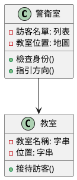
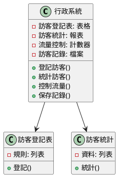
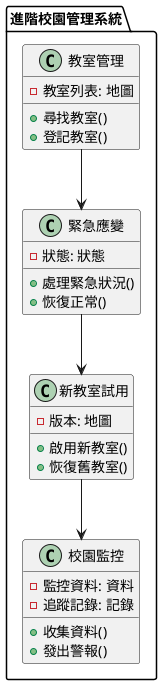

# API 網關教學

## 初級（Beginner）層級

### 1. 概念說明
API 網關就像學校的警衛室：
- 所有訪客都要先到警衛室登記
- 警衛會檢查訪客的身份
- 警衛會告訴訪客該去哪裡
- 警衛會記錄訪客的進出時間

初級學習者需要了解：
- 什麼是 API 網關（就像學校的警衛室）
- 為什麼需要 API 網關（為了保護和引導訪客）
- 基本的請求路由（就像警衛告訴訪客該去哪裡）

可能遇到的問題：
- 訪客找不到正確的教室（路由錯誤）
- 訪客沒有登記就進來了（未授權訪問）
- 太多訪客同時來訪（系統負載過高）

如何避免問題：
- 做好訪客登記（身份驗證）
- 清楚標示教室位置（正確的路由配置）
- 控制訪客數量（限流控制）

### 2. PlantUML 圖解


### 3. 分段教學步驟

#### 步驟 1：建立基本的警衛室（API 網關）
```java
public class 警衛室 {
    private Map<String, String> 教室位置;
    private List<String> 訪客名單;
    
    public boolean 檢查身份(String 訪客) {
        return 訪客名單.contains(訪客);
    }
    
    public String 指引方向(String 目的地) {
        return 教室位置.get(目的地);
    }
}
```

## 中級（Intermediate）層級

### 1. 概念說明
中級學習者需要理解：
- 訪客登記表（請求轉換）
- 訪客統計（響應聚合）
- 訪客流量控制（限流）
- 訪客記錄（緩存）

就像學校的行政系統：
- 需要記錄訪客的詳細資訊
- 需要統計訪客數量
- 需要控制訪客流量
- 需要保存訪客記錄

### 2. PlantUML 圖解


### 3. 分段教學步驟

#### 步驟 1：建立訪客登記系統
```java
public class 訪客登記系統 {
    private List<登記規則> 規則列表;
    
    public 訪客資料 登記訪客(訪客資料 原始資料) {
        訪客資料 處理後資料 = 原始資料;
        
        for (登記規則 規則 : 規則列表) {
            if (規則.符合條件(處理後資料)) {
                處理後資料 = 規則.處理資料(處理後資料);
            }
        }
        
        return 處理後資料;
    }
}
```

## 高級（Advanced）層級

### 1. 概念說明
高級學習者需要掌握：
- 教室管理系統（服務發現）
- 緊急應變機制（熔斷）
- 新教室試用（金絲雀發布）
- 校園監控（監控和追蹤）

就像學校的進階管理系統：
- 需要知道所有教室的位置和狀態
- 需要處理突發狀況
- 需要測試新教室
- 需要監控校園安全

### 2. PlantUML 圖解


### 3. 分段教學步驟

#### 步驟 1：建立教室管理系統
```java
public class 教室管理系統 {
    private Map<String, List<教室>> 教室列表;
    
    public 教室 尋找教室(String 教室名稱) {
        List<教室> 可用教室 = 教室列表.get(教室名稱);
        if (可用教室 == null || 可用教室.isEmpty()) {
            throw new 找不到教室異常(教室名稱);
        }
        
        // 選擇最適合的教室
        return 選擇教室(可用教室);
    }
    
    public void 登記教室(教室 新教室) {
        教室列表.computeIfAbsent(新教室.取得名稱(), 
            k -> new ArrayList<>()).add(新教室);
    }
}
```

### 4. 實戰案例

#### 案例一：圖書館訪客系統
```java
public class 圖書館訪客系統 {
    private 訪客登記系統 登記系統;
    private 教室管理系統 教室系統;
    private 校園監控 監控系統;
    
    public void 處理訪客(訪客 新訪客) {
        // 登記訪客
        訪客資料 處理後資料 = 登記系統.登記訪客(新訪客.取得資料());
        
        // 尋找適合的閱覽室
        教室 閱覽室 = 教室系統.尋找教室("閱覽室");
        
        // 監控訪客活動
        監控系統.收集資料(處理後資料);
    }
}
```

#### 案例二：體育館預約系統
```java
public class 體育館預約系統 {
    private 緊急應變 應變系統;
    private 新教室試用 試用系統;
    
    public void 預約場地(預約 新預約) {
        try {
            // 檢查場地可用性
            if (!應變系統.檢查可用性()) {
                throw new 場地不可用異常();
            }
            
            // 處理預約
            處理預約(新預約);
            
        } catch (異常 e) {
            // 啟動緊急應變
            應變系統.處理緊急狀況();
        }
    }
} 