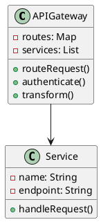
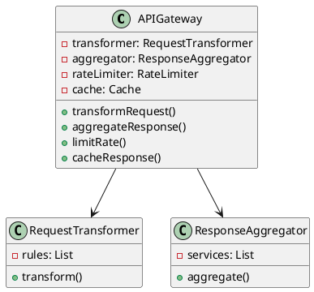
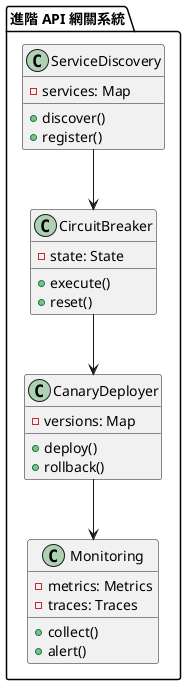

# API 網關教學

## 初級（Beginner）層級

### 1. 概念說明
API 網關就像一個智能的接待大廳：
- 所有外部請求都先到達網關
- 網關負責路由請求到正確的服務
- 網關可以進行身份驗證和授權
- 網關可以進行請求轉換和響應聚合

初級學習者需要了解：
- 什麼是 API 網關
- 為什麼需要 API 網關
- 基本的請求路由概念

### 2. PlantUML 圖解


### 3. 分段教學步驟

#### 步驟 1：基本 API 網關實現
```java
@RestController
public class APIGatewayController {
    private RouteResolver routeResolver;
    private AuthenticationService authService;
    
    @PostMapping("/api/**")
    public ResponseEntity<?> handleRequest(
        @RequestBody Object request,
        @RequestHeader HttpHeaders headers) {
        
        // 身份驗證
        if (!authService.authenticate(headers)) {
            return ResponseEntity.status(HttpStatus.UNAUTHORIZED).build();
        }
        
        // 路由解析
        ServiceEndpoint endpoint = routeResolver.resolve(request);
        
        // 轉發請求
        return forwardRequest(endpoint, request);
    }
    
    private ResponseEntity<?> forwardRequest(
        ServiceEndpoint endpoint,
        Object request) {
        // 實現請求轉發邏輯
    }
}
```

## 中級（Intermediate）層級

### 1. 概念說明
中級學習者需要理解：
- 請求轉換
- 響應聚合
- 限流控制
- 緩存策略

### 2. PlantUML 圖解


### 3. 分段教學步驟

#### 步驟 1：請求轉換實現
```java
public class RequestTransformer {
    private List<TransformationRule> rules;
    
    public Request transform(Request original) {
        Request transformed = original;
        
        for (TransformationRule rule : rules) {
            if (rule.matches(transformed)) {
                transformed = rule.apply(transformed);
            }
        }
        
        return transformed;
    }
}

class TransformationRule {
    private Predicate<Request> condition;
    private Function<Request, Request> transformation;
    
    public boolean matches(Request request) {
        return condition.test(request);
    }
    
    public Request apply(Request request) {
        return transformation.apply(request);
    }
}
```

#### 步驟 2：響應聚合實現
```java
public class ResponseAggregator {
    private List<ServiceEndpoint> endpoints;
    
    public Response aggregate(Request request) {
        List<CompletableFuture<Response>> futures = new ArrayList<>();
        
        for (ServiceEndpoint endpoint : endpoints) {
            futures.add(CompletableFuture.supplyAsync(() -> 
                callService(endpoint, request)));
        }
        
        return CompletableFuture.allOf(futures.toArray(new CompletableFuture[0]))
            .thenApply(v -> combineResponses(futures))
            .join();
    }
    
    private Response combineResponses(List<CompletableFuture<Response>> futures) {
        // 實現響應合併邏輯
    }
}
```

## 高級（Advanced）層級

### 1. 概念說明
高級學習者需要掌握：
- 服務發現集成
- 熔斷機制
- 金絲雀發布
- 監控和追蹤

### 2. PlantUML 圖解


### 3. 分段教學步驟

#### 步驟 1：服務發現集成
```java
public class ServiceDiscovery {
    private Map<String, List<ServiceInstance>> services;
    
    public ServiceInstance discover(String serviceName) {
        List<ServiceInstance> instances = services.get(serviceName);
        if (instances == null || instances.isEmpty()) {
            throw new ServiceNotFoundException(serviceName);
        }
        
        // 實現負載均衡
        return loadBalancer.select(instances);
    }
    
    public void register(ServiceInstance instance) {
        services.computeIfAbsent(instance.getServiceName(), 
            k -> new ArrayList<>()).add(instance);
    }
}
```

#### 步驟 2：熔斷機制實現
```java
public class CircuitBreaker {
    private String serviceName;
    private int failureThreshold;
    private int timeout;
    private State state;
    
    public Response execute(Request request) {
        if (state == State.OPEN) {
            return handleOpenState(request);
        }
        
        try {
            Response response = executeRequest(request);
            recordSuccess();
            return response;
        } catch (Exception e) {
            recordFailure();
            return handleFailure(request, e);
        }
    }
    
    private void recordFailure() {
        failureCount++;
        if (failureCount >= failureThreshold) {
            state = State.OPEN;
            scheduleReset();
        }
    }
}
```

### 4. 常見問題與解決方案

#### 問題表象
1. 路由問題：
   - 路由錯誤
   - 服務不可用
   - 版本衝突

2. 性能問題：
   - 響應延遲
   - 並發限制
   - 資源耗盡

3. 安全問題：
   - 未授權訪問
   - 數據洩露
   - 攻擊防護

4. 監控問題：
   - 指標缺失
   - 追蹤斷裂
   - 告警延遲

#### 避免方法
1. 路由問題防護：
   - 服務發現
   - 健康檢查
   - 版本控制

2. 性能問題防護：
   - 限流控制
   - 緩存策略
   - 資源優化

3. 安全問題防護：
   - 身份驗證
   - 訪問控制
   - 安全策略

4. 監控問題防護：
   - 集中採集
   - 鏈路追蹤
   - 實時告警

#### 處理方案
1. 技術方案：
   ```java
   public class APIGatewayManager {
       private RouteManager routeManager;
       private SecurityManager securityManager;
       private PerformanceManager performanceManager;
       private MonitoringManager monitoringManager;
       
       public void handleGatewayIssue(GatewayIssue issue) {
           switch (issue.getType()) {
               case ROUTING:
                   handleRoutingIssue(issue);
                   break;
               case PERFORMANCE:
                   handlePerformanceIssue(issue);
                   break;
               case SECURITY:
                   handleSecurityIssue(issue);
                   break;
               case MONITORING:
                   handleMonitoringIssue(issue);
                   break;
           }
       }
       
       private void handleRoutingIssue(GatewayIssue issue) {
           // 檢查路由配置
           checkRoutingConfig();
           // 更新服務發現
           updateServiceDiscovery();
           // 調整路由策略
           adjustRoutingStrategy();
       }
       
       private void handlePerformanceIssue(GatewayIssue issue) {
           // 檢查性能指標
           checkPerformanceMetrics();
           // 調整限流策略
           adjustRateLimiting();
           // 優化緩存
           optimizeCaching();
       }
       
       private void handleSecurityIssue(GatewayIssue issue) {
           // 檢查安全配置
           checkSecurityConfig();
           // 更新認證機制
           updateAuthentication();
           // 加強訪問控制
           strengthenAccessControl();
       }
       
       private void handleMonitoringIssue(GatewayIssue issue) {
           // 檢查監控系統
           checkMonitoringSystem();
           // 修復數據採集
           fixDataCollection();
           // 更新告警規則
           updateAlertRules();
       }
   }
   ```

2. 監控方案：
   ```java
   public class APIGatewayMonitor {
       private MetricsCollector metricsCollector;
       private TraceCollector traceCollector;
       private AlertManager alertManager;
       
       public void monitorGateway() {
           GatewayMetrics metrics = metricsCollector.collectMetrics();
           GatewayTraces traces = traceCollector.collectTraces();
           
           // 檢查請求成功率
           if (metrics.getSuccessRate() < SUCCESS_RATE_THRESHOLD) {
               alertManager.alert("請求成功率警告", metrics.getDetails());
           }
           
           // 檢查響應時間
           if (metrics.getResponseTime() > RESPONSE_TIME_THRESHOLD) {
               alertManager.alert("響應時間警告", metrics.getDetails());
           }
           
           // 檢查錯誤率
           if (metrics.getErrorRate() > ERROR_RATE_THRESHOLD) {
               alertManager.alert("錯誤率警告", metrics.getDetails());
           }
       }
   }
   ```

3. 最佳實踐：
   - 實現服務發現
   - 配置限流控制
   - 實現熔斷機制
   - 優化緩存策略
   - 加強安全防護
   - 完善監控系統
   - 支持金絲雀發布
   - 定期性能優化

### 5. 實戰案例

#### 案例一：電商系統 API 網關
```java
@Configuration
public class ECommerceGatewayConfig {
    @Bean
    public RouteLocator customRouteLocator(RouteLocatorBuilder builder) {
        return builder.routes()
            .route("user-service", r -> r.path("/api/users/**")
                .filters(f -> f.addRequestHeader("X-User-Service", "true"))
                .uri("lb://user-service"))
            .route("order-service", r -> r.path("/api/orders/**")
                .filters(f -> f.addRequestHeader("X-Order-Service", "true"))
                .uri("lb://order-service"))
            .route("product-service", r -> r.path("/api/products/**")
                .filters(f -> f.addRequestHeader("X-Product-Service", "true"))
                .uri("lb://product-service"))
            .build();
    }
}
```

#### 案例二：社交媒體 API 網關
```java
@Configuration
public class SocialMediaGatewayConfig {
    @Bean
    public RouteLocator customRouteLocator(RouteLocatorBuilder builder) {
        return builder.routes()
            .route("post-service", r -> r.path("/api/posts/**")
                .filters(f -> f.addRequestHeader("X-Post-Service", "true")
                    .circuitBreaker(config -> config
                        .setName("post-service-circuit")
                        .setFallbackUri("forward:/fallback/post")))
                .uri("lb://post-service"))
            .route("comment-service", r -> r.path("/api/comments/**")
                .filters(f -> f.addRequestHeader("X-Comment-Service", "true")
                    .retry(config -> config
                        .setRetries(3)
                        .setStatuses(HttpStatus.INTERNAL_SERVER_ERROR)))
                .uri("lb://comment-service"))
            .build();
    }
} 