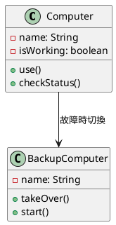
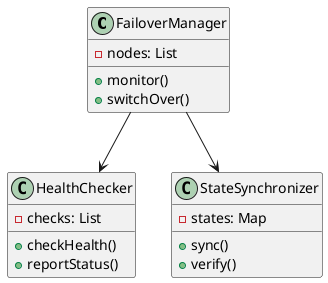
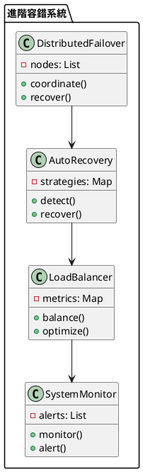

# 可用性-容錯轉移教學

## 初級（Beginner）層級

### 1. 概念說明
可用性-容錯轉移就像是在學校裡，當班級電腦壞掉時：
- 可以立即使用備用電腦繼續上課
- 不會因為一台電腦壞掉就影響整堂課
- 系統會自動切換到備用設備，保持課程正常進行

初級學習者需要了解：
- 什麼是容錯轉移
- 為什麼需要容錯轉移
- 基本的備用系統概念

### 2. 使用原因
容錯轉移系統的主要使用原因包括：
1. 提高系統可用性：
   - 確保服務持續運行
   - 減少系統停機時間
   - 提供不間斷的用戶體驗

2. 增強系統可靠性：
   - 防止單點故障
   - 提供故障恢復機制
   - 確保數據完整性

3. 優化資源利用：
   - 實現負載均衡
   - 提高資源利用率
   - 支持系統擴展

### 3. 問題表象
常見的問題表象包括：
1. 系統故障：
   - 服務不可用
   - 響應超時
   - 數據不一致

2. 性能問題：
   - 切換延遲
   - 資源競爭
   - 負載不均

3. 監控問題：
   - 故障檢測延遲
   - 狀態同步失敗
   - 告警不及時

### 4. 避免方法
避免問題的方法包括：
1. 系統設計：
   - 實現冗余備份
   - 設計自動切換機制
   - 建立健康檢查機制

2. 資源管理：
   - 合理分配資源
   - 實現負載均衡
   - 優化資源使用

3. 監控機制：
   - 建立實時監控
   - 設置預警閾值
   - 實現自動告警

### 5. 問題處理
遇到問題時的處理方法：
1. 故障處理：
   - 自動切換備用系統
   - 執行故障恢復
   - 記錄故障信息

2. 性能優化：
   - 調整資源分配
   - 優化切換策略
   - 改進負載均衡

3. 監控改進：
   - 完善監控機制
   - 優化告警策略
   - 加強故障預測

### 6. PlantUML 圖解


### 7. 分段教學步驟

#### 步驟 1：基本電腦系統
```java
public class SimpleComputerSystem {
    private Computer mainComputer;
    private Computer backupComputer;
    private HealthMonitor healthMonitor;
    private AlertSystem alertSystem;
    
    public SimpleComputerSystem() {
        mainComputer = new Computer("主電腦");
        backupComputer = new Computer("備用電腦");
        healthMonitor = new HealthMonitor();
        alertSystem = new AlertSystem();
    }
    
    public void useComputer() {
        if (mainComputer.isWorking()) {
            mainComputer.use();
            healthMonitor.checkHealth(mainComputer);
        } else {
            System.out.println("主電腦故障，切換到備用電腦");
            alertSystem.sendAlert("主電腦故障，正在切換到備用電腦");
            backupComputer.takeOver();
            healthMonitor.checkHealth(backupComputer);
        }
    }
}

class Computer {
    private String name;
    private boolean isWorking;
    private long lastHealthCheck;
    private int errorCount;
    
    public Computer(String name) {
        this.name = name;
        this.isWorking = true;
        this.lastHealthCheck = System.currentTimeMillis();
        this.errorCount = 0;
    }
    
    public void use() {
        System.out.println("使用 " + name);
        // 模擬可能的故障
        if (Math.random() < 0.1) {
            isWorking = false;
            errorCount++;
        }
    }
    
    public boolean isWorking() {
        return isWorking;
    }
    
    public void takeOver() {
        System.out.println(name + " 接管工作");
        isWorking = true;
        errorCount = 0;
    }
    
    public void reset() {
        isWorking = true;
        errorCount = 0;
        lastHealthCheck = System.currentTimeMillis();
    }
}

class HealthMonitor {
    public void checkHealth(Computer computer) {
        if (!computer.isWorking()) {
            System.out.println("檢測到電腦健康問題");
            // 可以添加更多的健康檢查邏輯
        }
    }
}

class AlertSystem {
    public void sendAlert(String message) {
        System.out.println("告警: " + message);
        // 可以實現更多的告警邏輯，如發送郵件、短信等
    }
}
```

## 中級（Intermediate）層級

### 1. 概念說明
中級學習者需要理解：
- 容錯轉移的實現方式
- 故障檢測機制
- 狀態同步
- 自動切換策略

### 2. PlantUML 圖解


### 3. 分段教學步驟

#### 步驟 1：健康檢查
```java
import java.util.*;
import java.util.concurrent.*;

public class HealthChecker {
    private List<HealthCheck> checks;
    private Map<String, Boolean> nodeStatus;
    private ScheduledExecutorService scheduler;
    private AlertManager alertManager;
    
    public HealthChecker() {
        checks = new ArrayList<>();
        nodeStatus = new HashMap<>();
        scheduler = Executors.newScheduledThreadPool(1);
        alertManager = new AlertManager();
    }
    
    public void startMonitoring() {
        scheduler.scheduleAtFixedRate(() -> {
            for (String nodeId : nodeStatus.keySet()) {
                boolean isHealthy = checkHealth(nodeId);
                if (!isHealthy) {
                    alertManager.sendAlert("節點 " + nodeId + " 健康檢查失敗");
                }
            }
        }, 0, 30, TimeUnit.SECONDS);
    }
    
    public void addCheck(HealthCheck check) {
        checks.add(check);
    }
    
    public boolean checkHealth(String nodeId) {
        boolean isHealthy = true;
        for (HealthCheck check : checks) {
            if (!check.perform(nodeId)) {
                isHealthy = false;
                alertManager.sendAlert("節點 " + nodeId + " 檢查失敗: " + check.getName());
                break;
            }
        }
        nodeStatus.put(nodeId, isHealthy);
        return isHealthy;
    }
    
    public void shutdown() {
        scheduler.shutdown();
    }
}

interface HealthCheck {
    boolean perform(String nodeId);
    String getName();
}

class PingCheck implements HealthCheck {
    @Override
    public boolean perform(String nodeId) {
        // 模擬 ping 檢查
        return Math.random() > 0.1; // 90% 的成功率
    }
    
    @Override
    public String getName() {
        return "Ping 檢查";
    }
}

class AlertManager {
    public void sendAlert(String message) {
        System.out.println("告警: " + message);
        // 可以實現更多的告警邏輯
    }
}
```

#### 步驟 2：狀態同步
```java
public class StateSynchronizer {
    private Map<String, NodeState> states;
    
    public void syncState(String nodeId, NodeState state) {
        // 同步節點狀態
        states.put(nodeId, state);
        
        // 驗證同步結果
        verifySync(nodeId);
    }
    
    private void verifySync(String nodeId) {
        NodeState state = states.get(nodeId);
        if (state != null && state.isValid()) {
            System.out.println("節點 " + nodeId + " 狀態同步成功");
        } else {
            System.out.println("節點 " + nodeId + " 狀態同步失敗");
        }
    }
}

class NodeState {
    private String data;
    private long timestamp;
    
    public boolean isValid() {
        return data != null && !data.isEmpty();
    }
}
```

## 高級（Advanced）層級

### 1. 概念說明
高級學習者需要掌握：
- 分散式容錯轉移
- 自動故障恢復
- 負載平衡
- 系統監控與優化

### 2. PlantUML 圖解


### 3. 分段教學步驟

#### 步驟 1：自動故障恢復
```java
import java.util.*;

public class AutoRecovery {
    private Map<String, RecoveryStrategy> strategies;
    private List<Node> nodes;
    
    public void handleFailure(String nodeId) {
        // 檢測故障
        if (detectFailure(nodeId)) {
            // 選擇恢復策略
            RecoveryStrategy strategy = selectStrategy(nodeId);
            
            // 執行恢復
            strategy.recover(nodeId);
            
            // 驗證恢復結果
            verifyRecovery(nodeId);
        }
    }
    
    private boolean detectFailure(String nodeId) {
        Node node = findNode(nodeId);
        return node != null && !node.isHealthy();
    }
    
    private RecoveryStrategy selectStrategy(String nodeId) {
        return strategies.getOrDefault(nodeId, new DefaultRecoveryStrategy());
    }
}

interface RecoveryStrategy {
    void recover(String nodeId);
    boolean verify(String nodeId);
}
```

#### 步驟 2：負載平衡
```java
public class LoadBalancer {
    private List<Node> nodes;
    private Map<String, LoadMetric> metrics;
    
    public void balanceLoad() {
        // 收集負載指標
        collectMetrics();
        
        // 分析負載情況
        analyzeLoad();
        
        // 執行負載平衡
        performBalancing();
    }
    
    private void analyzeLoad() {
        for (Node node : nodes) {
            LoadMetric metric = metrics.get(node.getId());
            if (needsBalancing(metric)) {
                // 觸發負載平衡
                triggerBalancing(node);
            }
        }
    }
}

class LoadMetric {
    private String nodeId;
    private double cpuUsage;
    private double memoryUsage;
    private int connectionCount;
    
    public LoadMetric(String nodeId) {
        this.nodeId = nodeId;
    }
    
    public boolean isOverloaded() {
        return cpuUsage > 80 || memoryUsage > 80 || connectionCount > 1000;
    }
}
```

#### 步驟 3：系統監控
```java
public class SystemMonitor {
    private List<Alert> alerts;
    private Map<String, MonitorMetric> metrics;
    
    public void monitorSystem() {
        // 收集監控指標
        collectMetrics();
        
        // 檢查系統狀態
        checkStatus();
        
        // 處理警報
        handleAlerts();
    }
    
    private void checkStatus() {
        for (MonitorMetric metric : metrics.values()) {
            if (metric.isAbnormal()) {
                // 產生警報
                generateAlert(metric);
            }
        }
    }
}

class MonitorMetric {
    private String name;
    private double value;
    private double threshold;
    
    public boolean isAbnormal() {
        return value > threshold;
    }
}
```

這個教學文件提供了從基礎到進階的可用性-容錯轉移學習路徑，每個層級都包含了相應的概念說明、圖解、教學步驟和實作範例。初級學習者可以從基本的電腦系統開始，中級學習者可以學習健康檢查和狀態同步，而高級學習者則可以掌握自動故障恢復和負載平衡等進階功能。 