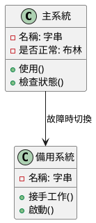
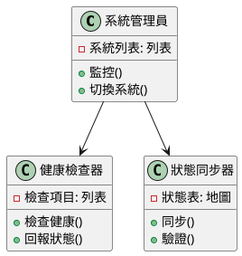
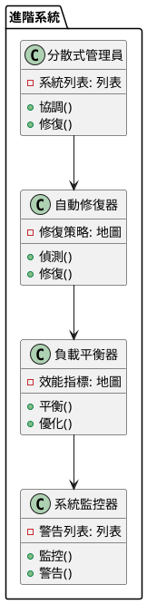

# 可用性-容錯轉移教學

## 初級（Beginner）層級

### 1. 概念說明
可用性-容錯轉移就像是在玩線上遊戲時：
- 當你的電腦突然斷線，遊戲會自動幫你連到其他伺服器
- 你不會因為斷線就失去遊戲進度
- 系統會自動幫你找到最好的連線方式

初級學習者需要了解：
- 什麼是備用系統
- 為什麼需要備用系統
- 基本的故障處理概念

### 2. 使用原因
為什麼需要容錯轉移系統：
1. 保持系統運作：
   - 當主系統壞掉時，備用系統可以馬上接手
   - 使用者不會感覺到系統有問題
   - 資料不會遺失

2. 提高系統穩定性：
   - 避免單一故障點
   - 提供自動修復功能
   - 保護重要資料

3. 優化系統效能：
   - 平均分配工作負載
   - 提高系統效率
   - 支援更多使用者

### 3. 問題表象
常見的問題包括：
1. 系統故障：
   - 畫面卡住
   - 操作沒反應
   - 資料不見了

2. 效能問題：
   - 切換太慢
   - 系統變慢
   - 負載不均

3. 監控問題：
   - 沒發現問題
   - 狀態不同步
   - 警告太慢

### 4. 避免方法
如何避免問題：
1. 系統設計：
   - 準備備用系統
   - 設定自動切換
   - 定期檢查系統

2. 資源管理：
   - 平均分配資源
   - 控制使用量
   - 優化效能

3. 監控機制：
   - 即時監控系統
   - 設定警告值
   - 自動通知問題

### 5. 問題處理
遇到問題怎麼辦：
1. 故障處理：
   - 自動切換備用系統
   - 修復故障
   - 記錄問題

2. 效能優化：
   - 調整資源
   - 優化切換
   - 平衡負載

3. 監控改進：
   - 加強監控
   - 改進警告
   - 預測問題

### 6. PlantUML 圖解


### 7. 分段教學步驟

#### 步驟 1：基本系統
```java
public class 簡單系統 {
    private 主系統 主機;
    private 主系統 備機;
    private 健康檢查 檢查器;
    private 警告系統 警告器;
    
    public 簡單系統() {
        主機 = new 主系統("主機");
        備機 = new 主系統("備機");
        檢查器 = new 健康檢查();
        警告器 = new 警告系統();
    }
    
    public void 使用系統() {
        if (主機.是否正常()) {
            主機.使用();
            檢查器.檢查健康(主機);
        } else {
            System.out.println("主機故障，切換到備機");
            警告器.發送警告("主機故障，正在切換到備機");
            備機.接手工作();
            檢查器.檢查健康(備機);
        }
    }
}

class 主系統 {
    private String 名稱;
    private boolean 是否正常;
    
    public 主系統(String 名稱) {
        this.名稱 = 名稱;
        this.是否正常 = true;
    }
    
    public void 使用() {
        System.out.println("使用 " + 名稱);
        // 模擬可能的故障
        if (Math.random() < 0.1) {
            是否正常 = false;
        }
    }
    
    public boolean 是否正常() {
        return 是否正常;
    }
    
    public void 接手工作() {
        System.out.println(名稱 + " 接手工作");
        是否正常 = true;
    }
}

class 健康檢查 {
    public void 檢查健康(主系統 系統) {
        if (!系統.是否正常()) {
            System.out.println("檢測到系統問題");
        }
    }
}

class 警告系統 {
    public void 發送警告(String 訊息) {
        System.out.println("警告: " + 訊息);
    }
}
```

## 中級（Intermediate）層級

### 1. 概念說明
中級學習者需要理解：
- 如何檢查系統是否正常
- 如何讓備用系統和主系統保持同步
- 如何自動切換系統
- 如何監控系統狀態

### 2. PlantUML 圖解


### 3. 分段教學步驟

#### 步驟 1：健康檢查
```java
import java.util.*;
import java.util.concurrent.*;

public class 健康檢查器 {
    private List<健康檢查項目> 檢查項目;
    private Map<String, Boolean> 系統狀態;
    private ScheduledExecutorService 排程器;
    private 警告管理員 警告器;
    
    public 健康檢查器() {
        檢查項目 = new ArrayList<>();
        系統狀態 = new HashMap<>();
        排程器 = Executors.newScheduledThreadPool(1);
        警告器 = new 警告管理員();
    }
    
    public void 開始監控() {
        排程器.scheduleAtFixedRate(() -> {
            for (String 系統ID : 系統狀態.keySet()) {
                boolean 是否正常 = 檢查健康(系統ID);
                if (!是否正常) {
                    警告器.發送警告("系統 " + 系統ID + " 檢查失敗");
                }
            }
        }, 0, 30, TimeUnit.SECONDS);
    }
    
    public void 新增檢查(健康檢查項目 檢查) {
        檢查項目.add(檢查);
    }
    
    public boolean 檢查健康(String 系統ID) {
        boolean 是否正常 = true;
        for (健康檢查項目 檢查 : 檢查項目) {
            if (!檢查.執行(系統ID)) {
                是否正常 = false;
                警告器.發送警告("系統 " + 系統ID + " 檢查失敗: " + 檢查.取得名稱());
                break;
            }
        }
        系統狀態.put(系統ID, 是否正常);
        return 是否正常;
    }
    
    public void 關閉() {
        排程器.shutdown();
    }
}

interface 健康檢查項目 {
    boolean 執行(String 系統ID);
    String 取得名稱();
}

class 連線檢查 implements 健康檢查項目 {
    @Override
    public boolean 執行(String 系統ID) {
        // 模擬連線檢查
        return Math.random() > 0.1; // 90% 的成功率
    }
    
    @Override
    public String 取得名稱() {
        return "連線檢查";
    }
}

class 警告管理員 {
    public void 發送警告(String 訊息) {
        System.out.println("警告: " + 訊息);
    }
}
```

#### 步驟 2：狀態同步
```java
public class 狀態同步器 {
    private Map<String, 系統狀態> 狀態表;
    
    public void 同步狀態(String 系統ID, 系統狀態 狀態) {
        // 同步系統狀態
        狀態表.put(系統ID, 狀態);
        
        // 驗證同步結果
        驗證同步(系統ID);
    }
    
    private void 驗證同步(String 系統ID) {
        系統狀態 狀態 = 狀態表.get(系統ID);
        if (狀態 != null && 狀態.是否有效()) {
            System.out.println("系統 " + 系統ID + " 狀態同步成功");
        } else {
            System.out.println("系統 " + 系統ID + " 狀態同步失敗");
        }
    }
}

class 系統狀態 {
    private String 資料;
    private long 時間戳記;
    
    public boolean 是否有效() {
        return 資料 != null && !資料.isEmpty();
    }
}
```

## 高級（Advanced）層級

### 1. 概念說明
高級學習者需要掌握：
- 如何管理多個系統
- 如何自動修復問題
- 如何平衡系統負載
- 如何監控和優化系統

### 2. PlantUML 圖解


### 3. 分段教學步驟

#### 步驟 1：自動修復
```java
import java.util.*;

public class 自動修復器 {
    private Map<String, 修復策略> 策略表;
    private List<系統> 系統列表;
    
    public void 處理故障(String 系統ID) {
        // 偵測故障
        if (偵測故障(系統ID)) {
            // 選擇修復策略
            修復策略 策略 = 選擇策略(系統ID);
            
            // 執行修復
            策略.修復(系統ID);
            
            // 驗證修復結果
            驗證修復(系統ID);
        }
    }
    
    private boolean 偵測故障(String 系統ID) {
        系統 系統 = 尋找系統(系統ID);
        return 系統 != null && !系統.是否正常();
    }
    
    private 修復策略 選擇策略(String 系統ID) {
        return 策略表.getOrDefault(系統ID, new 預設修復策略());
    }
}

interface 修復策略 {
    void 修復(String 系統ID);
    boolean 驗證(String 系統ID);
}
```

#### 步驟 2：負載平衡
```java
public class 負載平衡器 {
    private List<系統> 系統列表;
    private Map<String, 負載指標> 指標表;
    
    public void 平衡負載() {
        // 收集負載指標
        收集指標();
        
        // 分析負載情況
        分析負載();
        
        // 執行負載平衡
        執行平衡();
    }
    
    private void 分析負載() {
        for (系統 系統 : 系統列表) {
            負載指標 指標 = 指標表.get(系統.取得ID());
            if (需要平衡(指標)) {
                // 觸發負載平衡
                觸發平衡(系統);
            }
        }
    }
}

class 負載指標 {
    private String 系統ID;
    private double CPU使用率;
    private double 記憶體使用率;
    private int 連線數;
    
    public 負載指標(String 系統ID) {
        this.系統ID = 系統ID;
    }
    
    public boolean 是否過載() {
        return CPU使用率 > 80 || 記憶體使用率 > 80 || 連線數 > 1000;
    }
}
```

#### 步驟 3：系統監控
```java
public class 系統監控器 {
    private List<警告> 警告列表;
    private Map<String, 監控指標> 指標表;
    
    public void 監控系統() {
        // 收集監控指標
        收集指標();
        
        // 檢查系統狀態
        檢查狀態();
        
        // 處理警告
        處理警告();
    }
    
    private void 檢查狀態() {
        for (監控指標 指標 : 指標表.values()) {
            if (指標.是否異常()) {
                // 產生警告
                產生警告(指標);
            }
        }
    }
}

class 監控指標 {
    private String 名稱;
    private double 數值;
    private double 閾值;
    
    public boolean 是否異常() {
        return 數值 > 閾值;
    }
}
```

這個教學文件提供了從基礎到進階的可用性-容錯轉移學習路徑，每個層級都包含了相應的概念說明、圖解、教學步驟和實作範例。初級學習者可以從基本的電腦系統開始，中級學習者可以學習健康檢查和狀態同步，而高級學習者則可以掌握自動故障恢復和負載平衡等進階功能。 
這個教學文件提供了從基礎到進階的可用性-容錯轉移學習路徑，每個層級都包含了相應的概念說明、圖解、教學步驟和實作範例。初級學習者可以從基本的電腦系統開始，中級學習者可以學習健康檢查和狀態同步，而高級學習者則可以掌握自動故障恢復和負載平衡等進階功能。 