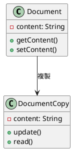
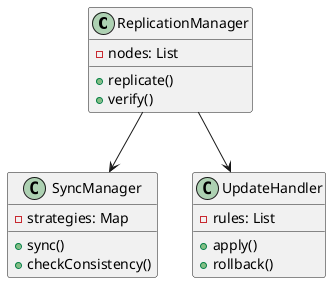
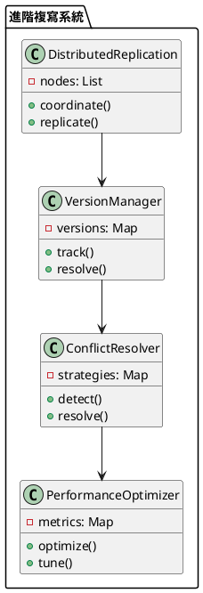

# 可用性-複寫教學

## 初級（Beginner）層級

### 1. 概念說明
可用性-複寫就像是在學校裡，當老師要發放重要文件時：
- 會準備多份相同的文件，分發給不同同學
- 即使某份文件遺失，其他同學手上的文件仍然可用
- 確保重要資訊不會因為單一文件遺失而消失

初級學習者需要了解：
- 什麼是資料複寫
- 為什麼需要資料複寫
- 基本的資料備份概念

### 2. PlantUML 圖解


### 3. 分段教學步驟

#### 步驟 1：基本文件系統
```java
public class SimpleDocumentSystem {
    private Document original;
    private List<DocumentCopy> copies;
    
    public SimpleDocumentSystem() {
        original = new Document();
        copies = new ArrayList<>();
    }
    
    public void createCopy() {
        DocumentCopy copy = new DocumentCopy(original.getContent());
        copies.add(copy);
        System.out.println("建立文件副本");
    }
    
    public void updateContent(String newContent) {
        original.setContent(newContent);
        // 更新所有副本
        for (DocumentCopy copy : copies) {
            copy.update(newContent);
        }
        System.out.println("更新所有文件內容");
    }
}

class Document {
    private String content;
    
    public String getContent() {
        return content;
    }
    
    public void setContent(String content) {
        this.content = content;
    }
}

class DocumentCopy {
    private String content;
    
    public DocumentCopy(String content) {
        this.content = content;
    }
    
    public void update(String newContent) {
        this.content = newContent;
    }
    
    public String read() {
        return content;
    }
}
```

#### 步驟 2：簡單的副本管理
```java
public class CopyManager {
    private List<DocumentCopy> copies;
    
    public void checkCopies() {
        for (DocumentCopy copy : copies) {
            if (copy.isValid()) {
                System.out.println("副本有效");
            } else {
                System.out.println("副本無效，需要更新");
                updateCopy(copy);
            }
        }
    }
    
    private void updateCopy(DocumentCopy copy) {
        // 更新副本內容
        copy.update(getLatestContent());
    }
}
```

## 中級（Intermediate）層級

### 1. 概念說明
中級學習者需要理解：
- 資料複寫的實現方式
- 同步機制
- 一致性檢查
- 更新策略

### 2. PlantUML 圖解


### 3. 分段教學步驟

#### 步驟 1：同步管理
```java
import java.util.*;

public class SyncManager {
    private List<Node> nodes;
    private Map<String, SyncStrategy> strategies;
    
    public void synchronize(String key, String value) {
        // 選擇同步策略
        SyncStrategy strategy = selectStrategy(key);
        
        // 執行同步
        strategy.sync(nodes, key, value);
        
        // 檢查一致性
        checkConsistency(key);
    }
    
    private SyncStrategy selectStrategy(String key) {
        return strategies.getOrDefault(key, new DefaultSyncStrategy());
    }
    
    private void checkConsistency(String key) {
        boolean isConsistent = true;
        String expectedValue = getExpectedValue(key);
        
        for (Node node : nodes) {
            if (!node.getValue(key).equals(expectedValue)) {
                isConsistent = false;
                break;
            }
        }
        
        if (!isConsistent) {
            System.out.println("資料不一致，需要修復");
            repairInconsistency(key);
        }
    }
}

interface SyncStrategy {
    void sync(List<Node> nodes, String key, String value);
}
```

#### 步驟 2：更新處理
```java
public class UpdateHandler {
    private List<UpdateRule> rules;
    
    public void applyUpdate(String key, String value) {
        // 選擇更新規則
        UpdateRule rule = selectRule(key);
        
        // 應用更新
        rule.apply(key, value);
        
        // 驗證更新
        if (!verifyUpdate(key, value)) {
            // 回滾更新
            rule.rollback(key);
        }
    }
    
    private UpdateRule selectRule(String key) {
        return rules.stream()
            .filter(rule -> rule.isApplicable(key))
            .findFirst()
            .orElse(new DefaultUpdateRule());
    }
}

interface UpdateRule {
    boolean isApplicable(String key);
    void apply(String key, String value);
    void rollback(String key);
}
```

## 高級（Advanced）層級

### 1. 概念說明
高級學習者需要掌握：
- 分散式複寫
- 版本控制
- 衝突解決
- 效能優化

### 2. PlantUML 圖解


### 3. 分段教學步驟

#### 步驟 1：版本控制
```java
import java.util.*;

public class VersionManager {
    private Map<String, Version> versions;
    
    public VersionManager() {
        versions = new HashMap<>();
    }
    
    public void trackChange(String key, String value) {
        Version current = versions.get(key);
        Version newVersion = new Version(value, current == null ? 0 : current.getNumber() + 1);
        versions.put(key, newVersion);
    }
    
    public boolean isConflict(String key, Version otherVersion) {
        Version thisVersion = versions.get(key);
        return thisVersion != null && thisVersion.getNumber() > otherVersion.getNumber();
    }
    
    public void resolveConflict(String key, Version version1, Version version2) {
        // 選擇較新的版本
        Version resolved = version1.getNumber() > version2.getNumber() ? version1 : version2;
        versions.put(key, resolved);
    }
}

class Version {
    private String value;
    private int number;
    
    public Version(String value, int number) {
        this.value = value;
        this.number = number;
    }
    
    public int getNumber() {
        return number;
    }
    
    public String getValue() {
        return value;
    }
}
```

#### 步驟 2：衝突解決
```java
public class ConflictResolver {
    private Map<String, ConflictStrategy> strategies;
    
    public void handleConflict(String key, Version version1, Version version2) {
        // 檢測衝突
        if (isConflict(version1, version2)) {
            // 選擇解決策略
            ConflictStrategy strategy = selectStrategy(key);
            
            // 解決衝突
            Version resolved = strategy.resolve(version1, version2);
            
            // 應用解決方案
            applyResolution(key, resolved);
        }
    }
    
    private boolean isConflict(Version version1, Version version2) {
        return version1.getNumber() != version2.getNumber();
    }
    
    private ConflictStrategy selectStrategy(String key) {
        return strategies.getOrDefault(key, new DefaultConflictStrategy());
    }
}

interface ConflictStrategy {
    Version resolve(Version version1, Version version2);
}
```

#### 步驟 3：效能優化
```java
public class PerformanceOptimizer {
    private Map<String, PerformanceMetric> metrics;
    
    public void optimizeReplication() {
        // 收集效能指標
        collectMetrics();
        
        // 分析效能
        analyzePerformance();
        
        // 調整參數
        tuneParameters();
    }
    
    private void analyzePerformance() {
        for (PerformanceMetric metric : metrics.values()) {
            if (needsOptimization(metric)) {
                // 觸發優化
                triggerOptimization(metric);
            }
        }
    }
}

class PerformanceMetric {
    private String nodeId;
    private double replicationTime;
    private double syncTime;
    private int conflictCount;
    
    public PerformanceMetric(String nodeId) {
        this.nodeId = nodeId;
    }
    
    public boolean needsOptimization() {
        return replicationTime > 1000 || syncTime > 500 || conflictCount > 10;
    }
}
```

這個教學文件提供了從基礎到進階的可用性-複寫學習路徑，每個層級都包含了相應的概念說明、圖解、教學步驟和實作範例。初級學習者可以從基本的文件系統開始，中級學習者可以學習同步機制和更新處理，而高級學習者則可以掌握版本控制和衝突解決等進階功能。 