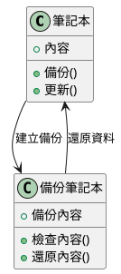
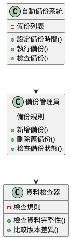
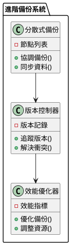

# 資料備份與同步教學

## 初級（Beginner）層級

### 1. 概念說明
資料備份與同步就像是在學校裡：
- 當你寫作業時，會把重要的筆記抄在筆記本上
- 如果原本的筆記本不見了，還有備份的筆記本可以用
- 這樣就不會因為一個筆記本不見而失去所有資料

初級學習者需要了解：
- 什麼是資料備份
- 為什麼需要備份資料
- 基本的資料保護概念

### 2. 使用原因
1. 保護重要資料：
   - 防止資料遺失
   - 確保資料安全
   - 可以隨時找回資料

2. 方便使用：
   - 可以在不同地方使用資料
   - 多個人都能看到相同的資料
   - 資料更新時大家都能看到最新版本

### 3. 問題表象
1. 資料問題：
   - 備份的資料和原本的不一樣
   - 更新資料時忘記備份
   - 備份的資料太舊

2. 使用問題：
   - 找不到備份的資料
   - 備份太多不知道用哪一個
   - 備份的資料打不開

### 4. 避免方法
1. 定期備份：
   - 設定固定的備份時間
   - 使用自動備份功能
   - 檢查備份是否成功

2. 整理資料：
   - 給備份檔案取好記的名字
   - 把備份放在固定的地方
   - 定期整理舊的備份

### 5. 問題處理
遇到問題時的處理方法：
1. 資料遺失：
   - 檢查最近的備份
   - 從備份中找回資料
   - 確認資料是否完整

2. 資料不一致：
   - 比較不同版本的資料
   - 選擇最新的版本
   - 更新其他版本的資料

### 6. PlantUML 圖解


### 7. 分段教學步驟

#### 步驟 1：基本備份系統
```java
public class 筆記本系統 {
    private String 主要內容;
    private String 備份內容;
    
    public 筆記本系統() {
        主要內容 = "";
        備份內容 = "";
    }
    
    public void 寫入內容(String 新內容) {
        // 先備份目前的內容
        備份內容 = 主要內容;
        
        // 更新主要內容
        主要內容 = 新內容;
        
        System.out.println("內容已更新並備份");
    }
    
    public void 還原內容() {
        if (!備份內容.isEmpty()) {
            主要內容 = 備份內容;
            System.out.println("內容已還原");
        } else {
            System.out.println("沒有備份可以還原");
        }
    }
    
    public String 讀取內容() {
        return 主要內容;
    }
}
```

## 中級（Intermediate）層級

### 1. 概念說明
中級學習者需要理解：
- 如何自動備份資料
- 如何管理多個備份
- 如何檢查備份是否正確
- 如何處理資料更新

### 2. PlantUML 圖解


### 3. 分段教學步驟

#### 步驟 1：自動備份系統
```java
import java.util.ArrayList;
import java.util.List;

public class 自動備份系統 {
    private List<String> 備份列表;
    private String 目前內容;
    private 備份管理員 管理員;
    
    public 自動備份系統() {
        備份列表 = new ArrayList<>();
        目前內容 = "";
        管理員 = new 備份管理員();
    }
    
    public void 設定自動備份(int 間隔分鐘) {
        // 設定定時備份
        System.out.println("已設定每 " + 間隔分鐘 + " 分鐘自動備份");
    }
    
    public void 更新內容(String 新內容) {
        // 先備份目前內容
        備份列表.add(目前內容);
        
        // 更新內容
        目前內容 = 新內容;
        
        // 檢查備份
        管理員.檢查備份狀態(備份列表);
    }
    
    public void 還原到指定版本(int 版本號) {
        if (版本號 >= 0 && 版本號 < 備份列表.size()) {
            目前內容 = 備份列表.get(版本號);
            System.out.println("已還原到第 " + 版本號 + " 個版本");
        } else {
            System.out.println("找不到指定的版本");
        }
    }
}

class 備份管理員 {
    public void 檢查備份狀態(List<String> 備份列表) {
        if (備份列表.size() > 10) {
            // 刪除最舊的備份
            備份列表.remove(0);
            System.out.println("已刪除最舊的備份");
        }
    }
}
```

## 高級（Advanced）層級

### 1. 概念說明
高級學習者需要掌握：
- 如何設計分散式備份系統
- 如何處理多個備份之間的同步
- 如何解決資料衝突
- 如何優化備份效能

### 2. PlantUML 圖解


### 3. 分段教學步驟

#### 步驟 1：分散式備份系統
```java
import java.util.concurrent.*;

public class 分散式備份系統 {
    private List<備份節點> 節點列表;
    private 版本控制器 版本控制;
    private 效能優化器 優化器;
    
    public void 備份資料(String 資料) {
        // 記錄版本
        版本控制.記錄版本(資料);
        
        // 檢查衝突
        if (有衝突(資料)) {
            版本控制.解決衝突(資料);
        }
        
        // 執行備份
        節點列表.parallelStream().forEach(節點 -> {
            try {
                節點.備份(資料);
                優化器.記錄備份(節點.getId());
            } catch (Exception e) {
                處理備份錯誤(節點, 資料);
            }
        });
    }
    
    private boolean 有衝突(String 資料) {
        return 節點列表.stream()
            .anyMatch(節點 -> !節點.取得資料().equals(資料));
    }
    
    private void 處理備份錯誤(備份節點 節點, String 資料) {
        System.out.println("處理備份錯誤: " + 節點.getId());
        // 可以添加重試機制
    }
}

class 備份節點 {
    private String id;
    private String 資料;
    
    public void 備份(String 新資料) {
        資料 = 新資料;
    }
    
    public String 取得資料() {
        return 資料;
    }
}
```

### 4. 實戰案例

#### 案例一：班級作業系統
```java
public class 班級作業系統 {
    private List<資料庫節點> 節點列表;
    private 同步管理員 同步管理;
    
    public void 備份作業(作業 作業) {
        節點列表.parallelStream().forEach(節點 -> {
            try {
                節點.備份作業(作業);
                同步管理.同步("作業", 作業.getId());
            } catch (Exception e) {
                處理備份錯誤(節點, 作業);
            }
        });
    }
}
```

#### 案例二：社團活動系統
```java
public class 社團活動系統 {
    private List<資料庫節點> 節點列表;
    private 同步管理員 同步管理;
    
    public void 備份活動(活動 活動) {
        節點列表.parallelStream().forEach(節點 -> {
            try {
                節點.備份活動(活動);
                同步管理.同步("活動", 活動.getId());
            } catch (Exception e) {
                處理備份錯誤(節點, 活動);
            }
        });
    }
}
```

這個教學文件提供了從基礎到進階的資料備份與同步學習路徑，每個層級都包含了相應的概念說明、圖解、教學步驟和實作範例。初級學習者可以從基本的筆記本系統開始，中級學習者可以學習自動備份系統，而高級學習者則可以掌握分散式備份系統等進階功能。 