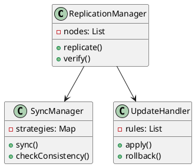
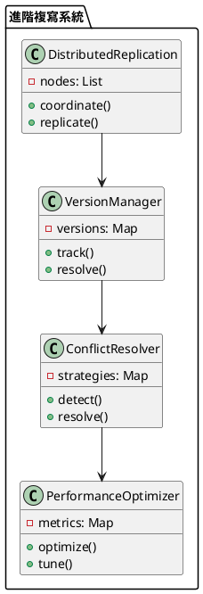

# 可用性-複寫教學

## 初級（Beginner）層級

### 1. 概念說明
可用性-複寫就像是在學校裡，當老師要發放重要文件時：
- 會準備多份相同的文件，分發給不同同學
- 即使某份文件遺失，其他同學手上的文件仍然可用
- 確保重要資訊不會因為單一文件遺失而消失

初級學習者需要了解：
- 什麼是資料複寫
- 為什麼需要資料複寫
- 基本的資料備份概念

### 2. 使用原因
資料複寫系統的主要使用原因包括：
1. 提高資料可用性：
   - 確保資料持續可訪問
   - 減少資料不可用時間
   - 提供不間斷的資料服務

2. 增強資料可靠性：
   - 防止資料遺失
   - 提供資料備份
   - 確保資料完整性

3. 優化系統效能：
   - 實現讀取負載均衡
   - 提高查詢效能
   - 支持系統擴展

### 3. 問題表象
常見的問題表象包括：
1. 資料問題：
   - 資料不一致
   - 同步延遲
   - 資料衝突

2. 效能問題：
   - 複寫延遲
   - 資源消耗
   - 網路負載

3. 管理問題：
   - 版本控制混亂
   - 衝突解決困難
   - 監控不足

### 4. 避免方法
避免問題的方法包括：
1. 系統設計：
   - 實現適當的複寫策略
   - 設計有效的同步機制
   - 建立監控系統

2. 資料管理：
   - 定期一致性檢查
   - 實現版本控制
   - 優化更新策略

3. 效能優化：
   - 合理配置資源
   - 優化網路傳輸
   - 實現負載均衡

### 5. 問題處理
遇到問題時的處理方法：
1. 資料問題處理：
   - 執行一致性檢查
   - 修復不一致資料
   - 更新複寫策略

2. 效能問題處理：
   - 優化複寫機制
   - 調整資源配置
   - 改進網路傳輸

3. 管理問題處理：
   - 完善版本控制
   - 改進衝突解決
   - 加強監控系統

### 6. 分段教學步驟

#### 步驟 1：基本文件系統
```java
public class SimpleDocumentSystem {
    private Document original;
    private List<DocumentCopy> copies;
    private VersionManager versionManager;
    private ConsistencyChecker consistencyChecker;
    
    public SimpleDocumentSystem() {
        original = new Document();
        copies = new ArrayList<>();
        versionManager = new VersionManager();
        consistencyChecker = new ConsistencyChecker();
    }
    
    public void createCopy() {
        DocumentCopy copy = new DocumentCopy(original.getContent());
        copies.add(copy);
        versionManager.recordVersion(copy);
        System.out.println("建立文件副本");
    }
    
    public void updateContent(String newContent) {
        // 記錄更新前版本
        versionManager.saveVersion(original);
        
        // 更新原始文件
        original.setContent(newContent);
        
        // 更新所有副本
        for (DocumentCopy copy : copies) {
            copy.update(newContent);
            versionManager.recordVersion(copy);
        }
        
        // 檢查一致性
        consistencyChecker.checkConsistency(original, copies);
        
        System.out.println("更新所有文件內容");
    }
}

class Document {
    private String content;
    private String version;
    
    public String getContent() {
        return content;
    }
    
    public void setContent(String content) {
        this.content = content;
        this.version = generateVersion();
    }
    
    private String generateVersion() {
        return String.valueOf(System.currentTimeMillis());
    }
}

class DocumentCopy {
    private String content;
    private String version;
    private boolean isValid;
    
    public DocumentCopy(String content) {
        this.content = content;
        this.version = generateVersion();
        this.isValid = true;
    }
    
    public void update(String newContent) {
        this.content = newContent;
        this.version = generateVersion();
    }
    
    public String read() {
        return content;
    }
    
    public boolean isValid() {
        return isValid;
    }
    
    private String generateVersion() {
        return String.valueOf(System.currentTimeMillis());
    }
}

class VersionManager {
    private Map<String, List<String>> versions;
    
    public void recordVersion(DocumentCopy copy) {
        versions.computeIfAbsent(copy.getVersion(), k -> new ArrayList<>())
            .add(copy.toString());
    }
    
    public void saveVersion(Document document) {
        versions.put(document.getVersion(), List.of(document.toString()));
    }
}

class ConsistencyChecker {
    public void checkConsistency(Document original, List<DocumentCopy> copies) {
        String originalContent = original.getContent();
        for (DocumentCopy copy : copies) {
            if (!copy.read().equals(originalContent)) {
                System.out.println("發現不一致的副本");
                // 可以添加修復邏輯
            }
        }
    }
}
```

## 中級（Intermediate）層級

### 1. 概念說明
中級學習者需要理解：
- 資料複寫的實現方式
- 同步機制
- 一致性檢查
- 更新策略

### 2. PlantUML 圖解


### 3. 分段教學步驟

#### 步驟 1：同步管理
```java
import java.util.*;
import java.util.concurrent.*;

public class SyncManager {
    private List<Node> nodes;
    private Map<String, SyncStrategy> strategies;
    private ExecutorService executor;
    private AlertManager alertManager;
    
    public SyncManager() {
        nodes = new ArrayList<>();
        strategies = new HashMap<>();
        executor = Executors.newFixedThreadPool(4);
        alertManager = new AlertManager();
    }
    
    public void synchronize(String key, String value) {
        // 選擇同步策略
        SyncStrategy strategy = selectStrategy(key);
        
        // 執行同步
        CompletableFuture<Void> syncFuture = CompletableFuture.runAsync(() -> {
            try {
                strategy.sync(nodes, key, value);
            } catch (Exception e) {
                alertManager.sendAlert("同步失敗: " + e.getMessage());
            }
        }, executor);
        
        // 檢查一致性
        syncFuture.thenRun(() -> {
            if (!checkConsistency(key)) {
                alertManager.sendAlert("資料不一致: " + key);
                repairInconsistency(key);
            }
        });
    }
    
    private boolean checkConsistency(String key) {
        String expectedValue = getExpectedValue(key);
        return nodes.stream()
            .allMatch(node -> node.getValue(key).equals(expectedValue));
    }
    
    private void repairInconsistency(String key) {
        String correctValue = getExpectedValue(key);
        nodes.forEach(node -> {
            if (!node.getValue(key).equals(correctValue)) {
                node.updateValue(key, correctValue);
            }
        });
    }
    
    public void shutdown() {
        executor.shutdown();
    }
}

class AlertManager {
    public void sendAlert(String message) {
        System.out.println("告警: " + message);
        // 可以實現更多的告警邏輯
    }
}
```

#### 步驟 2：更新處理
```java
public class UpdateHandler {
    private List<UpdateRule> rules;
    
    public void applyUpdate(String key, String value) {
        // 選擇更新規則
        UpdateRule rule = selectRule(key);
        
        // 應用更新
        rule.apply(key, value);
        
        // 驗證更新
        if (!verifyUpdate(key, value)) {
            // 回滾更新
            rule.rollback(key);
        }
    }
    
    private UpdateRule selectRule(String key) {
        return rules.stream()
            .filter(rule -> rule.isApplicable(key))
            .findFirst()
            .orElse(new DefaultUpdateRule());
    }
}

interface UpdateRule {
    boolean isApplicable(String key);
    void apply(String key, String value);
    void rollback(String key);
}
```

## 高級（Advanced）層級

### 1. 概念說明
高級學習者需要掌握：
- 分散式複寫
- 版本控制
- 衝突解決
- 效能優化

### 2. PlantUML 圖解


### 3. 分段教學步驟

#### 步驟 1：分散式複寫
```java
public class DistributedReplication {
    private List<ReplicaNode> nodes;
    private ConflictResolver conflictResolver;
    private VersionManager versionManager;
    private MonitoringSystem monitoringSystem;
    
    public void replicateData(String key, String value) {
        // 記錄版本
        versionManager.recordVersion(key, value);
        
        // 檢查衝突
        if (hasConflict(key, value)) {
            conflictResolver.resolveConflict(key, value);
        }
        
        // 執行複寫
        nodes.parallelStream().forEach(node -> {
            try {
                node.replicate(key, value);
                monitoringSystem.recordReplication(node.getId(), key);
            } catch (Exception e) {
                monitoringSystem.recordError(node.getId(), e);
                handleReplicationError(node, key, value);
            }
        });
    }
    
    private boolean hasConflict(String key, String value) {
        return nodes.stream()
            .anyMatch(node -> !node.getValue(key).equals(value));
    }
    
    private void handleReplicationError(ReplicaNode node, String key, String value) {
        // 實現錯誤處理邏輯
        System.out.println("處理複寫錯誤: " + node.getId());
        // 可以添加重試機制
    }
}

class ReplicaNode {
    private String id;
    private Map<String, String> data;
    private VersionManager versionManager;
    
    public void replicate(String key, String value) {
        // 實現複寫邏輯
        data.put(key, value);
        versionManager.recordVersion(key, value);
    }
    
    public String getValue(String key) {
        return data.get(key);
    }
}

class ConflictResolver {
    public void resolveConflict(String key, String value) {
        // 實現衝突解決邏輯
        System.out.println("解決衝突: " + key);
    }
}

class MonitoringSystem {
    public void recordReplication(String nodeId, String key) {
        // 記錄複寫成功
    }
    
    public void recordError(String nodeId, Exception e) {
        // 記錄錯誤
    }
}
```

### 4. 常見問題與解決方案

#### 問題表象
1. 資料問題：
   - 資料不一致
   - 同步延遲
   - 資料衝突

2. 效能問題：
   - 複寫延遲
   - 資源消耗
   - 網路負載

3. 管理問題：
   - 版本控制混亂
   - 衝突解決困難
   - 監控不足

#### 避免方法
1. 系統設計：
   - 實現適當的複寫策略
   - 設計有效的同步機制
   - 建立監控系統

2. 資料管理：
   - 定期一致性檢查
   - 實現版本控制
   - 優化更新策略

3. 效能優化：
   - 合理配置資源
   - 優化網路傳輸
   - 實現負載均衡

#### 處理方案
1. 技術方案：
   ```java
   public class ReplicationManager {
       private SyncManager syncManager;
       private VersionManager versionManager;
       private MonitoringManager monitoringManager;
       private AlertManager alertManager;
       
       public void handleReplicationIssue(ReplicationIssue issue) {
           switch (issue.getType()) {
               case DATA:
                   handleDataIssue(issue);
                   break;
               case PERFORMANCE:
                   handlePerformanceIssue(issue);
                   break;
               case MANAGEMENT:
                   handleManagementIssue(issue);
                   break;
           }
       }
       
       private void handleDataIssue(ReplicationIssue issue) {
           // 檢查資料一致性
           checkDataConsistency();
           // 修復不一致資料
           repairInconsistentData();
           // 更新複寫策略
           updateReplicationStrategy();
       }
       
       private void handlePerformanceIssue(ReplicationIssue issue) {
           // 檢查效能指標
           checkPerformanceMetrics();
           // 優化複寫機制
           optimizeReplication();
           // 調整資源配置
           adjustResourceAllocation();
       }
       
       private void handleManagementIssue(ReplicationIssue issue) {
           // 檢查版本控制
           checkVersionControl();
           // 改進衝突解決
           improveConflictResolution();
           // 加強監控系統
           enhanceMonitoring();
       }
   }
   ```

2. 監控方案：
   ```java
   public class ReplicationMonitor {
       private MetricsCollector metricsCollector;
       private ConsistencyChecker consistencyChecker;
       private AlertManager alertManager;
       
       public void monitorReplication() {
           ReplicationMetrics metrics = metricsCollector.collectMetrics();
           ConsistencyStatus status = consistencyChecker.checkConsistency();
           
           // 檢查複寫延遲
           if (metrics.getReplicationDelay() > DELAY_THRESHOLD) {
               alertManager.alert("複寫延遲警告", metrics.getDetails());
           }
           
           // 檢查資料一致性
           if (!status.isConsistent()) {
               alertManager.alert("資料不一致警告", status.getDetails());
           }
           
           // 檢查資源使用
           if (metrics.getResourceUsage() > RESOURCE_THRESHOLD) {
               alertManager.alert("資源使用警告", metrics.getDetails());
           }
       }
   }
   ```

3. 最佳實踐：
   - 實現自動化複寫
   - 配置智能同步
   - 建立版本控制
   - 優化衝突解決
   - 完善監控告警
   - 定期效能優化
   - 保持系統文檔
   - 建立應急流程

### 5. 實戰案例

#### 案例一：電商系統資料複寫
```java
public class ECommerceReplication {
    private List<DatabaseNode> nodes;
    private SyncManager syncManager;
    private VersionManager versionManager;
    
    public void replicateOrder(Order order) {
        // 記錄版本
        versionManager.recordVersion("order", order.getId());
        
        // 執行複寫
        nodes.parallelStream().forEach(node -> {
            try {
                node.replicateOrder(order);
                syncManager.synchronize("order", order.getId());
            } catch (Exception e) {
                handleReplicationError(node, order);
            }
        });
    }
    
    private void handleReplicationError(DatabaseNode node, Order order) {
        // 實現錯誤處理邏輯
        System.out.println("處理訂單複寫錯誤");
        // 可以添加重試機制
    }
}
```

#### 案例二：社交媒體資料複寫
```java
public class SocialMediaReplication {
    private List<DatabaseNode> nodes;
    private SyncManager syncManager;
    private VersionManager versionManager;
    
    public void replicatePost(Post post) {
        // 記錄版本
        versionManager.recordVersion("post", post.getId());
        
        // 執行複寫
        nodes.parallelStream().forEach(node -> {
            try {
                node.replicatePost(post);
                syncManager.synchronize("post", post.getId());
            } catch (Exception e) {
                handleReplicationError(node, post);
            }
        });
    }
    
    private void handleReplicationError(DatabaseNode node, Post post) {
        // 實現錯誤處理邏輯
        System.out.println("處理貼文複寫錯誤");
        // 可以添加重試機制
    }
}
```

這個教學文件提供了從基礎到進階的可用性-複寫學習路徑，每個層級都包含了相應的概念說明、圖解、教學步驟和實作範例。初級學習者可以從基本的文件系統開始，中級學習者可以學習同步機制和更新處理，而高級學習者則可以掌握版本控制和衝突解決等進階功能。 