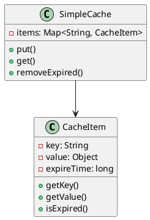
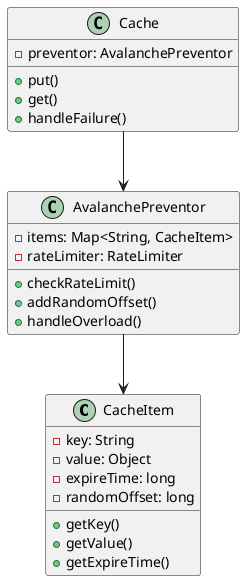
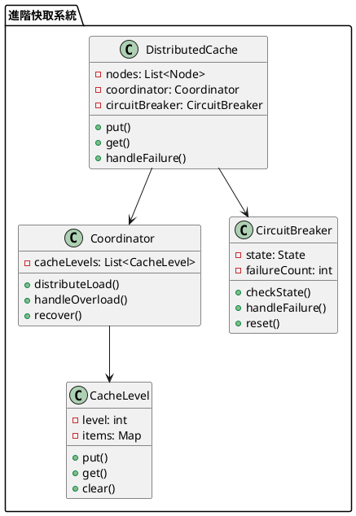

# 快取雪崩教學

## 初級（Beginner）層級

### 1. 概念說明
快取雪崩就像學校的飲水機：
- 如果所有同學同時去裝水，飲水機會很忙
- 如果飲水機壞了，大家都沒水喝
- 我們要避免太多人同時使用同一個飲水機

初級學習者需要了解：
- 什麼是快取雪崩
- 為什麼會發生雪崩
- 基本的負載分散概念

### 2. PlantUML 圖解


### 3. 分段教學步驟

#### 步驟 1：基本快取實現
```java
public class SimpleCacheItem {
    private String key;
    private Object value;
    private long expireTime;
    
    public SimpleCacheItem(String key, Object value, long expireTime) {
        this.key = key;
        this.value = value;
        this.expireTime = expireTime;
    }
    
    public String getKey() {
        return key;
    }
    
    public Object getValue() {
        return value;
    }
    
    public boolean isExpired() {
        return System.currentTimeMillis() > expireTime;
    }
}

public class SimpleCache {
    private Map<String, SimpleCacheItem> items;
    
    public SimpleCache() {
        items = new HashMap<>();
    }
    
    public void put(String key, Object value, long expireTime) {
        SimpleCacheItem item = new SimpleCacheItem(key, value, 
            System.currentTimeMillis() + expireTime);
        items.put(key, item);
        System.out.println("存入快取：" + key);
    }
    
    public Object get(String key) {
        SimpleCacheItem item = items.get(key);
        if (item != null) {
            if (item.isExpired()) {
                items.remove(key);
                System.out.println("快取過期：" + key);
                return null;
            }
            return item.getValue();
        }
        return null;
    }
}
```

## 中級（Intermediate）層級

### 1. 概念說明
中級學習者需要理解：
- 雪崩預防策略
- 過期時間分散
- 請求限流機制
- 降級處理策略

### 2. PlantUML 圖解


### 3. 分段教學步驟

#### 步驟 1：雪崩預防
```java
public class AdvancedCacheItem {
    private String key;
    private Object value;
    private long expireTime;
    private long randomOffset;
    
    public AdvancedCacheItem(String key, Object value, long expireTime) {
        this.key = key;
        this.value = value;
        this.randomOffset = (long)(Math.random() * 1000); // 隨機偏移
        this.expireTime = System.currentTimeMillis() + expireTime + randomOffset;
    }
    
    public long getExpireTime() {
        return expireTime;
    }
}
```

#### 步驟 2：請求限流
```java
public class RateLimiter {
    private Map<String, Integer> requestCounts;
    private int maxRequests;
    private long windowSize;
    
    public RateLimiter(int maxRequests, long windowSize) {
        this.requestCounts = new HashMap<>();
        this.maxRequests = maxRequests;
        this.windowSize = windowSize;
    }
    
    public boolean checkRateLimit(String key) {
        int count = requestCounts.getOrDefault(key, 0);
        if (count >= maxRequests) {
            return false;
        }
        requestCounts.put(key, count + 1);
        return true;
    }
    
    public void resetCount(String key) {
        requestCounts.remove(key);
    }
}

public class AvalanchePreventor {
    private Map<String, AdvancedCacheItem> items;
    private RateLimiter rateLimiter;
    
    public AvalanchePreventor() {
        items = new HashMap<>();
        rateLimiter = new RateLimiter(100, 1000); // 每秒最多100個請求
    }
    
    public Object get(String key) {
        if (!rateLimiter.checkRateLimit(key)) {
            System.out.println("請求過多，降級處理：" + key);
            return handleOverload(key);
        }
        
        AdvancedCacheItem item = items.get(key);
        if (item != null && !item.isExpired()) {
            return item.getValue();
        }
        return null;
    }
    
    private Object handleOverload(String key) {
        // 降級處理邏輯
        return "降級數據";
    }
}
```

## 高級（Advanced）層級

### 1. 概念說明
高級學習者需要掌握：
- 分散式雪崩預防
- 多級快取策略
- 熔斷機制
- 自動恢復策略

### 2. PlantUML 圖解


### 3. 分段教學步驟

#### 步驟 1：分散式快取
```java
public class DistributedCache {
    private List<Node> nodes;
    private Coordinator coordinator;
    private CircuitBreaker circuitBreaker;
    
    public DistributedCache() {
        nodes = new ArrayList<>();
        coordinator = new Coordinator();
        circuitBreaker = new CircuitBreaker();
    }
    
    public Object get(String key) {
        if (!circuitBreaker.checkState()) {
            return handleFailure(key);
        }
        
        // 分散式獲取
        for (Node node : nodes) {
            Object value = node.get(key);
            if (value != null) {
                return value;
            }
        }
        return null;
    }
    
    private Object handleFailure(String key) {
        circuitBreaker.handleFailure();
        return coordinator.handleOverload(key);
    }
}
```

#### 步驟 2：熔斷機制
```java
public class CircuitBreaker {
    private enum State { OPEN, HALF_OPEN, CLOSED }
    private State state;
    private int failureCount;
    private int threshold;
    
    public CircuitBreaker() {
        state = State.CLOSED;
        failureCount = 0;
        threshold = 10;
    }
    
    public boolean checkState() {
        if (state == State.OPEN) {
            return false;
        }
        return true;
    }
    
    public void handleFailure() {
        failureCount++;
        if (failureCount >= threshold) {
            state = State.OPEN;
            System.out.println("熔斷器開啟");
        }
    }
    
    public void reset() {
        state = State.CLOSED;
        failureCount = 0;
        System.out.println("熔斷器重置");
    }
}
```

#### 步驟 3：多級快取
```java
public class CacheLevel {
    private int level;
    private Map<String, Object> items;
    
    public CacheLevel(int level) {
        this.level = level;
        this.items = new HashMap<>();
    }
    
    public void put(String key, Object value) {
        items.put(key, value);
        System.out.println("存入快取層級 " + level + "：" + key);
    }
    
    public Object get(String key) {
        return items.get(key);
    }
    
    public void clear() {
        items.clear();
    }
}

public class Coordinator {
    private List<CacheLevel> cacheLevels;
    
    public Coordinator() {
        cacheLevels = new ArrayList<>();
        // 初始化多級快取
        for (int i = 0; i < 3; i++) {
            cacheLevels.add(new CacheLevel(i));
        }
    }
    
    public void distributeLoad(String key, Object value) {
        // 根據策略分配到不同層級
        for (CacheLevel level : cacheLevels) {
            level.put(key, value);
        }
    }
    
    public Object handleOverload(String key) {
        // 從較低層級獲取數據
        for (CacheLevel level : cacheLevels) {
            Object value = level.get(key);
            if (value != null) {
                return value;
            }
        }
        return null;
    }
}
```

這個教學文件提供了從基礎到進階的快取雪崩學習路徑，每個層級都包含了相應的概念說明、圖解、教學步驟和實作範例。初級學習者可以從基本的快取實現開始，中級學習者可以學習雪崩預防和請求限流，而高級學習者則可以掌握分散式快取、熔斷機制和多級快取等進階功能。 