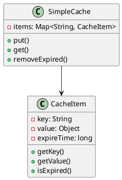
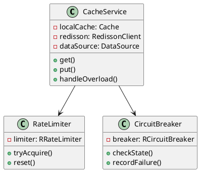
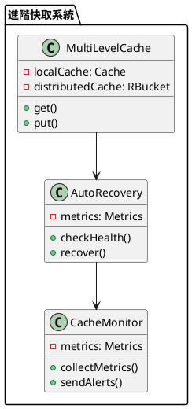

# 快取雪崩教學

## 初級（Beginner）層級

### 1. 概念說明
快取雪崩就像學校的飲水機：
- 如果所有同學同時去裝水，飲水機會很忙
- 如果飲水機壞了，大家都沒水喝
- 我們要避免太多人同時使用同一個飲水機

#### 原因分析
1. 系統設計問題：
   - 緩存過期時間集中
   - 沒有多級緩存
   - 缺乏限流機制

2. 業務場景：
   - 系統重啟
   - 定時任務執行
   - 突發流量

#### 問題表象
1. 性能問題：
   - 數據庫壓力暴增
   - 系統響應變慢
   - 資源使用率飆升

2. 業務影響：
   - 服務不可用
   - 用戶體驗差
   - 可能導致系統崩潰

#### 避免方法
1. 基礎防護：
   - 設置隨機過期時間
   - 實現多級緩存
   - 添加限流機制

2. 數據處理：
   - 數據預熱
   - 熱點數據隔離
   - 請求合併

#### 處理方案
1. 技術方案：
   - 使用多級緩存
   - 實現限流機制
   - 添加降級處理

2. 運維方案：
   - 監控系統負載
   - 設置告警閾值
   - 準備應急預案

初級學習者需要了解：
- 什麼是快取雪崩
- 為什麼會發生雪崩
- 基本的負載分散概念

### 2. PlantUML 圖解


### 3. 分段教學步驟

#### 步驟 1：基本快取實現
```java
// 配置 Caffeine 快取
public class CacheConfig {
    public Cache<String, Object> createCache() {
        return Caffeine.newBuilder()
            .maximumSize(10_000)
            .expireAfterWrite(5, TimeUnit.MINUTES)
            .build();
    }
}

// 使用 Redis 實現分布式快取
public class CacheService {
    private final Cache<String, Object> localCache;
    private final RedissonClient redisson;
    private final DataSource dataSource;
    
    public CacheService(DataSource dataSource) {
        this.localCache = Caffeine.newBuilder()
            .maximumSize(10_000)
            .expireAfterWrite(5, TimeUnit.MINUTES)
            .build();
        this.redisson = Redisson.create();
        this.dataSource = dataSource;
    }
    
    public Object get(String key) {
        // 先從本地快取獲取
        Object value = localCache.getIfPresent(key);
        if (value != null) {
            return value;
        }
        
        // 從分布式快取獲取
        RBucket<Object> bucket = redisson.getBucket(key);
        value = bucket.get();
        if (value != null) {
            localCache.put(key, value);
            return value;
        }
        
        // 從資料來源獲取
        value = dataSource.fetch(key);
        if (value != null) {
            // 設置隨機過期時間，避免雪崩
            long randomExpireTime = 5 * 60 * 1000 + (long)(Math.random() * 60 * 1000);
            bucket.set(value, randomExpireTime, TimeUnit.MILLISECONDS);
            localCache.put(key, value);
        }
        return value;
    }
}
```

## 中級（Intermediate）層級

### 1. 概念說明
中級學習者需要理解：
- 分布式快取的使用
- 過期時間分散
- 請求限流機制
- 降級處理策略

#### 分布式緩存詳解
1. 工作原理：
   - 數據分片
   - 一致性哈希
   - 故障轉移

2. 優缺點：
   - 優點：擴展性好、可用性高
   - 缺點：實現複雜、網絡開銷大

3. 使用場景：
   - 大規模數據緩存
   - 高並發訪問
   - 數據共享

#### 過期時間分散
1. 實現方式：
   - 隨機過期時間
   - 分層過期策略
   - 動態調整

2. 注意事項：
   - 過期時間範圍
   - 更新策略
   - 監控機制

#### 請求限流機制
1. 限流策略：
   - 計數器算法
   - 漏桶算法
   - 令牌桶算法

2. 實現方式：
   - 單機限流
   - 分布式限流
   - 多級限流

#### 降級處理策略
1. 降級方式：
   - 返回默認值
   - 使用舊數據
   - 部分功能降級

2. 觸發條件：
   - 系統負載過高
   - 服務異常
   - 資源不足

### 2. PlantUML 圖解


### 3. 分段教學步驟

#### 步驟 1：請求限流
```java
public class AdvancedCacheService {
    private final Cache<String, Object> localCache;
    private final RedissonClient redisson;
    private final RRateLimiter rateLimiter;
    private final RCircuitBreaker circuitBreaker;
    
    public AdvancedCacheService() {
        this.localCache = Caffeine.newBuilder()
            .maximumSize(10_000)
            .expireAfterWrite(5, TimeUnit.MINUTES)
            .build();
        this.redisson = Redisson.create();
        this.rateLimiter = redisson.getRateLimiter("rate:limiter");
        this.circuitBreaker = redisson.getCircuitBreaker("circuit:breaker");
        
        // 配置限流器：每秒最多100個請求
        rateLimiter.trySetRate(RateType.OVERALL, 100, 1, RateIntervalUnit.SECONDS);
        
        // 配置熔斷器：5次失敗後熔斷，10秒後半開
        circuitBreaker.trySetConfiguration(
            new CircuitBreakerConfig()
                .setFailureRateThreshold(5)
                .setWaitDurationInOpenState(10_000)
        );
    }
    
    public Object get(String key) {
        // 檢查熔斷器狀態
        if (!circuitBreaker.tryPass()) {
            return handleOverload(key);
        }
        
        // 檢查限流
        if (!rateLimiter.tryAcquire()) {
            return handleOverload(key);
        }
        
        try {
            // 從本地快取獲取
            Object value = localCache.getIfPresent(key);
            if (value != null) {
                return value;
            }
            
            // 從分布式快取獲取
            RBucket<Object> bucket = redisson.getBucket(key);
            value = bucket.get();
            if (value != null) {
                localCache.put(key, value);
                return value;
            }
            
            // 從資料來源獲取
            value = fetchFromDataSource(key);
            if (value != null) {
                // 設置隨機過期時間
                long randomExpireTime = 5 * 60 * 1000 + (long)(Math.random() * 60 * 1000);
                bucket.set(value, randomExpireTime, TimeUnit.MILLISECONDS);
                localCache.put(key, value);
                circuitBreaker.onSuccess();
            }
            return value;
        } catch (Exception e) {
            circuitBreaker.onFailure();
            return handleOverload(key);
        }
    }
    
    private Object handleOverload(String key) {
        // 返回降級數據
        return "降級數據";
    }
}
```

## 高級（Advanced）層級

### 1. 概念說明
高級學習者需要掌握：
- 多級快取策略
- 自動恢復機制
- 監控和告警
- 性能優化

#### 多級緩存策略
1. 架構設計：
   - 本地緩存
   - 分布式緩存
   - 數據庫緩存

2. 同步機制：
   - 定期同步
   - 事件觸發
   - 增量更新

#### 熔斷降級機制
1. 熔斷策略：
   - 錯誤率熔斷
   - 響應時間熔斷
   - 並發數熔斷

2. 降級策略：
   - 服務降級
   - 功能降級
   - 數據降級

#### 監控和告警
1. 監控維度：
   - 系統負載
   - 緩存命中率
   - 錯誤率
   - 響應時間

2. 告警策略：
   - 多級告警
   - 智能降噪
   - 自動處理

#### 性能優化
1. 優化方向：
   - 緩存策略
   - 數據結構
   - 並發控制

2. 優化手段：
   - 預熱機制
   - 異步處理
   - 批量操作

### 2. PlantUML 圖解


### 3. 分段教學步驟

#### 步驟 1：多級快取
```java
public class MultiLevelCache {
    private final Cache<String, Object> localCache;
    private final RedissonClient redisson;
    private final CacheMonitor monitor;
    
    public MultiLevelCache() {
        this.localCache = Caffeine.newBuilder()
            .maximumSize(1_000)
            .expireAfterWrite(1, TimeUnit.MINUTES)
            .build();
        this.redisson = Redisson.create();
        this.monitor = new CacheMonitor();
    }
    
    public Object get(String key) {
        // 先從本地快取獲取
        Object value = localCache.getIfPresent(key);
        if (value != null) {
            monitor.recordLocalHit();
            return value;
        }
        
        // 從分布式快取獲取
        RBucket<Object> bucket = redisson.getBucket(key);
        value = bucket.get();
        if (value != null) {
            localCache.put(key, value);
            monitor.recordDistributedHit();
            return value;
        }
        
        // 從資料來源獲取
        value = fetchFromDataSource(key);
        if (value != null) {
            // 設置隨機過期時間
            long randomExpireTime = 5 * 60 * 1000 + (long)(Math.random() * 60 * 1000);
            bucket.set(value, randomExpireTime, TimeUnit.MILLISECONDS);
            localCache.put(key, value);
        }
        return value;
    }
}
```

### 4. 進階配置

#### 監控配置（使用 Micrometer）
```java
public class CacheMetrics {
    private final Counter localCacheHits;
    private final Counter distributedCacheHits;
    private final Counter circuitBreakerTrips;
    
    public CacheMetrics() {
        this.localCacheHits = Metrics.counter("local.cache.hits");
        this.distributedCacheHits = Metrics.counter("distributed.cache.hits");
        this.circuitBreakerTrips = Metrics.counter("circuit.breaker.trips");
    }
    
    public void recordLocalHit() {
        localCacheHits.increment();
    }
    
    public void recordDistributedHit() {
        distributedCacheHits.increment();
    }
    
    public void recordCircuitBreakerTrip() {
        circuitBreakerTrips.increment();
    }
}
```

#### Maven 依賴配置
```xml
<dependencies>
    <dependency>
        <groupId>com.github.ben-manes.caffeine</groupId>
        <artifactId>caffeine</artifactId>
        <version>3.1.8</version>
    </dependency>
    <dependency>
        <groupId>org.redisson</groupId>
        <artifactId>redisson</artifactId>
        <version>3.24.3</version>
    </dependency>
    <dependency>
        <groupId>io.micrometer</groupId>
        <artifactId>micrometer-core</artifactId>
        <version>1.11.5</version>
    </dependency>
</dependencies>
```

這個教學文件提供了從基礎到進階的快取雪崩學習路徑，每個層級都包含了相應的概念說明、圖解、教學步驟和實作範例。初級學習者可以從基本的快取實現開始，中級學習者可以學習雪崩預防和請求限流，而高級學習者則可以掌握分散式快取、熔斷機制和多級快取等進階功能。 