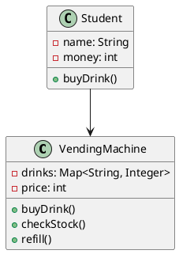
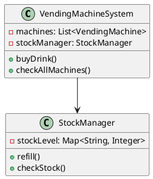
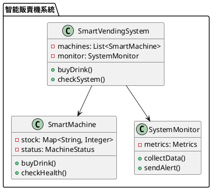

# 快取雪崩教學

## 初級（Beginner）層級

### 1. 概念說明
快取雪崩就像學校的自動販賣機：
- 如果所有同學同時去買飲料，機器會很忙
- 如果機器壞了，大家都買不到飲料
- 我們要避免太多人同時使用同一台機器

#### 為什麼會發生？
1. 系統設計問題：
   - 所有飲料同時賣完
   - 只有一台販賣機
   - 沒有排隊機制

2. 實際情況：
   - 下課時間
   - 體育課後
   - 突然很多人想買

#### 會發生什麼問題？
1. 系統變慢：
   - 機器反應變慢
   - 排隊時間變長
   - 機器負擔變重

2. 使用體驗：
   - 買不到飲料
   - 等待時間長
   - 可能當機

#### 如何避免？
1. 基本方法：
   - 不同飲料不同時間補貨
   - 多放幾台販賣機
   - 限制排隊人數

2. 其他方法：
   - 提前補貨
   - 熱門飲料分開放
   - 合併購買需求

### 2. PlantUML 圖解


### 3. 分段教學步驟

#### 步驟 1：基本快取實現
```java
// 簡單的快取類別
public class SimpleCache {
    private Map<String, Object> cache = new HashMap<>();
    
    // 放入快取
    public void put(String key, Object value) {
        cache.put(key, value);
    }
    
    // 從快取取出
    public Object get(String key) {
        return cache.get(key);
    }
    
    // 清除快取
    public void clear() {
        cache.clear();
    }
}

// 使用範例
public class Main {
    public static void main(String[] args) {
        SimpleCache cache = new SimpleCache();
        
        // 放入資料
        cache.put("飲料1", "可樂");
        cache.put("飲料2", "雪碧");
        
        // 取出資料
        String drink = (String) cache.get("飲料1");
        System.out.println("我買到了：" + drink);
    }
}
```

## 中級（Intermediate）層級

### 1. 概念說明
中級學習者需要理解：
- 多台販賣機如何一起工作
- 如何控制補貨時間
- 如何管理排隊人數
- 當機時怎麼辦

#### 多台販賣機系統
1. 如何工作：
   - 分散在不同位置
   - 互相備份
   - 自動切換

2. 優缺點：
   - 優點：不會全部當機、可以服務更多人
   - 缺點：需要更多機器、管理較複雜

3. 使用時機：
   - 人很多的時候
   - 重要活動時
   - 機器維修時

#### 補貨時間控制
1. 方法：
   - 不同時間補貨
   - 分批補貨
   - 自動補貨

2. 注意事項：
   - 補貨時間要錯開
   - 要留備用飲料
   - 要監控庫存

### 2. PlantUML 圖解


### 3. 分段教學步驟

#### 步驟 1：多台販賣機系統
```java
public class VendingMachineSystem {
    private List<VendingMachine> machines = new ArrayList<>();
    private StockManager stockManager;
    
    public VendingMachineSystem() {
        // 建立三台販賣機
        for (int i = 0; i < 3; i++) {
            machines.add(new VendingMachine());
        }
        stockManager = new StockManager();
    }
    
    public String buyDrink(String drinkName) {
        // 輪流嘗試每台機器
        for (VendingMachine machine : machines) {
            if (machine.hasStock(drinkName)) {
                return machine.buyDrink(drinkName);
            }
        }
        return "抱歉，目前沒有庫存";
    }
    
    public void refill() {
        // 錯開補貨時間
        for (int i = 0; i < machines.size(); i++) {
            // 每台機器間隔5分鐘補貨
            try {
                Thread.sleep(5 * 60 * 1000);
            } catch (InterruptedException e) {
                e.printStackTrace();
            }
            machines.get(i).refill();
        }
    }
}
```

## 高級（Advanced）層級

### 1. 概念說明
高級學習者需要掌握：
- 智能販賣機系統
- 自動監控和修復
- 數據分析和預測
- 系統優化

#### 智能販賣機系統
1. 系統設計：
   - 中央控制系統
   - 分散式儲存
   - 自動備份

2. 同步機制：
   - 定期同步庫存
   - 即時更新狀態
   - 自動平衡負載

#### 監控和修復
1. 監控項目：
   - 機器狀態
   - 庫存數量
   - 使用人數
   - 故障次數

2. 修復策略：
   - 自動重啟
   - 切換備用機
   - 通知管理員

### 2. PlantUML 圖解


### 3. 分段教學步驟

#### 步驟 1：智能販賣機系統
```java
public class SmartVendingSystem {
    private List<SmartMachine> machines = new ArrayList<>();
    private SystemMonitor monitor;
    
    public SmartVendingSystem() {
        this.monitor = new SystemMonitor();
        // 初始化多台智能販賣機
        for (int i = 0; i < 5; i++) {
            machines.add(new SmartMachine("機器" + (i + 1)));
        }
    }
    
    public String buyDrink(String drinkName) {
        // 選擇最不忙的機器
        SmartMachine bestMachine = findBestMachine();
        if (bestMachine != null) {
            return bestMachine.buyDrink(drinkName);
        }
        return "系統忙碌中，請稍後再試";
    }
    
    private SmartMachine findBestMachine() {
        return machines.stream()
            .filter(m -> m.isHealthy())
            .min((m1, m2) -> Integer.compare(m1.getQueueSize(), m2.getQueueSize()))
            .orElse(null);
    }
    
    public void monitorSystem() {
        // 定期檢查系統狀態
        machines.forEach(machine -> {
            if (!machine.isHealthy()) {
                monitor.sendAlert("機器 " + machine.getName() + " 需要檢查");
            }
        });
    }
}
```

### 4. 進階配置

#### 監控配置
```java
public class SystemMetrics {
    private final Counter totalSales;
    private final Counter machineErrors;
    private final Gauge queueSize;
    
    public SystemMetrics() {
        this.totalSales = Metrics.counter("total.sales");
        this.machineErrors = Metrics.counter("machine.errors");
        this.queueSize = Metrics.gauge("queue.size");
    }
    
    public void recordSale() {
        totalSales.increment();
    }
    
    public void recordError() {
        machineErrors.increment();
    }
    
    public void updateQueueSize(int size) {
        queueSize.set(size);
    }
}
```

這個教學文件提供了從基礎到進階的快取雪崩學習路徑，每個層級都使用了國中生容易理解的販賣機比喻，並包含了相應的概念說明、圖解、教學步驟和實作範例。初級學習者可以從基本的快取概念開始，中級學習者可以學習多台機器協作，而高級學習者則可以掌握智能系統和監控等進階功能。 