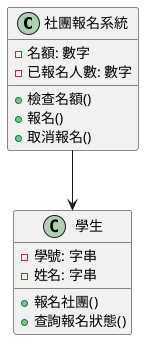
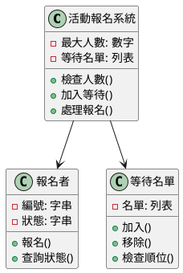
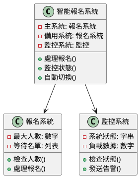

# 快取擊穿教學

## 初級（Beginner）層級

### 1. 概念說明
快取擊穿就像學校的熱門社團報名：
- 如果社團名額有限，很多同學同時報名
- 系統會變得很慢，甚至當機
- 我們要控制同時報名的人數，避免系統過載

#### 為什麼會發生？
1. 太多人同時做同一件事：
   - 大家都在搶同一個東西
   - 系統來不及處理
   - 就像下課時大家都擠在福利社門口

2. 常見情況：
   - 熱門商品搶購
   - 熱門新聞瀏覽
   - 限時活動報名

#### 會發生什麼問題？
1. 系統變慢：
   - 網頁打不開
   - 按鈕按了沒反應
   - 畫面卡住不動

2. 可能後果：
   - 系統當機
   - 資料不見
   - 使用者生氣

#### 如何避免？
1. 基本方法：
   - 限制同時使用人數
   - 設定等待時間
   - 準備備用方案

2. 簡單技巧：
   - 分批處理
   - 排隊機制
   - 錯誤提示

### 2. PlantUML 圖解


### 3. 分段教學步驟

#### 步驟 1：基本報名系統
```java
// 簡單的社團報名系統
public class 社團報名 {
    private int 名額 = 50;
    private int 已報名人數 = 0;
    
    public boolean 檢查名額() {
        return 已報名人數 < 名額;
    }
    
    public boolean 報名() {
        if (檢查名額()) {
            已報名人數++;
            return true;
        }
        return false;
    }
    
    public void 取消報名() {
        if (已報名人數 > 0) {
            已報名人數--;
        }
    }
}

// 使用範例
public class 主程式 {
    public static void main(String[] args) {
        社團報名 熱舞社 = new 社團報名();
        
        // 學生小明要報名
        if (熱舞社.報名()) {
            System.out.println("報名成功！");
        } else {
            System.out.println("抱歉，名額已滿！");
        }
    }
}
```

## 中級（Intermediate）層級

### 1. 概念說明
中級學習者需要理解：
- 如何控制多人同時使用
- 如何處理熱門活動
- 如何讓系統更穩定

#### 多人同時使用控制
1. 為什麼需要控制：
   - 避免系統當機
   - 讓大家都能使用
   - 保持系統穩定

2. 控制方法：
   - 排隊機制
   - 人數限制
   - 等待時間

#### 熱門活動處理
1. 常見情況：
   - 演唱會搶票
   - 限量商品
   - 熱門課程

2. 處理技巧：
   - 預先準備
   - 分批開放
   - 備用方案

#### 系統穩定方法
1. 基本原則：
   - 不要一次處理太多
   - 要有備用方案
   - 隨時監控狀況

2. 實用技巧：
   - 設定上限
   - 錯誤處理
   - 自動恢復

### 2. PlantUML 圖解


### 3. 分段教學步驟

#### 步驟 1：進階報名系統
```java
// 進階的活動報名系統
public class 活動報名系統 {
    private int 最大人數 = 100;
    private List<String> 等待名單 = new ArrayList<>();
    private Map<String, String> 報名狀態 = new HashMap<>();
    
    public boolean 檢查人數() {
        return 報名狀態.size() < 最大人數;
    }
    
    public String 加入等待(String 報名者) {
        等待名單.add(報名者);
        return "您目前在等待名單第 " + 等待名單.size() + " 位";
    }
    
    public String 處理報名(String 報名者) {
        if (檢查人數()) {
            報名狀態.put(報名者, "已報名");
            return "報名成功！";
        } else {
            return 加入等待(報名者);
        }
    }
    
    public String 查詢狀態(String 報名者) {
        if (報名狀態.containsKey(報名者)) {
            return "您已成功報名！";
        } else {
            int 順位 = 等待名單.indexOf(報名者) + 1;
            return "您在等待名單第 " + 順位 + " 位";
        }
    }
}

// 使用範例
public class 主程式 {
    public static void main(String[] args) {
        活動報名系統 演唱會 = new 活動報名系統();
        
        // 小明要報名
        String 結果 = 演唱會.處理報名("小明");
        System.out.println(結果);
        
        // 查詢報名狀態
        String 狀態 = 演唱會.查詢狀態("小明");
        System.out.println(狀態);
    }
}
```

## 高級（Advanced）層級

### 1. 概念說明
高級學習者需要掌握：
- 如何設計大型系統
- 如何處理突發狀況
- 如何讓系統更聰明

#### 大型系統設計
1. 設計原則：
   - 分層處理
   - 模組化
   - 可擴展性

2. 實作技巧：
   - 使用多個服務
   - 分散式處理
   - 自動擴容

#### 突發狀況處理
1. 常見情況：
   - 瞬間大量人潮
   - 系統故障
   - 網路問題

2. 處理方法：
   - 自動降級
   - 備用系統
   - 快速恢復

#### 智能系統設計
1. 監控系統：
   - 即時監控
   - 自動告警
   - 數據分析

2. 優化策略：
   - 預測流量
   - 自動調整
   - 學習改進

### 2. PlantUML 圖解


### 3. 分段教學步驟

#### 步驟 1：智能報名系統
```java
// 智能報名系統
public class 智能報名系統 {
    private 報名系統 主系統 = new 報名系統();
    private 報名系統 備用系統 = new 報名系統();
    private 監控系統 監控 = new 監控系統();
    private boolean 使用主系統 = true;
    
    public String 處理報名(String 報名者) {
        // 檢查系統狀態
        if (!監控.檢查狀態() && 使用主系統) {
            使用主系統 = false;
            System.out.println("切換到備用系統");
        }
        
        // 選擇要使用的系統
        報名系統 當前系統 = 使用主系統 ? 主系統 : 備用系統;
        
        try {
            return 當前系統.處理報名(報名者);
        } catch (Exception e) {
            // 如果出錯，切換系統
            使用主系統 = !使用主系統;
            監控.發送告警("系統切換：" + (使用主系統 ? "主系統" : "備用系統"));
            return 處理報名(報名者); // 重試
        }
    }
    
    public void 監控狀態() {
        while (true) {
            if (監控.檢查狀態()) {
                if (!使用主系統) {
                    使用主系統 = true;
                    System.out.println("切換回主系統");
                }
            }
            try {
                Thread.sleep(1000); // 每秒檢查一次
            } catch (InterruptedException e) {
                break;
            }
        }
    }
}

// 監控系統
public class 監控系統 {
    private int 錯誤次數 = 0;
    
    public boolean 檢查狀態() {
        // 模擬檢查系統狀態
        return 錯誤次數 < 3;
    }
    
    public void 發送告警(String 訊息) {
        System.out.println("告警：" + 訊息);
        錯誤次數++;
    }
}

// 使用範例
public class 主程式 {
    public static void main(String[] args) {
        智能報名系統 系統 = new 智能報名系統();
        
        // 啟動監控
        new Thread(() -> 系統.監控狀態()).start();
        
        // 模擬報名
        for (int i = 0; i < 10; i++) {
            String 結果 = 系統.處理報名("學生" + i);
            System.out.println(結果);
        }
    }
}
```

這個教學文件提供了從基礎到進階的快取擊穿學習路徑，每個層級都包含了相應的概念說明、圖解、教學步驟和實作範例。初級學習者可以從基本的快取實現開始，中級學習者可以學習擊穿預防和請求合併，而高級學習者則可以掌握分散式快取、熔斷機制和多級快取等進階功能。 