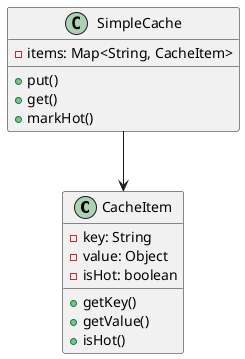
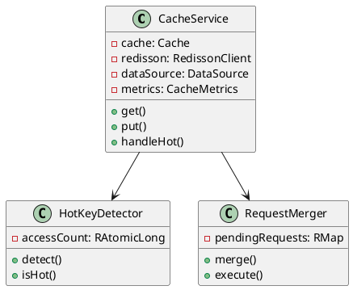
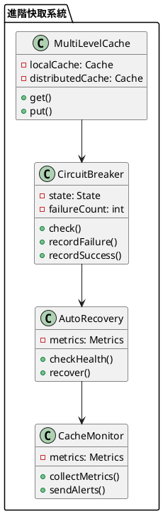

# 快取擊穿教學

## 初級（Beginner）層級

### 1. 概念說明
快取擊穿就像學校的熱門社團：
- 如果社團名額有限，很多同學同時報名
- 系統會變得很慢，甚至當機
- 我們要控制同時報名的人數，避免系統過載

#### 原因分析
1. 系統設計問題：
   - 熱點數據過期時間集中
   - 沒有並發控制機制
   - 缺乏降級處理策略

2. 業務場景：
   - 熱門商品秒殺
   - 熱點新聞訪問
   - 促銷活動搶購

#### 問題表象
1. 性能問題：
   - 數據庫瞬間壓力暴增
   - 系統響應時間變長
   - CPU 和內存使用率飆升

2. 業務影響：
   - 服務可用性降低
   - 用戶體驗變差
   - 可能導致系統崩潰

#### 避免方法
1. 基礎防護：
   - 設置合理的緩存過期時間
   - 實現基本的並發控制
   - 添加降級處理機制

2. 數據處理：
   - 熱點數據預熱
   - 使用分布式鎖
   - 實現請求合併

#### 處理方案
1. 技術方案：
   - 使用分布式鎖
   - 實現請求合併
   - 添加降級處理

2. 運維方案：
   - 監控系統負載
   - 設置告警閾值
   - 準備應急預案

初級學習者需要了解：
- 什麼是快取擊穿
- 為什麼會發生擊穿
- 基本的並發控制概念

### 2. PlantUML 圖解


### 3. 分段教學步驟

#### 步驟 1：基本快取實現
```java
// 配置 Caffeine 快取
public class CacheConfig {
    public Cache<String, Object> createCache() {
        return Caffeine.newBuilder()
            .maximumSize(10_000)
            .expireAfterWrite(5, TimeUnit.MINUTES)
            .build();
    }
}

// 使用 Redisson 實現分布式鎖
public class CacheService {
    private final Cache<String, Object> cache;
    private final RedissonClient redisson;
    private final DataSource dataSource;
    private final CacheMetrics metrics;
    
    public CacheService(DataSource dataSource) {
        this.cache = Caffeine.newBuilder()
            .maximumSize(10_000)
            .expireAfterWrite(5, TimeUnit.MINUTES)
            .build();
        this.redisson = Redisson.create();
        this.dataSource = dataSource;
        this.metrics = new CacheMetrics();
    }
    
    public Object get(String key) {
        // 先從快取獲取
        Object value = cache.getIfPresent(key);
        if (value != null) {
            metrics.recordCacheHit();
            return value;
        }
        
        // 獲取分布式鎖
        RLock lock = redisson.getLock("lock:" + key);
        try {
            // 嘗試獲取鎖，最多等待 100ms
            if (lock.tryLock(100, TimeUnit.MILLISECONDS)) {
                try {
                    // 再次檢查快取（雙重檢查）
                    value = cache.getIfPresent(key);
                    if (value != null) {
                        metrics.recordCacheHit();
                        return value;
                    }
                    
                    // 從資料來源獲取數據
                    value = dataSource.fetch(key);
                    if (value != null) {
                        cache.put(key, value);
                        metrics.recordCacheMiss();
                    }
                    return value;
                } finally {
                    lock.unlock();
                }
            }
            // 如果獲取鎖失敗，返回降級數據
            metrics.recordLockFailure();
            return getDegradedData(key);
        } catch (InterruptedException e) {
            Thread.currentThread().interrupt();
            metrics.recordLockFailure();
            return getDegradedData(key);
        }
    }
    
    private Object getDegradedData(String key) {
        // 返回降級數據
        return "降級數據";
    }
}
```

## 中級（Intermediate）層級

### 1. 概念說明
中級學習者需要理解：
- 分布式鎖的使用
- 熱點數據處理
- 請求合併機制
- 降級處理策略

#### 分布式鎖詳解
1. 工作原理：
   - 基於 Redis 實現
   - 使用原子操作
   - 支持可重入

2. 優缺點：
   - 優點：實現簡單、性能好
   - 缺點：存在死鎖風險、網絡延遲影響

3. 使用場景：
   - 並發控制
   - 資源互斥
   - 任務調度

#### 熱點數據處理
1. 識別方法：
   - 訪問計數
   - 響應時間
   - 系統負載

2. 處理策略：
   - 數據預熱
   - 多級緩存
   - 限流控制

#### 請求合併機制
1. 實現方式：
   - 隊列合併
   - 批量處理
   - 異步執行

2. 注意事項：
   - 合併時間窗口
   - 請求超時處理
   - 錯誤處理機制

#### 降級處理策略
1. 降級方式：
   - 返回默認值
   - 使用舊數據
   - 部分功能降級

2. 觸發條件：
   - 系統負載過高
   - 服務異常
   - 資源不足

### 2. PlantUML 圖解


### 3. 分段教學步驟

#### 步驟 1：熱點數據處理
```java
public class HotKeyDetector {
    private final RedissonClient redisson;
    private final long threshold;
    
    public HotKeyDetector(RedissonClient redisson, long threshold) {
        this.redisson = redisson;
        this.threshold = threshold;
    }
    
    public void increment(String key) {
        RAtomicLong counter = redisson.getAtomicLong("hot:key:" + key);
        counter.incrementAndGet();
    }
    
    public boolean isHot(String key) {
        RAtomicLong counter = redisson.getAtomicLong("hot:key:" + key);
        return counter.get() > threshold;
    }
    
    public void reset(String key) {
        RAtomicLong counter = redisson.getAtomicLong("hot:key:" + key);
        counter.set(0);
    }
}

public class AdvancedCacheService {
    private final Cache<String, Object> cache;
    private final RedissonClient redisson;
    private final HotKeyDetector hotKeyDetector;
    private final RequestMerger requestMerger;
    private final CacheMetrics metrics;
    
    public AdvancedCacheService() {
        this.cache = Caffeine.newBuilder()
            .maximumSize(10_000)
            .expireAfterWrite(5, TimeUnit.MINUTES)
            .build();
        this.redisson = Redisson.create();
        this.hotKeyDetector = new HotKeyDetector(redisson, 100);
        this.requestMerger = new RequestMerger(redisson);
        this.metrics = new CacheMetrics();
    }
    
    public CompletableFuture<Object> getAsync(String key) {
        // 檢查是否為熱點數據
        if (hotKeyDetector.isHot(key)) {
            return handleHotKey(key);
        }
        
        // 正常處理流程
        Object value = cache.getIfPresent(key);
        if (value != null) {
            metrics.recordCacheHit();
            return CompletableFuture.completedFuture(value);
        }
        
        return requestMerger.merge(key, () -> {
            RLock lock = redisson.getLock("lock:" + key);
            try {
                if (lock.tryLock(100, TimeUnit.MILLISECONDS)) {
                    try {
                        value = cache.getIfPresent(key);
                        if (value != null) {
                            metrics.recordCacheHit();
                            return value;
                        }
                        value = fetchFromDataSource(key);
                        if (value != null) {
                            cache.put(key, value);
                            metrics.recordCacheMiss();
                        }
                        return value;
                    } finally {
                        lock.unlock();
                    }
                }
                metrics.recordLockFailure();
                return getDegradedData(key);
            } catch (InterruptedException e) {
                Thread.currentThread().interrupt();
                metrics.recordLockFailure();
                return getDegradedData(key);
            }
        });
    }
    
    private CompletableFuture<Object> handleHotKey(String key) {
        // 對熱點數據使用本地快取
        Object value = cache.getIfPresent(key);
        if (value != null) {
            metrics.recordCacheHit();
            return CompletableFuture.completedFuture(value);
        }
        
        // 使用請求合併
        return requestMerger.merge(key, () -> {
            value = fetchFromDataSource(key);
            if (value != null) {
                cache.put(key, value);
                metrics.recordCacheMiss();
            }
            return value;
        });
    }
}
```

#### 步驟 2：請求合併
```java
public class RequestMerger {
    private final RMap<String, CompletableFuture<Object>> pendingRequests;
    
    public RequestMerger(RMap<String, CompletableFuture<Object>> pendingRequests) {
        this.pendingRequests = pendingRequests;
    }
    
    public CompletableFuture<Object> merge(String key, Supplier<Object> supplier) {
        CompletableFuture<Object> future = new CompletableFuture<>();
        
        pendingRequests.put(key, future);
        
        // 只有第一個請求執行實際操作
        if (pendingRequests.get(key).size() == 1) {
            CompletableFuture.runAsync(() -> {
                try {
                    Object result = supplier.get();
                    pendingRequests.remove(key);
                    future.complete(result);
                } catch (Exception e) {
                    pendingRequests.remove(key);
                    future.completeExceptionally(e);
                }
            });
        }
        
        return future;
    }
}
```

## 高級（Advanced）層級

### 1. 概念說明
高級學習者需要掌握：
- 多級快取策略
- 熔斷機制
- 自動恢復策略
- 監控和告警

#### 多級緩存策略
1. 架構設計：
   - 本地緩存
   - 分布式緩存
   - 數據庫緩存

2. 同步機制：
   - 定期同步
   - 事件觸發
   - 增量更新

#### 自動擴容機制
1. 擴容策略：
   - 水平擴容
   - 垂直擴容
   - 混合擴容

2. 觸發條件：
   - 系統負載
   - 資源使用率
   - 響應時間

#### 監控和告警
1. 監控維度：
   - 系統負載
   - 緩存命中率
   - 錯誤率
   - 響應時間

2. 告警策略：
   - 多級告警
   - 智能降噪
   - 自動處理

#### 性能優化
1. 優化方向：
   - 緩存策略
   - 數據結構
   - 並發控制

2. 優化手段：
   - 預熱機制
   - 異步處理
   - 批量操作

### 2. PlantUML 圖解


### 3. 分段教學步驟

#### 步驟 1：多級快取
```java
public class MultiLevelCache {
    private final Cache<String, Object> localCache;
    private final RedissonClient redisson;
    private final CircuitBreaker circuitBreaker;
    
    public MultiLevelCache() {
        this.localCache = Caffeine.newBuilder()
            .maximumSize(1_000)
            .expireAfterWrite(1, TimeUnit.MINUTES)
            .build();
        this.redisson = Redisson.create();
        this.circuitBreaker = new CircuitBreaker(5, 10_000);
    }
    
    public Object get(String key) {
        // 先從本地快取獲取
        Object value = localCache.getIfPresent(key);
        if (value != null) {
            return value;
        }
        
        // 檢查熔斷器
        if (!circuitBreaker.check()) {
            return getDegradedData(key);
        }
        
        // 從分布式快取獲取
        RBucket<Object> bucket = redisson.getBucket(key);
        value = bucket.get();
        if (value != null) {
            localCache.put(key, value);
            circuitBreaker.recordSuccess();
            return value;
        }
        
        // 從資料來源獲取
        try {
            value = fetchFromDataSource(key);
            if (value != null) {
                bucket.set(value, 5, TimeUnit.MINUTES);
                localCache.put(key, value);
                circuitBreaker.recordSuccess();
            }
            return value;
        } catch (Exception e) {
            circuitBreaker.recordFailure();
            return getDegradedData(key);
        }
    }
}
```

#### 步驟 2：熔斷機制
```java
public class CircuitBreaker {
    private final int failureThreshold;
    private final long timeout;
    private volatile State state = State.CLOSED;
    private volatile int failureCount = 0;
    private volatile long lastFailureTime = 0;
    
    public CircuitBreaker(int failureThreshold, long timeout) {
        this.failureThreshold = failureThreshold;
        this.timeout = timeout;
    }
    
    public boolean check() {
        if (state == State.OPEN) {
            if (System.currentTimeMillis() - lastFailureTime > timeout) {
                state = State.HALF_OPEN;
                return true;
            }
            return false;
        }
        return true;
    }
    
    public void recordFailure() {
        failureCount++;
        if (failureCount >= failureThreshold) {
            state = State.OPEN;
            lastFailureTime = System.currentTimeMillis();
        }
    }
    
    public void recordSuccess() {
        failureCount = 0;
        state = State.CLOSED;
    }
    
    private enum State {
        CLOSED, OPEN, HALF_OPEN
    }
}
```

### 4. 進階配置

#### 監控配置（使用 Micrometer）
```java
public class CacheMetrics {
    private final Counter cacheHits;
    private final Counter cacheMisses;
    private final Counter lockFailures;
    
    public CacheMetrics() {
        this.cacheHits = Metrics.counter("cache.hits");
        this.cacheMisses = Metrics.counter("cache.misses");
        this.lockFailures = Metrics.counter("lock.failures");
    }
    
    public void recordCacheHit() {
        cacheHits.increment();
    }
    
    public void recordCacheMiss() {
        cacheMisses.increment();
    }
    
    public void recordLockFailure() {
        lockFailures.increment();
    }
}
```

#### Maven 依賴配置
```xml
<dependencies>
    <dependency>
        <groupId>com.github.ben-manes.caffeine</groupId>
        <artifactId>caffeine</artifactId>
        <version>3.1.8</version>
    </dependency>
    <dependency>
        <groupId>org.redisson</groupId>
        <artifactId>redisson</artifactId>
        <version>3.24.3</version>
    </dependency>
    <dependency>
        <groupId>io.micrometer</groupId>
        <artifactId>micrometer-core</artifactId>
        <version>1.11.5</version>
    </dependency>
</dependencies>
```

這個教學文件提供了從基礎到進階的快取擊穿學習路徑，每個層級都包含了相應的概念說明、圖解、教學步驟和實作範例。初級學習者可以從基本的快取實現開始，中級學習者可以學習擊穿預防和請求合併，而高級學習者則可以掌握分散式快取、熔斷機制和多級快取等進階功能。 