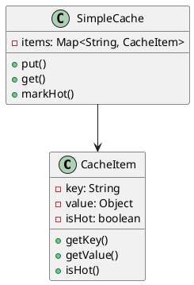
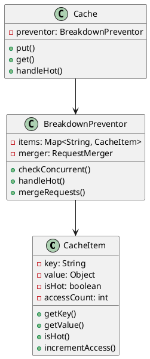
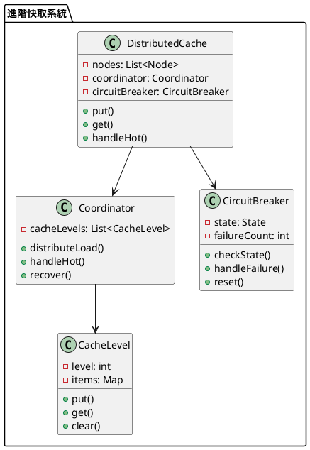

# 快取擊穿教學

## 初級（Beginner）層級

### 1. 概念說明
快取擊穿就像學校的熱門社團：
- 如果社團名額有限，很多同學同時報名
- 系統會變得很慢，甚至當機
- 我們要控制同時報名的人數，避免系統過載

初級學習者需要了解：
- 什麼是快取擊穿
- 為什麼會發生擊穿
- 基本的並發控制概念

### 2. PlantUML 圖解


### 3. 分段教學步驟

#### 步驟 1：基本快取實現
```java
public class SimpleCacheItem {
    private String key;
    private Object value;
    private boolean isHot;
    
    public SimpleCacheItem(String key, Object value) {
        this.key = key;
        this.value = value;
        this.isHot = false;
    }
    
    public String getKey() {
        return key;
    }
    
    public Object getValue() {
        return value;
    }
    
    public boolean isHot() {
        return isHot;
    }
    
    public void markHot() {
        this.isHot = true;
    }
}

public class SimpleCache {
    private Map<String, SimpleCacheItem> items;
    
    public SimpleCache() {
        items = new HashMap<>();
    }
    
    public void put(String key, Object value) {
        SimpleCacheItem item = new SimpleCacheItem(key, value);
        items.put(key, item);
        System.out.println("存入快取：" + key);
    }
    
    public Object get(String key) {
        SimpleCacheItem item = items.get(key);
        if (item != null) {
            if (item.isHot()) {
                System.out.println("熱門項目：" + key);
            }
            return item.getValue();
        }
        return null;
    }
    
    public void markHot(String key) {
        SimpleCacheItem item = items.get(key);
        if (item != null) {
            item.markHot();
            System.out.println("標記熱門：" + key);
        }
    }
}
```

## 中級（Intermediate）層級

### 1. 概念說明
中級學習者需要理解：
- 擊穿預防策略
- 並發控制機制
- 請求合併機制
- 降級處理策略

### 2. PlantUML 圖解


### 3. 分段教學步驟

#### 步驟 1：擊穿預防
```java
public class AdvancedCacheItem {
    private String key;
    private Object value;
    private boolean isHot;
    private int accessCount;
    
    public AdvancedCacheItem(String key, Object value) {
        this.key = key;
        this.value = value;
        this.isHot = false;
        this.accessCount = 0;
    }
    
    public void incrementAccess() {
        accessCount++;
        if (accessCount > 100) { // 設定熱門閾值
            isHot = true;
        }
    }
    
    public boolean isHot() {
        return isHot;
    }
    
    public int getAccessCount() {
        return accessCount;
    }
}
```

#### 步驟 2：請求合併
```java
public class RequestMerger {
    private Map<String, List<Runnable>> pendingRequests;
    
    public RequestMerger() {
        pendingRequests = new HashMap<>();
    }
    
    public void addRequest(String key, Runnable request) {
        pendingRequests.computeIfAbsent(key, k -> new ArrayList<>())
                      .add(request);
    }
    
    public void executeRequests(String key) {
        List<Runnable> requests = pendingRequests.remove(key);
        if (requests != null) {
            for (Runnable request : requests) {
                request.run();
            }
        }
    }
}

public class BreakdownPreventor {
    private Map<String, AdvancedCacheItem> items;
    private RequestMerger merger;
    
    public BreakdownPreventor() {
        items = new HashMap<>();
        merger = new RequestMerger();
    }
    
    public Object get(String key) {
        AdvancedCacheItem item = items.get(key);
        if (item != null) {
            item.incrementAccess();
            if (item.isHot()) {
                return handleHot(key);
            }
            return item.getValue();
        }
        return null;
    }
    
    private Object handleHot(String key) {
        // 合併請求
        merger.addRequest(key, () -> {
            System.out.println("處理熱門請求：" + key);
        });
        merger.executeRequests(key);
        return "降級數據";
    }
}
```

## 高級（Advanced）層級

### 1. 概念說明
高級學習者需要掌握：
- 分散式擊穿預防
- 多級快取策略
- 熔斷機制
- 自動恢復策略

### 2. PlantUML 圖解


### 3. 分段教學步驟

#### 步驟 1：分散式快取
```java
public class DistributedCache {
    private List<Node> nodes;
    private Coordinator coordinator;
    private CircuitBreaker circuitBreaker;
    
    public DistributedCache() {
        nodes = new ArrayList<>();
        coordinator = new Coordinator();
        circuitBreaker = new CircuitBreaker();
    }
    
    public Object get(String key) {
        if (!circuitBreaker.checkState()) {
            return handleHot(key);
        }
        
        // 分散式獲取
        for (Node node : nodes) {
            Object value = node.get(key);
            if (value != null) {
                return value;
            }
        }
        return null;
    }
    
    private Object handleHot(String key) {
        circuitBreaker.handleFailure();
        return coordinator.handleHot(key);
    }
}
```

#### 步驟 2：熔斷機制
```java
public class CircuitBreaker {
    private enum State { OPEN, HALF_OPEN, CLOSED }
    private State state;
    private int failureCount;
    private int threshold;
    
    public CircuitBreaker() {
        state = State.CLOSED;
        failureCount = 0;
        threshold = 10;
    }
    
    public boolean checkState() {
        if (state == State.OPEN) {
            return false;
        }
        return true;
    }
    
    public void handleFailure() {
        failureCount++;
        if (failureCount >= threshold) {
            state = State.OPEN;
            System.out.println("熔斷器開啟");
        }
    }
    
    public void reset() {
        state = State.CLOSED;
        failureCount = 0;
        System.out.println("熔斷器重置");
    }
}
```

#### 步驟 3：多級快取
```java
public class CacheLevel {
    private int level;
    private Map<String, Object> items;
    
    public CacheLevel(int level) {
        this.level = level;
        this.items = new HashMap<>();
    }
    
    public void put(String key, Object value) {
        items.put(key, value);
        System.out.println("存入快取層級 " + level + "：" + key);
    }
    
    public Object get(String key) {
        return items.get(key);
    }
    
    public void clear() {
        items.clear();
    }
}

public class Coordinator {
    private List<CacheLevel> cacheLevels;
    
    public Coordinator() {
        cacheLevels = new ArrayList<>();
        // 初始化多級快取
        for (int i = 0; i < 3; i++) {
            cacheLevels.add(new CacheLevel(i));
        }
    }
    
    public void distributeLoad(String key, Object value) {
        // 根據策略分配到不同層級
        for (CacheLevel level : cacheLevels) {
            level.put(key, value);
        }
    }
    
    public Object handleHot(String key) {
        // 從較低層級獲取數據
        for (CacheLevel level : cacheLevels) {
            Object value = level.get(key);
            if (value != null) {
                return value;
            }
        }
        return null;
    }
}
```

這個教學文件提供了從基礎到進階的快取擊穿學習路徑，每個層級都包含了相應的概念說明、圖解、教學步驟和實作範例。初級學習者可以從基本的快取實現開始，中級學習者可以學習擊穿預防和請求合併，而高級學習者則可以掌握分散式快取、熔斷機制和多級快取等進階功能。 