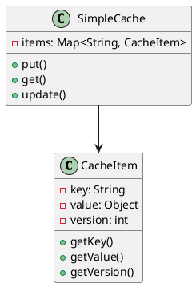
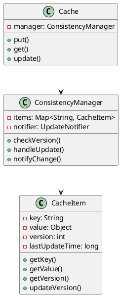
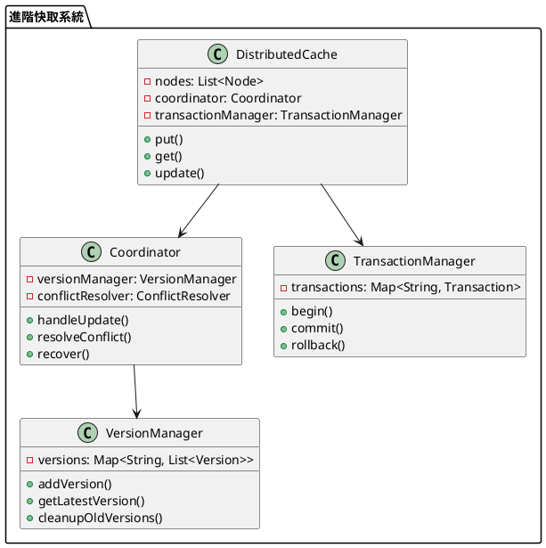

# 快取資料庫一致性教學

## 初級（Beginner）層級

### 1. 概念說明
快取資料庫一致性就像學校的公告欄：
- 如果老師在辦公室修改了公告，但公告欄還沒更新
- 同學看到的資訊就會不一樣
- 我們要確保公告欄和辦公室的資訊是一致的

初級學習者需要了解：
- 什麼是快取資料庫一致性
- 為什麼需要一致性
- 基本的更新機制

### 2. 使用原因
快取資料庫一致性的主要使用原因包括：
1. 提高系統效能：
   - 減少資料庫訪問次數
   - 加快資料讀取速度
   - 降低系統負載

2. 確保資料正確性：
   - 避免資料不一致
   - 防止髒讀問題
   - 保證資料完整性

3. 優化使用者體驗：
   - 提供即時資料更新
   - 減少等待時間
   - 提升系統響應速度

### 3. 問題表象
常見的問題表象包括：
1. 資料問題：
   - 快取與資料庫不一致
   - 資料過期或失效
   - 髒讀問題

2. 效能問題：
   - 快取擊穿
   - 快取雪崩
   - 快取穿透

3. 管理問題：
   - 版本控制混亂
   - 更新策略不當
   - 監控不足

### 4. 避免方法
避免問題的方法包括：
1. 系統設計：
   - 實現適當的更新策略
   - 設計有效的失效機制
   - 建立監控系統

2. 資料管理：
   - 定期一致性檢查
   - 實現版本控制
   - 優化更新策略

3. 效能優化：
   - 合理配置快取大小
   - 優化更新頻率
   - 實現負載均衡

### 5. 問題處理
遇到問題時的處理方法：
1. 資料問題處理：
   - 執行一致性檢查
   - 修復不一致資料
   - 更新快取策略

2. 效能問題處理：
   - 優化快取機制
   - 調整更新頻率
   - 改進失效策略

3. 管理問題處理：
   - 完善版本控制
   - 改進更新策略
   - 加強監控系統

### 6. PlantUML 圖解


### 7. 分段教學步驟

#### 步驟 1：基本快取實現
```java
public class SimpleCacheItem {
    private String key;
    private Object value;
    private int version;
    private long lastUpdateTime;
    private boolean isValid;
    
    public SimpleCacheItem(String key, Object value) {
        this.key = key;
        this.value = value;
        this.version = 0;
        this.lastUpdateTime = System.currentTimeMillis();
        this.isValid = true;
    }
    
    public String getKey() {
        return key;
    }
    
    public Object getValue() {
        return value;
    }
    
    public int getVersion() {
        return version;
    }
    
    public void updateValue(Object newValue) {
        this.value = newValue;
        this.version++;
        this.lastUpdateTime = System.currentTimeMillis();
    }
    
    public boolean isStale(long currentTime) {
        return currentTime - lastUpdateTime > 5000; // 5秒過期
    }
    
    public boolean isValid() {
        return isValid;
    }
    
    public void invalidate() {
        this.isValid = false;
    }
}

public class SimpleCache {
    private Map<String, SimpleCacheItem> items;
    private ConsistencyChecker consistencyChecker;
    private VersionManager versionManager;
    
    public SimpleCache() {
        items = new HashMap<>();
        consistencyChecker = new ConsistencyChecker();
        versionManager = new VersionManager();
    }
    
    public void put(String key, Object value) {
        SimpleCacheItem item = new SimpleCacheItem(key, value);
        items.put(key, item);
        versionManager.recordVersion(key, item.getVersion());
        System.out.println("存入快取：" + key);
    }
    
    public Object get(String key) {
        SimpleCacheItem item = items.get(key);
        if (item != null && item.isValid() && !item.isStale(System.currentTimeMillis())) {
            return item.getValue();
        }
        return null;
    }
    
    public void update(String key, Object newValue) {
        SimpleCacheItem item = items.get(key);
        if (item != null) {
            item.updateValue(newValue);
            versionManager.recordVersion(key, item.getVersion());
            consistencyChecker.checkConsistency(key, newValue);
            System.out.println("更新快取：" + key + "，版本：" + item.getVersion());
        }
    }
    
    public void invalidate(String key) {
        SimpleCacheItem item = items.get(key);
        if (item != null) {
            item.invalidate();
            System.out.println("失效快取：" + key);
        }
    }
}

class ConsistencyChecker {
    public void checkConsistency(String key, Object value) {
        // 實現一致性檢查邏輯
        System.out.println("檢查一致性：" + key);
    }
}

class VersionManager {
    private Map<String, Integer> versions;
    
    public void recordVersion(String key, int version) {
        versions.put(key, version);
    }
    
    public int getVersion(String key) {
        return versions.getOrDefault(key, 0);
    }
}
```

## 中級（Intermediate）層級

### 1. 概念說明
中級學習者需要理解：
- 一致性策略
- 版本控制機制
- 更新通知機制
- 衝突處理策略

### 2. PlantUML 圖解


### 3. 分段教學步驟

#### 步驟 1：版本控制
```java
public class AdvancedCacheItem {
    private String key;
    private Object value;
    private int version;
    private long lastUpdateTime;
    private boolean isValid;
    private List<CacheListener> listeners;
    
    public AdvancedCacheItem(String key, Object value) {
        this.key = key;
        this.value = value;
        this.version = 0;
        this.lastUpdateTime = System.currentTimeMillis();
        this.isValid = true;
        this.listeners = new ArrayList<>();
    }
    
    public void updateValue(Object newValue) {
        this.value = newValue;
        this.version++;
        this.lastUpdateTime = System.currentTimeMillis();
        notifyListeners();
    }
    
    public boolean isStale(long currentTime) {
        return currentTime - lastUpdateTime > 5000; // 5秒過期
    }
    
    public boolean isValid() {
        return isValid;
    }
    
    public void invalidate() {
        this.isValid = false;
        notifyListeners();
    }
    
    public void addListener(CacheListener listener) {
        listeners.add(listener);
    }
    
    private void notifyListeners() {
        for (CacheListener listener : listeners) {
            listener.onCacheUpdate(this);
        }
    }
}

interface CacheListener {
    void onCacheUpdate(AdvancedCacheItem item);
}
```

#### 步驟 2：更新通知
```java
public class UpdateNotifier {
    private Map<String, List<UpdateListener>> listeners;
    
    public UpdateNotifier() {
        listeners = new HashMap<>();
    }
    
    public void addListener(String key, UpdateListener listener) {
        listeners.computeIfAbsent(key, k -> new ArrayList<>())
                .add(listener);
    }
    
    public void notifyUpdate(String key, Object newValue) {
        List<UpdateListener> keyListeners = listeners.get(key);
        if (keyListeners != null) {
            for (UpdateListener listener : keyListeners) {
                listener.onUpdate(key, newValue);
            }
        }
    }
}

public interface UpdateListener {
    void onUpdate(String key, Object newValue);
}

public class ConsistencyManager {
    private Map<String, AdvancedCacheItem> items;
    private UpdateNotifier notifier;
    
    public ConsistencyManager() {
        items = new HashMap<>();
        notifier = new UpdateNotifier();
    }
    
    public void update(String key, Object newValue) {
        AdvancedCacheItem item = items.get(key);
        if (item != null) {
            item.updateValue(newValue);
            notifier.notifyUpdate(key, newValue);
            System.out.println("更新並通知：" + key);
        }
    }
}
```

## 高級（Advanced）層級

### 1. 概念說明
高級學習者需要掌握：
- 分散式一致性
- 多版本並發控制
- 事務管理
- 自動恢復策略

### 2. PlantUML 圖解


### 3. 分段教學步驟

#### 步驟 1：分散式快取
```java
public class DistributedCache {
    private List<Node> nodes;
    private Coordinator coordinator;
    private TransactionManager transactionManager;
    
    public DistributedCache() {
        nodes = new ArrayList<>();
        coordinator = new Coordinator();
        transactionManager = new TransactionManager();
    }
    
    public void update(String key, Object newValue) {
        String transactionId = transactionManager.begin();
        try {
            // 分散式更新
            for (Node node : nodes) {
                node.update(key, newValue);
            }
            transactionManager.commit(transactionId);
        } catch (Exception e) {
            transactionManager.rollback(transactionId);
            throw e;
        }
    }
}
```

#### 步驟 2：版本管理
```java
public class Version {
    private int versionNumber;
    private Object value;
    private long timestamp;
    
    public Version(int versionNumber, Object value) {
        this.versionNumber = versionNumber;
        this.value = value;
        this.timestamp = System.currentTimeMillis();
    }
    
    public int getVersionNumber() {
        return versionNumber;
    }
    
    public Object getValue() {
        return value;
    }
    
    public long getTimestamp() {
        return timestamp;
    }
}

public class VersionManager {
    private Map<String, List<Version>> versions;
    
    public VersionManager() {
        versions = new HashMap<>();
    }
    
    public void addVersion(String key, Object value) {
        List<Version> keyVersions = versions.computeIfAbsent(key, k -> new ArrayList<>());
        int newVersion = keyVersions.size() + 1;
        keyVersions.add(new Version(newVersion, value));
        
        // 清理舊版本
        while (keyVersions.size() > 5) {
            keyVersions.remove(0);
        }
    }
    
    public Version getLatestVersion(String key) {
        List<Version> keyVersions = versions.get(key);
        if (keyVersions != null && !keyVersions.isEmpty()) {
            return keyVersions.get(keyVersions.size() - 1);
        }
        return null;
    }
}
```

#### 步驟 3：事務管理
```java
public class Transaction {
    private String id;
    private Map<String, Object> changes;
    private boolean committed;
    
    public Transaction(String id) {
        this.id = id;
        this.changes = new HashMap<>();
        this.committed = false;
    }
    
    public void addChange(String key, Object value) {
        changes.put(key, value);
    }
    
    public void commit() {
        committed = true;
    }
    
    public void rollback() {
        changes.clear();
    }
    
    public boolean isCommitted() {
        return committed;
    }
}

public class TransactionManager {
    private Map<String, Transaction> transactions;
    
    public TransactionManager() {
        transactions = new HashMap<>();
    }
    
    public String begin() {
        String transactionId = UUID.randomUUID().toString();
        transactions.put(transactionId, new Transaction(transactionId));
        return transactionId;
    }
    
    public void commit(String transactionId) {
        Transaction transaction = transactions.get(transactionId);
        if (transaction != null) {
            transaction.commit();
            transactions.remove(transactionId);
        }
    }
    
    public void rollback(String transactionId) {
        Transaction transaction = transactions.get(transactionId);
        if (transaction != null) {
            transaction.rollback();
            transactions.remove(transactionId);
        }
    }
}
```

### 4. 常見問題與解決方案

#### 問題表象
1. 資料問題：
   - 快取與資料庫不一致
   - 資料過期或失效
   - 髒讀問題

2. 效能問題：
   - 快取擊穿
   - 快取雪崩
   - 快取穿透

3. 管理問題：
   - 版本控制混亂
   - 更新策略不當
   - 監控不足

#### 避免方法
1. 系統設計：
   - 實現適當的更新策略
   - 設計有效的失效機制
   - 建立監控系統

2. 資料管理：
   - 定期一致性檢查
   - 實現版本控制
   - 優化更新策略

3. 效能優化：
   - 合理配置快取大小
   - 優化更新頻率
   - 實現負載均衡

#### 處理方案
1. 技術方案：
   ```java
   public class CacheConsistencyManager {
       private CacheManager cacheManager;
       private DatabaseManager dbManager;
       private VersionManager versionManager;
       private MonitoringManager monitoringManager;
       private AlertManager alertManager;
       
       public void handleConsistencyIssue(ConsistencyIssue issue) {
           switch (issue.getType()) {
               case DATA:
                   handleDataIssue(issue);
                   break;
               case PERFORMANCE:
                   handlePerformanceIssue(issue);
                   break;
               case MANAGEMENT:
                   handleManagementIssue(issue);
                   break;
           }
       }
       
       private void handleDataIssue(ConsistencyIssue issue) {
           // 檢查資料一致性
           checkDataConsistency();
           // 修復不一致資料
           repairInconsistentData();
           // 更新快取策略
           updateCacheStrategy();
       }
       
       private void handlePerformanceIssue(ConsistencyIssue issue) {
           // 檢查效能指標
           checkPerformanceMetrics();
           // 優化快取機制
           optimizeCache();
           // 調整更新頻率
           adjustUpdateFrequency();
       }
       
       private void handleManagementIssue(ConsistencyIssue issue) {
           // 檢查版本控制
           checkVersionControl();
           // 改進更新策略
           improveUpdateStrategy();
           // 加強監控系統
           enhanceMonitoring();
       }
   }
   ```

2. 監控方案：
   ```java
   public class CacheMonitor {
       private MetricsCollector metricsCollector;
       private ConsistencyChecker consistencyChecker;
       private AlertManager alertManager;
       
       public void monitorCache() {
           CacheMetrics metrics = metricsCollector.collectMetrics();
           ConsistencyStatus status = consistencyChecker.checkConsistency();
           
           // 檢查快取命中率
           if (metrics.getHitRate() < HIT_RATE_THRESHOLD) {
               alertManager.alert("快取命中率警告", metrics.getDetails());
           }
           
           // 檢查資料一致性
           if (!status.isConsistent()) {
               alertManager.alert("資料不一致警告", status.getDetails());
           }
           
           // 檢查資源使用
           if (metrics.getResourceUsage() > RESOURCE_THRESHOLD) {
               alertManager.alert("資源使用警告", metrics.getDetails());
           }
       }
   }
   ```

3. 最佳實踐：
   - 實現自動化更新
   - 配置智能失效
   - 建立版本控制
   - 優化更新策略
   - 完善監控告警
   - 定期效能優化
   - 保持系統文檔
   - 建立應急流程

### 5. 實戰案例

#### 案例一：電商系統快取一致性
```java
public class ECommerceCache {
    private CacheManager cacheManager;
    private DatabaseManager dbManager;
    private VersionManager versionManager;
    
    public void updateProduct(Product product) {
        // 更新資料庫
        dbManager.updateProduct(product);
        
        // 更新快取
        cacheManager.updateProduct(product);
        
        // 記錄版本
        versionManager.recordVersion("product", product.getId());
        
        // 檢查一致性
        checkConsistency(product);
    }
    
    private void checkConsistency(Product product) {
        // 實現一致性檢查邏輯
        System.out.println("檢查產品一致性：" + product.getId());
    }
}
```

#### 案例二：社交媒體快取一致性
```java
public class SocialMediaCache {
    private CacheManager cacheManager;
    private DatabaseManager dbManager;
    private VersionManager versionManager;
    
    public void updatePost(Post post) {
        // 更新資料庫
        dbManager.updatePost(post);
        
        // 更新快取
        cacheManager.updatePost(post);
        
        // 記錄版本
        versionManager.recordVersion("post", post.getId());
        
        // 檢查一致性
        checkConsistency(post);
    }
    
    private void checkConsistency(Post post) {
        // 實現一致性檢查邏輯
        System.out.println("檢查貼文一致性：" + post.getId());
    }
} 