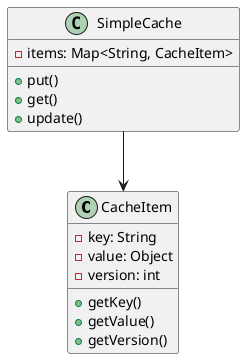
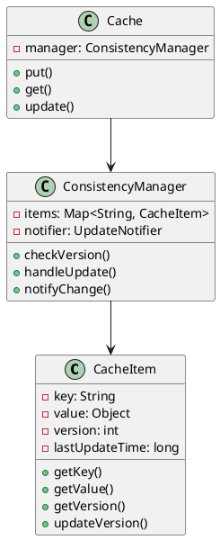
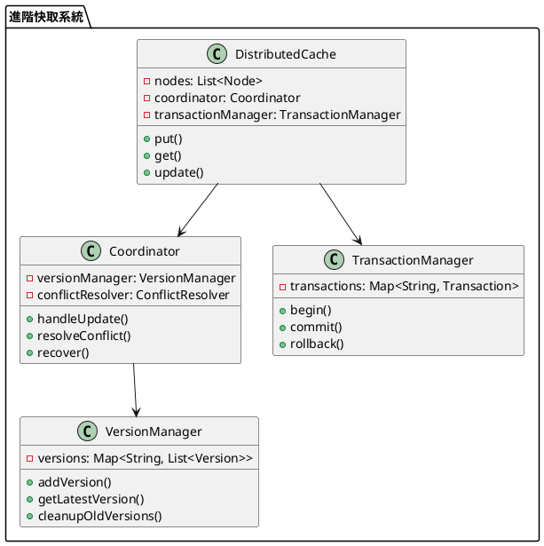

# 快取資料庫一致性教學

## 初級（Beginner）層級

### 1. 概念說明
快取資料庫一致性就像學校的公告欄：
- 如果老師在辦公室修改了公告，但公告欄還沒更新
- 同學看到的資訊就會不一樣
- 我們要確保公告欄和辦公室的資訊是一致的

初級學習者需要了解：
- 什麼是快取資料庫一致性
- 為什麼需要一致性
- 基本的更新機制

### 2. PlantUML 圖解


### 3. 分段教學步驟

#### 步驟 1：基本快取實現
```java
public class SimpleCacheItem {
    private String key;
    private Object value;
    private int version;
    
    public SimpleCacheItem(String key, Object value) {
        this.key = key;
        this.value = value;
        this.version = 0;
    }
    
    public String getKey() {
        return key;
    }
    
    public Object getValue() {
        return value;
    }
    
    public int getVersion() {
        return version;
    }
    
    public void updateValue(Object newValue) {
        this.value = newValue;
        this.version++;
    }
}

public class SimpleCache {
    private Map<String, SimpleCacheItem> items;
    
    public SimpleCache() {
        items = new HashMap<>();
    }
    
    public void put(String key, Object value) {
        SimpleCacheItem item = new SimpleCacheItem(key, value);
        items.put(key, item);
        System.out.println("存入快取：" + key);
    }
    
    public Object get(String key) {
        SimpleCacheItem item = items.get(key);
        if (item != null) {
            return item.getValue();
        }
        return null;
    }
    
    public void update(String key, Object newValue) {
        SimpleCacheItem item = items.get(key);
        if (item != null) {
            item.updateValue(newValue);
            System.out.println("更新快取：" + key + "，版本：" + item.getVersion());
        }
    }
}
```

## 中級（Intermediate）層級

### 1. 概念說明
中級學習者需要理解：
- 一致性策略
- 版本控制機制
- 更新通知機制
- 衝突處理策略

### 2. PlantUML 圖解


### 3. 分段教學步驟

#### 步驟 1：版本控制
```java
public class AdvancedCacheItem {
    private String key;
    private Object value;
    private int version;
    private long lastUpdateTime;
    
    public AdvancedCacheItem(String key, Object value) {
        this.key = key;
        this.value = value;
        this.version = 0;
        this.lastUpdateTime = System.currentTimeMillis();
    }
    
    public void updateValue(Object newValue) {
        this.value = newValue;
        this.version++;
        this.lastUpdateTime = System.currentTimeMillis();
    }
    
    public boolean isStale(long currentTime) {
        return currentTime - lastUpdateTime > 5000; // 5秒過期
    }
}
```

#### 步驟 2：更新通知
```java
public class UpdateNotifier {
    private Map<String, List<UpdateListener>> listeners;
    
    public UpdateNotifier() {
        listeners = new HashMap<>();
    }
    
    public void addListener(String key, UpdateListener listener) {
        listeners.computeIfAbsent(key, k -> new ArrayList<>())
                .add(listener);
    }
    
    public void notifyUpdate(String key, Object newValue) {
        List<UpdateListener> keyListeners = listeners.get(key);
        if (keyListeners != null) {
            for (UpdateListener listener : keyListeners) {
                listener.onUpdate(key, newValue);
            }
        }
    }
}

public interface UpdateListener {
    void onUpdate(String key, Object newValue);
}

public class ConsistencyManager {
    private Map<String, AdvancedCacheItem> items;
    private UpdateNotifier notifier;
    
    public ConsistencyManager() {
        items = new HashMap<>();
        notifier = new UpdateNotifier();
    }
    
    public void update(String key, Object newValue) {
        AdvancedCacheItem item = items.get(key);
        if (item != null) {
            item.updateValue(newValue);
            notifier.notifyUpdate(key, newValue);
            System.out.println("更新並通知：" + key);
        }
    }
}
```

## 高級（Advanced）層級

### 1. 概念說明
高級學習者需要掌握：
- 分散式一致性
- 多版本並發控制
- 事務管理
- 自動恢復策略

### 2. PlantUML 圖解


### 3. 分段教學步驟

#### 步驟 1：分散式快取
```java
public class DistributedCache {
    private List<Node> nodes;
    private Coordinator coordinator;
    private TransactionManager transactionManager;
    
    public DistributedCache() {
        nodes = new ArrayList<>();
        coordinator = new Coordinator();
        transactionManager = new TransactionManager();
    }
    
    public void update(String key, Object newValue) {
        String transactionId = transactionManager.begin();
        try {
            // 分散式更新
            for (Node node : nodes) {
                node.update(key, newValue);
            }
            transactionManager.commit(transactionId);
        } catch (Exception e) {
            transactionManager.rollback(transactionId);
            throw e;
        }
    }
}
```

#### 步驟 2：版本管理
```java
public class Version {
    private int versionNumber;
    private Object value;
    private long timestamp;
    
    public Version(int versionNumber, Object value) {
        this.versionNumber = versionNumber;
        this.value = value;
        this.timestamp = System.currentTimeMillis();
    }
    
    public int getVersionNumber() {
        return versionNumber;
    }
    
    public Object getValue() {
        return value;
    }
    
    public long getTimestamp() {
        return timestamp;
    }
}

public class VersionManager {
    private Map<String, List<Version>> versions;
    
    public VersionManager() {
        versions = new HashMap<>();
    }
    
    public void addVersion(String key, Object value) {
        List<Version> keyVersions = versions.computeIfAbsent(key, k -> new ArrayList<>());
        int newVersion = keyVersions.size() + 1;
        keyVersions.add(new Version(newVersion, value));
        
        // 清理舊版本
        while (keyVersions.size() > 5) {
            keyVersions.remove(0);
        }
    }
    
    public Version getLatestVersion(String key) {
        List<Version> keyVersions = versions.get(key);
        if (keyVersions != null && !keyVersions.isEmpty()) {
            return keyVersions.get(keyVersions.size() - 1);
        }
        return null;
    }
}
```

#### 步驟 3：事務管理
```java
public class Transaction {
    private String id;
    private Map<String, Object> changes;
    private boolean committed;
    
    public Transaction(String id) {
        this.id = id;
        this.changes = new HashMap<>();
        this.committed = false;
    }
    
    public void addChange(String key, Object value) {
        changes.put(key, value);
    }
    
    public void commit() {
        committed = true;
    }
    
    public void rollback() {
        changes.clear();
    }
    
    public boolean isCommitted() {
        return committed;
    }
}

public class TransactionManager {
    private Map<String, Transaction> transactions;
    
    public TransactionManager() {
        transactions = new HashMap<>();
    }
    
    public String begin() {
        String transactionId = UUID.randomUUID().toString();
        transactions.put(transactionId, new Transaction(transactionId));
        return transactionId;
    }
    
    public void commit(String transactionId) {
        Transaction transaction = transactions.get(transactionId);
        if (transaction != null) {
            transaction.commit();
            transactions.remove(transactionId);
        }
    }
    
    public void rollback(String transactionId) {
        Transaction transaction = transactions.get(transactionId);
        if (transaction != null) {
            transaction.rollback();
            transactions.remove(transactionId);
        }
    }
}
```

這個教學文件提供了從基礎到進階的快取資料庫一致性學習路徑，每個層級都包含了相應的概念說明、圖解、教學步驟和實作範例。初級學習者可以從基本的快取實現開始，中級學習者可以學習版本控制和更新通知，而高級學習者則可以掌握分散式一致性、多版本並發控制和事務管理等進階功能。 