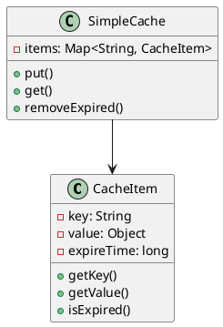
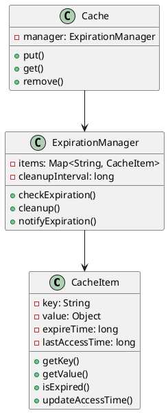
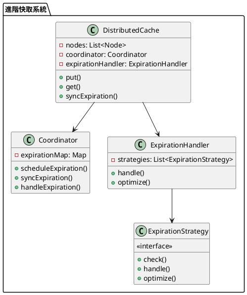

# 快取過期策略教學

## 初級（Beginner）層級

### 1. 概念說明
快取過期策略就像學校的便當：
- 便當放太久會壞掉
- 我們要定期檢查便當是否過期
- 過期的便當要丟掉，換新的

初級學習者需要了解：
- 什麼是快取過期
- 為什麼需要過期機制
- 基本的時間檢查概念

### 2. PlantUML 圖解


### 3. 分段教學步驟

#### 步驟 1：基本過期檢查
```java
public class SimpleCacheItem {
    private String key;
    private Object value;
    private long expireTime;
    
    public SimpleCacheItem(String key, Object value, long expireTime) {
        this.key = key;
        this.value = value;
        this.expireTime = expireTime;
    }
    
    public String getKey() {
        return key;
    }
    
    public Object getValue() {
        return value;
    }
    
    public boolean isExpired() {
        return System.currentTimeMillis() > expireTime;
    }
}

public class SimpleCache {
    private Map<String, SimpleCacheItem> items;
    
    public SimpleCache() {
        items = new HashMap<>();
    }
    
    public void put(String key, Object value, long expireTime) {
        SimpleCacheItem item = new SimpleCacheItem(key, value, 
            System.currentTimeMillis() + expireTime);
        items.put(key, item);
        System.out.println("存入快取：" + key);
    }
    
    public Object get(String key) {
        SimpleCacheItem item = items.get(key);
        if (item != null) {
            if (item.isExpired()) {
                items.remove(key);
                System.out.println("快取過期：" + key);
                return null;
            }
            return item.getValue();
        }
        return null;
    }
    
    public void removeExpired() {
        items.entrySet().removeIf(entry -> entry.getValue().isExpired());
    }
}
```

## 中級（Intermediate）層級

### 1. 概念說明
中級學習者需要理解：
- 過期策略實現
- 定期清理機制
- 過期通知機制
- 過期時間管理

### 2. PlantUML 圖解


### 3. 分段教學步驟

#### 步驟 1：過期管理
```java
public class AdvancedCacheItem {
    private String key;
    private Object value;
    private long expireTime;
    private long lastAccessTime;
    
    public AdvancedCacheItem(String key, Object value, long expireTime) {
        this.key = key;
        this.value = value;
        this.expireTime = expireTime;
        this.lastAccessTime = System.currentTimeMillis();
    }
    
    public void updateAccessTime() {
        lastAccessTime = System.currentTimeMillis();
    }
    
    public boolean isExpired() {
        return System.currentTimeMillis() > expireTime;
    }
    
    public long getLastAccessTime() {
        return lastAccessTime;
    }
}
```

#### 步驟 2：定期清理
```java
public class ExpirationManager {
    private Map<String, AdvancedCacheItem> items;
    private long cleanupInterval;
    
    public ExpirationManager(long cleanupInterval) {
        this.items = new HashMap<>();
        this.cleanupInterval = cleanupInterval;
    }
    
    public void checkExpiration() {
        items.entrySet().removeIf(entry -> {
            if (entry.getValue().isExpired()) {
                notifyExpiration(entry.getKey());
                return true;
            }
            return false;
        });
    }
    
    public void cleanup() {
        long currentTime = System.currentTimeMillis();
        items.entrySet().removeIf(entry -> 
            currentTime - entry.getValue().getLastAccessTime() > cleanupInterval);
    }
    
    private void notifyExpiration(String key) {
        System.out.println("快取過期通知：" + key);
    }
}
```

## 高級（Advanced）層級

### 1. 概念說明
高級學習者需要掌握：
- 分散式過期策略
- 過期時間同步
- 過期事件處理
- 過期策略優化

### 2. PlantUML 圖解


### 3. 分段教學步驟

#### 步驟 1：分散式過期
```java
public class DistributedCache {
    private List<Node> nodes;
    private Coordinator coordinator;
    private ExpirationHandler expirationHandler;
    
    public DistributedCache() {
        nodes = new ArrayList<>();
        coordinator = new Coordinator();
        expirationHandler = new ExpirationHandler();
    }
    
    public void put(String key, Object value, long expireTime) {
        // 同步到所有節點
        for (Node node : nodes) {
            node.put(key, value, expireTime);
        }
        
        // 安排過期時間
        coordinator.scheduleExpiration(key, expireTime);
    }
    
    public void handleExpiration(String key) {
        expirationHandler.handle(key);
        // 同步到其他節點
        for (Node node : nodes) {
            node.remove(key);
        }
    }
}
```

#### 步驟 2：過期策略
```java
public interface ExpirationStrategy {
    boolean check(String key, long expireTime);
    void handle(String key);
    void optimize();
}

public class TimeBasedStrategy implements ExpirationStrategy {
    @Override
    public boolean check(String key, long expireTime) {
        return System.currentTimeMillis() > expireTime;
    }
    
    @Override
    public void handle(String key) {
        System.out.println("處理過期：" + key);
    }
    
    @Override
    public void optimize() {
        // 優化過期策略
    }
}

public class AccessBasedStrategy implements ExpirationStrategy {
    private Map<String, Long> lastAccessTimes;
    
    public AccessBasedStrategy() {
        lastAccessTimes = new HashMap<>();
    }
    
    @Override
    public boolean check(String key, long expireTime) {
        Long lastAccess = lastAccessTimes.get(key);
        return lastAccess != null && 
               System.currentTimeMillis() - lastAccess > expireTime;
    }
    
    @Override
    public void handle(String key) {
        lastAccessTimes.remove(key);
        System.out.println("處理閒置：" + key);
    }
    
    @Override
    public void optimize() {
        // 優化訪問策略
    }
}
```

#### 步驟 3：過期處理器
```java
public class ExpirationHandler {
    private List<ExpirationStrategy> strategies;
    
    public ExpirationHandler() {
        strategies = new ArrayList<>();
        strategies.add(new TimeBasedStrategy());
        strategies.add(new AccessBasedStrategy());
    }
    
    public void handle(String key) {
        for (ExpirationStrategy strategy : strategies) {
            if (strategy.check(key, System.currentTimeMillis())) {
                strategy.handle(key);
            }
        }
    }
    
    public void optimize() {
        for (ExpirationStrategy strategy : strategies) {
            strategy.optimize();
        }
    }
}
```

這個教學文件提供了從基礎到進階的快取過期策略學習路徑，每個層級都包含了相應的概念說明、圖解、教學步驟和實作範例。初級學習者可以從基本的過期檢查開始，中級學習者可以學習過期管理和定期清理，而高級學習者則可以掌握分散式過期策略和優化等進階功能。 