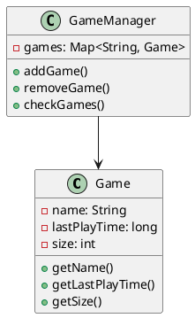
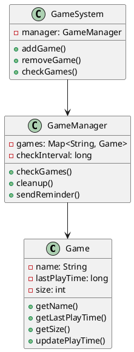
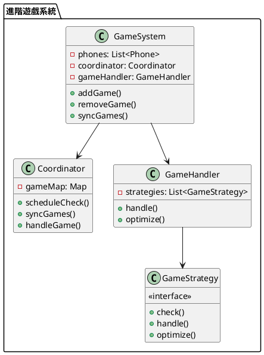

# 快取過期策略教學

## 初級（Beginner）層級

### 1. 概念說明
快取過期就像你手機裡的遊戲：
- 遊戲太久沒玩會被自動刪除
- 我們要定期檢查哪些遊戲沒在玩
- 沒在玩的遊戲要刪掉，讓手機有更多空間

初級學習者需要了解：
- 什麼是快取過期
- 為什麼需要過期機制
- 基本的時間檢查概念

### 2. 使用原因
快取過期策略的主要使用原因包括：
1. 空間管理：
   - 避免手機空間不夠
   - 控制遊戲數量
   - 讓手機跑得更快

2. 資料正確性：
   - 確保遊戲是最新版本
   - 避免玩到舊版本
   - 保持遊戲資料正確

3. 效能優化：
   - 減少沒在玩的遊戲
   - 提高手機速度
   - 讓手機更順暢

### 3. 問題表象
常見的問題表象包括：
1. 空間問題：
   - 手機空間不夠
   - 遊戲裝不下
   - 手機變很慢

2. 資料問題：
   - 遊戲版本太舊
   - 遊戲資料錯誤
   - 遊戲打不開

3. 管理問題：
   - 不知道哪些遊戲要刪
   - 刪錯遊戲
   - 忘記檢查

### 4. 避免方法
避免問題的方法包括：
1. 系統設計：
   - 設定自動檢查
   - 設計提醒功能
   - 建立備份系統

2. 空間管理：
   - 定期清理遊戲
   - 控制遊戲數量
   - 優化空間使用

3. 效能優化：
   - 合理設定檢查時間
   - 優化檢查頻率
   - 保持手機順暢

### 5. 問題處理
遇到問題時的處理方法：
1. 空間問題處理：
   - 檢查手機空間
   - 清理沒在玩的遊戲
   - 優化遊戲管理

2. 資料問題處理：
   - 檢查遊戲版本
   - 更新舊遊戲
   - 修復錯誤資料

3. 管理問題處理：
   - 調整檢查設定
   - 改進提醒功能
   - 加強備份系統

### 6. PlantUML 圖解


### 7. 分段教學步驟

#### 步驟 1：基本遊戲檢查
```java
public class Game {
    private String name;
    private long lastPlayTime;
    private int size;
    
    public Game(String name, int size) {
        this.name = name;
        this.lastPlayTime = System.currentTimeMillis();
        this.size = size;
    }
    
    public String getName() {
        return name;
    }
    
    public long getLastPlayTime() {
        return lastPlayTime;
    }
    
    public int getSize() {
        return size;
    }
    
    public void updatePlayTime() {
        lastPlayTime = System.currentTimeMillis();
    }
}

public class GameManager {
    private Map<String, Game> games;
    
    public GameManager() {
        games = new HashMap<>();
    }
    
    public void addGame(String name, int size) {
        Game game = new Game(name, size);
        games.put(name, game);
        System.out.println("新增遊戲：" + name);
    }
    
    public void checkGames() {
        long currentTime = System.currentTimeMillis();
        games.entrySet().removeIf(entry -> {
            Game game = entry.getValue();
            // 如果遊戲超過30天沒玩，就刪除
            if (currentTime - game.getLastPlayTime() > 30 * 24 * 60 * 60 * 1000) {
                System.out.println("刪除遊戲：" + game.getName());
                return true;
            }
            return false;
        });
    }
}
```

## 中級（Intermediate）層級

### 1. 概念說明
中級學習者需要理解：
- 遊戲管理系統
- 自動清理機制
- 提醒功能
- 時間管理

### 2. PlantUML 圖解


### 3. 分段教學步驟

#### 步驟 1：遊戲管理
```java
public class AdvancedGame {
    private String name;
    private long lastPlayTime;
    private int size;
    private List<GameListener> listeners;
    
    public AdvancedGame(String name, int size) {
        this.name = name;
        this.lastPlayTime = System.currentTimeMillis();
        this.size = size;
        this.listeners = new ArrayList<>();
    }
    
    public void updatePlayTime() {
        lastPlayTime = System.currentTimeMillis();
        notifyListeners();
    }
    
    public void addListener(GameListener listener) {
        listeners.add(listener);
    }
    
    private void notifyListeners() {
        for (GameListener listener : listeners) {
            listener.onGameUpdated(this);
        }
    }
}

interface GameListener {
    void onGameUpdated(AdvancedGame game);
}
```

#### 步驟 2：自動清理
```java
public class GameManager {
    private Map<String, AdvancedGame> games;
    private long checkInterval;
    
    public GameManager(long checkInterval) {
        this.games = new HashMap<>();
        this.checkInterval = checkInterval;
    }
    
    public void checkGames() {
        long currentTime = System.currentTimeMillis();
        games.entrySet().removeIf(entry -> {
            AdvancedGame game = entry.getValue();
            if (currentTime - game.getLastPlayTime() > 30 * 24 * 60 * 60 * 1000) {
                sendReminder(game.getName());
                return true;
            }
            return false;
        });
    }
    
    private void sendReminder(String gameName) {
        System.out.println("提醒：遊戲 " + gameName + " 已經超過30天沒玩了，將被刪除");
    }
}
```

## 高級（Advanced）層級

### 1. 概念說明
高級學習者需要掌握：
- 多手機遊戲同步
- 遊戲時間同步
- 遊戲事件處理
- 遊戲管理優化

### 2. PlantUML 圖解


### 3. 分段教學步驟

#### 步驟 1：多手機同步
```java
public class GameSystem {
    private List<Phone> phones;
    private Coordinator coordinator;
    private GameHandler gameHandler;
    
    public GameSystem() {
        phones = new ArrayList<>();
        coordinator = new Coordinator();
        gameHandler = new GameHandler();
    }
    
    public void addGame(String gameName, int size) {
        // 同步到所有手機
        for (Phone phone : phones) {
            phone.addGame(gameName, size);
        }
        
        // 安排檢查時間
        coordinator.scheduleCheck(gameName);
    }
    
    public void handleGame(String gameName) {
        gameHandler.handle(gameName);
        // 同步到其他手機
        for (Phone phone : phones) {
            phone.removeGame(gameName);
        }
    }
}
```

#### 步驟 2：遊戲策略
```java
public interface GameStrategy {
    boolean check(String gameName, long lastPlayTime);
    void handle(String gameName);
    void optimize();
}

public class TimeBasedStrategy implements GameStrategy {
    @Override
    public boolean check(String gameName, long lastPlayTime) {
        return System.currentTimeMillis() - lastPlayTime > 30 * 24 * 60 * 60 * 1000;
    }
    
    @Override
    public void handle(String gameName) {
        System.out.println("處理遊戲：" + gameName);
    }
    
    @Override
    public void optimize() {
        // 優化遊戲策略
    }
}

public class SizeBasedStrategy implements GameStrategy {
    private Map<String, Integer> gameSizes;
    
    public SizeBasedStrategy() {
        gameSizes = new HashMap<>();
    }
    
    @Override
    public boolean check(String gameName, long lastPlayTime) {
        Integer size = gameSizes.get(gameName);
        return size != null && size > 1000; // 如果遊戲大小超過1GB
    }
    
    @Override
    public void handle(String gameName) {
        gameSizes.remove(gameName);
        System.out.println("處理大遊戲：" + gameName);
    }
    
    @Override
    public void optimize() {
        // 優化大小策略
    }
}
```

#### 步驟 3：遊戲處理器
```java
public class GameHandler {
    private List<GameStrategy> strategies;
    
    public GameHandler() {
        strategies = new ArrayList<>();
        strategies.add(new TimeBasedStrategy());
        strategies.add(new SizeBasedStrategy());
    }
    
    public void handle(String gameName) {
        for (GameStrategy strategy : strategies) {
            if (strategy.check(gameName, System.currentTimeMillis())) {
                strategy.handle(gameName);
            }
        }
    }
    
    public void optimize() {
        for (GameStrategy strategy : strategies) {
            strategy.optimize();
        }
    }
}
```

### 4. 常見問題與解決方案

#### 問題表象
1. 空間問題：
   - 手機空間不夠
   - 遊戲裝不下
   - 手機變很慢

2. 資料問題：
   - 遊戲版本太舊
   - 遊戲資料錯誤
   - 遊戲打不開

3. 管理問題：
   - 不知道哪些遊戲要刪
   - 刪錯遊戲
   - 忘記檢查

#### 避免方法
1. 系統設計：
   - 設定自動檢查
   - 設計提醒功能
   - 建立備份系統

2. 空間管理：
   - 定期清理遊戲
   - 控制遊戲數量
   - 優化空間使用

3. 效能優化：
   - 合理設定檢查時間
   - 優化檢查頻率
   - 保持手機順暢

#### 處理方案
1. 技術方案：
   ```java
   public class GameManager {
       private GameSystem gameSystem;
       private GameHandler gameHandler;
       private Monitor monitor;
       private Alert alert;
       
       public void handleGameIssue(GameIssue issue) {
           switch (issue.getType()) {
               case SPACE:
                   handleSpaceIssue(issue);
                   break;
               case DATA:
                   handleDataIssue(issue);
                   break;
               case MANAGEMENT:
                   handleManagementIssue(issue);
                   break;
           }
       }
       
       private void handleSpaceIssue(GameIssue issue) {
           // 檢查空間使用
           checkSpaceUsage();
           // 清理沒在玩的遊戲
           cleanupGames();
           // 優化遊戲管理
           optimizeGameManagement();
       }
       
       private void handleDataIssue(GameIssue issue) {
           // 檢查遊戲版本
           checkGameVersions();
           // 更新舊遊戲
           updateOldGames();
           // 修復錯誤資料
           repairGameData();
       }
       
       private void handleManagementIssue(GameIssue issue) {
           // 檢查遊戲設定
           checkGameSettings();
           // 改進提醒功能
           improveReminders();
           // 加強備份系統
           enhanceBackup();
       }
   }
   ```

2. 監控方案：
   ```java
   public class GameMonitor {
       private MetricsCollector metricsCollector;
       private GameChecker gameChecker;
       private Alert alert;
       
       public void monitorGames() {
           GameMetrics metrics = metricsCollector.collectMetrics();
           GameStatus status = gameChecker.checkGames();
           
           // 檢查空間使用
           if (metrics.getSpaceUsage() > SPACE_THRESHOLD) {
               alert.send("空間使用警告", metrics.getDetails());
           }
           
           // 檢查沒在玩的遊戲
           if (status.hasUnplayedGames()) {
               alert.send("遊戲提醒", status.getDetails());
           }
           
           // 檢查遊戲數量
           if (metrics.getGameCount() > COUNT_THRESHOLD) {
               alert.send("遊戲數量警告", metrics.getDetails());
           }
       }
   }
   ```

3. 最佳實踐：
   - 設定自動清理
   - 配置智能提醒
   - 建立監控告警
   - 優化遊戲管理
   - 定期效能檢查
   - 保持系統更新
   - 建立應急流程 