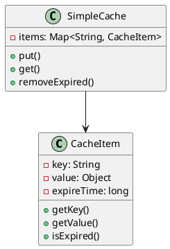
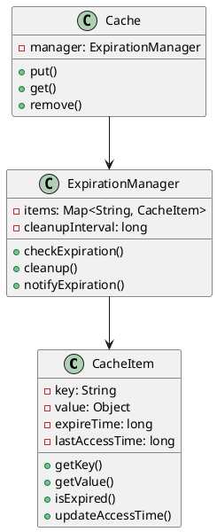
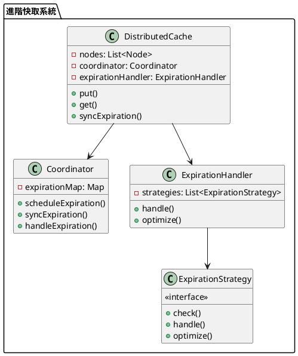

# 快取過期策略教學

## 初級（Beginner）層級

### 1. 概念說明
快取過期策略就像學校的便當：
- 便當放太久會壞掉
- 我們要定期檢查便當是否過期
- 過期的便當要丟掉，換新的

初級學習者需要了解：
- 什麼是快取過期
- 為什麼需要過期機制
- 基本的時間檢查概念

### 2. 使用原因
快取過期策略的主要使用原因包括：
1. 資源管理：
   - 避免記憶體洩漏
   - 控制快取大小
   - 優化資源使用

2. 資料正確性：
   - 確保資料時效性
   - 避免使用過期資料
   - 保持資料一致性

3. 效能優化：
   - 減少無效快取
   - 提高快取命中率
   - 優化系統效能

### 3. 問題表象
常見的問題表象包括：
1. 資源問題：
   - 記憶體使用過高
   - 快取空間不足
   - 系統效能下降

2. 資料問題：
   - 使用過期資料
   - 資料不一致
   - 快取擊穿

3. 管理問題：
   - 過期策略不當
   - 清理機制失效
   - 監控不足

### 4. 避免方法
避免問題的方法包括：
1. 系統設計：
   - 實現適當的過期策略
   - 設計有效的清理機制
   - 建立監控系統

2. 資源管理：
   - 定期清理過期快取
   - 控制快取大小
   - 優化資源使用

3. 效能優化：
   - 合理設置過期時間
   - 優化清理頻率
   - 實現負載均衡

### 5. 問題處理
遇到問題時的處理方法：
1. 資源問題處理：
   - 檢查記憶體使用
   - 清理過期快取
   - 優化快取策略

2. 資料問題處理：
   - 檢查資料時效性
   - 更新過期資料
   - 修復不一致資料

3. 管理問題處理：
   - 調整過期策略
   - 改進清理機制
   - 加強監控系統

### 6. PlantUML 圖解


### 7. 分段教學步驟

#### 步驟 1：基本過期檢查
```java
public class SimpleCacheItem {
    private String key;
    private Object value;
    private long expireTime;
    private long lastAccessTime;
    private boolean isValid;
    
    public SimpleCacheItem(String key, Object value, long expireTime) {
        this.key = key;
        this.value = value;
        this.expireTime = expireTime;
        this.lastAccessTime = System.currentTimeMillis();
        this.isValid = true;
    }
    
    public String getKey() {
        return key;
    }
    
    public Object getValue() {
        return value;
    }
    
    public boolean isExpired() {
        return System.currentTimeMillis() > expireTime;
    }
    
    public void updateAccessTime() {
        lastAccessTime = System.currentTimeMillis();
    }
    
    public boolean isValid() {
        return isValid;
    }
    
    public void invalidate() {
        this.isValid = false;
    }
}

public class SimpleCache {
    private Map<String, SimpleCacheItem> items;
    private ExpirationManager expirationManager;
    private MonitoringManager monitoringManager;
    
    public SimpleCache() {
        items = new HashMap<>();
        expirationManager = new ExpirationManager();
        monitoringManager = new MonitoringManager();
    }
    
    public void put(String key, Object value, long expireTime) {
        SimpleCacheItem item = new SimpleCacheItem(key, value, 
            System.currentTimeMillis() + expireTime);
        items.put(key, item);
        monitoringManager.recordCacheOperation("put", key);
        System.out.println("存入快取：" + key);
    }
    
    public Object get(String key) {
        SimpleCacheItem item = items.get(key);
        if (item != null) {
            if (item.isExpired()) {
                items.remove(key);
                monitoringManager.recordCacheOperation("expire", key);
                System.out.println("快取過期：" + key);
                return null;
            }
            item.updateAccessTime();
            monitoringManager.recordCacheOperation("get", key);
            return item.getValue();
        }
        return null;
    }
    
    public void removeExpired() {
        items.entrySet().removeIf(entry -> {
            if (entry.getValue().isExpired()) {
                monitoringManager.recordCacheOperation("remove", entry.getKey());
                return true;
            }
            return false;
        });
    }
}

class ExpirationManager {
    public void checkExpiration(Map<String, SimpleCacheItem> items) {
        items.entrySet().removeIf(entry -> entry.getValue().isExpired());
    }
}

class MonitoringManager {
    private Map<String, Integer> operationCounts;
    
    public MonitoringManager() {
        operationCounts = new HashMap<>();
    }
    
    public void recordCacheOperation(String operation, String key) {
        String metric = operation + ":" + key;
        operationCounts.merge(metric, 1, Integer::sum);
    }
}
```

## 中級（Intermediate）層級

### 1. 概念說明
中級學習者需要理解：
- 過期策略實現
- 定期清理機制
- 過期通知機制
- 過期時間管理

### 2. PlantUML 圖解


### 3. 分段教學步驟

#### 步驟 1：過期管理
```java
public class AdvancedCacheItem {
    private String key;
    private Object value;
    private long expireTime;
    private long lastAccessTime;
    private boolean isValid;
    private List<ExpirationListener> listeners;
    
    public AdvancedCacheItem(String key, Object value, long expireTime) {
        this.key = key;
        this.value = value;
        this.expireTime = expireTime;
        this.lastAccessTime = System.currentTimeMillis();
        this.isValid = true;
        this.listeners = new ArrayList<>();
    }
    
    public void updateAccessTime() {
        lastAccessTime = System.currentTimeMillis();
    }
    
    public boolean isExpired() {
        return System.currentTimeMillis() > expireTime;
    }
    
    public long getLastAccessTime() {
        return lastAccessTime;
    }
    
    public boolean isValid() {
        return isValid;
    }
    
    public void invalidate() {
        this.isValid = false;
        notifyListeners();
    }
    
    public void addListener(ExpirationListener listener) {
        listeners.add(listener);
    }
    
    private void notifyListeners() {
        for (ExpirationListener listener : listeners) {
            listener.onExpiration(this);
        }
    }
}

interface ExpirationListener {
    void onExpiration(AdvancedCacheItem item);
}
```

#### 步驟 2：定期清理
```java
public class ExpirationManager {
    private Map<String, AdvancedCacheItem> items;
    private long cleanupInterval;
    
    public ExpirationManager(long cleanupInterval) {
        this.items = new HashMap<>();
        this.cleanupInterval = cleanupInterval;
    }
    
    public void checkExpiration() {
        items.entrySet().removeIf(entry -> {
            if (entry.getValue().isExpired()) {
                notifyExpiration(entry.getKey());
                return true;
            }
            return false;
        });
    }
    
    public void cleanup() {
        long currentTime = System.currentTimeMillis();
        items.entrySet().removeIf(entry -> 
            currentTime - entry.getValue().getLastAccessTime() > cleanupInterval);
    }
    
    private void notifyExpiration(String key) {
        System.out.println("快取過期通知：" + key);
    }
}
```

## 高級（Advanced）層級

### 1. 概念說明
高級學習者需要掌握：
- 分散式過期策略
- 過期時間同步
- 過期事件處理
- 過期策略優化

### 2. PlantUML 圖解


### 3. 分段教學步驟

#### 步驟 1：分散式過期
```java
public class DistributedCache {
    private List<Node> nodes;
    private Coordinator coordinator;
    private ExpirationHandler expirationHandler;
    
    public DistributedCache() {
        nodes = new ArrayList<>();
        coordinator = new Coordinator();
        expirationHandler = new ExpirationHandler();
    }
    
    public void put(String key, Object value, long expireTime) {
        // 同步到所有節點
        for (Node node : nodes) {
            node.put(key, value, expireTime);
        }
        
        // 安排過期時間
        coordinator.scheduleExpiration(key, expireTime);
    }
    
    public void handleExpiration(String key) {
        expirationHandler.handle(key);
        // 同步到其他節點
        for (Node node : nodes) {
            node.remove(key);
        }
    }
}
```

#### 步驟 2：過期策略
```java
public interface ExpirationStrategy {
    boolean check(String key, long expireTime);
    void handle(String key);
    void optimize();
}

public class TimeBasedStrategy implements ExpirationStrategy {
    @Override
    public boolean check(String key, long expireTime) {
        return System.currentTimeMillis() > expireTime;
    }
    
    @Override
    public void handle(String key) {
        System.out.println("處理過期：" + key);
    }
    
    @Override
    public void optimize() {
        // 優化過期策略
    }
}

public class AccessBasedStrategy implements ExpirationStrategy {
    private Map<String, Long> lastAccessTimes;
    
    public AccessBasedStrategy() {
        lastAccessTimes = new HashMap<>();
    }
    
    @Override
    public boolean check(String key, long expireTime) {
        Long lastAccess = lastAccessTimes.get(key);
        return lastAccess != null && 
               System.currentTimeMillis() - lastAccess > expireTime;
    }
    
    @Override
    public void handle(String key) {
        lastAccessTimes.remove(key);
        System.out.println("處理閒置：" + key);
    }
    
    @Override
    public void optimize() {
        // 優化訪問策略
    }
}
```

#### 步驟 3：過期處理器
```java
public class ExpirationHandler {
    private List<ExpirationStrategy> strategies;
    
    public ExpirationHandler() {
        strategies = new ArrayList<>();
        strategies.add(new TimeBasedStrategy());
        strategies.add(new AccessBasedStrategy());
    }
    
    public void handle(String key) {
        for (ExpirationStrategy strategy : strategies) {
            if (strategy.check(key, System.currentTimeMillis())) {
                strategy.handle(key);
            }
        }
    }
    
    public void optimize() {
        for (ExpirationStrategy strategy : strategies) {
            strategy.optimize();
        }
    }
}
```

### 4. 常見問題與解決方案

#### 問題表象
1. 資源問題：
   - 記憶體使用過高
   - 快取空間不足
   - 系統效能下降

2. 資料問題：
   - 使用過期資料
   - 資料不一致
   - 快取擊穿

3. 管理問題：
   - 過期策略不當
   - 清理機制失效
   - 監控不足

#### 避免方法
1. 系統設計：
   - 實現適當的過期策略
   - 設計有效的清理機制
   - 建立監控系統

2. 資源管理：
   - 定期清理過期快取
   - 控制快取大小
   - 優化資源使用

3. 效能優化：
   - 合理設置過期時間
   - 優化清理頻率
   - 實現負載均衡

#### 處理方案
1. 技術方案：
   ```java
   public class CacheExpirationManager {
       private CacheManager cacheManager;
       private ExpirationManager expirationManager;
       private MonitoringManager monitoringManager;
       private AlertManager alertManager;
       
       public void handleExpirationIssue(ExpirationIssue issue) {
           switch (issue.getType()) {
               case RESOURCE:
                   handleResourceIssue(issue);
                   break;
               case DATA:
                   handleDataIssue(issue);
                   break;
               case MANAGEMENT:
                   handleManagementIssue(issue);
                   break;
           }
       }
       
       private void handleResourceIssue(ExpirationIssue issue) {
           // 檢查資源使用
           checkResourceUsage();
           // 清理過期快取
           cleanupExpiredCache();
           // 優化快取策略
           optimizeCacheStrategy();
       }
       
       private void handleDataIssue(ExpirationIssue issue) {
           // 檢查資料時效性
           checkDataValidity();
           // 更新過期資料
           updateExpiredData();
           // 修復不一致資料
           repairInconsistentData();
       }
       
       private void handleManagementIssue(ExpirationIssue issue) {
           // 檢查過期策略
           checkExpirationStrategy();
           // 改進清理機制
           improveCleanupMechanism();
           // 加強監控系統
           enhanceMonitoring();
       }
   }
   ```

2. 監控方案：
   ```java
   public class CacheExpirationMonitor {
       private MetricsCollector metricsCollector;
       private ExpirationChecker expirationChecker;
       private AlertManager alertManager;
       
       public void monitorCache() {
           CacheMetrics metrics = metricsCollector.collectMetrics();
           ExpirationStatus status = expirationChecker.checkExpiration();
           
           // 檢查記憶體使用
           if (metrics.getMemoryUsage() > MEMORY_THRESHOLD) {
               alertManager.alert("記憶體使用警告", metrics.getDetails());
           }
           
           // 檢查過期快取
           if (status.hasExpiredItems()) {
               alertManager.alert("過期快取警告", status.getDetails());
           }
           
           // 檢查快取命中率
           if (metrics.getHitRate() < HIT_RATE_THRESHOLD) {
               alertManager.alert("快取命中率警告", metrics.getDetails());
           }
       }
   }
   ```

3. 最佳實踐：
   - 實現自動化清理
   - 配置智能過期
   - 建立監控告警
   - 優化過期策略
   - 定期效能優化
   - 保持系統文檔
   - 建立應急流程

### 5. 實戰案例

#### 案例一：電商系統快取過期
```java
public class ECommerceCache {
    private CacheManager cacheManager;
    private ExpirationManager expirationManager;
    private MonitoringManager monitoringManager;
    
    public void updateProduct(Product product) {
        // 更新快取
        cacheManager.updateProduct(product);
        
        // 設置過期時間
        expirationManager.setExpiration("product", product.getId(), 
            System.currentTimeMillis() + 3600000); // 1小時過期
        
        // 記錄操作
        monitoringManager.recordCacheOperation("update", "product:" + product.getId());
    }
    
    public Product getProduct(String productId) {
        // 檢查過期
        if (expirationManager.isExpired("product", productId)) {
            // 重新載入
            return reloadProduct(productId);
        }
        return cacheManager.getProduct(productId);
    }
}
```

#### 案例二：社交媒體快取過期
```java
public class SocialMediaCache {
    private CacheManager cacheManager;
    private ExpirationManager expirationManager;
    private MonitoringManager monitoringManager;
    
    public void updatePost(Post post) {
        // 更新快取
        cacheManager.updatePost(post);
        
        // 設置過期時間
        expirationManager.setExpiration("post", post.getId(), 
            System.currentTimeMillis() + 1800000); // 30分鐘過期
        
        // 記錄操作
        monitoringManager.recordCacheOperation("update", "post:" + post.getId());
    }
    
    public Post getPost(String postId) {
        // 檢查過期
        if (expirationManager.isExpired("post", postId)) {
            // 重新載入
            return reloadPost(postId);
        }
        return cacheManager.getPost(postId);
    }
}
```

這個教學文件提供了從基礎到進階的快取過期策略學習路徑，每個層級都包含了相應的概念說明、圖解、教學步驟和實作範例。初級學習者可以從基本的過期檢查開始，中級學習者可以學習過期管理和定期清理，而高級學習者則可以掌握分散式過期策略和優化等進階功能。 