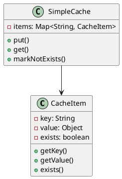
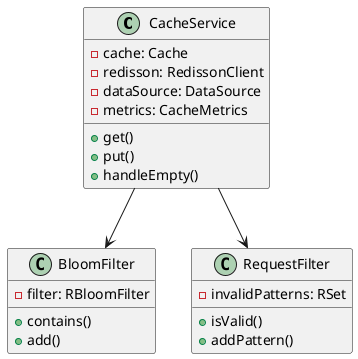

# 快取穿透教學

## 初級（Beginner）層級

### 1. 概念說明
快取穿透就像學校的圖書館：
- 如果同學要找一本不存在的書，圖書館員會一直找
- 這樣會浪費很多時間
- 我們要記錄哪些書是不存在的，避免重複查找

#### 原因分析
1. 系統設計問題：
   - 沒有對不存在的數據進行標記
   - 沒有對請求參數進行校驗
   - 沒有使用布隆過濾器等預過濾機制

2. 業務場景：
   - 惡意攻擊：使用不存在的 key 進行大量請求
   - 業務異常：用戶輸入錯誤的查詢條件
   - 數據變更：已刪除的數據仍被查詢

#### 問題表象
1. 性能問題：
   - 數據庫壓力驟增
   - 響應時間變長
   - 系統資源消耗增加

2. 業務影響：
   - 服務可用性降低
   - 用戶體驗變差
   - 可能導致系統崩潰

#### 避免方法
1. 基礎防護：
   - 對請求參數進行合法性校驗
   - 設置合理的緩存過期時間
   - 實現基本的限流機制

2. 數據處理：
   - 對不存在的數據進行標記
   - 使用布隆過濾器預過濾
   - 實現空值緩存

#### 處理方案
1. 技術方案：
   - 使用布隆過濾器
   - 實現空值緩存
   - 添加請求過濾

2. 運維方案：
   - 監控緩存命中率
   - 設置告警閾值
   - 定期清理無效數據

初級學習者需要了解：
- 什麼是快取穿透
- 為什麼會發生穿透
- 基本的空值處理概念

### 2. PlantUML 圖解


### 3. 分段教學步驟

#### 步驟 1：基本快取實現
```java
// 配置 Caffeine 快取
public class CacheConfig {
    public Cache<String, Object> createCache() {
        return Caffeine.newBuilder()
            .maximumSize(10_000)
            .expireAfterWrite(5, TimeUnit.MINUTES)
            .build();
    }
}

// 使用 Redis 布隆過濾器
public class CacheService {
    private final Cache<String, Object> cache;
    private final RedissonClient redisson;
    private final DataSource dataSource;
    private final CacheMetrics metrics;
    
    public CacheService(DataSource dataSource) {
        this.cache = Caffeine.newBuilder()
            .maximumSize(10_000)
            .expireAfterWrite(5, TimeUnit.MINUTES)
            .build();
        this.redisson = Redisson.create();
        this.dataSource = dataSource;
        this.metrics = new CacheMetrics();
        
        // 初始化布隆過濾器
        RBloomFilter<String> bloomFilter = redisson.getBloomFilter("bloom:filter");
        bloomFilter.tryInit(100_000, 0.01); // 預期元素數量 100,000，誤判率 1%
    }
    
    public Object get(String key) {
        // 先從快取獲取
        Object value = cache.getIfPresent(key);
        if (value != null) {
            metrics.recordCacheHit();
            return value;
        }
        
        // 使用布隆過濾器檢查
        RBloomFilter<String> bloomFilter = redisson.getBloomFilter("bloom:filter");
        if (!bloomFilter.contains(key)) {
            metrics.recordBloomFilterMiss();
            return null;
        }
        
        // 從資料來源獲取數據
        value = dataSource.fetch(key);
        if (value != null) {
            cache.put(key, value);
            metrics.recordCacheMiss();
        } else {
            // 如果數據不存在，將 key 加入布隆過濾器
            bloomFilter.add(key);
            metrics.recordBloomFilterAdd();
        }
        return value;
    }
}
```

## 中級（Intermediate）層級

### 1. 概念說明
中級學習者需要理解：
- 布隆過濾器的使用
- 空值快取機制
- 請求過濾機制
- 降級處理策略

#### 布隆過濾器詳解
1. 工作原理：
   - 使用多個哈希函數
   - 將元素映射到位數組
   - 可能存在誤判（假陽性）

2. 優缺點：
   - 優點：空間效率高、查詢效率高
   - 缺點：不支持刪除、存在誤判率

3. 使用場景：
   - 大規模數據過濾
   - 防止緩存穿透
   - 垃圾郵件過濾

#### 空值緩存機制
1. 實現方式：
   - 使用特殊標記存儲空值
   - 設置較短的過期時間
   - 定期清理機制

2. 注意事項：
   - 避免緩存污染
   - 控制緩存大小
   - 處理數據更新

#### 請求過濾機制
1. 過濾策略：
   - 參數格式校驗
   - 頻率限制
   - 黑名單機制

2. 實現方式：
   - 使用正則表達式
   - 實現請求計數器
   - 使用分布式集合

#### 降級處理策略
1. 降級方式：
   - 返回默認值
   - 使用舊數據
   - 部分功能降級

2. 觸發條件：
   - 系統負載過高
   - 服務異常
   - 資源不足

### 2. PlantUML 圖解


### 3. 分段教學步驟

#### 步驟 1：請求過濾
```java
public class RequestFilter {
    private final RSet<String> invalidPatterns;
    private final Pattern pattern;
    
    public RequestFilter(RedissonClient redisson) {
        this.invalidPatterns = redisson.getSet("invalid:patterns");
        this.pattern = Pattern.compile("[^a-zA-Z0-9]");
    }
    
    public boolean isValid(String key) {
        // 檢查是否包含無效字符
        if (pattern.matcher(key).find()) {
            return false;
        }
        
        // 檢查是否匹配無效模式
        return !invalidPatterns.contains(key);
    }
    
    public void addInvalidPattern(String pattern) {
        invalidPatterns.add(pattern);
    }
}

public class AdvancedCacheService {
    private final Cache<String, Object> cache;
    private final RedissonClient redisson;
    private final RequestFilter requestFilter;
    private final CacheMetrics metrics;
    
    public AdvancedCacheService() {
        this.cache = Caffeine.newBuilder()
            .maximumSize(10_000)
            .expireAfterWrite(5, TimeUnit.MINUTES)
            .build();
        this.redisson = Redisson.create();
        this.requestFilter = new RequestFilter(redisson);
        this.metrics = new CacheMetrics();
        
        // 初始化布隆過濾器
        RBloomFilter<String> bloomFilter = redisson.getBloomFilter("bloom:filter");
        bloomFilter.tryInit(100_000, 0.01);
    }
    
    public Object get(String key) {
        // 檢查請求是否有效
        if (!requestFilter.isValid(key)) {
            metrics.recordInvalidRequest();
            return handleEmpty(key);
        }
        
        // 使用布隆過濾器
        RBloomFilter<String> bloomFilter = redisson.getBloomFilter("bloom:filter");
        if (!bloomFilter.contains(key)) {
            metrics.recordBloomFilterMiss();
            return handleEmpty(key);
        }
        
        // 從快取獲取
        Object value = cache.getIfPresent(key);
        if (value != null) {
            metrics.recordCacheHit();
            return value;
        }
        
        // 從資料來源獲取
        value = fetchFromDataSource(key);
        if (value != null) {
            cache.put(key, value);
            metrics.recordCacheMiss();
        } else {
            bloomFilter.add(key);
            metrics.recordBloomFilterAdd();
        }
        return value;
    }
    
    private Object handleEmpty(String key) {
        // 返回降級數據
        return "降級數據";
    }
}
```

### 4. 進階配置

#### 監控配置（使用 Micrometer）
```java
public class CacheMetrics {
    private final Counter cacheHits;
    private final Counter cacheMisses;
    private final Counter bloomFilterHits;
    private final Counter bloomFilterMisses;
    private final Counter invalidRequests;
    
    public CacheMetrics() {
        this.cacheHits = Metrics.counter("cache.hits");
        this.cacheMisses = Metrics.counter("cache.misses");
        this.bloomFilterHits = Metrics.counter("bloom.filter.hits");
        this.bloomFilterMisses = Metrics.counter("bloom.filter.misses");
        this.invalidRequests = Metrics.counter("invalid.requests");
    }
    
    public void recordCacheHit() {
        cacheHits.increment();
    }
    
    public void recordCacheMiss() {
        cacheMisses.increment();
    }
    
    public void recordBloomFilterHit() {
        bloomFilterHits.increment();
    }
    
    public void recordBloomFilterMiss() {
        bloomFilterMisses.increment();
    }
    
    public void recordBloomFilterAdd() {
        bloomFilterMisses.increment();
    }
    
    public void recordInvalidRequest() {
        invalidRequests.increment();
    }
}
```

#### Maven 依賴配置
```xml
<dependencies>
    <dependency>
        <groupId>com.github.ben-manes.caffeine</groupId>
        <artifactId>caffeine</artifactId>
        <version>3.1.8</version>
    </dependency>
    <dependency>
        <groupId>org.redisson</groupId>
        <artifactId>redisson</artifactId>
        <version>3.24.3</version>
    </dependency>
    <dependency>
        <groupId>io.micrometer</groupId>
        <artifactId>micrometer-core</artifactId>
        <version>1.11.5</version>
    </dependency>
</dependencies>
```

這個教學文件提供了從基礎到進階的快取穿透學習路徑，每個層級都包含了相應的概念說明、圖解、教學步驟和實作範例。初級學習者可以從基本的快取實現開始，中級學習者可以學習布隆過濾器和請求過濾，而高級學習者則可以掌握多級布隆過濾器和自動恢復策略等進階功能。 

## 高級（Advanced）層級

### 1. 概念說明
高級學習者需要掌握：
- 多級布隆過濾器
- 自動恢復策略
- 監控和告警
- 性能優化

#### 多級布隆過濾器
1. 架構設計：
   - 本地過濾器
   - 分布式過濾器
   - 多級緩存

2. 同步機制：
   - 定期同步
   - 事件觸發
   - 增量更新

#### 自動恢復策略
1. 恢復機制：
   - 熔斷降級
   - 自動擴容
   - 數據預熱

2. 監控指標：
   - 系統負載
   - 錯誤率
   - 響應時間

#### 監控和告警
1. 監控維度：
   - 緩存命中率
   - 請求量
   - 錯誤率
   - 系統資源

2. 告警策略：
   - 多級告警
   - 智能降噪
   - 自動處理

#### 性能優化
1. 優化方向：
   - 緩存策略
   - 數據結構
   - 並發控制

2. 優化手段：
   - 預熱機制
   - 異步處理
   - 批量操作

這個教學文件提供了從基礎到進階的快取穿透學習路徑，每個層級都包含了相應的概念說明、圖解、教學步驟和實作範例。初級學習者可以從基本的快取實現開始，中級學習者可以學習布隆過濾器和請求過濾，而高級學習者則可以掌握多級布隆過濾器和自動恢復策略等進階功能。 