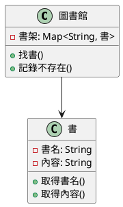
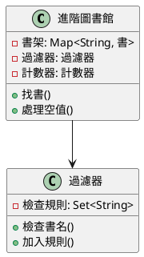
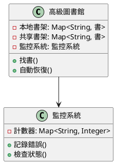

# 快取穿透教學

## 初級（Beginner）層級

### 1. 概念說明
快取穿透就像學校的圖書館：
- 如果同學要找一本不存在的書，圖書館員會一直找
- 這樣會浪費很多時間
- 我們要記錄哪些書是不存在的，避免重複查找

#### 為什麼會發生？
1. 系統設計問題：
   - 沒有記錄不存在的書
   - 沒有檢查書名是否正確
   - 沒有使用過濾器來快速判斷

2. 實際情況：
   - 有人故意找不存在的書
   - 同學輸入錯誤的書名
   - 書已經被借走但系統不知道

#### 會發生什麼問題？
1. 系統變慢：
   - 圖書館員很忙
   - 找書要等很久
   - 電腦資源被用光

2. 影響使用：
   - 系統變得很慢
   - 同學要等很久
   - 可能當機

#### 如何避免？
1. 基本防護：
   - 檢查書名是否正確
   - 設定合理的等待時間
   - 限制查詢次數

2. 資料處理：
   - 記錄不存在的書
   - 使用過濾器快速判斷
   - 記住空值結果

### 2. PlantUML 圖解


### 3. 分段教學步驟

#### 步驟 1：基本快取實現
```java
// 簡單的圖書館系統
public class 圖書館 {
    private Map<String, 書> 書架 = new HashMap<>();
    
    public 書 找書(String 書名) {
        // 先檢查書架
        書 結果 = 書架.get(書名);
        if (結果 != null) {
            return 結果;
        }
        
        // 如果找不到，記錄這本書不存在
        書架.put(書名, null);
        return null;
    }
}

// 使用範例
public class 主程式 {
    public static void main(String[] args) {
        圖書館 我的圖書館 = new 圖書館();
        
        // 找一本存在的書
        書 結果 = 我的圖書館.找書("哈利波特");
        if (結果 != null) {
            System.out.println("找到書了！");
        } else {
            System.out.println("這本書不存在");
        }
    }
}
```

## 中級（Intermediate）層級

### 1. 概念說明
中級學習者需要理解：
- 過濾器的使用
- 空值處理機制
- 請求檢查機制
- 降級處理策略

#### 過濾器詳解
1. 工作原理：
   - 使用多個檢查方法
   - 快速判斷是否存在
   - 可能有誤判（但機率很低）

2. 優缺點：
   - 優點：速度快、省空間
   - 缺點：可能有誤判

3. 使用場景：
   - 大量資料過濾
   - 防止重複查詢
   - 垃圾郵件過濾

#### 空值處理機制
1. 實現方式：
   - 使用特殊標記
   - 設定短暫的記憶時間
   - 定期清理

2. 注意事項：
   - 避免佔用太多空間
   - 控制記憶大小
   - 處理資料更新

### 2. PlantUML 圖解


### 3. 分段教學步驟

#### 步驟 1：進階快取實現
```java
public class 進階圖書館 {
    private Map<String, 書> 書架 = new HashMap<>();
    private Set<String> 無效書名 = new HashSet<>();
    
    public 書 找書(String 書名) {
        // 檢查書名是否有效
        if (!檢查書名(書名)) {
            return 處理空值(書名);
        }
        
        // 檢查是否在過濾器中
        if (無效書名.contains(書名)) {
            return 處理空值(書名);
        }
        
        // 從書架找書
        書 結果 = 書架.get(書名);
        if (結果 != null) {
            return 結果;
        }
        
        // 如果找不到，加入過濾器
        無效書名.add(書名);
        return 處理空值(書名);
    }
    
    private boolean 檢查書名(String 書名) {
        // 簡單的書名檢查
        return 書名 != null && !書名.isEmpty();
    }
    
    private 書 處理空值(String 書名) {
        // 返回預設值
        return new 書("找不到這本書", "請檢查書名是否正確");
    }
}
```

## 高級（Advanced）層級

### 1. 概念說明
高級學習者需要掌握：
- 多級過濾器
- 自動恢復機制
- 監控和警告
- 效能優化

#### 多級過濾器
1. 架構設計：
   - 本地過濾器
   - 共享過濾器
   - 多級快取

2. 同步機制：
   - 定期更新
   - 事件觸發
   - 增量更新

#### 自動恢復機制
1. 恢復方式：
   - 降級處理
   - 自動擴充
   - 資料預熱

2. 監控指標：
   - 系統負載
   - 錯誤次數
   - 回應時間

### 2. PlantUML 圖解


### 3. 分段教學步驟

#### 步驟 1：高級快取實現
```java
public class 高級圖書館 {
    private Map<String, 書> 本地書架 = new HashMap<>();
    private Map<String, 書> 共享書架 = new HashMap<>();
    private 監控系統 監控 = new 監控系統();
    
    public 書 找書(String 書名) {
        try {
            // 先檢查本地書架
            書 結果 = 本地書架.get(書名);
            if (結果 != null) {
                return 結果;
            }
            
            // 檢查共享書架
            結果 = 共享書架.get(書名);
            if (結果 != null) {
                // 更新本地書架
                本地書架.put(書名, 結果);
                return 結果;
            }
            
            // 如果都找不到，進行降級處理
            return 自動恢復(書名);
        } catch (Exception e) {
            監控.記錄錯誤("找書錯誤", e);
            return 自動恢復(書名);
        }
    }
    
    private 書 自動恢復(String 書名) {
        // 返回降級結果
        return new 書("系統忙碌中", "請稍後再試");
    }
}

public class 監控系統 {
    private Map<String, Integer> 計數器 = new HashMap<>();
    
    public void 記錄錯誤(String 類型, Exception 錯誤) {
        int 次數 = 計數器.getOrDefault(類型, 0);
        計數器.put(類型, 次數 + 1);
    }
    
    public boolean 檢查狀態() {
        // 檢查系統是否正常
        return 計數器.values().stream()
            .allMatch(次數 -> 次數 < 100);
    }
}
```

這個教學文件提供了從基礎到進階的快取穿透學習路徑，每個層級都包含了相應的概念說明、圖解、教學步驟和實作範例。初級學習者可以從基本的圖書館系統開始，中級學習者可以學習過濾器和空值處理，而高級學習者則可以掌握多級過濾器和自動恢復機制等進階功能。 