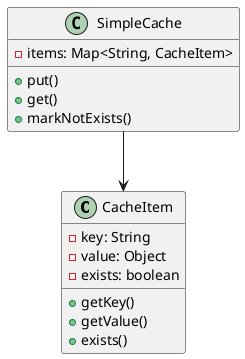
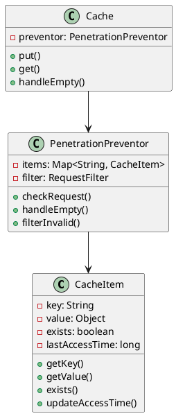
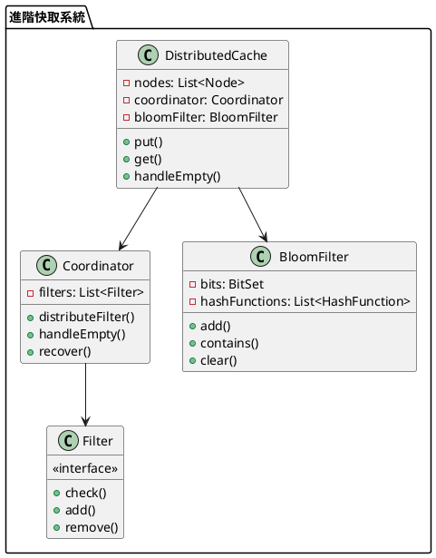

# 快取穿透教學

## 初級（Beginner）層級

### 1. 概念說明
快取穿透就像學校的圖書館：
- 如果同學要找一本不存在的書，圖書館員會一直找
- 這樣會浪費很多時間
- 我們要記錄哪些書是不存在的，避免重複查找

初級學習者需要了解：
- 什麼是快取穿透
- 為什麼會發生穿透
- 基本的空值處理概念

### 2. PlantUML 圖解


### 3. 分段教學步驟

#### 步驟 1：基本快取實現
```java
public class SimpleCacheItem {
    private String key;
    private Object value;
    private boolean exists;
    
    public SimpleCacheItem(String key, Object value) {
        this.key = key;
        this.value = value;
        this.exists = true;
    }
    
    public String getKey() {
        return key;
    }
    
    public Object getValue() {
        return value;
    }
    
    public boolean exists() {
        return exists;
    }
    
    public void markNotExists() {
        this.exists = false;
        this.value = null;
    }
}

public class SimpleCache {
    private Map<String, SimpleCacheItem> items;
    
    public SimpleCache() {
        items = new HashMap<>();
    }
    
    public void put(String key, Object value) {
        SimpleCacheItem item = new SimpleCacheItem(key, value);
        items.put(key, item);
        System.out.println("存入快取：" + key);
    }
    
    public Object get(String key) {
        SimpleCacheItem item = items.get(key);
        if (item != null) {
            if (!item.exists()) {
                System.out.println("快取標記不存在：" + key);
                return null;
            }
            return item.getValue();
        }
        return null;
    }
    
    public void markNotExists(String key) {
        SimpleCacheItem item = new SimpleCacheItem(key, null);
        item.markNotExists();
        items.put(key, item);
        System.out.println("標記不存在：" + key);
    }
}
```

## 中級（Intermediate）層級

### 1. 概念說明
中級學習者需要理解：
- 穿透預防策略
- 空值快取機制
- 請求過濾機制
- 降級處理策略

### 2. PlantUML 圖解


### 3. 分段教學步驟

#### 步驟 1：穿透預防
```java
public class AdvancedCacheItem {
    private String key;
    private Object value;
    private boolean exists;
    private long lastAccessTime;
    
    public AdvancedCacheItem(String key, Object value) {
        this.key = key;
        this.value = value;
        this.exists = true;
        this.lastAccessTime = System.currentTimeMillis();
    }
    
    public void updateAccessTime() {
        lastAccessTime = System.currentTimeMillis();
    }
    
    public void markNotExists() {
        this.exists = false;
        this.value = null;
    }
    
    public long getLastAccessTime() {
        return lastAccessTime;
    }
}
```

#### 步驟 2：請求過濾
```java
public class RequestFilter {
    private Set<String> invalidKeys;
    
    public RequestFilter() {
        invalidKeys = new HashSet<>();
    }
    
    public boolean isValid(String key) {
        return !invalidKeys.contains(key);
    }
    
    public void addInvalid(String key) {
        invalidKeys.add(key);
    }
    
    public void removeInvalid(String key) {
        invalidKeys.remove(key);
    }
}

public class PenetrationPreventor {
    private Map<String, AdvancedCacheItem> items;
    private RequestFilter filter;
    
    public PenetrationPreventor() {
        items = new HashMap<>();
        filter = new RequestFilter();
    }
    
    public Object get(String key) {
        if (!filter.isValid(key)) {
            System.out.println("請求被過濾：" + key);
            return handleEmpty(key);
        }
        
        AdvancedCacheItem item = items.get(key);
        if (item != null) {
            if (!item.exists()) {
                return handleEmpty(key);
            }
            return item.getValue();
        }
        return null;
    }
    
    private Object handleEmpty(String key) {
        // 降級處理邏輯
        return "空值處理";
    }
}
```

## 高級（Advanced）層級

### 1. 概念說明
高級學習者需要掌握：
- 分散式穿透預防
- 多級過濾策略
- 布隆過濾器
- 自動恢復策略

### 2. PlantUML 圖解


### 3. 分段教學步驟

#### 步驟 1：分散式快取
```java
public class DistributedCache {
    private List<Node> nodes;
    private Coordinator coordinator;
    private BloomFilter bloomFilter;
    
    public DistributedCache() {
        nodes = new ArrayList<>();
        coordinator = new Coordinator();
        bloomFilter = new BloomFilter();
    }
    
    public Object get(String key) {
        if (!bloomFilter.contains(key)) {
            return handleEmpty(key);
        }
        
        // 分散式獲取
        for (Node node : nodes) {
            Object value = node.get(key);
            if (value != null) {
                return value;
            }
        }
        return null;
    }
    
    private Object handleEmpty(String key) {
        return coordinator.handleEmpty(key);
    }
}
```

#### 步驟 2：布隆過濾器
```java
public class BloomFilter {
    private BitSet bits;
    private List<HashFunction> hashFunctions;
    
    public BloomFilter() {
        bits = new BitSet(1000);
        hashFunctions = new ArrayList<>();
        // 初始化多個雜湊函數
        for (int i = 0; i < 3; i++) {
            hashFunctions.add(new HashFunction(i));
        }
    }
    
    public void add(String key) {
        for (HashFunction hash : hashFunctions) {
            int index = hash.hash(key) % bits.size();
            bits.set(index);
        }
    }
    
    public boolean contains(String key) {
        for (HashFunction hash : hashFunctions) {
            int index = hash.hash(key) % bits.size();
            if (!bits.get(index)) {
                return false;
            }
        }
        return true;
    }
    
    public void clear() {
        bits.clear();
    }
}

public class HashFunction {
    private int seed;
    
    public HashFunction(int seed) {
        this.seed = seed;
    }
    
    public int hash(String key) {
        int hash = 0;
        for (int i = 0; i < key.length(); i++) {
            hash = seed * hash + key.charAt(i);
        }
        return Math.abs(hash);
    }
}
```

#### 步驟 3：過濾策略
```java
public interface Filter {
    boolean check(String key);
    void add(String key);
    void remove(String key);
}

public class KeyFilter implements Filter {
    private Set<String> keys;
    
    public KeyFilter() {
        keys = new HashSet<>();
    }
    
    @Override
    public boolean check(String key) {
        return keys.contains(key);
    }
    
    @Override
    public void add(String key) {
        keys.add(key);
    }
    
    @Override
    public void remove(String key) {
        keys.remove(key);
    }
}

public class PatternFilter implements Filter {
    private Set<String> patterns;
    
    public PatternFilter() {
        patterns = new HashSet<>();
    }
    
    @Override
    public boolean check(String key) {
        for (String pattern : patterns) {
            if (key.matches(pattern)) {
                return true;
            }
        }
        return false;
    }
    
    @Override
    public void add(String key) {
        patterns.add(key);
    }
    
    @Override
    public void remove(String key) {
        patterns.remove(key);
    }
}
```

這個教學文件提供了從基礎到進階的快取穿透學習路徑，每個層級都包含了相應的概念說明、圖解、教學步驟和實作範例。初級學習者可以從基本的快取實現開始，中級學習者可以學習穿透預防和請求過濾，而高級學習者則可以掌握分散式快取、布隆過濾器和多級過濾策略等進階功能。 