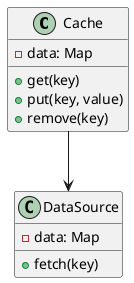
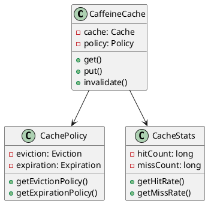
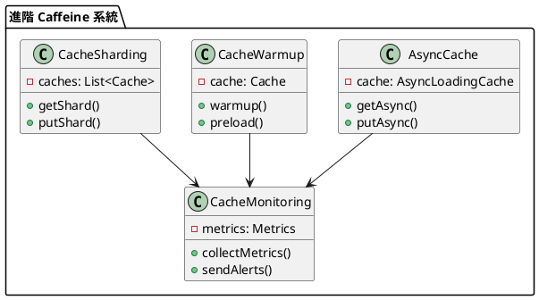

# 快取教學

## 初級（Beginner）層級

### 1. 概念說明
快取就像是在學校裡，當我們需要經常使用的東西時：
- 把常用的書本放在書桌上（記憶體快取）
- 把常用的文具放在鉛筆盒裡（本地快取）
- 把常用的資料記在筆記本上（持久化快取）

#### 原因分析
1. 性能需求：
   - 減少數據庫訪問
   - 提高響應速度
   - 降低系統負載

2. 業務場景：
   - 高頻訪問數據
   - 計算密集型操作
   - 數據一致性要求低

#### 問題表象
1. 性能問題：
   - 數據庫壓力大
   - 響應時間長
   - 系統資源消耗高

2. 業務影響：
   - 用戶體驗差
   - 系統擴展性受限
   - 運營成本增加

#### 避免方法
1. 基礎防護：
   - 合理設置緩存大小
   - 選擇合適的過期策略
   - 實現基本的監控

2. 數據處理：
   - 熱點數據識別
   - 緩存預熱
   - 定期清理

#### 處理方案
1. 技術方案：
   - 使用本地緩存
   - 實現多級緩存
   - 添加監控機制

2. 運維方案：
   - 監控緩存命中率
   - 設置告警閾值
   - 定期優化配置

初級學習者需要了解：
- 什麼是快取
- 為什麼需要快取
- 基本的快取操作

### 2. PlantUML 圖解


### 3. 分段教學步驟

#### 步驟 1：基本快取操作
```java
// 配置快取
Cache<String, String> cache = Caffeine.newBuilder()
    .maximumSize(10_000)
    .expireAfterWrite(5, TimeUnit.MINUTES)
    .build();

// 快取操作
public class CacheService {
    private final Cache<String, String> cache;
    private final DataSource dataSource;
    
    public CacheService(DataSource dataSource) {
        this.cache = Caffeine.newBuilder()
            .maximumSize(10_000)
            .expireAfterWrite(5, TimeUnit.MINUTES)
            .build();
        this.dataSource = dataSource;
    }
    
    public String get(String key) {
        return cache.get(key, k -> {
            System.out.println("從資料來源取得資料: " + k);
            return dataSource.fetch(k);
        });
    }
    
    public void put(String key, String value) {
        cache.put(key, value);
        System.out.println("將資料存入快取: " + key);
    }
    
    public void invalidate(String key) {
        cache.invalidate(key);
    }
}
```

#### 步驟 2：快取清理策略
```java
public class CacheConfig {
    public Cache<String, String> createCache() {
        return Caffeine.newBuilder()
            .maximumSize(10_000)
            .expireAfterWrite(5, TimeUnit.MINUTES)
            .removalListener((key, value, cause) -> {
                System.out.printf("Key %s was removed (%s)%n", key, cause);
            })
            .build();
    }
}
```

### 4. 配置說明

#### Maven 依賴配置
```xml
<dependencies>
    <dependency>
        <groupId>com.github.ben-manes.caffeine</groupId>
        <artifactId>caffeine</artifactId>
        <version>3.1.8</version>
    </dependency>
</dependencies>
```

## 中級（Intermediate）層級

### 1. 概念說明
中級學習者需要理解：
- Caffeine 的架構和組件
- 快取策略和算法
- 快取監控和統計
- 快取性能優化

#### Caffeine 架構詳解
1. 核心組件：
   - 緩存存儲
   - 過期策略
   - 淘汰策略
   - 監控統計

2. 優缺點：
   - 優點：性能高、功能豐富
   - 缺點：內存消耗大、配置複雜

3. 使用場景：
   - 本地緩存
   - 熱點數據
   - 計算結果緩存

#### 快取策略詳解
1. 淘汰策略：
   - LRU（最近最少使用）
   - LFU（最不經常使用）
   - FIFO（先進先出）

2. 過期策略：
   - 寫入後過期
   - 訪問後過期
   - 定時過期

#### 監控和統計
1. 監控指標：
   - 命中率
   - 加載時間
   - 淘汰數量

2. 統計方法：
   - 實時統計
   - 定期匯總
   - 趨勢分析

#### 性能優化
1. 優化方向：
   - 緩存大小
   - 過期時間
   - 並發控制

2. 優化手段：
   - 預熱機制
   - 異步加載
   - 批量操作

### 2. PlantUML 圖解


### 3. 分段教學步驟

#### 步驟 1：快取策略配置
```java
public class AdvancedCacheConfig {
    public Cache<String, String> createCache() {
        return Caffeine.newBuilder()
            .maximumSize(10_000)
            .expireAfterWrite(5, TimeUnit.MINUTES)
            .expireAfterAccess(10, TimeUnit.MINUTES)
            .refreshAfterWrite(1, TimeUnit.MINUTES)
            .weakKeys()
            .weakValues()
            .removalListener((key, value, cause) -> {
                System.out.printf("Key %s was removed (%s)%n", key, cause);
            })
            .build();
    }
}
```

#### 步驟 2：快取監控
```java
public class CacheMonitor {
    private final Cache<String, String> cache;
    
    public CacheMonitor(Cache<String, String> cache) {
        this.cache = cache;
    }
    
    public void printStats() {
        CacheStats stats = cache.stats();
        System.out.printf("Hit Rate: %.2f%%%n", stats.hitRate() * 100);
        System.out.printf("Miss Rate: %.2f%%%n", stats.missRate() * 100);
        System.out.printf("Load Success Rate: %.2f%%%n", stats.loadSuccessRate() * 100);
        System.out.printf("Average Load Penalty: %.2f ms%n", stats.averageLoadPenalty() / 1_000_000.0);
    }
}
```

### 4. 配置說明

#### Maven 依賴配置
```xml
<dependencies>
    <dependency>
        <groupId>com.github.ben-manes.caffeine</groupId>
        <artifactId>caffeine</artifactId>
        <version>3.1.8</version>
    </dependency>
</dependencies>
```

## 高級（Advanced）層級

### 1. 概念說明
高級學習者需要掌握：
- 非同步快取
- 快取預熱
- 快取分片
- 快取監控和告警

#### 非同步快取詳解
1. 實現方式：
   - CompletableFuture
   - 回調函數
   - 事件驅動

2. 注意事項：
   - 線程安全
   - 錯誤處理
   - 超時控制

#### 快取預熱機制
1. 預熱策略：
   - 啟動時預熱
   - 定時預熱
   - 事件觸發預熱

2. 實現方式：
   - 批量加載
   - 異步加載
   - 增量加載

#### 快取分片策略
1. 分片方式：
   - 哈希分片
   - 範圍分片
   - 一致性哈希

2. 注意事項：
   - 數據均衡
   - 擴容縮容
   - 故障轉移

#### 監控和告警
1. 監控維度：
   - 性能指標
   - 容量指標
   - 錯誤指標

2. 告警策略：
   - 多級告警
   - 智能降噪
   - 自動處理

### 2. PlantUML 圖解


### 3. 分段教學步驟

#### 步驟 1：非同步快取
```java
public class AsyncCacheService {
    private final AsyncLoadingCache<String, String> cache;
    
    public AsyncCacheService() {
        this.cache = Caffeine.newBuilder()
            .maximumSize(10_000)
            .expireAfterWrite(5, TimeUnit.MINUTES)
            .buildAsync(key -> {
                System.out.println("非同步載入資料: " + key);
                return fetchData(key);
            });
    }
    
    public CompletableFuture<String> getAsync(String key) {
        return cache.get(key);
    }
    
    private String fetchData(String key) {
        // 模擬從資料來源取得資料
        return "資料內容";
    }
}
```

#### 步驟 2：快取預熱
```java
public class CacheWarmupService {
    private final Cache<String, String> cache;
    
    public CacheWarmupService() {
        this.cache = Caffeine.newBuilder()
            .maximumSize(10_000)
            .build();
    }
    
    public void warmup(List<String> keys) {
        keys.parallelStream().forEach(key -> {
            String value = fetchData(key);
            cache.put(key, value);
        });
    }
    
    private String fetchData(String key) {
        // 模擬從資料來源取得資料
        return "資料內容";
    }
}
```

#### 步驟 3：快取分片
```java
public class ShardedCache {
    private final List<Cache<String, String>> shards;
    
    public ShardedCache(int numShards) {
        this.shards = new ArrayList<>(numShards);
        for (int i = 0; i < numShards; i++) {
            shards.add(Caffeine.newBuilder()
                .maximumSize(10_000 / numShards)
                .build());
        }
    }
    
    public String get(String key) {
        Cache<String, String> shard = getShard(key);
        return shard.get(key, k -> fetchData(k));
    }
    
    private Cache<String, String> getShard(String key) {
        int shardIndex = Math.abs(key.hashCode() % shards.size());
        return shards.get(shardIndex);
    }
    
    private String fetchData(String key) {
        // 模擬從資料來源取得資料
        return "資料內容";
    }
}
```

### 4. 進階配置

#### 監控配置（使用 Micrometer）
```java
public class CacheMetricsConfig {
    public Cache<String, String> createCacheWithMetrics() {
        return Caffeine.newBuilder()
            .maximumSize(10_000)
            .recordStats(() -> new StatsCounter() {
                private final Counter hits = Metrics.counter("cache.hits");
                private final Counter misses = Metrics.counter("cache.misses");
                
                @Override
                public void recordHits(int count) {
                    hits.increment(count);
                }
                
                @Override
                public void recordMisses(int count) {
                    misses.increment(count);
                }
            })
            .build();
    }
}
```

#### 性能優化配置
```java
public class PerformanceOptimizedCache {
    public Cache<String, String> createOptimizedCache() {
        return Caffeine.newBuilder()
            .maximumSize(10_000)
            .initialCapacity(1000)
            .executor(Runnable::run) // 使用當前線程
            .scheduler(Scheduler.systemScheduler())
            .weigher((String key, String value) -> value.length())
            .build();
    }
}
```

### 4. 常見問題與解決方案

#### 問題表象
1. 緩存穿透：
   - 大量請求不存在的數據
   - 數據庫壓力驟增
   - 系統響應變慢

2. 緩存擊穿：
   - 熱點數據過期
   - 並發請求直接訪問數據庫
   - 系統負載不均

3. 緩存雪崩：
   - 大量緩存同時過期
   - 系統負載激增
   - 服務不可用

4. 數據不一致：
   - 緩存與數據庫不一致
   - 多級緩存之間不一致
   - 並發更新導致不一致

#### 避免方法
1. 緩存穿透防護：
   - 使用布隆過濾器
   - 設置空值緩存
   - 實現請求限流

2. 緩存擊穿防護：
   - 使用互斥鎖
   - 實現熱點數據永不過期
   - 設置隨機過期時間

3. 緩存雪崩防護：
   - 分散過期時間
   - 實現多級緩存
   - 設置熔斷機制

4. 數據一致性保證：
   - 使用雙寫策略
   - 實現延遲刪除
   - 設置版本控制

#### 處理方案
1. 技術方案：
   ```java
   public class CacheManager {
       private Cache<String, String> cache;
       private DataSource dataSource;
       private BloomFilter<String> bloomFilter;
       private LockManager lockManager;
       
       public String get(String key) {
           // 檢查布隆過濾器
           if (!bloomFilter.mightContain(key)) {
               return null;
           }
           
           // 嘗試從緩存獲取
           String value = cache.getIfPresent(key);
           if (value != null) {
               return value;
           }
           
           // 獲取互斥鎖
           if (lockManager.tryLock(key)) {
               try {
                   // 再次檢查緩存
                   value = cache.getIfPresent(key);
                   if (value != null) {
                       return value;
                   }
                   
                   // 從數據源獲取
                   value = dataSource.fetch(key);
                   if (value != null) {
                       // 更新緩存
                       cache.put(key, value);
                   } else {
                       // 設置空值緩存
                       cache.put(key, "");
                   }
                   return value;
               } finally {
                   lockManager.unlock(key);
               }
           }
           
           // 等待其他線程處理
           return waitForValue(key);
       }
       
       private String waitForValue(String key) {
           // 實現等待邏輯
           return null;
       }
   }
   ```

2. 監控方案：
   ```java
   public class CacheMonitor {
       private MetricsCollector metricsCollector;
       private AlertManager alertManager;
       
       public void monitorCache() {
           CacheMetrics metrics = metricsCollector.collectMetrics();
           
           // 檢查緩存命中率
           if (metrics.getHitRate() < HIT_RATE_THRESHOLD) {
               alertManager.alert("緩存命中率低", metrics.getDetails());
           }
           
           // 檢查緩存穿透
           if (metrics.getPenetrationRate() > PENETRATION_THRESHOLD) {
               alertManager.alert("緩存穿透警告", metrics.getDetails());
           }
           
           // 檢查緩存雪崩風險
           if (metrics.getExpirationConcentration() > CONCENTRATION_THRESHOLD) {
               alertManager.alert("緩存雪崩風險", metrics.getDetails());
           }
       }
   }
   ```

3. 最佳實踐：
   - 合理設置緩存大小和過期時間
   - 實現多級緩存架構
   - 使用布隆過濾器防止緩存穿透
   - 實現熱點數據預熱
   - 設置合理的緩存更新策略
   - 實現緩存監控和告警
   - 定期清理無效緩存
   - 實現緩存降級策略

### 5. 實戰案例

#### 案例一：電商商品緩存
```java
public class ProductCacheService {
    private Cache<String, Product> productCache;
    private Cache<String, List<Product>> categoryCache;
    private ProductService productService;
    
    public Product getProduct(String productId) {
        return productCache.get(productId, id -> {
            // 從數據庫獲取商品
            Product product = productService.getProductById(id);
            if (product != null) {
                // 預熱相關緩存
                warmUpRelatedCaches(product);
            }
            return product;
        });
    }
    
    public List<Product> getProductsByCategory(String categoryId) {
        return categoryCache.get(categoryId, id -> {
            // 從數據庫獲取分類商品
            return productService.getProductsByCategory(id);
        });
    }
    
    private void warmUpRelatedCaches(Product product) {
        // 預熱分類緩存
        categoryCache.invalidate(product.getCategoryId());
        // 預熱相關商品緩存
        warmUpRelatedProducts(product);
    }
}
```

#### 案例二：用戶會話緩存
```java
public class SessionCacheService {
    private Cache<String, UserSession> sessionCache;
    private Cache<String, UserPreferences> preferencesCache;
    private SessionService sessionService;
    
    public UserSession getSession(String sessionId) {
        return sessionCache.get(sessionId, id -> {
            // 從數據庫獲取會話
            UserSession session = sessionService.getSession(id);
            if (session != null) {
                // 預熱用戶偏好緩存
                preferencesCache.get(session.getUserId(), 
                    userId -> sessionService.getUserPreferences(userId));
            }
            return session;
        });
    }
    
    public void updateSession(UserSession session) {
        // 更新會話緩存
        sessionCache.put(session.getId(), session);
        // 更新用戶偏好緩存
        preferencesCache.put(session.getUserId(), session.getPreferences());
    }
}
```

這個教學文件提供了從基礎到進階的快取學習路徑，每個層級都包含了相應的概念說明、圖解、教學步驟和實作範例。初級學習者可以從基本的快取操作開始，中級學習者可以學習快取策略和監控，而高級學習者則可以掌握分散式快取和優化等進階功能。 