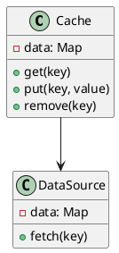
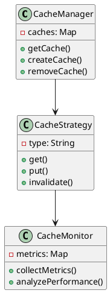
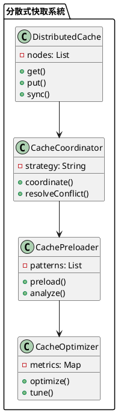

# 快取教學

## 初級（Beginner）層級

### 1. 概念說明
快取就像是在學校裡，當我們需要經常使用的東西時：
- 把常用的書本放在書桌上（記憶體快取）
- 把常用的文具放在鉛筆盒裡（本地快取）
- 把常用的資料記在筆記本上（持久化快取）

初級學習者需要了解：
- 什麼是快取
- 為什麼需要快取
- 基本的快取操作

### 2. PlantUML 圖解


### 3. 分段教學步驟

#### 步驟 1：基本快取操作
```java
public class SimpleCache {
    private Map<String, String> cache;
    
    public SimpleCache() {
        cache = new HashMap<>();
    }
    
    public String get(String key) {
        // 先檢查快取中是否有資料
        String value = cache.get(key);
        if (value != null) {
            System.out.println("從快取取得資料: " + key);
            return value;
        }
        
        // 如果快取中沒有，從資料來源取得
        value = fetchFromDataSource(key);
        if (value != null) {
            // 將資料存入快取
            cache.put(key, value);
        }
        return value;
    }
    
    public void put(String key, String value) {
        cache.put(key, value);
        System.out.println("將資料存入快取: " + key);
    }
    
    private String fetchFromDataSource(String key) {
        // 模擬從資料來源取得資料
        System.out.println("從資料來源取得資料: " + key);
        return "資料內容";
    }
}
```

#### 步驟 2：簡單的快取清理
```java
public class CacheCleaner {
    private SimpleCache cache;
    private int maxSize;
    
    public CacheCleaner(SimpleCache cache, int maxSize) {
        this.cache = cache;
        this.maxSize = maxSize;
    }
    
    public void checkAndClean() {
        if (cache.size() > maxSize) {
            System.out.println("快取已滿，開始清理...");
            // 簡單的清理策略：移除最舊的資料
            cache.removeOldest();
        }
    }
}
```

## 中級（Intermediate）層級

### 1. 概念說明
中級學習者需要理解：
- 快取策略
- 快取失效
- 快取更新
- 快取監控

### 2. PlantUML 圖解


### 3. 分段教學步驟

#### 步驟 1：快取策略實作
```java
import java.util.*;

public class CacheStrategy {
    private Map<String, CacheEntry> cache;
    private int maxSize;
    private String strategyType;
    
    public CacheStrategy(int maxSize, String strategyType) {
        this.cache = new HashMap<>();
        this.maxSize = maxSize;
        this.strategyType = strategyType;
    }
    
    public String get(String key) {
        CacheEntry entry = cache.get(key);
        if (entry == null) {
            return null;
        }
        
        // 更新最後存取時間
        entry.updateLastAccess();
        return entry.getValue();
    }
    
    public void put(String key, String value) {
        if (cache.size() >= maxSize) {
            evict();
        }
        
        cache.put(key, new CacheEntry(value));
    }
    
    private void evict() {
        switch (strategyType) {
            case "LRU":
                evictLRU();
                break;
            case "FIFO":
                evictFIFO();
                break;
        }
    }
    
    private void evictLRU() {
        // 移除最久未使用的項目
        String oldestKey = cache.entrySet().stream()
            .min((e1, e2) -> e1.getValue().getLastAccess()
                .compareTo(e2.getValue().getLastAccess()))
            .map(Map.Entry::getKey)
            .orElse(null);
        
        if (oldestKey != null) {
            cache.remove(oldestKey);
        }
    }
}

class CacheEntry {
    private String value;
    private Date lastAccess;
    
    public CacheEntry(String value) {
        this.value = value;
        this.lastAccess = new Date();
    }
    
    public void updateLastAccess() {
        this.lastAccess = new Date();
    }
}
```

#### 步驟 2：快取監控
```java
public class CacheMonitor {
    private Map<String, CacheMetrics> metrics;
    
    public void collectMetrics(String cacheName, CacheStrategy cache) {
        CacheMetrics metric = new CacheMetrics();
        metric.setHitCount(cache.getHitCount());
        metric.setMissCount(cache.getMissCount());
        metric.setSize(cache.size());
        
        metrics.put(cacheName, metric);
    }
    
    public void analyzePerformance() {
        for (Map.Entry<String, CacheMetrics> entry : metrics.entrySet()) {
            String cacheName = entry.getKey();
            CacheMetrics metric = entry.getValue();
            
            double hitRate = (double) metric.getHitCount() / 
                           (metric.getHitCount() + metric.getMissCount());
            
            System.out.println("快取 " + cacheName + " 的命中率: " + 
                             String.format("%.2f", hitRate * 100) + "%");
        }
    }
}

class CacheMetrics {
    private int hitCount;
    private int missCount;
    private int size;
    
    // Getters and setters
}
```

## 高級（Advanced）層級

### 1. 概念說明
高級學習者需要掌握：
- 分散式快取
- 快取一致性
- 快取預熱
- 快取監控與優化

### 2. PlantUML 圖解


### 3. 分段教學步驟

#### 步驟 1：分散式快取
```java
import java.util.*;

public class DistributedCache {
    private List<CacheNode> nodes;
    private CacheCoordinator coordinator;
    
    public DistributedCache(List<CacheNode> nodes) {
        this.nodes = nodes;
        this.coordinator = new CacheCoordinator();
    }
    
    public String get(String key) {
        // 根據一致性雜湊選擇節點
        CacheNode node = selectNode(key);
        
        // 從選定的節點取得資料
        String value = node.get(key);
        
        if (value == null) {
            // 如果本地節點沒有資料，從其他節點同步
            value = syncFromOtherNodes(key);
            if (value != null) {
                node.put(key, value);
            }
        }
        
        return value;
    }
    
    private CacheNode selectNode(String key) {
        // 使用一致性雜湊選擇節點
        int hash = key.hashCode();
        return nodes.get(Math.abs(hash % nodes.size()));
    }
    
    private String syncFromOtherNodes(String key) {
        // 從其他節點同步資料
        for (CacheNode node : nodes) {
            String value = node.get(key);
            if (value != null) {
                return value;
            }
        }
        return null;
    }
}

class CacheNode {
    private Map<String, String> data;
    private String id;
    
    public CacheNode(String id) {
        this.id = id;
        this.data = new HashMap<>();
    }
    
    public String get(String key) {
        return data.get(key);
    }
    
    public void put(String key, String value) {
        data.put(key, value);
    }
}
```

#### 步驟 2：快取預熱
```java
public class CachePreloader {
    private DistributedCache cache;
    private List<AccessPattern> patterns;
    
    public void preload() {
        // 分析存取模式
        analyzeAccessPatterns();
        
        // 根據模式預先載入資料
        for (AccessPattern pattern : patterns) {
            preloadPattern(pattern);
        }
    }
    
    private void analyzeAccessPatterns() {
        // 分析歷史存取記錄，找出常用模式
        patterns = new ArrayList<>();
        // 添加分析邏輯
    }
    
    private void preloadPattern(AccessPattern pattern) {
        // 根據模式預先載入資料
        List<String> keys = pattern.predictKeys();
        for (String key : keys) {
            cache.get(key);
        }
    }
}

class AccessPattern {
    private String type;
    private List<String> history;
    
    public List<String> predictKeys() {
        // 根據歷史記錄預測未來可能存取的鍵
        return new ArrayList<>();
    }
}
```

#### 步驟 3：快取優化
```java
public class CacheOptimizer {
    private DistributedCache cache;
    private Map<String, PerformanceMetrics> metrics;
    
    public void optimize() {
        // 收集效能指標
        collectMetrics();
        
        // 分析並調整快取參數
        tuneParameters();
        
        // 優化快取策略
        optimizeStrategy();
    }
    
    private void tuneParameters() {
        // 根據效能指標調整快取參數
        for (Map.Entry<String, PerformanceMetrics> entry : metrics.entrySet()) {
            String nodeId = entry.getKey();
            PerformanceMetrics metric = entry.getValue();
            
            // 調整快取大小
            if (metric.getHitRate() < 0.8) {
                increaseCacheSize(nodeId);
            }
            
            // 調整過期時間
            if (metric.getExpirationRate() > 0.3) {
                adjustExpirationTime(nodeId);
            }
        }
    }
    
    private void optimizeStrategy() {
        // 根據使用模式優化快取策略
        // 實現優化邏輯
    }
}

class PerformanceMetrics {
    private double hitRate;
    private double expirationRate;
    private int size;
    
    // Getters and setters
}
```

這個教學文件提供了從基礎到進階的快取學習路徑，每個層級都包含了相應的概念說明、圖解、教學步驟和實作範例。初級學習者可以從基本的快取操作開始，中級學習者可以學習快取策略和監控，而高級學習者則可以掌握分散式快取和優化等進階功能。 