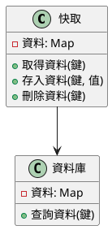
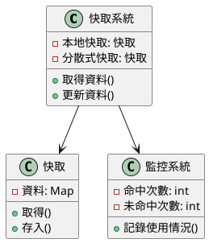
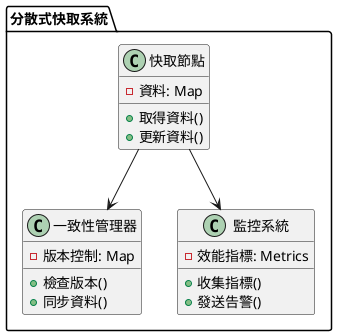

# 快取教學

## 初級（Beginner）層級

### 1. 概念說明
快取就像是在學校裡，當我們需要經常使用的東西時：
- 把常用的書本放在書桌上（記憶體快取）
- 把常用的文具放在鉛筆盒裡（本地快取）
- 把常用的資料記在筆記本上（持久化快取）

#### 為什麼需要快取？
1. 讓程式跑得更快：
   - 不用每次都去資料庫找資料
   - 減少等待時間
   - 讓電腦不會太忙

2. 適合使用快取的情況：
   - 經常要用的資料
   - 不會常常改變的資料
   - 可以晚一點更新的資料

#### 可能遇到的問題
1. 資料不正確：
   - 快取裡的資料和資料庫不一樣
   - 資料過期了還在用
   - 多人同時修改造成混亂

2. 記憶體不夠：
   - 快取太多東西
   - 電腦變慢
   - 程式當掉

#### 如何避免問題
1. 設定合理的快取大小：
   - 不要存太多東西
   - 定期清理不需要的資料
   - 設定資料的保存時間

2. 定期更新資料：
   - 設定資料的過期時間
   - 重要資料要即時更新
   - 定期檢查資料是否正確

### 2. PlantUML 圖解


### 3. 分段教學步驟

#### 步驟 1：建立基本快取
```java
// 建立一個簡單的快取
Map<String, String> 快取 = new HashMap<>();

// 存入資料
快取.put("學生1", "小明");
快取.put("學生2", "小華");

// 取得資料
String 學生姓名 = 快取.get("學生1");
System.out.println("學生姓名：" + 學生姓名);
```

#### 步驟 2：加入過期時間
```java
// 建立一個有過期時間的快取
Map<String, String> 快取 = new HashMap<>();
Map<String, Long> 過期時間 = new HashMap<>();

// 存入資料並設定過期時間
快取.put("學生1", "小明");
過期時間.put("學生1", System.currentTimeMillis() + 60000); // 1分鐘後過期

// 檢查資料是否過期
public String 取得資料(String 鍵) {
    if (過期時間.containsKey(鍵) && 過期時間.get(鍵) < System.currentTimeMillis()) {
        快取.remove(鍵);
        過期時間.remove(鍵);
        return null;
    }
    return 快取.get(鍵);
}
```

## 中級（Intermediate）層級

### 1. 概念說明
中級學習者需要理解：
- 快取的不同類型
- 快取的更新策略
- 快取的監控方法
- 快取的優化技巧

#### 快取類型
1. 本地快取：
   - 存在程式記憶體中
   - 存取速度快
   - 適合單一程式使用

2. 分散式快取：
   - 多台電腦共用
   - 可以存更多資料
   - 適合多人使用

#### 更新策略
1. 定時更新：
   - 固定時間更新
   - 簡單但可能不即時
   - 適合不常變的資料

2. 事件驅動更新：
   - 資料改變時更新
   - 即時但較複雜
   - 適合重要資料

### 2. PlantUML 圖解


### 3. 分段教學步驟

#### 步驟 1：使用 Caffeine 快取
```java
// 建立快取
Cache<String, String> 快取 = Caffeine.newBuilder()
    .maximumSize(100)  // 最多存100筆資料
    .expireAfterWrite(5, TimeUnit.MINUTES)  // 5分鐘後過期
    .build();

// 使用快取
public class 學生資料服務 {
    private final Cache<String, String> 快取;
    
    public 學生資料服務() {
        this.快取 = Caffeine.newBuilder()
            .maximumSize(100)
            .expireAfterWrite(5, TimeUnit.MINUTES)
            .build();
    }
    
    public String 取得學生資料(String 學號) {
        return 快取.get(學號, 鍵 -> {
            System.out.println("從資料庫取得資料: " + 鍵);
            return 資料庫.查詢學生資料(鍵);
        });
    }
}
```

#### 步驟 2：監控快取使用情況
```java
public class 快取監控 {
    private final Cache<String, String> 快取;
    
    public 快取監控(Cache<String, String> 快取) {
        this.快取 = 快取;
    }
    
    public void 顯示使用情況() {
        CacheStats 統計 = 快取.stats();
        System.out.printf("命中率: %.2f%%%n", 統計.hitRate() * 100);
        System.out.printf("未命中率: %.2f%%%n", 統計.missRate() * 100);
    }
}
```

## 高級（Advanced）層級

### 1. 概念說明
高級學習者需要掌握：
- 分散式快取系統
- 快取一致性
- 快取預熱機制
- 快取監控和告警

#### 分散式快取
1. 特點：
   - 多台電腦共用
   - 資料分散儲存
   - 高可用性

2. 挑戰：
   - 資料一致性
   - 網路延遲
   - 故障處理

#### 快取一致性
1. 更新策略：
   - 寫入時更新
   - 讀取時更新
   - 定期更新

2. 同步機制：
   - 鎖定機制
   - 版本控制
   - 事件通知

### 2. PlantUML 圖解


### 3. 分段教學步驟

#### 步驟 1：使用 Redis 分散式快取
```java
public class Redis快取服務 {
    private final Jedis jedis;
    
    public Redis快取服務() {
        this.jedis = new Jedis("localhost", 6379);
    }
    
    public String 取得資料(String 鍵) {
        // 先從快取取得
        String 值 = jedis.get(鍵);
        if (值 == null) {
            // 快取沒有，從資料庫取得
            值 = 資料庫.查詢資料(鍵);
            if (值 != null) {
                // 存入快取
                jedis.setex(鍵, 300, 值); // 5分鐘過期
            }
        }
        return 值;
    }
    
    public void 更新資料(String 鍵, String 值) {
        // 更新資料庫
        資料庫.更新資料(鍵, 值);
        // 更新快取
        jedis.setex(鍵, 300, 值);
    }
}
```

#### 步驟 2：實現快取預熱
```java
public class 快取預熱服務 {
    private final Redis快取服務 快取;
    
    public void 預熱資料() {
        // 取得需要預熱的資料列表
        List<String> 熱門資料 = 資料庫.取得熱門資料列表();
        
        // 並行預熱
        熱門資料.parallelStream().forEach(鍵 -> {
            String 值 = 資料庫.查詢資料(鍵);
            if (值 != null) {
                快取.更新資料(鍵, 值);
            }
        });
    }
}
```

### 4. 常見問題與解決方案

#### 快取穿透
問題：一直查詢不存在的資料
解決：使用布隆過濾器檢查資料是否存在

#### 快取擊穿
問題：熱門資料過期時大量請求
解決：使用互斥鎖，只讓一個請求去資料庫查詢

#### 快取雪崩
問題：大量資料同時過期
解決：設定隨機過期時間，分散過期時間點

這個教學文件提供了從基礎到進階的快取學習路徑，每個層級都包含了相應的概念說明、圖解、教學步驟和實作範例。初級學習者可以從基本的快取操作開始，中級學習者可以學習快取策略和監控，而高級學習者則可以掌握分散式快取和優化等進階功能。 