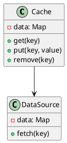
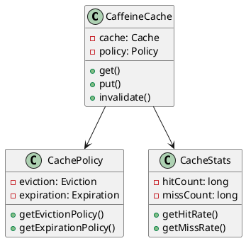
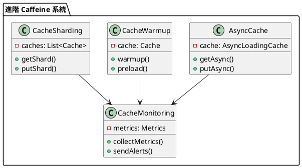

# 快取教學

## 初級（Beginner）層級

### 1. 概念說明
快取就像是在學校裡，當我們需要經常使用的東西時：
- 把常用的書本放在書桌上（記憶體快取）
- 把常用的文具放在鉛筆盒裡（本地快取）
- 把常用的資料記在筆記本上（持久化快取）

初級學習者需要了解：
- 什麼是快取
- 為什麼需要快取
- 基本的快取操作

### 2. PlantUML 圖解


### 3. 分段教學步驟

#### 步驟 1：基本快取操作
```java
// 配置快取
Cache<String, String> cache = Caffeine.newBuilder()
    .maximumSize(10_000)
    .expireAfterWrite(5, TimeUnit.MINUTES)
    .build();

// 快取操作
public class CacheService {
    private final Cache<String, String> cache;
    private final DataSource dataSource;
    
    public CacheService(DataSource dataSource) {
        this.cache = Caffeine.newBuilder()
            .maximumSize(10_000)
            .expireAfterWrite(5, TimeUnit.MINUTES)
            .build();
        this.dataSource = dataSource;
    }
    
    public String get(String key) {
        return cache.get(key, k -> {
            System.out.println("從資料來源取得資料: " + k);
            return dataSource.fetch(k);
        });
    }
    
    public void put(String key, String value) {
        cache.put(key, value);
        System.out.println("將資料存入快取: " + key);
    }
    
    public void invalidate(String key) {
        cache.invalidate(key);
    }
}
```

#### 步驟 2：快取清理策略
```java
public class CacheConfig {
    public Cache<String, String> createCache() {
        return Caffeine.newBuilder()
            .maximumSize(10_000)
            .expireAfterWrite(5, TimeUnit.MINUTES)
            .removalListener((key, value, cause) -> {
                System.out.printf("Key %s was removed (%s)%n", key, cause);
            })
            .build();
    }
}
```

### 4. 配置說明

#### Maven 依賴配置
```xml
<dependencies>
    <dependency>
        <groupId>com.github.ben-manes.caffeine</groupId>
        <artifactId>caffeine</artifactId>
        <version>3.1.8</version>
    </dependency>
</dependencies>
```

## 中級（Intermediate）層級

### 1. 概念說明
中級學習者需要理解：
- Caffeine 的架構和組件
- 快取策略和算法
- 快取監控和統計
- 快取性能優化

### 2. PlantUML 圖解


### 3. 分段教學步驟

#### 步驟 1：快取策略配置
```java
public class AdvancedCacheConfig {
    public Cache<String, String> createCache() {
        return Caffeine.newBuilder()
            .maximumSize(10_000)
            .expireAfterWrite(5, TimeUnit.MINUTES)
            .expireAfterAccess(10, TimeUnit.MINUTES)
            .refreshAfterWrite(1, TimeUnit.MINUTES)
            .weakKeys()
            .weakValues()
            .removalListener((key, value, cause) -> {
                System.out.printf("Key %s was removed (%s)%n", key, cause);
            })
            .build();
    }
}
```

#### 步驟 2：快取監控
```java
public class CacheMonitor {
    private final Cache<String, String> cache;
    
    public CacheMonitor(Cache<String, String> cache) {
        this.cache = cache;
    }
    
    public void printStats() {
        CacheStats stats = cache.stats();
        System.out.printf("Hit Rate: %.2f%%%n", stats.hitRate() * 100);
        System.out.printf("Miss Rate: %.2f%%%n", stats.missRate() * 100);
        System.out.printf("Load Success Rate: %.2f%%%n", stats.loadSuccessRate() * 100);
        System.out.printf("Average Load Penalty: %.2f ms%n", stats.averageLoadPenalty() / 1_000_000.0);
    }
}
```

## 高級（Advanced）層級

### 1. 概念說明
高級學習者需要掌握：
- 非同步快取
- 快取預熱
- 快取分片
- 快取監控和告警

### 2. PlantUML 圖解


### 3. 分段教學步驟

#### 步驟 1：非同步快取
```java
public class AsyncCacheService {
    private final AsyncLoadingCache<String, String> cache;
    
    public AsyncCacheService() {
        this.cache = Caffeine.newBuilder()
            .maximumSize(10_000)
            .expireAfterWrite(5, TimeUnit.MINUTES)
            .buildAsync(key -> {
                System.out.println("非同步載入資料: " + key);
                return fetchData(key);
            });
    }
    
    public CompletableFuture<String> getAsync(String key) {
        return cache.get(key);
    }
    
    private String fetchData(String key) {
        // 模擬從資料來源取得資料
        return "資料內容";
    }
}
```

#### 步驟 2：快取預熱
```java
public class CacheWarmupService {
    private final Cache<String, String> cache;
    
    public CacheWarmupService() {
        this.cache = Caffeine.newBuilder()
            .maximumSize(10_000)
            .build();
    }
    
    public void warmup(List<String> keys) {
        keys.parallelStream().forEach(key -> {
            String value = fetchData(key);
            cache.put(key, value);
        });
    }
    
    private String fetchData(String key) {
        // 模擬從資料來源取得資料
        return "資料內容";
    }
}
```

#### 步驟 3：快取分片
```java
public class ShardedCache {
    private final List<Cache<String, String>> shards;
    
    public ShardedCache(int numShards) {
        this.shards = new ArrayList<>(numShards);
        for (int i = 0; i < numShards; i++) {
            shards.add(Caffeine.newBuilder()
                .maximumSize(10_000 / numShards)
                .build());
        }
    }
    
    public String get(String key) {
        Cache<String, String> shard = getShard(key);
        return shard.get(key, k -> fetchData(k));
    }
    
    private Cache<String, String> getShard(String key) {
        int shardIndex = Math.abs(key.hashCode() % shards.size());
        return shards.get(shardIndex);
    }
    
    private String fetchData(String key) {
        // 模擬從資料來源取得資料
        return "資料內容";
    }
}
```

### 4. 進階配置

#### 監控配置（使用 Micrometer）
```java
public class CacheMetricsConfig {
    public Cache<String, String> createCacheWithMetrics() {
        return Caffeine.newBuilder()
            .maximumSize(10_000)
            .recordStats(() -> new StatsCounter() {
                private final Counter hits = Metrics.counter("cache.hits");
                private final Counter misses = Metrics.counter("cache.misses");
                
                @Override
                public void recordHits(int count) {
                    hits.increment(count);
                }
                
                @Override
                public void recordMisses(int count) {
                    misses.increment(count);
                }
            })
            .build();
    }
}
```

#### 性能優化配置
```java
public class PerformanceOptimizedCache {
    public Cache<String, String> createOptimizedCache() {
        return Caffeine.newBuilder()
            .maximumSize(10_000)
            .initialCapacity(1000)
            .executor(Runnable::run) // 使用當前線程
            .scheduler(Scheduler.systemScheduler())
            .weigher((String key, String value) -> value.length())
            .build();
    }
}
```

這個教學文件提供了從基礎到進階的快取學習路徑，每個層級都包含了相應的概念說明、圖解、教學步驟和實作範例。初級學習者可以從基本的快取操作開始，中級學習者可以學習快取策略和監控，而高級學習者則可以掌握分散式快取和優化等進階功能。 