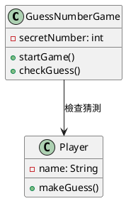
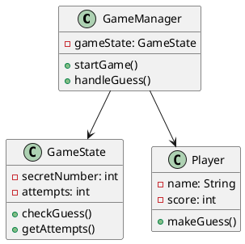
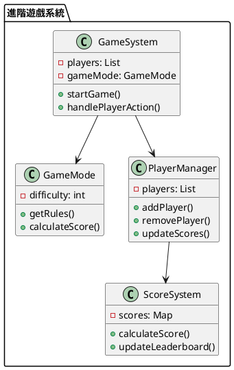

# 程式設計入門教學

## 初級（Beginner）層級

### 1. 概念說明
想像你在玩一個簡單的猜數字遊戲：
- 變數：用來儲存數字
- 條件：判斷猜的數字是太大還是太小
- 迴圈：讓玩家可以一直猜，直到猜對為止

初級學習者需要了解：
- 為什麼需要寫程式
- 程式的基本組成
- 如何讓程式動起來

### 2. PlantUML 圖解


### 3. 分段教學步驟

#### 步驟 1：基本遊戲設定
```java
public class GuessNumberGame {
    private int secretNumber;
    
    public GuessNumberGame() {
        // 產生一個 1-100 的隨機數字
        secretNumber = (int)(Math.random() * 100) + 1;
    }
    
    public void startGame() {
        System.out.println("歡迎來到猜數字遊戲！");
        System.out.println("我已經想好了一個 1-100 之間的數字");
    }
}
```

#### 步驟 2：遊戲邏輯
```java
public class GuessNumberGame {
    // ... 前面的程式碼 ...
    
    public void checkGuess(int guess) {
        if (guess < secretNumber) {
            System.out.println("太小了！再試一次");
        } else if (guess > secretNumber) {
            System.out.println("太大了！再試一次");
        } else {
            System.out.println("恭喜你猜對了！");
        }
    }
}
```

## 中級（Intermediate）層級

### 1. 概念說明
中級學習者需要理解：
- 如何把程式分成不同部分
- 如何讓程式更容易維護
- 如何處理不同的遊戲狀態
- 如何讓程式更有彈性

### 2. PlantUML 圖解


### 3. 分段教學步驟

#### 步驟 1：遊戲狀態管理
```java
public class GameState {
    private int secretNumber;
    private int attempts;
    
    public GameState() {
        secretNumber = (int)(Math.random() * 100) + 1;
        attempts = 0;
    }
    
    public String checkGuess(int guess) {
        attempts++;
        if (guess < secretNumber) {
            return "太小了！";
        } else if (guess > secretNumber) {
            return "太大了！";
        } else {
            return "恭喜你猜對了！總共猜了 " + attempts + " 次";
        }
    }
}
```

#### 步驟 2：玩家管理
```java
public class Player {
    private String name;
    private int score;
    
    public Player(String name) {
        this.name = name;
        this.score = 0;
    }
    
    public void updateScore(int points) {
        score += points;
    }
    
    public String getName() {
        return name;
    }
    
    public int getScore() {
        return score;
    }
}
```

## 高級（Advanced）層級

### 1. 概念說明
高級學習者需要掌握：
- 如何設計完整的遊戲系統
- 如何讓系統容易擴充
- 如何處理多人遊戲
- 如何讓遊戲更有趣

### 2. PlantUML 圖解


### 3. 分段教學步驟

#### 步驟 1：遊戲系統設計
```java
public class GameSystem {
    private List<Player> players;
    private GameMode gameMode;
    private ScoreSystem scoreSystem;
    
    public GameSystem() {
        players = new ArrayList<>();
        gameMode = new GameMode();
        scoreSystem = new ScoreSystem();
    }
    
    public void startGame() {
        // 初始化遊戲
        gameMode.initialize();
        scoreSystem.reset();
    }
    
    public void handlePlayerAction(Player player, String action) {
        // 處理玩家動作
        int score = gameMode.calculateScore(action);
        scoreSystem.updateScore(player, score);
    }
}
```

#### 步驟 2：分數系統
```java
public class ScoreSystem {
    private Map<Player, Integer> scores;
    private List<Player> leaderboard;
    
    public ScoreSystem() {
        scores = new HashMap<>();
        leaderboard = new ArrayList<>();
    }
    
    public void updateScore(Player player, int points) {
        int currentScore = scores.getOrDefault(player, 0);
        scores.put(player, currentScore + points);
        updateLeaderboard();
    }
    
    private void updateLeaderboard() {
        leaderboard.clear();
        leaderboard.addAll(scores.keySet());
        leaderboard.sort((p1, p2) -> 
            scores.get(p2) - scores.get(p1));
    }
}
```

### 4. 常見問題與解決方案

#### 問題表象
1. 程式問題：
   - 程式跑不動
   - 結果不對
   - 程式當掉

2. 遊戲問題：
   - 遊戲太難
   - 遊戲太簡單
   - 遊戲不好玩

3. 系統問題：
   - 遊戲變慢
   - 多人遊戲不同步
   - 分數計算錯誤

#### 避免方法
1. 程式設計：
   - 寫程式前先想清楚
   - 把程式分成小部分
   - 多測試程式

2. 遊戲設計：
   - 調整遊戲難度
   - 加入有趣的功能
   - 讓遊戲有挑戰性

3. 系統設計：
   - 使用好的資料結構
   - 優化程式碼
   - 加入錯誤處理

#### 處理方案
1. 程式問題：
   ```java
   public class GameSystem {
       private ErrorHandler errorHandler;
       
       public void handleError(String error) {
           errorHandler.logError(error);
           System.out.println("發生錯誤：" + error);
       }
   }
   ```

2. 遊戲問題：
   ```java
   public class GameMode {
       private int difficulty;
       
       public void adjustDifficulty() {
           // 根據玩家表現調整難度
           if (playerIsDoingWell()) {
               difficulty++;
           } else {
               difficulty--;
           }
       }
   }
   ```

3. 系統問題：
   ```java
   public class GameMonitor {
       private PerformanceTracker tracker;
       
       public void checkPerformance() {
           if (tracker.isGameSlow()) {
               System.out.println("遊戲變慢了，正在優化...");
               optimizeGame();
           }
       }
   }
   ```

### 5. 實戰案例

#### 案例一：多人猜數字遊戲
```java
public class MultiplayerGame {
    private List<Player> players;
    private GameState gameState;
    
    public void handlePlayerGuess(Player player, int guess) {
        String result = gameState.checkGuess(guess);
        System.out.println(player.getName() + "：" + result);
        
        if (result.contains("猜對了")) {
            endRound(player);
        }
    }
}
```

#### 案例二：計分版遊戲
```java
public class ScoreboardGame {
    private ScoreSystem scoreSystem;
    private List<Player> players;
    
    public void updateGame() {
        for (Player player : players) {
            int score = calculatePlayerScore(player);
            scoreSystem.updateScore(player, score);
        }
        
        displayLeaderboard();
    }
}
```

這個教學文件提供了從基礎到進階的程式設計學習路徑，每個層級都包含了相應的概念說明、圖解、教學步驟和實作範例。初級學習者可以從基本的猜數字遊戲開始，中級學習者可以學習如何組織程式碼，而高級學習者則可以掌握完整的遊戲系統設計。 