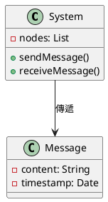
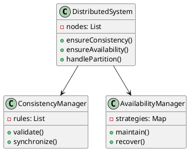
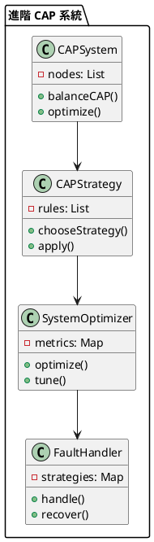

# CAP 理論教學

## 初級（Beginner）層級

### 1. 概念說明
CAP 理論就像是在學校裡，當我們需要傳遞訊息時：
- 一致性（Consistency）：確保所有同學收到的訊息都一樣
- 可用性（Availability）：確保訊息隨時都能被傳遞
- 分區容錯性（Partition tolerance）：即使有同學暫時不在，系統也能運作

初級學習者需要了解：
- 什麼是 CAP 理論
- 為什麼需要 CAP 理論
- 基本的系統特性

### 2. PlantUML 圖解


### 3. 分段教學步驟

#### 步驟 1：基本訊息傳遞
```java
public class SimpleMessageSystem {
    private List<Node> nodes;
    
    public SimpleMessageSystem() {
        nodes = new ArrayList<>();
    }
    
    public void addNode(Node node) {
        nodes.add(node);
        System.out.println("加入節點: " + node.getId());
    }
    
    public void sendMessage(String message) {
        for (Node node : nodes) {
            node.receiveMessage(message);
            System.out.println("傳送訊息到節點: " + node.getId());
        }
    }
}

class Node {
    private String id;
    private List<String> messages;
    
    public Node(String id) {
        this.id = id;
        this.messages = new ArrayList<>();
    }
    
    public void receiveMessage(String message) {
        messages.add(message);
        System.out.println("節點 " + id + " 收到訊息: " + message);
    }
    
    public String getId() {
        return id;
    }
}
```

#### 步驟 2：簡單的系統監控
```java
public class SystemMonitor {
    private SimpleMessageSystem system;
    
    public void checkSystem() {
        // 檢查系統是否正常運作
        boolean isWorking = system.isWorking();
        
        if (isWorking) {
            System.out.println("系統運作正常！");
        } else {
            System.out.println("系統需要檢查！");
        }
    }
}
```

## 中級（Intermediate）層級

### 1. 概念說明
中級學習者需要理解：
- 一致性（Consistency）的實現
- 可用性（Availability）的確保
- 分區容錯性（Partition tolerance）的處理
- 三者之間的取捨

### 2. PlantUML 圖解


### 3. 分段教學步驟

#### 步驟 1：一致性管理
```java
import java.util.*;

public class ConsistencyManager {
    private List<Node> nodes;
    private Map<String, String> data;
    
    public void ensureConsistency(String key, String value) {
        // 確保所有節點都有相同的資料
        for (Node node : nodes) {
            node.updateData(key, value);
        }
        
        // 等待所有節點確認
        waitForConfirmation();
    }
    
    private void waitForConfirmation() {
        boolean allConfirmed = false;
        while (!allConfirmed) {
            allConfirmed = true;
            for (Node node : nodes) {
                if (!node.isConfirmed()) {
                    allConfirmed = false;
                    break;
                }
            }
        }
    }
}

class Node {
    private String id;
    private Map<String, String> data;
    private boolean confirmed;
    
    public void updateData(String key, String value) {
        data.put(key, value);
        confirmed = true;
    }
    
    public boolean isConfirmed() {
        return confirmed;
    }
}
```

#### 步驟 2：可用性管理
```java
public class AvailabilityManager {
    private List<Node> nodes;
    private Map<String, AvailabilityStrategy> strategies;
    
    public void ensureAvailability() {
        for (Node node : nodes) {
            if (!node.isAvailable()) {
                // 使用備用策略
                AvailabilityStrategy strategy = strategies.get(node.getId());
                strategy.handleUnavailable(node);
            }
        }
    }
}

interface AvailabilityStrategy {
    void handleUnavailable(Node node);
}

class BackupStrategy implements AvailabilityStrategy {
    @Override
    public void handleUnavailable(Node node) {
        // 使用備用節點
        System.out.println("使用備用節點替代: " + node.getId());
    }
}
```

## 高級（Advanced）層級

### 1. 概念說明
高級學習者需要掌握：
- 分散式系統設計
- CAP 取捨策略
- 系統優化
- 容錯處理

### 2. PlantUML 圖解


### 3. 分段教學步驟

#### 步驟 1：CAP 平衡策略
```java
import java.util.*;

public class CAPSystem {
    private List<Node> nodes;
    private CAPStrategy strategy;
    
    public void balanceCAP(OperationType type) {
        // 根據操作類型選擇策略
        CAPStrategy selectedStrategy = strategy.chooseStrategy(type);
        
        // 應用策略
        selectedStrategy.apply(nodes);
    }
    
    public void optimize() {
        // 收集系統指標
        SystemMetrics metrics = collectMetrics();
        
        // 分析並優化
        analyzeAndOptimize(metrics);
    }
}

enum OperationType {
    READ, WRITE, UPDATE
}

class CAPStrategy {
    private Map<OperationType, Strategy> strategies;
    
    public Strategy chooseStrategy(OperationType type) {
        return strategies.get(type);
    }
}

interface Strategy {
    void apply(List<Node> nodes);
}
```

#### 步驟 2：系統優化
```java
public class SystemOptimizer {
    private CAPSystem system;
    private List<PerformanceMetric> metrics;
    
    public void optimize() {
        // 收集效能指標
        collectMetrics();
        
        // 分析系統效能
        analyzePerformance();
        
        // 調整系統參數
        tuneSystem();
    }
    
    private void analyzePerformance() {
        for (PerformanceMetric metric : metrics) {
            if (needsOptimization(metric)) {
                // 觸發優化
                triggerOptimization(metric);
            }
        }
    }
}

class PerformanceMetric {
    private String nodeId;
    private double consistencyScore;
    private double availabilityScore;
    private double partitionToleranceScore;
    private Date timestamp;
    
    public PerformanceMetric(String nodeId, double consistency, double availability, double partitionTolerance) {
        this.nodeId = nodeId;
        this.consistencyScore = consistency;
        this.availabilityScore = availability;
        this.partitionToleranceScore = partitionTolerance;
        this.timestamp = new Date();
    }
}
```

#### 步驟 3：容錯處理
```java
public class FaultHandler {
    private CAPSystem system;
    private List<FaultStrategy> strategies;
    
    public void handleFault(FaultType type) {
        // 分析故障類型
        FaultAnalysis analysis = analyzeFault(type);
        
        // 選擇處理策略
        FaultStrategy strategy = selectStrategy(analysis);
        
        // 執行處理
        strategy.execute(system);
    }
    
    private FaultStrategy selectStrategy(FaultAnalysis analysis) {
        return strategies.stream()
            .filter(s -> s.isApplicable(analysis))
            .max((s1, s2) -> Double.compare(
                s1.getScore(analysis),
                s2.getScore(analysis)
            ))
            .orElseThrow();
    }
}

interface FaultStrategy {
    boolean isApplicable(FaultAnalysis analysis);
    double getScore(FaultAnalysis analysis);
    void execute(CAPSystem system);
}
```

這個教學文件提供了從基礎到進階的 CAP 理論學習路徑，每個層級都包含了相應的概念說明、圖解、教學步驟和實作範例。初級學習者可以從基本的系統特性開始，中級學習者可以學習 CAP 的實現方式，而高級學習者則可以掌握 CAP 的平衡策略和系統優化等進階功能。 