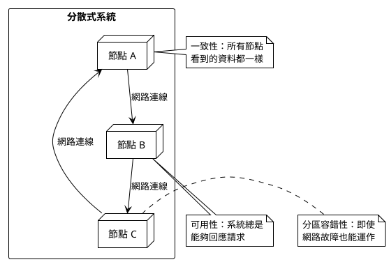
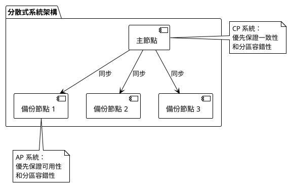
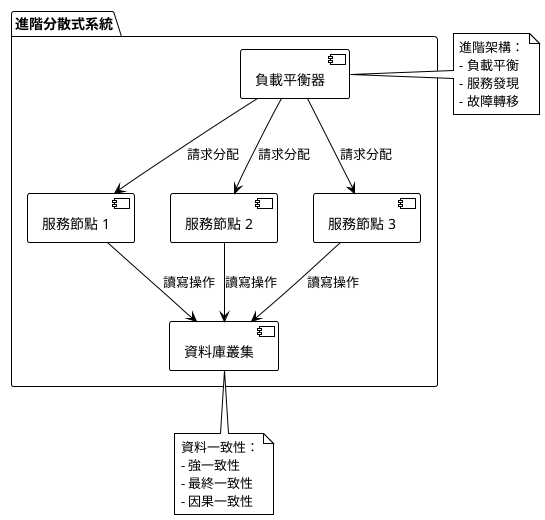

# CAP 定理教學指南

## 初級（Beginner）層級

### 概念說明
CAP 定理是分散式系統中的一個重要概念，它告訴我們在設計分散式系統時，我們必須在三個特性中做出取捨：
- **一致性（Consistency）**：所有節點看到的資料都是一樣的
- **可用性（Availability）**：系統總是能夠回應請求
- **分區容錯性（Partition Tolerance）**：即使網路發生故障，系統仍然可以運作

想像一下，這就像是一個班級群組：
- 一致性就像是確保每個同學都收到相同的訊息
- 可用性就像是確保任何時候都能發送訊息
- 分區容錯性就像是即使某些同學的網路斷線，群組仍然可以運作

### 圖解說明


### 教學步驟
1. **認識分散式系統**
   - 什麼是分散式系統？
   - 為什麼需要分散式系統？
   - 分散式系統的優點和缺點

2. **理解 CAP 三個特性**
   - 一致性：確保資料同步
   - 可用性：確保系統可用
   - 分區容錯性：處理網路問題

3. **實際案例說明**
   - 以即時通訊軟體為例
   - 以線上遊戲為例
   - 以社群媒體為例

### 實作範例
```java
// 簡單的分散式系統節點模擬
public class SimpleNode {
    private String data;
    private boolean isAvailable;
    
    public SimpleNode() {
        this.data = "";
        this.isAvailable = true;
    }
    
    // 模擬資料同步
    public void syncData(String newData) {
        if (isAvailable) {
            this.data = newData;
            System.out.println("資料已同步：" + newData);
        } else {
            System.out.println("節點目前無法使用");
        }
    }
    
    // 模擬網路故障
    public void setAvailable(boolean available) {
        this.isAvailable = available;
        System.out.println("節點狀態：" + (available ? "可用" : "不可用"));
    }
}
```

## 中級（Intermediate）層級

### 概念說明
在中級層級，我們需要更深入理解 CAP 定理的實際應用。我們將探討：
- 如何在不同場景下選擇適當的 CAP 組合
- 常見的分散式系統架構模式
- 資料同步策略和衝突解決方案

### 圖解說明


### 教學步驟
1. **CAP 組合分析**
   - CP 系統：優先保證一致性和分區容錯性
   - AP 系統：優先保證可用性和分區容錯性
   - CA 系統：優先保證一致性和可用性

2. **分散式系統設計模式**
   - 主從架構（Master-Slave）
   - 對等架構（Peer-to-Peer）
   - 分片架構（Sharding）

3. **資料同步策略**
   - 同步複製
   - 非同步複製
   - 最終一致性

### 實作範例
```java
// 主從架構的簡單實現
public class MasterNode {
    private List<SlaveNode> slaves;
    private String data;
    
    public MasterNode() {
        this.slaves = new ArrayList<>();
        this.data = "";
    }
    
    public void addSlave(SlaveNode slave) {
        slaves.add(slave);
    }
    
    public void updateData(String newData) {
        this.data = newData;
        // 同步到所有從節點
        for (SlaveNode slave : slaves) {
            slave.syncData(newData);
        }
    }
}

public class SlaveNode {
    private String data;
    private boolean isAvailable;
    
    public void syncData(String newData) {
        if (isAvailable) {
            this.data = newData;
            System.out.println("從節點資料已更新：" + newData);
        }
    }
}
```

## 高級（Advanced）層級

### 概念說明
在高級層級，我們將探討：
- 分散式系統的進階架構設計
- 複雜的資料一致性模型
- 分散式系統的效能優化
- 實際應用中的取捨策略

### 圖解說明


### 教學步驟
1. **進階架構設計**
   - 微服務架構
   - 服務網格（Service Mesh）
   - 事件驅動架構

2. **一致性模型**
   - 強一致性（Strong Consistency）
   - 最終一致性（Eventual Consistency）
   - 因果一致性（Causal Consistency）

3. **效能優化策略**
   - 快取策略
   - 資料分片
   - 非同步處理

### 實作範例
```java
// 使用 Spring Cloud 實現的分散式系統
@SpringBootApplication
@EnableDiscoveryClient
public class DistributedSystemApplication {
    public static void main(String[] args) {
        SpringApplication.run(DistributedSystemApplication.class, args);
    }
}

@Service
public class DistributedService {
    @Autowired
    private DiscoveryClient discoveryClient;
    
    @Autowired
    private RestTemplate restTemplate;
    
    @HystrixCommand(fallbackMethod = "fallbackMethod")
    public String processRequest(String data) {
        // 實現分散式處理邏輯
        return restTemplate.postForObject(
            "http://service-instance/process",
            data,
            String.class
        );
    }
    
    public String fallbackMethod(String data) {
        // 實現故障轉移邏輯
        return "服務暫時不可用，請稍後重試";
    }
}
```

## 總結
CAP 定理是分散式系統設計中的重要指導原則。通過這三個難度層級的學習，我們可以：
1. 理解基本的分散式系統概念
2. 掌握不同場景下的架構選擇
3. 設計可擴展且可靠的分散式系統

記住，在實際應用中，我們需要根據具體需求來選擇適當的 CAP 組合，並在系統設計中做出合理的取捨。
