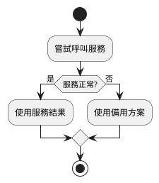
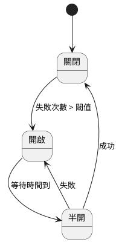
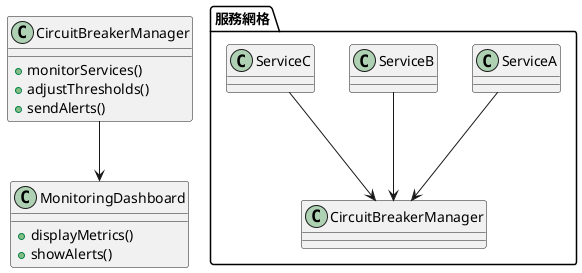

# 服務熔斷模式教學

## 初級（Beginner）層級

### 1. 概念說明
服務熔斷就像是一個電路開關，當電路過載時會自動斷電保護。在程式設計中，當某個服務（例如：查詢天氣、獲取新聞）出現問題時，我們需要一個機制來保護整個系統不會因為一個服務的故障而完全癱瘓。

可能遇到的問題：
- 服務回應太慢
- 服務完全無法回應
- 服務回傳錯誤訊息

如何避免：
- 設定超時時間
- 監控服務狀態
- 準備備用方案

遇到問題時：
- 先檢查服務是否真的故障
- 查看錯誤日誌
- 嘗試使用備用方案

### 2. PlantUML 圖解


### 3. 分段教學步驟

#### 步驟 1：基本服務呼叫
```java
public class WeatherService {
    public String getWeather(String city) {
        try {
            // 模擬服務呼叫
            Thread.sleep(1000); // 假設需要1秒鐘
            return "晴天";
        } catch (Exception e) {
            return "無法取得天氣資訊";
        }
    }
}
```

#### 步驟 2：加入超時控制
```java
public class WeatherService {
    public String getWeather(String city) {
        try {
            // 設定超時時間為2秒
            long startTime = System.currentTimeMillis();
            
            // 模擬服務呼叫
            Thread.sleep(1000);
            
            // 檢查是否超時
            if (System.currentTimeMillis() - startTime > 2000) {
                return "服務回應太慢，使用備用方案";
            }
            
            return "晴天";
        } catch (Exception e) {
            return "無法取得天氣資訊";
        }
    }
}
```

## 中級（Intermediate）層級

### 1. 概念說明
在中級層級，我們需要理解更完整的熔斷機制。就像家裡的保險絲，當電流過大時會熔斷，但過一段時間後可以重新開啟。在程式中，我們需要：
- 記錄服務的失敗次數
- 設定熔斷的條件
- 提供半開狀態的恢復機制
- 使用資料結構來管理狀態

可能遇到的問題：
- 服務間歇性故障
- 熔斷條件設定不當
- 恢復機制失效

如何避免：
- 合理設定熔斷閾值
- 監控服務健康狀態
- 實作漸進式恢復

遇到問題時：
- 分析服務故障模式
- 調整熔斷參數
- 檢查恢復機制

### 2. PlantUML 圖解


### 3. 分段教學步驟

#### 步驟 1：實作熔斷器類別
```java
public class CircuitBreaker {
    private int failureCount = 0;
    private int threshold = 3;
    private long lastFailureTime = 0;
    private static final long COOLDOWN_PERIOD = 5000; // 5秒冷卻時間
    
    public boolean isCircuitOpen() {
        if (failureCount >= threshold) {
            long currentTime = System.currentTimeMillis();
            if (currentTime - lastFailureTime > COOLDOWN_PERIOD) {
                // 進入半開狀態
                failureCount = 0;
                return false;
            }
            return true;
        }
        return false;
    }
    
    public void recordFailure() {
        failureCount++;
        lastFailureTime = System.currentTimeMillis();
    }
    
    public void recordSuccess() {
        failureCount = 0;
    }
}
```

#### 步驟 2：使用熔斷器
```java
public class WeatherService {
    private CircuitBreaker circuitBreaker = new CircuitBreaker();
    
    public String getWeather(String city) {
        if (circuitBreaker.isCircuitOpen()) {
            return "服務暫時不可用，請稍後再試";
        }
        
        try {
            // 模擬服務呼叫
            Thread.sleep(1000);
            circuitBreaker.recordSuccess();
            return "晴天";
        } catch (Exception e) {
            circuitBreaker.recordFailure();
            return "無法取得天氣資訊";
        }
    }
}
```

## 高級（Advanced）層級

### 1. 概念說明
在高級層級，我們需要考慮更複雜的場景：
- 分散式系統中的熔斷
- 多服務間的依賴關係
- 熔斷策略的動態調整
- 監控與告警機制

可能遇到的問題：
- 服務鏈路複雜
- 熔斷策略衝突
- 系統資源浪費

如何避免：
- 實作服務網格
- 使用集中式配置
- 建立監控儀表板

遇到問題時：
- 分析系統拓撲
- 調整熔斷策略
- 優化資源使用

### 2. PlantUML 圖解


### 3. 分段教學步驟

#### 步驟 1：實作熔斷管理器
```java
public class CircuitBreakerManager {
    private Map<String, CircuitBreaker> breakers = new HashMap<>();
    private MonitoringService monitoringService;
    
    public CircuitBreakerManager(MonitoringService monitoringService) {
        this.monitoringService = monitoringService;
    }
    
    public void registerService(String serviceName, CircuitBreaker breaker) {
        breakers.put(serviceName, breaker);
    }
    
    public void monitorServices() {
        breakers.forEach((serviceName, breaker) -> {
            if (breaker.isCircuitOpen()) {
                monitoringService.alert(serviceName + " 服務熔斷");
            }
        });
    }
    
    public void adjustThreshold(String serviceName, int newThreshold) {
        CircuitBreaker breaker = breakers.get(serviceName);
        if (breaker != null) {
            breaker.setThreshold(newThreshold);
        }
    }
}
```

#### 步驟 2：實作監控服務
```java
public class MonitoringService {
    private List<String> alerts = new ArrayList<>();
    
    public void alert(String message) {
        alerts.add(new Date() + ": " + message);
        // 可以實作發送郵件或簡訊通知
    }
    
    public List<String> getAlerts() {
        return alerts;
    }
}
```

#### 步驟 3：整合使用
```java
public class ServiceMesh {
    private CircuitBreakerManager manager;
    private MonitoringService monitoring;
    
    public ServiceMesh() {
        monitoring = new MonitoringService();
        manager = new CircuitBreakerManager(monitoring);
        
        // 註冊服務
        manager.registerService("weather", new CircuitBreaker());
        manager.registerService("news", new CircuitBreaker());
        
        // 啟動監控
        new Thread(() -> {
            while (true) {
                manager.monitorServices();
                try {
                    Thread.sleep(1000);
                } catch (InterruptedException e) {
                    break;
                }
            }
        }).start();
    }
}
```

這個教學文件從基礎到進階，逐步介紹了服務熔斷的概念和實作。初級學習者可以理解基本的超時控制，中級學習者可以實作完整的熔斷機制，而高級學習者則可以掌握分散式系統中的熔斷管理。每個層級都提供了相應的程式碼範例和圖解說明，幫助學習者更好地理解這個重要的系統設計模式。 