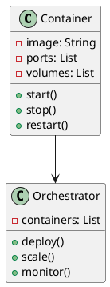
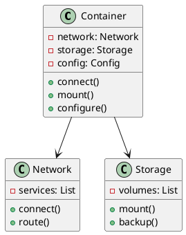
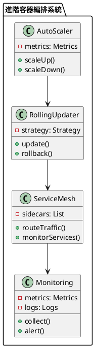

# 容器編排教學

## 初級（Beginner）層級

### 1. 概念說明
容器編排就像一個智能的物流系統：
- 容器就像標準化的貨櫃
- 編排系統就像物流調度中心
- 自動化部署和擴展就像智能調度
- 服務發現和負載均衡就像路線規劃

初級學習者需要了解：
- 什麼是容器
- 什麼是容器編排
- 基本的容器化概念

### 2. PlantUML 圖解


### 3. 分段教學步驟

#### 步驟 1：基本容器實現
```java
// Dockerfile 示例
FROM openjdk:11-jre-slim
WORKDIR /app
COPY target/*.jar app.jar
EXPOSE 8080
ENTRYPOINT ["java", "-jar", "app.jar"]

// Kubernetes 部署配置示例
apiVersion: apps/v1
kind: Deployment
metadata:
  name: user-service
spec:
  replicas: 3
  selector:
    matchLabels:
      app: user-service
  template:
    metadata:
      labels:
        app: user-service
    spec:
      containers:
      - name: user-service
        image: user-service:latest
        ports:
        - containerPort: 8080
```

## 中級（Intermediate）層級

### 1. 概念說明
中級學習者需要理解：
- 容器網絡
- 存儲管理
- 配置管理
- 健康檢查

### 2. PlantUML 圖解


### 3. 分段教學步驟

#### 步驟 1：容器網絡配置
```yaml
# Kubernetes 網絡配置示例
apiVersion: v1
kind: Service
metadata:
  name: user-service
spec:
  type: ClusterIP
  ports:
  - port: 80
    targetPort: 8080
  selector:
    app: user-service
```

#### 步驟 2：存儲管理
```yaml
# Kubernetes 存儲配置示例
apiVersion: v1
kind: PersistentVolumeClaim
metadata:
  name: user-data
spec:
  accessModes:
    - ReadWriteOnce
  resources:
    requests:
      storage: 1Gi
```

## 高級（Advanced）層級

### 1. 概念說明
高級學習者需要掌握：
- 自動擴展
- 滾動更新
- 服務網格集成
- 監控和日誌

### 2. PlantUML 圖解


### 3. 分段教學步驟

#### 步驟 1：自動擴展實現
```yaml
# Kubernetes HPA 配置示例
apiVersion: autoscaling/v2
kind: HorizontalPodAutoscaler
metadata:
  name: user-service
spec:
  scaleTargetRef:
    apiVersion: apps/v1
    kind: Deployment
    name: user-service
  minReplicas: 3
  maxReplicas: 10
  metrics:
  - type: Resource
    resource:
      name: cpu
      target:
        type: Utilization
        averageUtilization: 70
```

#### 步驟 2：滾動更新策略
```yaml
# Kubernetes 滾動更新配置示例
apiVersion: apps/v1
kind: Deployment
metadata:
  name: user-service
spec:
  strategy:
    type: RollingUpdate
    rollingUpdate:
      maxSurge: 1
      maxUnavailable: 0
  template:
    spec:
      containers:
      - name: user-service
        image: user-service:latest
        readinessProbe:
          httpGet:
            path: /health
            port: 8080
          initialDelaySeconds: 5
          periodSeconds: 10
```

### 4. 常見問題與解決方案

#### 問題表象
1. 容器問題：
   - 啟動失敗
   - 資源不足
   - 網絡問題

2. 編排問題：
   - 調度失敗
   - 擴展問題
   - 更新失敗

3. 存儲問題：
   - 數據丟失
   - 訪問權限
   - 性能問題

4. 監控問題：
   - 指標缺失
   - 日誌分散
   - 告警延遲

#### 避免方法
1. 容器問題防護：
   - 資源限制
   - 健康檢查
   - 網絡策略

2. 編排問題防護：
   - 調度策略
   - 擴展策略
   - 更新策略

3. 存儲問題防護：
   - 數據備份
   - 訪問控制
   - 性能優化

4. 監控問題防護：
   - 集中採集
   - 日誌聚合
   - 實時告警

#### 處理方案
1. 技術方案：
   ```java
   public class ContainerOrchestrator {
       private ContainerManager containerManager;
       private NetworkManager networkManager;
       private StorageManager storageManager;
       private MonitoringManager monitoringManager;
       
       public void handleOrchestrationIssue(OrchestrationIssue issue) {
           switch (issue.getType()) {
               case CONTAINER:
                   handleContainerIssue(issue);
                   break;
               case ORCHESTRATION:
                   handleOrchestrationIssue(issue);
                   break;
               case STORAGE:
                   handleStorageIssue(issue);
                   break;
               case MONITORING:
                   handleMonitoringIssue(issue);
                   break;
           }
       }
       
       private void handleContainerIssue(OrchestrationIssue issue) {
           // 檢查容器狀態
           ContainerStatus status = checkContainerStatus();
           // 重啟容器
           restartContainer(status);
           // 調整資源
           adjustResources(status);
       }
       
       private void handleOrchestrationIssue(OrchestrationIssue issue) {
           // 檢查調度狀態
           checkSchedulingStatus();
           // 調整調度策略
           adjustSchedulingStrategy();
           // 執行擴展
           executeScaling();
       }
       
       private void handleStorageIssue(OrchestrationIssue issue) {
           // 檢查存儲狀態
           checkStorageStatus();
           // 執行備份
           executeBackup();
           // 修復權限
           fixPermissions();
       }
       
       private void handleMonitoringIssue(OrchestrationIssue issue) {
           // 檢查監控系統
           checkMonitoringSystem();
           // 修復採集
           fixCollection();
           // 更新告警
           updateAlerts();
       }
   }
   ```

2. 監控方案：
   ```java
   public class ContainerMonitor {
       private MetricsCollector metricsCollector;
       private LogCollector logCollector;
       private AlertManager alertManager;
       
       public void monitorContainers() {
           ContainerMetrics metrics = metricsCollector.collectMetrics();
           ContainerLogs logs = logCollector.collectLogs();
           
           // 檢查容器健康狀態
           if (metrics.getContainerHealth() < HEALTH_THRESHOLD) {
               alertManager.alert("容器健康警告", metrics.getDetails());
           }
           
           // 檢查資源使用
           if (metrics.getResourceUsage() > RESOURCE_THRESHOLD) {
               alertManager.alert("資源使用警告", metrics.getDetails());
           }
           
           // 檢查錯誤日誌
           if (logs.hasErrors()) {
               alertManager.alert("錯誤日誌警告", logs.getErrorDetails());
           }
       }
   }
   ```

3. 最佳實踐：
   - 合理資源分配
   - 實現健康檢查
   - 配置網絡策略
   - 管理存儲卷
   - 設置監控告警
   - 實現自動擴展
   - 優化更新策略
   - 定期備份數據

### 5. 實戰案例

#### 案例一：電商系統容器編排
```yaml
# Kubernetes 部署配置
apiVersion: apps/v1
kind: Deployment
metadata:
  name: ecommerce
spec:
  replicas: 3
  selector:
    matchLabels:
      app: ecommerce
  template:
    metadata:
      labels:
        app: ecommerce
    spec:
      containers:
      - name: user-service
        image: user-service:latest
        resources:
          limits:
            cpu: "1"
            memory: "1Gi"
          requests:
            cpu: "500m"
            memory: "512Mi"
        readinessProbe:
          httpGet:
            path: /health
            port: 8080
        livenessProbe:
          httpGet:
            path: /health
            port: 8080
      - name: order-service
        image: order-service:latest
        resources:
          limits:
            cpu: "1"
            memory: "1Gi"
          requests:
            cpu: "500m"
            memory: "512Mi"
```

#### 案例二：社交媒體容器編排
```yaml
# Kubernetes 部署配置
apiVersion: apps/v1
kind: Deployment
metadata:
  name: social-media
spec:
  replicas: 5
  selector:
    matchLabels:
      app: social-media
  template:
    metadata:
      labels:
        app: social-media
    spec:
      containers:
      - name: post-service
        image: post-service:latest
        resources:
          limits:
            cpu: "2"
            memory: "2Gi"
          requests:
            cpu: "1"
            memory: "1Gi"
        volumeMounts:
        - name: post-data
          mountPath: /data
      volumes:
      - name: post-data
        persistentVolumeClaim:
          claimName: post-data
``` 