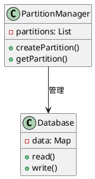
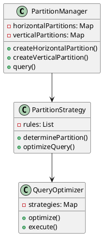
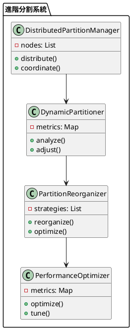

# 資料庫分割教學

## 初級（Beginner）層級

### 1. 概念說明
資料庫分割就像是在學校裡，當我們需要整理班級資料時：
- 把學生的資料按照班級分開存放（水平分割）
- 把學生的基本資料和成績分開存放（垂直分割）
- 讓資料更容易管理和查詢

初級學習者需要了解：
- 什麼是資料庫分割
- 為什麼需要資料庫分割
- 基本的資料分割方法

### 2. PlantUML 圖解


### 3. 分段教學步驟

#### 步驟 1：基本資料分割
```java
public class SimplePartitionManager {
    private Map<String, Database> partitions;
    
    public SimplePartitionManager() {
        partitions = new HashMap<>();
    }
    
    public void createPartition(String name) {
        partitions.put(name, new Database());
        System.out.println("建立分割區: " + name);
    }
    
    public void storeData(String partitionName, String key, String value) {
        Database partition = partitions.get(partitionName);
        if (partition != null) {
            partition.write(key, value);
        } else {
            System.out.println("分割區不存在: " + partitionName);
        }
    }
    
    public String getData(String partitionName, String key) {
        Database partition = partitions.get(partitionName);
        if (partition != null) {
            return partition.read(key);
        }
        return null;
    }
}

class Database {
    private Map<String, String> data;
    
    public Database() {
        data = new HashMap<>();
    }
    
    public void write(String key, String value) {
        data.put(key, value);
        System.out.println("寫入資料: " + key + " = " + value);
    }
    
    public String read(String key) {
        return data.get(key);
    }
}
```

#### 步驟 2：簡單的分割查詢
```java
public class PartitionQuery {
    private SimplePartitionManager manager;
    
    public List<String> searchAllPartitions(String key) {
        List<String> results = new ArrayList<>();
        
        for (String partitionName : manager.getPartitionNames()) {
            String value = manager.getData(partitionName, key);
            if (value != null) {
                results.add(value);
            }
        }
        
        return results;
    }
}
```

## 中級（Intermediate）層級

### 1. 概念說明
中級學習者需要理解：
- 水平分割（按行分割）
- 垂直分割（按列分割）
- 分割策略
- 分割查詢優化

### 2. PlantUML 圖解


### 3. 分段教學步驟

#### 步驟 1：進階分割策略
```java
import java.util.*;

public class AdvancedPartitionManager {
    private Map<String, List<Database>> horizontalPartitions;
    private Map<String, Map<String, Database>> verticalPartitions;
    private PartitionStrategy strategy;
    
    public void createHorizontalPartition(String tableName, String partitionKey) {
        List<Database> partitions = new ArrayList<>();
        horizontalPartitions.put(tableName, partitions);
        
        // 根據分割鍵建立分割區
        for (String key : getPartitionKeys(partitionKey)) {
            Database partition = new Database();
            partitions.add(partition);
        }
    }
    
    public void createVerticalPartition(String tableName, String[] columns) {
        Map<String, Database> partitions = new HashMap<>();
        verticalPartitions.put(tableName, partitions);
        
        // 為每個欄位建立分割區
        for (String column : columns) {
            Database partition = new Database();
            partitions.put(column, partition);
        }
    }
    
    public void storeData(String tableName, String partitionKey, Map<String, String> data) {
        // 決定水平分割區
        Database horizontalPartition = strategy.determineHorizontalPartition(
            tableName, partitionKey);
            
        // 決定垂直分割區
        Map<String, Database> verticalPartitions = this.verticalPartitions.get(tableName);
        
        // 儲存資料
        for (Map.Entry<String, String> entry : data.entrySet()) {
            String column = entry.getKey();
            String value = entry.getValue();
            
            Database verticalPartition = verticalPartitions.get(column);
            verticalPartition.write(partitionKey, value);
        }
    }
}

interface PartitionStrategy {
    Database determineHorizontalPartition(String tableName, String partitionKey);
    Map<String, Database> determineVerticalPartitions(String tableName, String[] columns);
}
```

#### 步驟 2：分割查詢優化
```java
public class PartitionQueryOptimizer {
    private AdvancedPartitionManager manager;
    private QueryStrategy strategy;
    
    public List<Map<String, String>> executeQuery(String tableName, Query query) {
        // 分析查詢條件
        QueryAnalysis analysis = analyzeQuery(query);
        
        // 決定需要查詢的分割區
        List<Database> partitions = determinePartitions(tableName, analysis);
        
        // 優化查詢執行
        return strategy.executeQuery(partitions, query);
    }
    
    private QueryAnalysis analyzeQuery(Query query) {
        // 分析查詢條件，決定最佳查詢策略
        return new QueryAnalysis(query);
    }
    
    private List<Database> determinePartitions(String tableName, QueryAnalysis analysis) {
        // 根據分析結果決定需要查詢的分割區
        return manager.getRelevantPartitions(tableName, analysis);
    }
}

interface QueryStrategy {
    List<Map<String, String>> executeQuery(List<Database> partitions, Query query);
}
```

## 高級（Advanced）層級

### 1. 概念說明
高級學習者需要掌握：
- 分散式分割
- 動態分割
- 分割重組
- 效能優化

### 2. PlantUML 圖解


### 3. 分段教學步驟

#### 步驟 1：分散式分割
```java
import java.util.*;

public class DistributedPartitionManager {
    private List<PartitionNode> nodes;
    private PartitionCoordinator coordinator;
    
    public void distributeData(String tableName, Map<String, String> data) {
        // 分析資料特徵
        DataAnalysis analysis = analyzeData(data);
        
        // 決定目標節點
        PartitionNode targetNode = determineTargetNode(analysis);
        
        // 分配資料
        targetNode.storeData(tableName, data);
        
        // 同步分割資訊
        syncPartitionInfo();
    }
    
    private DataAnalysis analyzeData(Map<String, String> data) {
        // 分析資料特徵，決定最佳分配策略
        return new DataAnalysis(data);
    }
    
    private PartitionNode determineTargetNode(DataAnalysis analysis) {
        // 根據分析結果選擇最適合的節點
        return coordinator.selectNode(analysis);
    }
}

class PartitionNode {
    private String id;
    private Map<String, Database> partitions;
    
    public void storeData(String tableName, Map<String, String> data) {
        Database partition = getOrCreatePartition(tableName);
        for (Map.Entry<String, String> entry : data.entrySet()) {
            partition.write(entry.getKey(), entry.getValue());
        }
    }
    
    private Database getOrCreatePartition(String tableName) {
        return partitions.computeIfAbsent(tableName, k -> new Database());
    }
}
```

#### 步驟 2：動態分割
```java
public class DynamicPartitioner {
    private DistributedPartitionManager manager;
    private List<PerformanceMetric> metrics;
    
    public void analyzeAndAdjust() {
        // 收集效能指標
        collectMetrics();
        
        // 分析分割效能
        analyzePartitioning();
        
        // 調整分割策略
        adjustPartitioning();
    }
    
    private void analyzePartitioning() {
        for (PerformanceMetric metric : metrics) {
            if (needsAdjustment(metric)) {
                // 觸發分割調整
                triggerAdjustment(metric);
            }
        }
    }
    
    private void adjustPartitioning() {
        // 根據分析結果調整分割策略
        // 實現調整邏輯
    }
}

class PerformanceMetric {
    private String nodeId;
    private double load;
    private double queryTime;
    private Date timestamp;
    
    public PerformanceMetric(String nodeId, double load, double queryTime) {
        this.nodeId = nodeId;
        this.load = load;
        this.queryTime = queryTime;
        this.timestamp = new Date();
    }
}
```

#### 步驟 3：分割重組
```java
public class PartitionReorganizer {
    private DistributedPartitionManager manager;
    private List<ReorganizationStrategy> strategies;
    
    public void reorganize() {
        // 分析當前分割狀態
        PartitionAnalysis analysis = analyzePartitions();
        
        // 選擇重組策略
        ReorganizationStrategy strategy = selectStrategy(analysis);
        
        // 執行重組
        strategy.execute(manager);
    }
    
    private PartitionAnalysis analyzePartitions() {
        // 分析分割區的使用情況和效能
        return new PartitionAnalysis(manager);
    }
    
    private ReorganizationStrategy selectStrategy(PartitionAnalysis analysis) {
        // 根據分析結果選擇最適合的重組策略
        return strategies.stream()
            .filter(s -> s.isApplicable(analysis))
            .max((s1, s2) -> Double.compare(
                s1.getScore(analysis),
                s2.getScore(analysis)
            ))
            .orElseThrow();
    }
}

interface ReorganizationStrategy {
    boolean isApplicable(PartitionAnalysis analysis);
    double getScore(PartitionAnalysis analysis);
    void execute(DistributedPartitionManager manager);
}
```

這個教學文件提供了從基礎到進階的資料庫分割學習路徑，每個層級都包含了相應的概念說明、圖解、教學步驟和實作範例。初級學習者可以從基本的資料分割開始，中級學習者可以學習水平分割和垂直分割，而高級學習者則可以掌握分散式分割和動態分割等進階功能。 