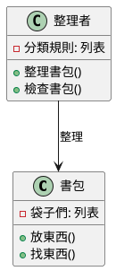
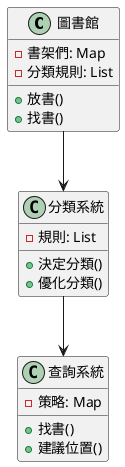
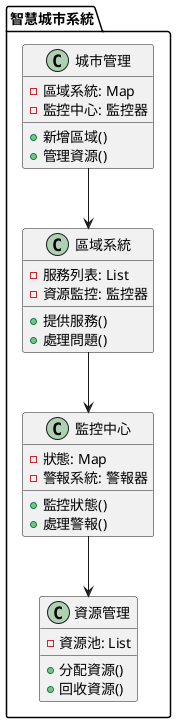

# 資料庫分割教學

## 初級（Beginner）層級

### 1. 概念說明
資料庫分割就像是在整理你的書包：
- 把不同科目的課本分開放（水平分割）
- 把課本和筆記本分開放（垂直分割）
- 這樣找東西會更快更方便

初級學習者需要了解：
- 什麼是資料庫分割（就像整理書包一樣）
- 為什麼要分割（讓資料更容易找到）
- 基本的分割方法（按科目分、按類型分）

### 2. 使用原因
為什麼要分割資料庫呢？就像為什麼要整理書包：
1. 找東西更快：
   - 不用翻遍整個書包
   - 直接去對應的袋子找
   - 節省時間

2. 書包不會太重：
   - 可以分開背
   - 不會一次拿太多
   - 比較好管理

3. 東西不會亂：
   - 每樣東西都有固定位置
   - 容易檢查有沒有少東西
   - 整理起來很簡單

### 3. 可能遇到的問題
就像整理書包時可能遇到的問題：
1. 找東西還是很慢：
   - 分錯袋子
   - 袋子太多
   - 忘記放哪裡

2. 東西不見了：
   - 放錯袋子
   - 袋子破了
   - 忘記帶

3. 整理很麻煩：
   - 不知道怎麼分
   - 分太多袋子
   - 忘記整理

### 4. 如何避免問題
就像整理書包的小技巧：
1. 好好規劃：
   - 想清楚要怎麼分
   - 不要分太多袋子
   - 貼上標籤

2. 定期檢查：
   - 每天整理
   - 檢查有沒有少東西
   - 保持整齊

3. 簡單就好：
   - 不要分太細
   - 容易記住
   - 方便使用

### 5. 遇到問題怎麼辦
就像書包出問題時的解決方法：
1. 找東西很慢：
   - 重新整理
   - 貼上標籤
   - 減少袋子

2. 東西不見：
   - 檢查每個袋子
   - 修補破洞
   - 寫清單

3. 整理很麻煩：
   - 簡化分類
   - 固定位置
   - 每天整理

### 6. PlantUML 圖解


### 7. 分段教學步驟

#### 步驟 1：基本資料分割
```java
// 這是一個簡單的書包整理程式
public class 書包整理 {
    private Map<String, 袋子> 袋子們;
    
    public 書包整理() {
        袋子們 = new HashMap<>();
    }
    
    public void 新增袋子(String 科目) {
        袋子們.put(科目, new 袋子());
        System.out.println("新增了" + 科目 + "的袋子");
    }
    
    public void 放東西(String 科目, String 東西名稱, String 東西) {
        袋子 目標袋子 = 袋子們.get(科目);
        if (目標袋子 != null) {
            目標袋子.放進去(東西名稱, 東西);
            System.out.println("把" + 東西名稱 + "放進" + 科目 + "的袋子");
        } else {
            System.out.println("找不到" + 科目 + "的袋子");
        }
    }
    
    public String 找東西(String 科目, String 東西名稱) {
        袋子 目標袋子 = 袋子們.get(科目);
        if (目標袋子 != null) {
            return 目標袋子.拿出來(東西名稱);
        }
        return null;
    }
}

class 袋子 {
    private Map<String, String> 東西們;
    
    public 袋子() {
        東西們 = new HashMap<>();
    }
    
    public void 放進去(String 名稱, String 東西) {
        東西們.put(名稱, 東西);
    }
    
    public String 拿出來(String 名稱) {
        return 東西們.get(名稱);
    }
}
```

#### 步驟 2：簡單的查詢
```java
public class 書包查詢 {
    private 書包整理 我的書包;
    
    public List<String> 找所有東西(String 東西名稱) {
        List<String> 結果 = new ArrayList<>();
        
        for (String 科目 : 我的書包.所有科目()) {
            String 東西 = 我的書包.找東西(科目, 東西名稱);
            if (東西 != null) {
                結果.add(東西);
            }
        }
        
        return 結果;
    }
}
```

## 中級（Intermediate）層級

### 1. 概念說明
中級學習者需要理解更進階的資料分割概念，就像管理一個圖書館：
- 按書的類型分類（水平分割）
- 按書的內容分類（垂直分割）
- 建立分類規則
- 優化找書方法

### 2. 使用原因
為什麼圖書館要這樣分類呢？
1. 找書更快：
   - 知道書的類型就能找到區域
   - 知道書的內容就能找到書架
   - 不用找遍整個圖書館

2. 管理更方便：
   - 新書容易歸類
   - 書架不會太滿
   - 容易整理

3. 借書更順暢：
   - 讀者容易找到書
   - 館員容易管理
   - 系統運作順暢

### 3. 可能遇到的問題
圖書館分類時可能遇到的問題：
1. 分類太複雜：
   - 類別太多
   - 規則太難
   - 容易搞混

2. 找書還是很慢：
   - 分類不準確
   - 書放錯位置
   - 規則不清楚

3. 管理很困難：
   - 新書難分類
   - 書架太滿
   - 整理很花時間

### 4. 如何避免問題
圖書館管理的小技巧：
1. 分類要清楚：
   - 規則要簡單
   - 類別要明確
   - 標示要清楚

2. 定期整理：
   - 檢查分類
   - 調整位置
   - 更新規則

3. 保持彈性：
   - 預留空間
   - 容易調整
   - 方便擴充

### 5. 遇到問題怎麼辦
圖書館出問題時的解決方法：
1. 分類太複雜：
   - 簡化規則
   - 減少類別
   - 重新分類

2. 找書很慢：
   - 檢查分類
   - 調整位置
   - 更新標示

3. 管理困難：
   - 增加空間
   - 優化流程
   - 加強訓練

### 6. PlantUML 圖解


### 7. 分段教學步驟

#### 步驟 1：進階分類系統
```java
// 這是一個圖書館分類系統
public class 圖書館管理 {
    private Map<String, List<書架>> 水平分類;
    private Map<String, Map<String, 書架>> 垂直分類;
    private 分類規則 規則;
    
    public void 新增水平分類(String 類型) {
        List<書架> 書架們 = new ArrayList<>();
        水平分類.put(類型, 書架們);
        System.out.println("新增了" + 類型 + "的書架區");
    }
    
    public void 新增垂直分類(String 類型, String[] 子類別) {
        Map<String, 書架> 子書架們 = new HashMap<>();
        垂直分類.put(類型, 子書架們);
        
        for (String 子類 : 子類別) {
            書架 新書架 = new 書架();
            子書架們.put(子類, 新書架);
            System.out.println("在" + 類型 + "下新增了" + 子類 + "的書架");
        }
    }
    
    public void 放書(String 類型, String 子類, 書 新書) {
        // 決定水平分類
        書架 水平書架 = 規則.決定水平書架(類型, 新書);
        
        // 決定垂直分類
        Map<String, 書架> 垂直書架們 = 垂直分類.get(類型);
        書架 垂直書架 = 垂直書架們.get(子類);
        
        // 放書
        水平書架.放書(新書);
        垂直書架.放書(新書);
        System.out.println("把" + 新書.書名 + "放進" + 類型 + "的" + 子類 + "書架");
    }
}

class 書架 {
    private List<書> 書本們;
    
    public 書架() {
        書本們 = new ArrayList<>();
    }
    
    public void 放書(書 新書) {
        書本們.add(新書);
    }
    
    public 書 找書(String 書名) {
        for (書 一本書 : 書本們) {
            if (一本書.書名.equals(書名)) {
                return 一本書;
            }
        }
        return null;
    }
}

class 書 {
    String 書名;
    String 作者;
    String 類型;
    
    public 書(String 書名, String 作者, String 類型) {
        this.書名 = 書名;
        this.作者 = 作者;
        this.類型 = 類型;
    }
}
```

#### 步驟 2：優化查詢系統
```java
public class 圖書館查詢 {
    private 圖書館管理 圖書館;
    private 查詢策略 策略;
    
    public List<書> 找書(查詢條件 條件) {
        // 分析查詢條件
        查詢分析 分析 = 分析查詢(條件);
        
        // 決定要查詢的書架
        List<書架> 書架們 = 決定書架(分析);
        
        // 執行查詢
        return 策略.執行查詢(書架們, 條件);
    }
    
    private 查詢分析 分析查詢(查詢條件 條件) {
        // 分析查詢條件，決定最佳查詢策略
        return new 查詢分析(條件);
    }
    
    private List<書架> 決定書架(查詢分析 分析) {
        // 根據分析結果決定要查詢的書架
        return 圖書館.取得相關書架(分析);
    }
}

interface 查詢策略 {
    List<書> 執行查詢(List<書架> 書架們, 查詢條件 條件);
}
```

## 高級（Advanced）層級

### 1. 概念說明
高級學習者需要理解更複雜的系統設計，就像設計一個智慧城市：
- 不同區域的資料要互相溝通（分散式系統）
- 城市可以隨人口增長而擴張（動態擴展）
- 各個系統要能互相合作（系統整合）
- 要能處理突發狀況（錯誤處理）

### 2. 使用原因
為什麼要這樣設計智慧城市呢？
1. 城市要能成長：
   - 人口增加時能擴充
   - 新區域能快速整合
   - 系統能自動調整

2. 系統要穩定：
   - 一個區域出問題不影響其他區域
   - 能自動修復問題
   - 系統運作順暢

3. 管理要方便：
   - 系統能自我監控
   - 問題能快速發現
   - 容易維護更新

### 3. 可能遇到的問題
智慧城市可能遇到的問題：
1. 系統太複雜：
   - 區域太多難管理
   - 系統互相干擾
   - 問題難找出原因

2. 效能不好：
   - 系統反應慢
   - 資源使用過多
   - 處理能力不足

3. 維護困難：
   - 系統太多難管理
   - 更新容易出錯
   - 問題難解決

### 4. 如何避免問題
智慧城市的設計原則：
1. 系統要模組化：
   - 功能要分開
   - 介面要清楚
   - 容易替換

2. 要有備援：
   - 重要系統要備份
   - 預防系統故障
   - 能快速恢復

3. 要能監控：
   - 即時發現問題
   - 自動回報狀態
   - 預測可能問題

### 5. 遇到問題怎麼辦
智慧城市的問題處理：
1. 系統出問題：
   - 自動切換備援
   - 隔離問題區域
   - 自動修復

2. 效能不足：
   - 自動增加資源
   - 調整負載平衡
   - 優化系統

3. 維護問題：
   - 自動化維護
   - 智能監控
   - 預測性維護

### 6. PlantUML 圖解


### 7. 分段教學步驟

#### 步驟 1：設計分散式系統
```java
// 這是一個智慧城市管理系統
public class 智慧城市管理 {
    private Map<String, 區域系統> 區域們;
    private 監控中心 監控;
    private 資源管理 資源;
    
    public void 新增區域(String 區域名稱) {
        // 建立新區域
        區域系統 新區域 = new 區域系統(區域名稱);
        區域們.put(區域名稱, 新區域);
        
        // 設定監控
        監控.新增監控目標(新區域);
        
        // 分配資源
        資源.分配初始資源(新區域);
        
        System.out.println("新增了" + 區域名稱 + "區域");
    }
    
    public void 處理區域事件(String 區域名稱, 事件 新事件) {
        區域系統 目標區域 = 區域們.get(區域名稱);
        if (目標區域 != null) {
            // 處理事件
            目標區域.處理事件(新事件);
            
            // 更新監控
            監控.記錄事件(區域名稱, 新事件);
            
            // 檢查資源
            if (需要更多資源(目標區域)) {
                資源.增加資源(目標區域);
            }
        }
    }
    
    private boolean 需要更多資源(區域系統 區域) {
        return 區域.資源使用率() > 0.8; // 如果使用率超過80%就需要更多資源
    }
}

class 區域系統 {
    private String 名稱;
    private List<服務> 服務列表;
    private 監控器 資源監控;
    
    public void 處理事件(事件 新事件) {
        // 根據事件類型選擇處理方式
        switch (新事件.類型) {
            case 一般:
                正常處理(新事件);
                break;
            case 緊急:
                緊急處理(新事件);
                break;
            case 系統:
                系統維護(新事件);
                break;
        }
    }
    
    public double 資源使用率() {
        return 資源監控.取得使用率();
    }
}

class 監控中心 {
    private Map<String, 系統狀態> 狀態表;
    private 警報系統 警報;
    
    public void 監控狀態() {
        for (Map.Entry<String, 系統狀態> 項目 : 狀態表.entrySet()) {
            if (項目.getValue().有問題()) {
                警報.發出警報(項目.getKey());
            }
        }
    }
}

class 資源管理 {
    private List<資源> 資源池;
    
    public void 分配資源(區域系統 區域) {
        // 檢查可用資源
        資源 可用資源 = 尋找可用資源();
        if (可用資源 != null) {
            // 分配資源
            區域.新增資源(可用資源);
        } else {
            // 建立新資源
            資源 新資源 = 建立新資源();
            區域.新增資源(新資源);
        }
    }
}
```

#### 步驟 2：實現自動化管理
```java
public class 自動化管理 {
    private 智慧城市管理 城市;
    private 預測系統 預測;
    
    public void 自動管理() {
        // 收集系統狀態
        系統狀態 目前狀態 = 收集狀態();
        
        // 預測未來需求
        需求預測 預測結果 = 預測.預測需求(目前狀態);
        
        // 自動調整資源
        if (預測結果.需要擴充()) {
            城市.擴充資源(預測結果.建議資源());
        }
        
        // 檢查系統健康
        if (!目前狀態.健康()) {
            城市.啟動自我修復();
        }
    }
    
    private 系統狀態 收集狀態() {
        return new 系統狀態(
            城市.取得資源使用率(),
            城市.取得系統負載(),
            城市.取得錯誤率()
        );
    }
}

interface 預測系統 {
    需求預測 預測需求(系統狀態 狀態);
}
```

這個高級部分使用智慧城市作為比喻，幫助學生理解複雜的系統架構概念。通過具體的例子和清晰的程式碼，讓學生更容易理解分散式系統、動態擴展、錯誤處理等進階概念。每個概念都配合實際的程式碼示例，幫助學生將理論轉化為實踐。 