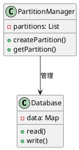
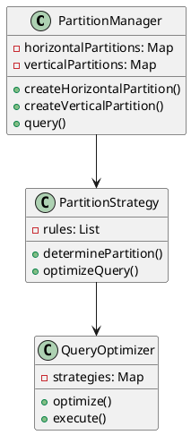
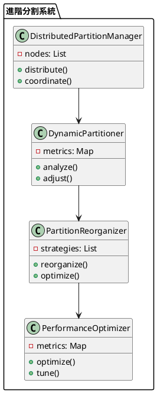

# 資料庫分割教學

## 初級（Beginner）層級

### 1. 概念說明
資料庫分割就像是在學校裡，當我們需要整理班級資料時：
- 把學生的資料按照班級分開存放（水平分割）
- 把學生的基本資料和成績分開存放（垂直分割）
- 讓資料更容易管理和查詢

初級學習者需要了解：
- 什麼是資料庫分割
- 為什麼需要資料庫分割
- 基本的資料分割方法

### 2. 使用原因
資料庫分割的主要使用原因包括：
1. 效能優化：
   - 提高查詢效能
   - 減少資料掃描範圍
   - 優化資料存取

2. 可擴展性：
   - 支援資料增長
   - 分散資料負載
   - 提升系統容量

3. 管理便利：
   - 簡化資料維護
   - 提高資料可用性
   - 優化備份策略

### 3. 問題表象
常見的問題表象包括：
1. 效能問題：
   - 查詢效能下降
   - 資料存取延遲
   - 系統負載過高

2. 資料問題：
   - 資料不一致
   - 分割不均
   - 資料完整性受損

3. 管理問題：
   - 分割策略不當
   - 維護困難
   - 監控不足

### 4. 避免方法
避免問題的方法包括：
1. 系統設計：
   - 選擇適當的分割策略
   - 設計有效的分割機制
   - 建立監控系統

2. 資料管理：
   - 定期檢查分割狀態
   - 優化分割策略
   - 確保資料一致性

3. 效能優化：
   - 合理設置分割大小
   - 優化查詢策略
   - 實現負載均衡

### 5. 問題處理
遇到問題時的處理方法：
1. 效能問題處理：
   - 檢查分割策略
   - 優化查詢語句
   - 調整分割大小

2. 資料問題處理：
   - 檢查資料一致性
   - 修復分割問題
   - 重新平衡資料

3. 管理問題處理：
   - 調整分割策略
   - 改進維護機制
   - 加強監控系統

### 6. PlantUML 圖解


### 7. 分段教學步驟

#### 步驟 1：基本資料分割
```java
public class SimplePartitionManager {
    private Map<String, Database> partitions;
    private PartitionMonitor monitor;
    private PartitionValidator validator;
    
    public SimplePartitionManager() {
        partitions = new HashMap<>();
        monitor = new PartitionMonitor();
        validator = new PartitionValidator();
    }
    
    public void createPartition(String name) {
        if (validator.validatePartitionName(name)) {
            partitions.put(name, new Database());
            monitor.recordPartitionOperation("create", name);
            System.out.println("建立分割區: " + name);
        } else {
            System.out.println("無效的分割區名稱: " + name);
        }
    }
    
    public void storeData(String partitionName, String key, String value) {
        Database partition = partitions.get(partitionName);
        if (partition != null) {
            if (validator.validateData(key, value)) {
                partition.write(key, value);
                monitor.recordDataOperation("write", partitionName, key);
            } else {
                System.out.println("無效的資料: " + key + " = " + value);
            }
        } else {
            System.out.println("分割區不存在: " + partitionName);
        }
    }
    
    public String getData(String partitionName, String key) {
        Database partition = partitions.get(partitionName);
        if (partition != null) {
            String value = partition.read(key);
            monitor.recordDataOperation("read", partitionName, key);
            return value;
        }
        return null;
    }
    
    public void checkPartitionHealth() {
        monitor.checkPartitionHealth(partitions);
    }
}

class PartitionMonitor {
    private Map<String, Integer> operationCounts;
    private Map<String, Long> lastCheckTimes;
    
    public PartitionMonitor() {
        operationCounts = new HashMap<>();
        lastCheckTimes = new HashMap<>();
    }
    
    public void recordPartitionOperation(String operation, String partitionName) {
        String metric = operation + ":" + partitionName;
        operationCounts.merge(metric, 1, Integer::sum);
    }
    
    public void recordDataOperation(String operation, String partitionName, String key) {
        String metric = operation + ":" + partitionName + ":" + key;
        operationCounts.merge(metric, 1, Integer::sum);
    }
    
    public void checkPartitionHealth(Map<String, Database> partitions) {
        long currentTime = System.currentTimeMillis();
        for (Map.Entry<String, Database> entry : partitions.entrySet()) {
            String partitionName = entry.getKey();
            Long lastCheck = lastCheckTimes.get(partitionName);
            
            if (lastCheck == null || currentTime - lastCheck > 3600000) { // 1小時檢查一次
                // 檢查分割區健康狀態
                System.out.println("檢查分割區健康狀態: " + partitionName);
                lastCheckTimes.put(partitionName, currentTime);
            }
        }
    }
}

class PartitionValidator {
    public boolean validatePartitionName(String name) {
        return name != null && !name.isEmpty() && name.matches("[a-zA-Z0-9_]+");
    }
    
    public boolean validateData(String key, String value) {
        return key != null && !key.isEmpty() && value != null;
    }
}
```

#### 步驟 2：簡單的分割查詢
```java
public class PartitionQuery {
    private SimplePartitionManager manager;
    
    public List<String> searchAllPartitions(String key) {
        List<String> results = new ArrayList<>();
        
        for (String partitionName : manager.getPartitionNames()) {
            String value = manager.getData(partitionName, key);
            if (value != null) {
                results.add(value);
            }
        }
        
        return results;
    }
}
```

## 中級（Intermediate）層級

### 1. 概念說明
中級學習者需要理解：
- 水平分割（按行分割）
- 垂直分割（按列分割）
- 分割策略
- 分割查詢優化

### 2. PlantUML 圖解


### 3. 分段教學步驟

#### 步驟 1：進階分割策略
```java
import java.util.*;

public class AdvancedPartitionManager {
    private Map<String, List<Database>> horizontalPartitions;
    private Map<String, Map<String, Database>> verticalPartitions;
    private PartitionStrategy strategy;
    private PartitionMonitor monitor;
    private PartitionValidator validator;
    
    public void createHorizontalPartition(String tableName, String partitionKey) {
        if (validator.validateTableName(tableName) && validator.validatePartitionKey(partitionKey)) {
            List<Database> partitions = new ArrayList<>();
            horizontalPartitions.put(tableName, partitions);
            
            // 根據分割鍵建立分割區
            for (String key : getPartitionKeys(partitionKey)) {
                Database partition = new Database();
                partitions.add(partition);
                monitor.recordPartitionOperation("create", tableName + ":" + key);
            }
        }
    }
    
    public void createVerticalPartition(String tableName, String[] columns) {
        if (validator.validateTableName(tableName) && validator.validateColumns(columns)) {
            Map<String, Database> partitions = new HashMap<>();
            verticalPartitions.put(tableName, partitions);
            
            // 為每個欄位建立分割區
            for (String column : columns) {
                Database partition = new Database();
                partitions.put(column, partition);
                monitor.recordPartitionOperation("create", tableName + ":" + column);
            }
        }
    }
    
    public void storeData(String tableName, String partitionKey, Map<String, String> data) {
        if (validator.validateData(tableName, partitionKey, data)) {
            // 決定水平分割區
            Database horizontalPartition = strategy.determineHorizontalPartition(
                tableName, partitionKey);
                
            // 決定垂直分割區
            Map<String, Database> verticalPartitions = this.verticalPartitions.get(tableName);
            
            // 儲存資料
            for (Map.Entry<String, String> entry : data.entrySet()) {
                String column = entry.getKey();
                String value = entry.getValue();
                
                Database verticalPartition = verticalPartitions.get(column);
                verticalPartition.write(partitionKey, value);
                monitor.recordDataOperation("write", tableName, partitionKey + ":" + column);
            }
        }
    }
    
    public void checkPartitionHealth() {
        monitor.checkPartitionHealth(horizontalPartitions, verticalPartitions);
    }
}

interface PartitionStrategy {
    Database determineHorizontalPartition(String tableName, String partitionKey);
    Map<String, Database> determineVerticalPartitions(String tableName, String[] columns);
}
```

#### 步驟 2：分割查詢優化
```java
public class PartitionQueryOptimizer {
    private AdvancedPartitionManager manager;
    private QueryStrategy strategy;
    
    public List<Map<String, String>> executeQuery(String tableName, Query query) {
        // 分析查詢條件
        QueryAnalysis analysis = analyzeQuery(query);
        
        // 決定需要查詢的分割區
        List<Database> partitions = determinePartitions(tableName, analysis);
        
        // 優化查詢執行
        return strategy.executeQuery(partitions, query);
    }
    
    private QueryAnalysis analyzeQuery(Query query) {
        // 分析查詢條件，決定最佳查詢策略
        return new QueryAnalysis(query);
    }
    
    private List<Database> determinePartitions(String tableName, QueryAnalysis analysis) {
        // 根據分析結果決定需要查詢的分割區
        return manager.getRelevantPartitions(tableName, analysis);
    }
}

interface QueryStrategy {
    List<Map<String, String>> executeQuery(List<Database> partitions, Query query);
}
```

## 高級（Advanced）層級

### 1. 概念說明
高級學習者需要掌握：
- 分散式分割
- 動態分割
- 分割重組
- 效能優化

### 2. PlantUML 圖解


### 3. 分段教學步驟

#### 步驟 1：分散式分割
```java
import java.util.*;

public class DistributedPartitionManager {
    private List<PartitionNode> nodes;
    private PartitionCoordinator coordinator;
    
    public void distributeData(String tableName, Map<String, String> data) {
        // 分析資料特徵
        DataAnalysis analysis = analyzeData(data);
        
        // 決定目標節點
        PartitionNode targetNode = determineTargetNode(analysis);
        
        // 分配資料
        targetNode.storeData(tableName, data);
        
        // 同步分割資訊
        syncPartitionInfo();
    }
    
    private DataAnalysis analyzeData(Map<String, String> data) {
        // 分析資料特徵，決定最佳分配策略
        return new DataAnalysis(data);
    }
    
    private PartitionNode determineTargetNode(DataAnalysis analysis) {
        // 根據分析結果選擇最適合的節點
        return coordinator.selectNode(analysis);
    }
}

class PartitionNode {
    private String id;
    private Map<String, Database> partitions;
    
    public void storeData(String tableName, Map<String, String> data) {
        Database partition = getOrCreatePartition(tableName);
        for (Map.Entry<String, String> entry : data.entrySet()) {
            partition.write(entry.getKey(), entry.getValue());
        }
    }
    
    private Database getOrCreatePartition(String tableName) {
        return partitions.computeIfAbsent(tableName, k -> new Database());
    }
}
```

#### 步驟 2：動態分割
```java
public class DynamicPartitioner {
    private DistributedPartitionManager manager;
    private List<PerformanceMetric> metrics;
    
    public void analyzeAndAdjust() {
        // 收集效能指標
        collectMetrics();
        
        // 分析分割效能
        analyzePartitioning();
        
        // 調整分割策略
        adjustPartitioning();
    }
    
    private void analyzePartitioning() {
        for (PerformanceMetric metric : metrics) {
            if (needsAdjustment(metric)) {
                // 觸發分割調整
                triggerAdjustment(metric);
            }
        }
    }
    
    private void adjustPartitioning() {
        // 根據分析結果調整分割策略
        // 實現調整邏輯
    }
}

class PerformanceMetric {
    private String nodeId;
    private double load;
    private double queryTime;
    private Date timestamp;
    
    public PerformanceMetric(String nodeId, double load, double queryTime) {
        this.nodeId = nodeId;
        this.load = load;
        this.queryTime = queryTime;
        this.timestamp = new Date();
    }
}
```

#### 步驟 3：分割重組
```java
public class PartitionReorganizer {
    private DistributedPartitionManager manager;
    private List<ReorganizationStrategy> strategies;
    
    public void reorganize() {
        // 分析當前分割狀態
        PartitionAnalysis analysis = analyzePartitions();
        
        // 選擇重組策略
        ReorganizationStrategy strategy = selectStrategy(analysis);
        
        // 執行重組
        strategy.execute(manager);
    }
    
    private PartitionAnalysis analyzePartitions() {
        // 分析分割區的使用情況和效能
        return new PartitionAnalysis(manager);
    }
    
    private ReorganizationStrategy selectStrategy(PartitionAnalysis analysis) {
        // 根據分析結果選擇最適合的重組策略
        return strategies.stream()
            .filter(s -> s.isApplicable(analysis))
            .max((s1, s2) -> Double.compare(
                s1.getScore(analysis),
                s2.getScore(analysis)
            ))
            .orElseThrow();
    }
}

interface ReorganizationStrategy {
    boolean isApplicable(PartitionAnalysis analysis);
    double getScore(PartitionAnalysis analysis);
    void execute(DistributedPartitionManager manager);
}
```

### 4. 常見問題與解決方案

#### 問題表象
1. 效能問題：
   - 查詢效能下降
   - 資料存取延遲
   - 系統負載過高

2. 資料問題：
   - 資料不一致
   - 分割不均
   - 資料完整性受損

3. 管理問題：
   - 分割策略不當
   - 維護困難
   - 監控不足

#### 避免方法
1. 系統設計：
   - 選擇適當的分割策略
   - 設計有效的分割機制
   - 建立監控系統

2. 資料管理：
   - 定期檢查分割狀態
   - 優化分割策略
   - 確保資料一致性

3. 效能優化：
   - 合理設置分割大小
   - 優化查詢策略
   - 實現負載均衡

#### 處理方案
1. 技術方案：
   ```java
   public class PartitionManager {
       private PartitionStrategy strategy;
       private PartitionMonitor monitor;
       private PartitionValidator validator;
       private PartitionOptimizer optimizer;
       
       public void handlePartitionIssue(PartitionIssue issue) {
           switch (issue.getType()) {
               case PERFORMANCE:
                   handlePerformanceIssue(issue);
                   break;
               case DATA:
                   handleDataIssue(issue);
                   break;
               case MANAGEMENT:
                   handleManagementIssue(issue);
                   break;
           }
       }
       
       private void handlePerformanceIssue(PartitionIssue issue) {
           // 檢查分割策略
           checkPartitionStrategy();
           // 優化查詢語句
           optimizeQueries();
           // 調整分割大小
           adjustPartitionSize();
       }
       
       private void handleDataIssue(PartitionIssue issue) {
           // 檢查資料一致性
           checkDataConsistency();
           // 修復分割問題
           repairPartitions();
           // 重新平衡資料
           rebalanceData();
       }
       
       private void handleManagementIssue(PartitionIssue issue) {
           // 檢查分割策略
           checkPartitionStrategy();
           // 改進維護機制
           improveMaintenance();
           // 加強監控系統
           enhanceMonitoring();
       }
   }
   ```

2. 監控方案：
   ```java
   public class PartitionMonitor {
       private MetricsCollector metricsCollector;
       private PartitionChecker partitionChecker;
       private AlertManager alertManager;
       
       public void monitorPartitions() {
           PartitionMetrics metrics = metricsCollector.collectMetrics();
           PartitionStatus status = partitionChecker.checkPartitions();
           
           // 檢查查詢效能
           if (metrics.getQueryPerformance() < PERFORMANCE_THRESHOLD) {
               alertManager.alert("查詢效能警告", metrics.getDetails());
           }
           
           // 檢查資料一致性
           if (!status.isConsistent()) {
               alertManager.alert("資料不一致警告", status.getDetails());
           }
           
           // 檢查分割狀態
           if (metrics.getPartitionStatus() != PartitionStatus.HEALTHY) {
               alertManager.alert("分割狀態警告", metrics.getDetails());
           }
       }
   }
   ```

3. 最佳實踐：
   - 實現自動化分割
   - 配置智能監控
   - 建立告警機制
   - 優化分割策略
   - 定期效能優化
   - 保持系統文檔
   - 建立應急流程

### 5. 實戰案例

#### 案例一：電商系統資料分割
```java
public class ECommercePartition {
    private PartitionManager partitionManager;
    private PartitionMonitor monitor;
    
    public void createProductPartition(String category) {
        // 建立水平分割
        partitionManager.createHorizontalPartition("products", category);
        
        // 建立垂直分割
        String[] columns = {"id", "name", "price", "stock", "description"};
        partitionManager.createVerticalPartition("products", columns);
        
        // 記錄操作
        monitor.recordPartitionOperation("create", "products:" + category);
    }
    
    public void storeProduct(Product product) {
        // 儲存產品資料
        Map<String, String> data = new HashMap<>();
        data.put("id", product.getId());
        data.put("name", product.getName());
        data.put("price", String.valueOf(product.getPrice()));
        data.put("stock", String.valueOf(product.getStock()));
        data.put("description", product.getDescription());
        
        partitionManager.storeData("products", product.getCategory(), data);
    }
}
```

#### 案例二：社交媒體資料分割
```java
public class SocialMediaPartition {
    private PartitionManager partitionManager;
    private PartitionMonitor monitor;
    
    public void createUserPartition(String region) {
        // 建立水平分割
        partitionManager.createHorizontalPartition("users", region);
        
        // 建立垂直分割
        String[] columns = {"id", "username", "email", "profile", "settings"};
        partitionManager.createVerticalPartition("users", columns);
        
        // 記錄操作
        monitor.recordPartitionOperation("create", "users:" + region);
    }
    
    public void storeUser(User user) {
        // 儲存用戶資料
        Map<String, String> data = new HashMap<>();
        data.put("id", user.getId());
        data.put("username", user.getUsername());
        data.put("email", user.getEmail());
        data.put("profile", user.getProfile());
        data.put("settings", user.getSettings());
        
        partitionManager.storeData("users", user.getRegion(), data);
    }
}
```

這個教學文件提供了從基礎到進階的資料庫分割學習路徑，每個層級都包含了相應的概念說明、圖解、教學步驟和實作範例。初級學習者可以從基本的資料分割開始，中級學習者可以學習水平分割和垂直分割，而高級學習者則可以掌握分散式分割和動態分割等進階功能。 