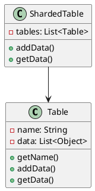
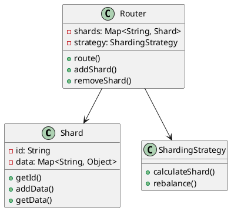
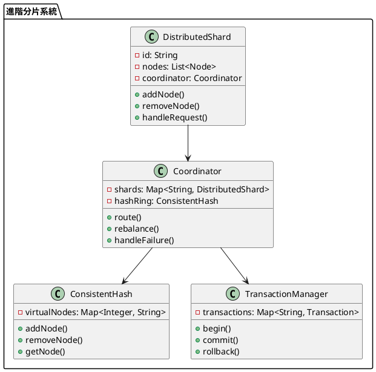

# 資料庫分庫分表教學

## 初級（Beginner）層級

### 1. 概念說明
分庫分表就像學校的圖書館：
- 如果所有書都放在一個書架上，找書會很慢
- 我們可以把書分成不同類別，放在不同區域
- 這樣找書會更快，管理也更容易

初級學習者需要了解：
- 什麼是分庫分表
- 為什麼需要分庫分表
- 基本的資料分割概念

### 2. PlantUML 圖解


### 3. 分段教學步驟

#### 步驟 1：基本分表實現
```java
public class SimpleTable {
    private String name;
    private List<Object> data;
    
    public SimpleTable(String name) {
        this.name = name;
        this.data = new ArrayList<>();
    }
    
    public String getName() {
        return name;
    }
    
    public void addData(Object item) {
        data.add(item);
        System.out.println("存入表 " + name + "：" + item);
    }
    
    public List<Object> getData() {
        return data;
    }
}

public class SimpleShardedTable {
    private List<SimpleTable> tables;
    
    public SimpleShardedTable(int numTables) {
        tables = new ArrayList<>();
        for (int i = 0; i < numTables; i++) {
            tables.add(new SimpleTable("表" + (i + 1)));
        }
    }
    
    public void addData(Object item) {
        // 簡單的取模分表
        int tableIndex = item.hashCode() % tables.size();
        tables.get(tableIndex).addData(item);
    }
    
    public List<Object> getData() {
        List<Object> allData = new ArrayList<>();
        for (SimpleTable table : tables) {
            allData.addAll(table.getData());
        }
        return allData;
    }
}
```

## 中級（Intermediate）層級

### 1. 概念說明
中級學習者需要理解：
- 分片策略
- 路由機制
- 資料平衡
- 查詢優化

### 2. PlantUML 圖解


### 3. 分段教學步驟

#### 步驟 1：分片實現
```java
public class Shard {
    private String id;
    private Map<String, Object> data;
    
    public Shard(String id) {
        this.id = id;
        this.data = new HashMap<>();
    }
    
    public String getId() {
        return id;
    }
    
    public void addData(String key, Object value) {
        data.put(key, value);
        System.out.println("存入分片 " + id + "：" + key);
    }
    
    public Object getData(String key) {
        return data.get(key);
    }
    
    public Map<String, Object> getAllData() {
        return data;
    }
}
```

#### 步驟 2：路由策略
```java
public interface ShardingStrategy {
    String calculateShard(String key);
    void rebalance();
}

public class HashShardingStrategy implements ShardingStrategy {
    private Map<String, Shard> shards;
    
    public HashShardingStrategy(Map<String, Shard> shards) {
        this.shards = shards;
    }
    
    @Override
    public String calculateShard(String key) {
        int hash = key.hashCode();
        int shardIndex = Math.abs(hash % shards.size());
        return "分片" + (shardIndex + 1);
    }
    
    @Override
    public void rebalance() {
        // 實現資料重新平衡邏輯
        System.out.println("重新平衡分片資料");
    }
}

public class Router {
    private Map<String, Shard> shards;
    private ShardingStrategy strategy;
    
    public Router(ShardingStrategy strategy) {
        this.shards = new HashMap<>();
        this.strategy = strategy;
    }
    
    public void addShard(Shard shard) {
        shards.put(shard.getId(), shard);
    }
    
    public void route(String key, Object value) {
        String shardId = strategy.calculateShard(key);
        Shard shard = shards.get(shardId);
        if (shard != null) {
            shard.addData(key, value);
        }
    }
    
    public Object get(String key) {
        String shardId = strategy.calculateShard(key);
        Shard shard = shards.get(shardId);
        return shard != null ? shard.getData(key) : null;
    }
}
```

## 高級（Advanced）層級

### 1. 概念說明
高級學習者需要掌握：
- 分散式分片
- 一致性雜湊
- 跨分片事務
- 自動擴展策略

### 2. PlantUML 圖解


### 3. 分段教學步驟

#### 步驟 1：一致性雜湊
```java
public class ConsistentHash {
    private TreeMap<Integer, String> virtualNodes;
    private int virtualNodeCount;
    
    public ConsistentHash(int virtualNodeCount) {
        this.virtualNodes = new TreeMap<>();
        this.virtualNodeCount = virtualNodeCount;
    }
    
    public void addNode(String nodeId) {
        for (int i = 0; i < virtualNodeCount; i++) {
            String virtualNodeId = nodeId + "#" + i;
            int hash = virtualNodeId.hashCode();
            virtualNodes.put(hash, nodeId);
        }
    }
    
    public void removeNode(String nodeId) {
        for (int i = 0; i < virtualNodeCount; i++) {
            String virtualNodeId = nodeId + "#" + i;
            int hash = virtualNodeId.hashCode();
            virtualNodes.remove(hash);
        }
    }
    
    public String getNode(String key) {
        if (virtualNodes.isEmpty()) {
            return null;
        }
        int hash = key.hashCode();
        Integer nodeHash = virtualNodes.ceilingKey(hash);
        if (nodeHash == null) {
            nodeHash = virtualNodes.firstKey();
        }
        return virtualNodes.get(nodeHash);
    }
}
```

#### 步驟 2：分散式分片
```java
public class DistributedShard {
    private String id;
    private List<Node> nodes;
    private Coordinator coordinator;
    
    public DistributedShard(String id, Coordinator coordinator) {
        this.id = id;
        this.nodes = new ArrayList<>();
        this.coordinator = coordinator;
    }
    
    public void addNode(Node node) {
        nodes.add(node);
        System.out.println("添加節點到分片 " + id);
    }
    
    public void removeNode(Node node) {
        nodes.remove(node);
        System.out.println("從分片 " + id + " 移除節點");
    }
    
    public void handleRequest(String key, Object value) {
        // 在節點間分配請求
        int nodeIndex = key.hashCode() % nodes.size();
        Node node = nodes.get(nodeIndex);
        node.process(key, value);
    }
}

public class Coordinator {
    private Map<String, DistributedShard> shards;
    private ConsistentHash hashRing;
    private TransactionManager transactionManager;
    
    public Coordinator() {
        this.shards = new HashMap<>();
        this.hashRing = new ConsistentHash(3);
        this.transactionManager = new TransactionManager();
    }
    
    public void addShard(DistributedShard shard) {
        shards.put(shard.getId(), shard);
        hashRing.addNode(shard.getId());
    }
    
    public void route(String key, Object value) {
        String shardId = hashRing.getNode(key);
        DistributedShard shard = shards.get(shardId);
        if (shard != null) {
            shard.handleRequest(key, value);
        }
    }
    
    public void handleFailure(String shardId) {
        // 處理分片故障
        System.out.println("處理分片 " + shardId + " 的故障");
        hashRing.removeNode(shardId);
        // 重新分配資料
        rebalance();
    }
    
    private void rebalance() {
        // 實現資料重新平衡邏輯
        System.out.println("重新平衡所有分片");
    }
}
```

#### 步驟 3：跨分片事務
```java
public class DistributedTransaction {
    private String id;
    private Map<String, List<Operation>> operations;
    private boolean committed;
    
    public DistributedTransaction(String id) {
        this.id = id;
        this.operations = new HashMap<>();
        this.committed = false;
    }
    
    public void addOperation(String shardId, Operation operation) {
        operations.computeIfAbsent(shardId, k -> new ArrayList<>())
                 .add(operation);
    }
    
    public void commit() {
        // 兩階段提交
        boolean canCommit = prepare();
        if (canCommit) {
            doCommit();
            committed = true;
        } else {
            rollback();
        }
    }
    
    private boolean prepare() {
        // 準備階段
        for (Map.Entry<String, List<Operation>> entry : operations.entrySet()) {
            for (Operation op : entry.getValue()) {
                if (!op.prepare()) {
                    return false;
                }
            }
        }
        return true;
    }
    
    private void doCommit() {
        // 提交階段
        for (Map.Entry<String, List<Operation>> entry : operations.entrySet()) {
            for (Operation op : entry.getValue()) {
                op.commit();
            }
        }
    }
    
    private void rollback() {
        // 回滾操作
        for (Map.Entry<String, List<Operation>> entry : operations.entrySet()) {
            for (Operation op : entry.getValue()) {
                op.rollback();
            }
        }
    }
}

public interface Operation {
    boolean prepare();
    void commit();
    void rollback();
}
```

#### 步驟 4：動態縮容擴容
```java
public class DynamicScalingManager {
    private Coordinator coordinator;
    private ConsistentHash hashRing;
    private Map<String, ShardMetrics> metrics;
    private int scaleUpThreshold;
    private int scaleDownThreshold;
    
    public DynamicScalingManager(Coordinator coordinator, ConsistentHash hashRing) {
        this.coordinator = coordinator;
        this.hashRing = hashRing;
        this.metrics = new HashMap<>();
        this.scaleUpThreshold = 80; // 使用率超過80%時擴容
        this.scaleDownThreshold = 20; // 使用率低於20%時縮容
    }
    
    public void monitorShard(String shardId) {
        ShardMetrics shardMetrics = metrics.computeIfAbsent(shardId, k -> new ShardMetrics());
        shardMetrics.update();
        
        if (shardMetrics.getUsage() > scaleUpThreshold) {
            scaleUp(shardId);
        } else if (shardMetrics.getUsage() < scaleDownThreshold) {
            scaleDown(shardId);
        }
    }
    
    private void scaleUp(String shardId) {
        System.out.println("開始擴容分片：" + shardId);
        
        // 1. 創建新的分片
        String newShardId = "分片" + (hashRing.getNodeCount() + 1);
        DistributedShard newShard = new DistributedShard(newShardId, coordinator);
        
        // 2. 將新分片添加到系統中
        coordinator.addShard(newShard);
        hashRing.addNode(newShardId);
        
        // 3. 重新平衡資料
        rebalanceData(shardId, newShardId);
        
        System.out.println("擴容完成，新增分片：" + newShardId);
    }
    
    private void scaleDown(String shardId) {
        System.out.println("開始縮容分片：" + shardId);
        
        // 1. 選擇目標分片（選擇使用率最低的分片）
        String targetShardId = findTargetShardForScaleDown(shardId);
        
        // 2. 遷移資料
        migrateData(shardId, targetShardId);
        
        // 3. 移除分片
        coordinator.removeShard(shardId);
        hashRing.removeNode(shardId);
        
        System.out.println("縮容完成，移除分片：" + shardId);
    }
    
    private void rebalanceData(String sourceShardId, String targetShardId) {
        // 實現資料重新平衡邏輯
        System.out.println("重新平衡資料從 " + sourceShardId + " 到 " + targetShardId);
        // 這裡可以實現具體的資料遷移邏輯
    }
    
    private void migrateData(String sourceShardId, String targetShardId) {
        // 實現資料遷移邏輯
        System.out.println("遷移資料從 " + sourceShardId + " 到 " + targetShardId);
        // 這裡可以實現具體的資料遷移邏輯
    }
    
    private String findTargetShardForScaleDown(String sourceShardId) {
        // 找到使用率最低的分片
        return metrics.entrySet().stream()
            .filter(entry -> !entry.getKey().equals(sourceShardId))
            .min(Comparator.comparingDouble(entry -> entry.getValue().getUsage()))
            .map(Map.Entry::getKey)
            .orElse(null);
    }
}

public class ShardMetrics {
    private long totalRequests;
    private long totalDataSize;
    private long capacity;
    private long lastUpdateTime;
    
    public ShardMetrics() {
        this.totalRequests = 0;
        this.totalDataSize = 0;
        this.capacity = 1000; // 假設容量為1000
        this.lastUpdateTime = System.currentTimeMillis();
    }
    
    public void update() {
        // 更新指標
        totalRequests++;
        // 這裡可以添加更多的指標收集邏輯
        lastUpdateTime = System.currentTimeMillis();
    }
    
    public double getUsage() {
        // 計算使用率
        return (double) totalDataSize / capacity * 100;
    }
    
    public long getTotalRequests() {
        return totalRequests;
    }
    
    public long getTotalDataSize() {
        return totalDataSize;
    }
}

// 在 Coordinator 類中添加以下方法
public class Coordinator {
    // ... existing code ...
    
    private DynamicScalingManager scalingManager;
    
    public Coordinator() {
        // ... existing code ...
        this.scalingManager = new DynamicScalingManager(this, hashRing);
    }
    
    public void monitorAndScale() {
        // 監控所有分片並進行必要的擴縮容
        for (String shardId : shards.keySet()) {
            scalingManager.monitorShard(shardId);
        }
    }
    
    public void removeShard(String shardId) {
        shards.remove(shardId);
        System.out.println("移除分片：" + shardId);
    }
}
```

這個擴展提供了動態縮容擴容的分庫分表方案，主要包含以下功能：

1. 動態監控：通過 `ShardMetrics` 類收集分片的使用情況
2. 自動擴容：當分片使用率超過閾值時，自動創建新的分片並重新平衡資料
3. 自動縮容：當分片使用率低於閾值時，自動將資料遷移到其他分片並移除該分片
4. 平滑遷移：在擴縮容過程中確保資料的完整性和一致性

使用這個方案，系統可以根據實際負載情況自動調整分片數量，實現更好的資源利用和性能優化。

這個教學文件提供了從基礎到進階的資料庫分庫分表學習路徑，每個層級都包含了相應的概念說明、圖解、教學步驟和實作範例。初級學習者可以從基本的資料分割開始，中級學習者可以學習分片策略和路由機制，而高級學習者則可以掌握分散式分片、一致性雜湊和跨分片事務等進階功能。 

#### 步驟 5：分庫分表ID處理方案
```java
public class ShardedIdGenerator {
    // 時間戳佔用41位
    private static final long TIMESTAMP_BITS = 41L;
    // 分片ID佔用10位
    private static final long SHARD_ID_BITS = 10L;
    // 序列號佔用12位
    private static final long SEQUENCE_BITS = 12L;
    
    // 最大分片ID
    private static final long MAX_SHARD_ID = ~(-1L << SHARD_ID_BITS);
    // 最大序列號
    private static final long MAX_SEQUENCE = ~(-1L << SEQUENCE_BITS);
    
    // 時間戳左移位數
    private static final long TIMESTAMP_SHIFT = SHARD_ID_BITS + SEQUENCE_BITS;
    // 分片ID左移位數
    private static final long SHARD_ID_SHIFT = SEQUENCE_BITS;
    
    private long shardId;
    private long sequence = 0L;
    private long lastTimestamp = -1L;
    
    public ShardedIdGenerator(long shardId) {
        if (shardId > MAX_SHARD_ID || shardId < 0) {
            throw new IllegalArgumentException("分片ID超出範圍");
        }
        this.shardId = shardId;
    }
    
    public synchronized long nextId() {
        long timestamp = System.currentTimeMillis();
        
        // 如果當前時間小於上次生成ID的時間，說明系統時間被回撥
        if (timestamp < lastTimestamp) {
            throw new RuntimeException("系統時間被回撥");
        }
        
        // 如果是同一毫秒內生成的ID
        if (timestamp == lastTimestamp) {
            sequence = (sequence + 1) & MAX_SEQUENCE;
            // 序列號用完，等待下一毫秒
            if (sequence == 0) {
                timestamp = waitNextMillis(timestamp);
            }
        } else {
            sequence = 0L;
        }
        
        lastTimestamp = timestamp;
        
        // 組裝ID
        return ((timestamp << TIMESTAMP_SHIFT) |
                (shardId << SHARD_ID_SHIFT) |
                sequence);
    }
    
    private long waitNextMillis(long lastTimestamp) {
        long timestamp = System.currentTimeMillis();
        while (timestamp <= lastTimestamp) {
            timestamp = System.currentTimeMillis();
        }
        return timestamp;
    }
    
    // 解析ID的各個部分
    public static IdInfo parseId(long id) {
        long timestamp = (id >>> TIMESTAMP_SHIFT);
        long shardId = (id >>> SHARD_ID_SHIFT) & MAX_SHARD_ID;
        long sequence = id & MAX_SEQUENCE;
        
        return new IdInfo(timestamp, shardId, sequence);
    }
}

public class IdInfo {
    private final long timestamp;
    private final long shardId;
    private final long sequence;
    
    public IdInfo(long timestamp, long shardId, long sequence) {
        this.timestamp = timestamp;
        this.shardId = shardId;
        this.sequence = sequence;
    }
    
    public long getTimestamp() {
        return timestamp;
    }
    
    public long getShardId() {
        return shardId;
    }
    
    public long getSequence() {
        return sequence;
    }
    
    @Override
    public String toString() {
        return String.format("時間戳: %d, 分片ID: %d, 序列號: %d", 
            timestamp, shardId, sequence);
    }
}

// 在 DistributedShard 類中添加ID生成器
public class DistributedShard {
    // ... existing code ...
    
    private ShardedIdGenerator idGenerator;
    
    public DistributedShard(String id, Coordinator coordinator) {
        // ... existing code ...
        this.idGenerator = new ShardedIdGenerator(Long.parseLong(id.substring(2))); // 假設id格式為"分片1"
    }
    
    public long generateId() {
        return idGenerator.nextId();
    }
    
    public IdInfo parseId(long id) {
        return ShardedIdGenerator.parseId(id);
    }
}

// 在 Coordinator 類中添加ID相關方法
public class Coordinator {
    // ... existing code ...
    
    public long generateId(String shardId) {
        DistributedShard shard = shards.get(shardId);
        if (shard != null) {
            return shard.generateId();
        }
        throw new IllegalArgumentException("無效的分片ID：" + shardId);
    }
    
    public IdInfo parseId(long id) {
        return ShardedIdGenerator.parseId(id);
    }
}
```

這個擴展提供了分庫分表後的ID處理方案，主要包含以下功能：

1. 分散式ID生成：
   - 使用雪花演算法（Snowflake）的變種
   - 包含時間戳、分片ID和序列號
   - 支援高併發場景
   - 避免ID衝突

2. ID結構：
   - 時間戳（41位）：精確到毫秒
   - 分片ID（10位）：支援最多1024個分片
   - 序列號（12位）：每毫秒最多生成4096個ID

3. 特點：
   - 全域性唯一
   - 趨勢遞增
   - 包含分片資訊
   - 可解析
   - 高效能

4. 使用方式：
   - 每個分片有自己的ID生成器
   - 生成的ID包含分片資訊
   - 可以根據ID快速定位到對應分片
   - 支援ID解析，方便除錯和監控

這個方案可以確保在分庫分表環境下，ID的生成是高效且可靠的，同時也方便資料的路由和查詢。

這個擴展提供了分庫分表後的ID處理方案，主要包含以下功能：

1. 分散式ID生成：
   - 使用雪花演算法（Snowflake）的變種
   - 包含時間戳、分片ID和序列號
   - 支援高併發場景
   - 避免ID衝突

2. ID結構：
   - 時間戳（41位）：精確到毫秒
   - 分片ID（10位）：支援最多1024個分片
   - 序列號（12位）：每毫秒最多生成4096個ID

3. 特點：
   - 全域性唯一
   - 趨勢遞增
   - 包含分片資訊
   - 可解析
   - 高效能

4. 使用方式：
   - 每個分片有自己的ID生成器
   - 生成的ID包含分片資訊
   - 可以根據ID快速定位到對應分片
   - 支援ID解析，方便除錯和監控

這個方案可以確保在分庫分表環境下，ID的生成是高效且可靠的，同時也方便資料的路由和查詢。 