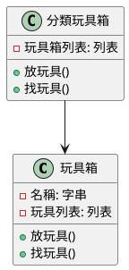
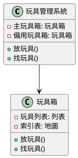
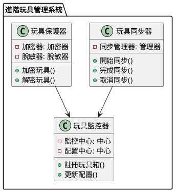

# 資料庫分庫分表教學

## 初級（Beginner）層級

### 1. 概念說明
想像你有一個超大的玩具箱，裡面裝滿了各種玩具。如果所有玩具都混在一起，找玩具會很困難。這時候我們可以：
- 把玩具分類：例如積木放一箱、娃娃放一箱
- 在每個箱子外面貼標籤
- 這樣找玩具就會快很多

初級學習者需要了解：
- 為什麼要分庫分表（就像為什麼要分類玩具）
- 基本的資料分類概念
- 簡單的資料查詢方式

### 2. PlantUML 圖解


### 3. 分段教學步驟

#### 步驟 1：基本分表實現
```yaml
# 設定檔
資料庫:
  玩具箱1:
    位置: localhost:3306/玩具箱1
    使用者: root
    密碼: root
  玩具箱2:
    位置: localhost:3306/玩具箱2
    使用者: root
    密碼: root
```

```java
// 玩具類別
public class 玩具 {
    private Long 玩具編號;
    private String 玩具名稱;
    private String 玩具類型;
}

// 玩具管理員
public class 玩具管理員 {
    public void 放玩具(玩具 新玩具) {
        // 根據玩具編號決定放哪個玩具箱
        String 玩具箱 = "玩具箱" + (新玩具.玩具編號 % 2);
        // 把玩具放到對應的玩具箱
    }
    
    public 玩具 找玩具(Long 玩具編號) {
        // 根據玩具編號找到對應的玩具箱
        String 玩具箱 = "玩具箱" + (玩具編號 % 2);
        // 從玩具箱中找出玩具
    }
}
```

## 中級（Intermediate）層級

### 1. 概念說明
中級學習者需要理解：
- 玩具箱的組織方式（資料庫結構）
- 如何快速找到玩具（索引）
- 玩具的分類規則（分片策略）
- 多個玩具箱的管理（讀寫分離）

### 2. PlantUML 圖解


### 3. 分段教學步驟

#### 步驟 1：玩具分類規則
```yaml
# 設定檔
玩具管理:
  玩具箱:
    - 玩具箱1
    - 玩具箱2
  分類規則:
    根據: 玩具編號
    規則: 玩具箱$->{玩具編號 % 2}
```

#### 步驟 2：讀寫分離設定
```yaml
# 設定檔
玩具箱:
  主要玩具箱:
    位置: localhost:3306/主要玩具箱
  備用玩具箱:
    - localhost:3306/備用玩具箱1
    - localhost:3306/備用玩具箱2
```

## 高級（Advanced）層級

### 1. 概念說明
高級學習者需要掌握：
- 多個玩具箱的同步（分佈式事務）
- 玩具的安全保護（數據加密）
- 玩具的隱私保護（數據脫敏）
- 玩具箱的監控（系統監控）

### 2. PlantUML 圖解


### 3. 分段教學步驟

#### 步驟 1：玩具同步設定
```yaml
# 設定檔
玩具同步:
  類型: XA
  設定:
    超時時間: 60秒
    最大超時: 60秒
    取消超時: 30秒
```

```java
public class 玩具管理員 {
    @玩具同步類型(同步類型.XA)
    public void 放新玩具(玩具 新玩具) {
        // 開始同步
        開始同步();
        try {
            // 放玩具
            放玩具(新玩具);
            // 完成同步
            完成同步();
        } catch (Exception e) {
            // 取消同步
            取消同步();
            throw e;
        }
    }
}
```

#### 步驟 2：玩具保護設定
```yaml
# 設定檔
玩具保護:
  加密器:
    類型: AES
    金鑰: 123456
  玩具表:
    玩具編號:
      原始欄位: 玩具編號
      加密欄位: 玩具編號_加密
      加密器: aes_加密器
```

### 4. 常見問題與解決方案

#### 問題表象
1. 玩具分佈不均：
   - 某些玩具箱太滿
   - 找玩具速度不一樣
   - 空間使用不均

2. 跨玩具箱找玩具：
   - 找玩具變慢
   - 結果要合併
   - 記憶體用太多

3. 玩具箱擴充：
   - 搬玩具困難
   - 可能暫停服務
   - 玩具可能不一致

4. 玩具同步：
   - 多個玩具箱同步複雜
   - 速度變慢
   - 可能卡住

#### 避免方法
1. 玩具分佈不均防護：
   - 選擇好的分類規則
   - 動態調整分類
   - 監控玩具分佈

2. 跨玩具箱找玩具優化：
   - 優化找玩具方法
   - 使用索引
   - 使用快取

3. 玩具箱擴充準備：
   - 預留擴充空間
   - 準備搬玩具方案
   - 準備回退方案

4. 玩具同步優化：
   - 使用分佈式同步
   - 實現最終一致性
   - 設定超時機制

#### 處理方案
1. 技術方案：
```java
public class 玩具管理員 {
    private 玩具箱 主要玩具箱;
    private 玩具箱 備用玩具箱;
    private 同步管理器 同步管理器;
    
    public void 處理問題(問題 玩具問題) {
        switch (玩具問題.類型) {
            case 玩具分佈不均:
                處理玩具分佈不均(玩具問題);
                break;
            case 跨玩具箱找玩具:
                處理跨玩具箱找玩具(玩具問題);
                break;
            case 玩具箱擴充:
                處理玩具箱擴充(玩具問題);
                break;
            case 玩具同步:
                處理玩具同步(玩具問題);
                break;
        }
    }
}
```

2. 監控方案：
```java
public class 玩具監控員 {
    private 指標收集器 收集器;
    private 警告管理器 警告管理器;
    
    public void 監控玩具箱() {
        玩具指標 指標 = 收集器.收集指標();
        
        // 檢查玩具分佈
        if (指標.玩具分佈不均 > 不均閾值) {
            警告管理器.警告("玩具分佈不均警告", 指標.詳細資料);
        }
        
        // 檢查找玩具速度
        if (指標.找玩具速度 < 速度閾值) {
            警告管理器.警告("找玩具速度警告", 指標.詳細資料);
        }
        
        // 檢查玩具箱負載
        if (指標.玩具箱負載 > 負載閾值) {
            警告管理器.警告("玩具箱負載警告", 指標.詳細資料);
        }
    }
}
```

3. 最佳實踐：
   - 選擇好的分類規則
   - 準備玩具箱
   - 設定監控
   - 準備擴充
   - 優化找玩具
   - 使用同步機制
   - 備份玩具
   - 準備故障恢復方案 