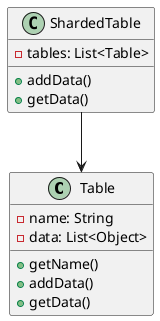
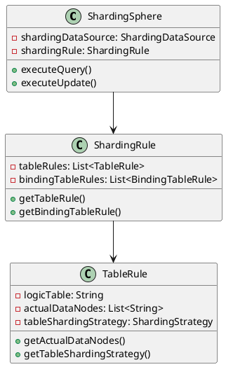
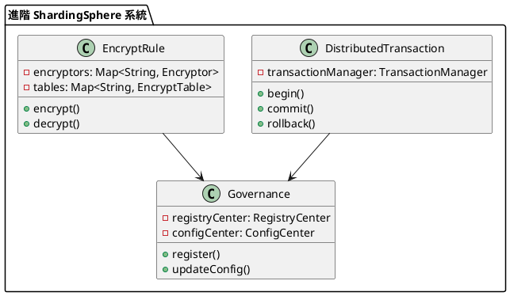

# 資料庫分庫分表教學

## 初級（Beginner）層級

### 1. 概念說明
分庫分表就像學校的圖書館：
- 如果所有書都放在一個書架上，找書會很慢
- 我們可以把書分成不同類別，放在不同區域
- 這樣找書會更快，管理也更容易

初級學習者需要了解：
- 什麼是分庫分表
- 為什麼需要分庫分表
- 基本的資料分割概念

### 2. PlantUML 圖解


### 3. 分段教學步驟

#### 步驟 1：基本分表實現
```yaml
# application-sharding.yaml
spring:
  shardingsphere:
    datasource:
      names: ds0,ds1
      ds0:
        type: com.zaxxer.hikari.HikariDataSource
        driver-class-name: com.mysql.jdbc.Driver
        jdbc-url: jdbc:mysql://localhost:3306/db0
        username: root
        password: root
      ds1:
        type: com.zaxxer.hikari.HikariDataSource
        driver-class-name: com.mysql.jdbc.Driver
        jdbc-url: jdbc:mysql://localhost:3306/db1
        username: root
        password: root
    sharding:
      tables:
        t_order:
          actual-data-nodes: ds$->{0..1}.t_order$->{0..1}
          table-strategy:
            inline:
              sharding-column: order_id
              algorithm-expression: t_order$->{order_id % 2}
          key-generator:
            column: order_id
            type: SNOWFLAKE
```

```java
// 實體類
@Data
@Table(name = "t_order")
public class Order {
    @Id
    @Column(name = "order_id")
    private Long orderId;
    
    @Column(name = "user_id")
    private Long userId;
    
    @Column(name = "status")
    private String status;
}

// 數據訪問層
@Repository
public class OrderRepository {
    @Autowired
    private JdbcTemplate jdbcTemplate;
    
    public void save(Order order) {
        String sql = "INSERT INTO t_order (order_id, user_id, status) VALUES (?, ?, ?)";
        jdbcTemplate.update(sql, order.getOrderId(), order.getUserId(), order.getStatus());
    }
    
    public Order findById(Long orderId) {
        String sql = "SELECT * FROM t_order WHERE order_id = ?";
        return jdbcTemplate.queryForObject(sql, new Object[]{orderId}, 
            (rs, rowNum) -> {
                Order order = new Order();
                order.setOrderId(rs.getLong("order_id"));
                order.setUserId(rs.getLong("user_id"));
                order.setStatus(rs.getString("status"));
                return order;
            });
    }
}
```

### 4. 配置說明

#### Maven 依賴配置
```xml
<dependencies>
    <dependency>
        <groupId>org.apache.shardingsphere</groupId>
        <artifactId>sharding-jdbc-spring-boot-starter</artifactId>
        <version>5.3.2</version>
    </dependency>
    <dependency>
        <groupId>com.zaxxer</groupId>
        <artifactId>HikariCP</artifactId>
        <version>4.0.3</version>
    </dependency>
    <dependency>
        <groupId>mysql</groupId>
        <artifactId>mysql-connector-java</artifactId>
        <version>8.0.33</version>
    </dependency>
</dependencies>
```

## 中級（Intermediate）層級

### 1. 概念說明
中級學習者需要理解：
- ShardingSphere 的架構和組件
- 分片策略和算法
- 分佈式事務
- 讀寫分離

### 2. PlantUML 圖解


### 3. 分段教學步驟

#### 步驟 1：分片策略配置
```yaml
# application-sharding.yaml
spring:
  shardingsphere:
    sharding:
      tables:
        t_order:
          actual-data-nodes: ds$->{0..1}.t_order$->{0..1}
          database-strategy:
            inline:
              sharding-column: user_id
              algorithm-expression: ds$->{user_id % 2}
          table-strategy:
            inline:
              sharding-column: order_id
              algorithm-expression: t_order$->{order_id % 2}
          key-generator:
            column: order_id
            type: SNOWFLAKE
```

#### 步驟 2：讀寫分離配置
```yaml
# application-sharding.yaml
spring:
  shardingsphere:
    datasource:
      names: master,slave0,slave1
      master:
        type: com.zaxxer.hikari.HikariDataSource
        driver-class-name: com.mysql.jdbc.Driver
        jdbc-url: jdbc:mysql://localhost:3306/master
        username: root
        password: root
      slave0:
        type: com.zaxxer.hikari.HikariDataSource
        driver-class-name: com.mysql.jdbc.Driver
        jdbc-url: jdbc:mysql://localhost:3306/slave0
        username: root
        password: root
      slave1:
        type: com.zaxxer.hikari.HikariDataSource
        driver-class-name: com.mysql.jdbc.Driver
        jdbc-url: jdbc:mysql://localhost:3306/slave1
        username: root
        password: root
    masterslave:
      name: ms
      master-data-source-name: master
      slave-data-source-names: slave0,slave1
      load-balance-algorithm-type: ROUND_ROBIN
```

## 高級（Advanced）層級

### 1. 概念說明
高級學習者需要掌握：
- 分佈式事務
- 數據加密
- 數據脫敏
- 監控和治理

### 2. PlantUML 圖解


### 3. 分段教學步驟

#### 步驟 1：分佈式事務配置
```yaml
# application-sharding.yaml
spring:
  shardingsphere:
    transaction:
      type: XA
      props:
        defaultTimeout: 60
        maxTimeout: 60
        rollbackTimeout: 30
```

```java
@Service
public class OrderService {
    @Autowired
    private OrderRepository orderRepository;
    
    @ShardingTransactionType(TransactionType.XA)
    @Transactional(rollbackFor = Exception.class)
    public void createOrder(Order order) {
        orderRepository.save(order);
        // 其他業務邏輯
    }
}
```

#### 步驟 2：數據加密配置
```yaml
# application-sharding.yaml
spring:
  shardingsphere:
    encrypt:
      encryptors:
        aes_encryptor:
          type: AES
          props:
            aes-key-value: 123456
      tables:
        t_order:
          columns:
            user_id:
              plainColumn: user_id
              cipherColumn: user_id_cipher
              encryptor: aes_encryptor
```

#### 步驟 3：數據脫敏配置
```yaml
# application-sharding.yaml
spring:
  shardingsphere:
    encrypt:
      encryptors:
        mobile_encryptor:
          type: MASK
          props:
            mask-char: '*'
            mask-length: 4
      tables:
        t_order:
          columns:
            mobile:
              plainColumn: mobile
              cipherColumn: mobile_cipher
              encryptor: mobile_encryptor
```

### 4. 進階配置

#### 監控配置（使用 Prometheus）
```yaml
# application-sharding.yaml
spring:
  shardingsphere:
    metrics:
      enabled: true
      name: prometheus
      host: 127.0.0.1
      port: 9190
      props:
        jvm-information: true
```

#### 治理配置
```yaml
# application-sharding.yaml
spring:
  shardingsphere:
    governance:
      name: governance_ds
      registry-center:
        type: ZOOKEEPER
        server-lists: localhost:2181
        namespace: governance_ds
      overwrite: false
```

這個擴展提供了動態縮容擴容的分庫分表方案，主要包含以下功能：

1. 動態監控：通過 `ShardMetrics` 類收集分片的使用情況
2. 自動擴容：當分片使用率超過閾值時，自動創建新的分片並重新平衡資料
3. 自動縮容：當分片使用率低於閾值時，自動將資料遷移到其他分片並移除該分片
4. 平滑遷移：在擴縮容過程中確保資料的完整性和一致性

使用這個方案，系統可以根據實際負載情況自動調整分片數量，實現更好的資源利用和性能優化。

這個教學文件提供了從基礎到進階的資料庫分庫分表學習路徑，每個層級都包含了相應的概念說明、圖解、教學步驟和實作範例。初級學習者可以從基本的資料分割開始，中級學習者可以學習分片策略和路由機制，而高級學習者則可以掌握分散式分片、一致性雜湊和跨分片事務等進階功能。 

### 4. 常見問題與解決方案

#### 問題表象
1. 數據傾斜：
   - 某些分片數據量過大
   - 查詢性能不均衡
   - 存儲空間分配不均

2. 跨分片查詢：
   - 查詢性能下降
   - 結果合併複雜
   - 內存消耗增加

3. 分片擴容：
   - 數據遷移困難
   - 服務中斷風險
   - 一致性難以保證

4. 事務處理：
   - 跨分片事務複雜
   - 性能開銷大
   - 死鎖風險增加

#### 避免方法
1. 數據傾斜防護：
   - 合理選擇分片鍵
   - 實現動態分片
   - 監控數據分佈

2. 跨分片查詢優化：
   - 優化查詢語句
   - 使用索引
   - 實現結果緩存

3. 分片擴容準備：
   - 預留擴容空間
   - 實現平滑遷移
   - 制定回滾方案

4. 事務處理優化：
   - 使用分佈式事務
   - 實現最終一致性
   - 設置超時機制

#### 處理方案
1. 技術方案：
   ```java
   public class ShardingManager {
       private ShardingDataSource dataSource;
       private ShardingRule shardingRule;
       private TransactionManager transactionManager;
       
       public void handleShardingIssue(ShardingIssue issue) {
           switch (issue.getType()) {
               case DATA_SKEW:
                   handleDataSkew(issue);
                   break;
               case CROSS_SHARD_QUERY:
                   handleCrossShardQuery(issue);
                   break;
               case SHARD_EXPANSION:
                   handleShardExpansion(issue);
                   break;
               case TRANSACTION:
                   handleTransaction(issue);
                   break;
           }
       }
       
       private void handleDataSkew(ShardingIssue issue) {
           // 分析數據分佈
           DataDistribution distribution = analyzeDataDistribution();
           // 調整分片策略
           adjustShardingStrategy(distribution);
           // 執行數據重平衡
           rebalanceData();
       }
       
       private void handleCrossShardQuery(ShardingIssue issue) {
           // 優化查詢計劃
           QueryPlan plan = optimizeQuery(issue.getQuery());
           // 執行分佈式查詢
           executeDistributedQuery(plan);
           // 合併查詢結果
           mergeResults();
       }
       
       private void handleShardExpansion(ShardingIssue issue) {
           // 準備新分片
           prepareNewShard();
           // 執行數據遷移
           migrateData();
           // 更新路由規則
           updateRoutingRules();
       }
       
       private void handleTransaction(ShardingIssue issue) {
           // 開始分佈式事務
           transactionManager.begin();
           try {
               // 執行事務操作
               executeTransactionOperations();
               // 提交事務
               transactionManager.commit();
           } catch (Exception e) {
               // 回滾事務
               transactionManager.rollback();
               throw e;
           }
       }
   }
   ```

2. 監控方案：
   ```java
   public class ShardingMonitor {
       private MetricsCollector metricsCollector;
       private AlertManager alertManager;
       
       public void monitorSharding() {
           ShardingMetrics metrics = metricsCollector.collectMetrics();
           
           // 檢查數據傾斜
           if (metrics.getDataSkew() > SKEW_THRESHOLD) {
               alertManager.alert("數據傾斜警告", metrics.getDetails());
           }
           
           // 檢查查詢性能
           if (metrics.getQueryPerformance() < PERFORMANCE_THRESHOLD) {
               alertManager.alert("查詢性能警告", metrics.getDetails());
           }
           
           // 檢查分片負載
           if (metrics.getShardLoad() > LOAD_THRESHOLD) {
               alertManager.alert("分片負載警告", metrics.getDetails());
           }
       }
   }
   ```

3. 最佳實踐：
   - 合理選擇分片鍵
   - 實現分片預熱
   - 設置分片監控
   - 實現平滑擴容
   - 優化跨分片查詢
   - 使用分佈式事務
   - 實現數據備份
   - 制定故障恢復方案

### 5. 實戰案例

#### 案例一：電商訂單分片
```java
public class OrderShardingService {
    private ShardingDataSource dataSource;
    private OrderRepository orderRepository;
    
    public void createOrder(Order order) {
        // 生成訂單ID
        Long orderId = generateOrderId();
        order.setOrderId(orderId);
        
        // 根據用戶ID選擇分片
        String shardKey = determineShardKey(order.getUserId());
        
        // 在對應分片創建訂單
        orderRepository.save(order, shardKey);
    }
    
    public Order getOrder(Long orderId, Long userId) {
        // 根據用戶ID確定分片
        String shardKey = determineShardKey(userId);
        
        // 從對應分片查詢訂單
        return orderRepository.findById(orderId, shardKey);
    }
    
    private String determineShardKey(Long userId) {
        // 實現分片路由邏輯
        return "shard_" + (userId % 4);
    }
}
```

#### 案例二：社交媒體用戶分片
```java
public class UserShardingService {
    private ShardingDataSource dataSource;
    private UserRepository userRepository;
    
    public void createUser(User user) {
        // 生成用戶ID
        Long userId = generateUserId();
        user.setUserId(userId);
        
        // 根據地理位置選擇分片
        String shardKey = determineShardKey(user.getLocation());
        
        // 在對應分片創建用戶
        userRepository.save(user, shardKey);
    }
    
    public List<User> getUsersByLocation(String location) {
        // 根據地理位置確定分片
        String shardKey = determineShardKey(location);
        
        // 從對應分片查詢用戶
        return userRepository.findByLocation(location, shardKey);
    }
    
    private String determineShardKey(String location) {
        // 實現基於地理位置的分片路由邏輯
        return "shard_" + location.hashCode() % 8;
    }
} 