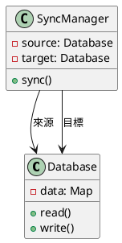
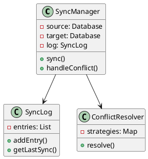
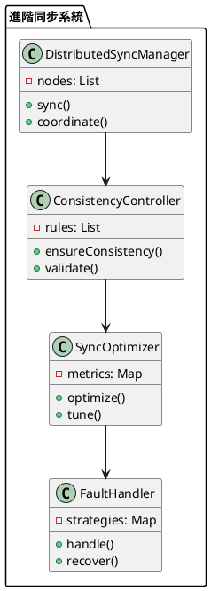

# 資料庫同步教學

## 初級（Beginner）層級

### 1. 概念說明
資料庫同步就像是在學校裡，當我們需要把一份資料分享給其他同學時：
- 把資料複製到其他同學的筆記本（資料庫）
- 確保大家的筆記本內容都一樣
- 當有人更新資料時，其他人的筆記本也要更新

初級學習者需要了解：
- 什麼是資料庫同步
- 為什麼需要資料庫同步
- 基本的資料複製方法

### 2. PlantUML 圖解


### 3. 分段教學步驟

#### 步驟 1：基本資料同步
```java
public class SimpleSyncManager {
    private Database source;
    private Database target;
    
    public SimpleSyncManager(Database source, Database target) {
        this.source = source;
        this.target = target;
    }
    
    public void sync() {
        // 從來源資料庫讀取所有資料
        Map<String, String> sourceData = source.readAll();
        
        // 將資料寫入目標資料庫
        for (Map.Entry<String, String> entry : sourceData.entrySet()) {
            target.write(entry.getKey(), entry.getValue());
        }
        
        System.out.println("資料同步完成！");
    }
}

class Database {
    private Map<String, String> data;
    
    public Database() {
        data = new HashMap<>();
    }
    
    public void write(String key, String value) {
        data.put(key, value);
        System.out.println("寫入資料: " + key + " = " + value);
    }
    
    public Map<String, String> readAll() {
        return new HashMap<>(data);
    }
}
```

#### 步驟 2：簡單的同步監控
```java
public class SyncMonitor {
    private Database source;
    private Database target;
    
    public void checkSync() {
        Map<String, String> sourceData = source.readAll();
        Map<String, String> targetData = target.readAll();
        
        // 檢查資料是否一致
        boolean isSynced = sourceData.equals(targetData);
        
        if (isSynced) {
            System.out.println("資料庫已同步！");
        } else {
            System.out.println("資料庫需要同步！");
        }
    }
}
```

## 中級（Intermediate）層級

### 1. 概念說明
中級學習者需要理解：
- 增量同步
- 衝突處理
- 同步日誌
- 錯誤恢復

### 2. PlantUML 圖解


### 3. 分段教學步驟

#### 步驟 1：增量同步
```java
import java.util.*;

public class IncrementalSyncManager {
    private Database source;
    private Database target;
    private SyncLog syncLog;
    
    public void sync() {
        // 取得上次同步時間
        Date lastSync = syncLog.getLastSync();
        
        // 取得需要同步的變更
        List<Change> changes = source.getChangesSince(lastSync);
        
        // 套用變更
        for (Change change : changes) {
            applyChange(change);
        }
        
        // 更新同步日誌
        syncLog.addEntry(new Date());
    }
    
    private void applyChange(Change change) {
        switch (change.getType()) {
            case INSERT:
                target.insert(change.getKey(), change.getValue());
                break;
            case UPDATE:
                target.update(change.getKey(), change.getValue());
                break;
            case DELETE:
                target.delete(change.getKey());
                break;
        }
    }
}

class Change {
    private ChangeType type;
    private String key;
    private String value;
    private Date timestamp;
    
    public Change(ChangeType type, String key, String value) {
        this.type = type;
        this.key = key;
        this.value = value;
        this.timestamp = new Date();
    }
}

enum ChangeType {
    INSERT, UPDATE, DELETE
}
```

#### 步驟 2：衝突處理
```java
public class ConflictResolver {
    private Map<String, ConflictStrategy> strategies;
    
    public void resolve(Conflict conflict) {
        ConflictStrategy strategy = strategies.get(conflict.getType());
        if (strategy != null) {
            strategy.resolve(conflict);
        } else {
            // 使用預設策略
            resolveWithDefaultStrategy(conflict);
        }
    }
    
    private void resolveWithDefaultStrategy(Conflict conflict) {
        // 使用最後修改時間來解決衝突
        if (conflict.getSourceTimestamp().after(conflict.getTargetTimestamp())) {
            conflict.getTarget().update(conflict.getKey(), conflict.getSourceValue());
        }
    }
}

class Conflict {
    private String key;
    private String sourceValue;
    private String targetValue;
    private Date sourceTimestamp;
    private Date targetTimestamp;
    
    // Getters and setters
}

interface ConflictStrategy {
    void resolve(Conflict conflict);
}
```

## 高級（Advanced）層級

### 1. 概念說明
高級學習者需要掌握：
- 分散式同步
- 一致性控制
- 同步優化
- 容錯處理

### 2. PlantUML 圖解


### 3. 分段教學步驟

#### 步驟 1：分散式同步
```java
import java.util.*;

public class DistributedSyncManager {
    private List<DatabaseNode> nodes;
    private ConsistencyController controller;
    
    public void sync() {
        // 協調所有節點的同步
        for (DatabaseNode node : nodes) {
            // 取得需要同步的變更
            List<Change> changes = node.getPendingChanges();
            
            // 確保一致性
            if (controller.validateChanges(changes)) {
                // 將變更傳播到其他節點
                propagateChanges(node, changes);
            }
        }
    }
    
    private void propagateChanges(DatabaseNode source, List<Change> changes) {
        for (DatabaseNode target : nodes) {
            if (target != source) {
                target.applyChanges(changes);
            }
        }
    }
}

class DatabaseNode {
    private String id;
    private Map<String, String> data;
    private List<Change> pendingChanges;
    
    public List<Change> getPendingChanges() {
        return new ArrayList<>(pendingChanges);
    }
    
    public void applyChanges(List<Change> changes) {
        for (Change change : changes) {
            applyChange(change);
        }
    }
}
```

#### 步驟 2：一致性控制
```java
public class ConsistencyController {
    private List<ConsistencyRule> rules;
    
    public boolean validateChanges(List<Change> changes) {
        // 檢查變更是否符合一致性規則
        for (ConsistencyRule rule : rules) {
            if (!rule.validate(changes)) {
                return false;
            }
        }
        return true;
    }
    
    public void ensureConsistency(List<DatabaseNode> nodes) {
        // 確保所有節點的一致性
        for (DatabaseNode node : nodes) {
            validateNode(node);
        }
    }
}

interface ConsistencyRule {
    boolean validate(List<Change> changes);
}

class PrimaryKeyRule implements ConsistencyRule {
    @Override
    public boolean validate(List<Change> changes) {
        // 檢查主鍵是否唯一
        Set<String> keys = new HashSet<>();
        for (Change change : changes) {
            if (!keys.add(change.getKey())) {
                return false;
            }
        }
        return true;
    }
}
```

#### 步驟 3：同步優化
```java
public class SyncOptimizer {
    private Map<String, PerformanceMetric> metrics;
    
    public void optimize() {
        // 收集效能指標
        collectMetrics();
        
        // 分析同步效能
        analyzePerformance();
        
        // 調整同步策略
        tuneStrategy();
    }
    
    private void analyzePerformance() {
        for (Map.Entry<String, PerformanceMetric> entry : metrics.entrySet()) {
            String nodeId = entry.getKey();
            PerformanceMetric metric = entry.getValue();
            
            // 分析同步延遲
            if (metric.getSyncDelay() > metric.getThreshold()) {
                optimizeNode(nodeId);
            }
        }
    }
    
    private void optimizeNode(String nodeId) {
        // 實現節點優化邏輯
        // 例如：調整批次大小、壓縮資料等
    }
}

class PerformanceMetric {
    private String nodeId;
    private double syncDelay;
    private double threshold;
    private Date timestamp;
    
    public PerformanceMetric(String nodeId, double syncDelay, double threshold) {
        this.nodeId = nodeId;
        this.syncDelay = syncDelay;
        this.threshold = threshold;
        this.timestamp = new Date();
    }
}
```

這個教學文件提供了從基礎到進階的資料庫同步學習路徑，每個層級都包含了相應的概念說明、圖解、教學步驟和實作範例。初級學習者可以從基本的資料複製開始，中級學習者可以學習增量同步和衝突處理，而高級學習者則可以掌握分散式同步和一致性控制等進階功能。 