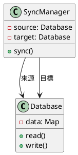
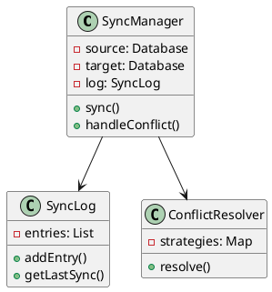
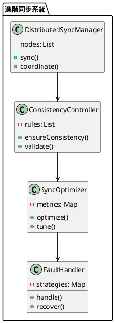

# 資料庫同步教學

## 初級（Beginner）層級

### 1. 概念說明
資料庫同步就像是在學校裡，當我們需要把一份資料分享給其他同學時：
- 把資料複製到其他同學的筆記本（資料庫）
- 確保大家的筆記本內容都一樣
- 當有人更新資料時，其他人的筆記本也要更新

初級學習者需要了解：
- 什麼是資料庫同步
- 為什麼需要資料庫同步
- 基本的資料複製方法

### 2. 使用原因
資料庫同步的主要使用原因包括：
1. 資料備份：
   - 防止資料遺失
   - 提供災難恢復
   - 確保資料安全

2. 負載均衡：
   - 分散查詢負載
   - 提高系統效能
   - 優化資源使用

3. 高可用性：
   - 提供故障轉移
   - 確保服務不中斷
   - 提升系統可靠性

### 3. 問題表象
常見的問題表象包括：
1. 同步延遲：
   - 資料更新不及時
   - 同步速度緩慢
   - 系統負載過高

2. 資料問題：
   - 資料不一致
   - 同步衝突
   - 資料完整性受損

3. 系統問題：
   - 網路中斷
   - 系統故障
   - 資源不足

### 4. 避免方法
避免問題的方法包括：
1. 系統設計：
   - 選擇適當的同步策略
   - 設計有效的同步機制
   - 建立監控系統

2. 資料管理：
   - 定期檢查同步狀態
   - 優化同步策略
   - 確保資料一致性

3. 效能優化：
   - 合理設置同步頻率
   - 優化同步方式
   - 實現負載均衡

### 5. 問題處理
遇到問題時的處理方法：
1. 同步延遲處理：
   - 檢查網路狀態
   - 優化同步策略
   - 調整同步頻率

2. 資料問題處理：
   - 檢查資料一致性
   - 解決同步衝突
   - 修復資料完整性

3. 系統問題處理：
   - 檢查系統狀態
   - 修復網路問題
   - 優化資源使用

### 6. PlantUML 圖解


### 7. 分段教學步驟

#### 步驟 1：基本資料同步
```java
public class SimpleSyncManager {
    private Database source;
    private Database target;
    
    public SimpleSyncManager(Database source, Database target) {
        this.source = source;
        this.target = target;
    }
    
    public void sync() {
        // 從來源資料庫讀取所有資料
        Map<String, String> sourceData = source.readAll();
        
        // 將資料寫入目標資料庫
        for (Map.Entry<String, String> entry : sourceData.entrySet()) {
            target.write(entry.getKey(), entry.getValue());
        }
        
        System.out.println("資料同步完成！");
    }
}
```

## 中級（Intermediate）層級

### 1. 概念說明
中級學習者需要理解：
- 增量同步
- 衝突處理
- 同步日誌
- 錯誤恢復

### 2. PlantUML 圖解


### 3. 分段教學步驟

#### 步驟 1：增量同步
```java
public class IncrementalSyncManager {
    private Database source;
    private Database target;
    private SyncLog syncLog;
    
    public void sync() {
        // 取得上次同步時間
        Date lastSync = syncLog.getLastSync();
        
        // 取得需要同步的變更
        List<Change> changes = source.getChangesSince(lastSync);
        
        // 套用變更
        for (Change change : changes) {
            applyChange(change);
        }
        
        // 更新同步日誌
        syncLog.addEntry(new Date());
    }
    
    private void applyChange(Change change) {
        switch (change.getType()) {
            case INSERT:
                target.insert(change.getKey(), change.getValue());
                break;
            case UPDATE:
                target.update(change.getKey(), change.getValue());
                break;
            case DELETE:
                target.delete(change.getKey());
                break;
        }
    }
}
```

#### 步驟 2：衝突處理
```java
public class ConflictResolver {
    public void resolve(Conflict conflict) {
        // 使用最後修改時間來解決衝突
        if (conflict.getSourceTimestamp().after(conflict.getTargetTimestamp())) {
            conflict.getTarget().update(conflict.getKey(), conflict.getSourceValue());
        }
    }
}
```

## 高級（Advanced）層級

### 1. 概念說明
高級學習者需要掌握：
- 分散式同步
- 一致性控制
- 同步優化
- 容錯處理

### 2. PlantUML 圖解


### 3. 分段教學步驟

#### 步驟 1：分散式同步
```java
public class DistributedSyncManager {
    private List<DatabaseNode> nodes;
    private ConsistencyController controller;
    
    public void sync() {
        for (DatabaseNode node : nodes) {
            List<Change> changes = node.getPendingChanges();
            
            if (controller.validateChanges(changes)) {
                propagateChanges(node, changes);
            }
        }
    }
    
    private void propagateChanges(DatabaseNode source, List<Change> changes) {
        for (DatabaseNode target : nodes) {
            if (target != source) {
                target.applyChanges(changes);
            }
        }
    }
}
```

#### 步驟 2：一致性控制
```java
public class ConsistencyController {
    private List<ConsistencyRule> rules;
    
    public boolean validateChanges(List<Change> changes) {
        for (ConsistencyRule rule : rules) {
            if (!rule.validate(changes)) {
                return false;
            }
        }
        return true;
    }
}
```

### 4. 常見問題與解決方案

#### 問題表象
1. 同步延遲：
   - 資料更新不及時
   - 同步速度緩慢
   - 系統負載過高

2. 資料問題：
   - 資料不一致
   - 同步衝突
   - 資料完整性受損

3. 系統問題：
   - 網路中斷
   - 系統故障
   - 資源不足

#### 避免方法
1. 系統設計：
   - 選擇適當的同步策略
   - 設計有效的同步機制
   - 建立監控系統

2. 資料管理：
   - 定期檢查同步狀態
   - 優化同步策略
   - 確保資料一致性

3. 效能優化：
   - 合理設置同步頻率
   - 優化同步方式
   - 實現負載均衡

#### 處理方案
1. 技術方案：
   ```java
   public class SyncManager {
       private SyncStrategy strategy;
       private SyncMonitor monitor;
       
       public void handleSyncIssue(SyncIssue issue) {
           switch (issue.getType()) {
               case DELAY:
                   handleDelayIssue(issue);
                   break;
               case DATA:
                   handleDataIssue(issue);
                   break;
               case SYSTEM:
                   handleSystemIssue(issue);
                   break;
           }
       }
   }
   ```

2. 監控方案：
   ```java
   public class SyncMonitor {
       private MetricsCollector metricsCollector;
       private AlertManager alertManager;
       
       public void monitorSync() {
           SyncMetrics metrics = metricsCollector.collectMetrics();
           
           if (metrics.getSyncDelay() > DELAY_THRESHOLD) {
               alertManager.alert("同步延遲警告", metrics.getDetails());
           }
       }
   }
   ```

3. 最佳實踐：
   - 實現自動化同步
   - 配置智能監控
   - 建立告警機制
   - 優化同步策略
   - 定期效能優化
   - 保持系統文檔
   - 建立應急流程 