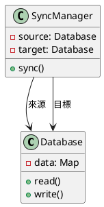
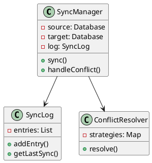
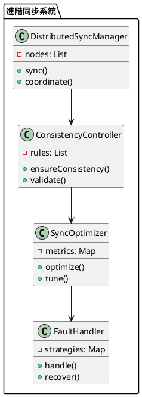

# 資料庫同步教學

## 初級（Beginner）層級

### 1. 概念說明
資料庫同步就像是在學校裡，當我們需要把一份資料分享給其他同學時：
- 把資料複製到其他同學的筆記本（資料庫）
- 確保大家的筆記本內容都一樣
- 當有人更新資料時，其他人的筆記本也要更新

初級學習者需要了解：
- 什麼是資料庫同步
- 為什麼需要資料庫同步
- 基本的資料複製方法

### 2. 使用原因
資料庫同步的主要使用原因包括：
1. 資料備份：
   - 防止資料遺失
   - 提供災難恢復
   - 確保資料安全

2. 負載均衡：
   - 分散查詢負載
   - 提高系統效能
   - 優化資源使用

3. 高可用性：
   - 提供故障轉移
   - 確保服務不中斷
   - 提升系統可靠性

### 3. 問題表象
常見的問題表象包括：
1. 同步延遲：
   - 資料更新不及時
   - 同步速度緩慢
   - 系統負載過高

2. 資料問題：
   - 資料不一致
   - 同步衝突
   - 資料完整性受損

3. 系統問題：
   - 網路中斷
   - 系統故障
   - 資源不足

### 4. 避免方法
避免問題的方法包括：
1. 系統設計：
   - 選擇適當的同步策略
   - 設計有效的同步機制
   - 建立監控系統

2. 資料管理：
   - 定期檢查同步狀態
   - 優化同步策略
   - 確保資料一致性

3. 效能優化：
   - 合理設置同步頻率
   - 優化同步方式
   - 實現負載均衡

### 5. 問題處理
遇到問題時的處理方法：
1. 同步延遲處理：
   - 檢查網路狀態
   - 優化同步策略
   - 調整同步頻率

2. 資料問題處理：
   - 檢查資料一致性
   - 解決同步衝突
   - 修復資料完整性

3. 系統問題處理：
   - 檢查系統狀態
   - 修復網路問題
   - 優化資源使用

### 6. PlantUML 圖解


### 7. 分段教學步驟

#### 步驟 1：基本資料同步
```java
public class SimpleSyncManager {
    private Database source;
    private Database target;
    private SyncMonitor monitor;
    private SyncValidator validator;
    
    public SimpleSyncManager(Database source, Database target) {
        this.source = source;
        this.target = target;
        this.monitor = new SyncMonitor(source, target);
        this.validator = new SyncValidator();
    }
    
    public void sync() {
        // 檢查同步狀態
        if (!validator.validateSync(source, target)) {
            System.out.println("同步驗證失敗！");
            return;
        }
        
        // 從來源資料庫讀取所有資料
        Map<String, String> sourceData = source.readAll();
        
        // 將資料寫入目標資料庫
        for (Map.Entry<String, String> entry : sourceData.entrySet()) {
            if (validator.validateData(entry.getKey(), entry.getValue())) {
                target.write(entry.getKey(), entry.getValue());
                monitor.recordSyncOperation("write", entry.getKey());
            }
        }
        
        // 檢查同步結果
        monitor.checkSync();
        System.out.println("資料同步完成！");
    }
}

class SyncMonitor {
    private Database source;
    private Database target;
    private Map<String, Integer> operationCounts;
    
    public SyncMonitor(Database source, Database target) {
        this.source = source;
        this.target = target;
        this.operationCounts = new HashMap<>();
    }
    
    public void recordSyncOperation(String operation, String key) {
        String metric = operation + ":" + key;
        operationCounts.merge(metric, 1, Integer::sum);
    }
    
    public void checkSync() {
        Map<String, String> sourceData = source.readAll();
        Map<String, String> targetData = target.readAll();
        
        // 檢查資料是否一致
        boolean isSynced = sourceData.equals(targetData);
        
        if (isSynced) {
            System.out.println("資料庫已同步！");
        } else {
            System.out.println("資料庫需要同步！");
            // 記錄不同步的資料
            for (Map.Entry<String, String> entry : sourceData.entrySet()) {
                String key = entry.getKey();
                String sourceValue = entry.getValue();
                String targetValue = targetData.get(key);
                
                if (!sourceValue.equals(targetValue)) {
                    System.out.println("資料不同步: " + key);
                    System.out.println("來源值: " + sourceValue);
                    System.out.println("目標值: " + targetValue);
                }
            }
        }
    }
}

class SyncValidator {
    public boolean validateSync(Database source, Database target) {
        // 檢查資料庫連接狀態
        return source.isConnected() && target.isConnected();
    }
    
    public boolean validateData(String key, String value) {
        return key != null && !key.isEmpty() && value != null;
    }
}
```

## 中級（Intermediate）層級

### 1. 概念說明
中級學習者需要理解：
- 增量同步
- 衝突處理
- 同步日誌
- 錯誤恢復

### 2. PlantUML 圖解


### 3. 分段教學步驟

#### 步驟 1：增量同步
```java
import java.util.*;

public class IncrementalSyncManager {
    private Database source;
    private Database target;
    private SyncLog syncLog;
    private SyncMonitor monitor;
    private SyncValidator validator;
    
    public void sync() {
        // 檢查同步狀態
        if (!validator.validateSync(source, target)) {
            System.out.println("同步驗證失敗！");
            return;
        }
        
        // 取得上次同步時間
        Date lastSync = syncLog.getLastSync();
        
        // 取得需要同步的變更
        List<Change> changes = source.getChangesSince(lastSync);
        
        // 套用變更
        for (Change change : changes) {
            if (validator.validateChange(change)) {
                applyChange(change);
                monitor.recordSyncOperation(change.getType().name(), change.getKey());
            }
        }
        
        // 更新同步日誌
        syncLog.addEntry(new Date());
        
        // 檢查同步結果
        monitor.checkSync();
    }
    
    private void applyChange(Change change) {
        try {
            switch (change.getType()) {
                case INSERT:
                    target.insert(change.getKey(), change.getValue());
                    break;
                case UPDATE:
                    target.update(change.getKey(), change.getValue());
                    break;
                case DELETE:
                    target.delete(change.getKey());
                    break;
            }
        } catch (Exception e) {
            System.out.println("套用變更失敗: " + change.getKey());
            e.printStackTrace();
        }
    }
}
```

#### 步驟 2：衝突處理
```java
public class ConflictResolver {
    private Map<String, ConflictStrategy> strategies;
    
    public void resolve(Conflict conflict) {
        ConflictStrategy strategy = strategies.get(conflict.getType());
        if (strategy != null) {
            strategy.resolve(conflict);
        } else {
            // 使用預設策略
            resolveWithDefaultStrategy(conflict);
        }
    }
    
    private void resolveWithDefaultStrategy(Conflict conflict) {
        // 使用最後修改時間來解決衝突
        if (conflict.getSourceTimestamp().after(conflict.getTargetTimestamp())) {
            conflict.getTarget().update(conflict.getKey(), conflict.getSourceValue());
        }
    }
}

class Conflict {
    private String key;
    private String sourceValue;
    private String targetValue;
    private Date sourceTimestamp;
    private Date targetTimestamp;
    
    // Getters and setters
}

interface ConflictStrategy {
    void resolve(Conflict conflict);
}
```

## 高級（Advanced）層級

### 1. 概念說明
高級學習者需要掌握：
- 分散式同步
- 一致性控制
- 同步優化
- 容錯處理

### 2. PlantUML 圖解


### 3. 分段教學步驟

#### 步驟 1：分散式同步
```java
import java.util.*;

public class DistributedSyncManager {
    private List<DatabaseNode> nodes;
    private ConsistencyController controller;
    
    public void sync() {
        // 協調所有節點的同步
        for (DatabaseNode node : nodes) {
            // 取得需要同步的變更
            List<Change> changes = node.getPendingChanges();
            
            // 確保一致性
            if (controller.validateChanges(changes)) {
                // 將變更傳播到其他節點
                propagateChanges(node, changes);
            }
        }
    }
    
    private void propagateChanges(DatabaseNode source, List<Change> changes) {
        for (DatabaseNode target : nodes) {
            if (target != source) {
                target.applyChanges(changes);
            }
        }
    }
}

class DatabaseNode {
    private String id;
    private Map<String, String> data;
    private List<Change> pendingChanges;
    
    public List<Change> getPendingChanges() {
        return new ArrayList<>(pendingChanges);
    }
    
    public void applyChanges(List<Change> changes) {
        for (Change change : changes) {
            applyChange(change);
        }
    }
}
```

#### 步驟 2：一致性控制
```java
public class ConsistencyController {
    private List<ConsistencyRule> rules;
    
    public boolean validateChanges(List<Change> changes) {
        // 檢查變更是否符合一致性規則
        for (ConsistencyRule rule : rules) {
            if (!rule.validate(changes)) {
                return false;
            }
        }
        return true;
    }
    
    public void ensureConsistency(List<DatabaseNode> nodes) {
        // 確保所有節點的一致性
        for (DatabaseNode node : nodes) {
            validateNode(node);
        }
    }
}

interface ConsistencyRule {
    boolean validate(List<Change> changes);
}

class PrimaryKeyRule implements ConsistencyRule {
    @Override
    public boolean validate(List<Change> changes) {
        // 檢查主鍵是否唯一
        Set<String> keys = new HashSet<>();
        for (Change change : changes) {
            if (!keys.add(change.getKey())) {
                return false;
            }
        }
        return true;
    }
}
```

#### 步驟 3：同步優化
```java
public class SyncOptimizer {
    private Map<String, PerformanceMetric> metrics;
    
    public void optimize() {
        // 收集效能指標
        collectMetrics();
        
        // 分析同步效能
        analyzePerformance();
        
        // 調整同步策略
        tuneStrategy();
    }
    
    private void analyzePerformance() {
        for (Map.Entry<String, PerformanceMetric> entry : metrics.entrySet()) {
            String nodeId = entry.getKey();
            PerformanceMetric metric = entry.getValue();
            
            // 分析同步延遲
            if (metric.getSyncDelay() > metric.getThreshold()) {
                optimizeNode(nodeId);
            }
        }
    }
    
    private void optimizeNode(String nodeId) {
        // 實現節點優化邏輯
        // 例如：調整批次大小、壓縮資料等
    }
}

class PerformanceMetric {
    private String nodeId;
    private double syncDelay;
    private double threshold;
    private Date timestamp;
    
    public PerformanceMetric(String nodeId, double syncDelay, double threshold) {
        this.nodeId = nodeId;
        this.syncDelay = syncDelay;
        this.threshold = threshold;
        this.timestamp = new Date();
    }
}
```

### 4. 常見問題與解決方案

#### 問題表象
1. 同步延遲：
   - 資料更新不及時
   - 同步速度緩慢
   - 系統負載過高

2. 資料問題：
   - 資料不一致
   - 同步衝突
   - 資料完整性受損

3. 系統問題：
   - 網路中斷
   - 系統故障
   - 資源不足

#### 避免方法
1. 系統設計：
   - 選擇適當的同步策略
   - 設計有效的同步機制
   - 建立監控系統

2. 資料管理：
   - 定期檢查同步狀態
   - 優化同步策略
   - 確保資料一致性

3. 效能優化：
   - 合理設置同步頻率
   - 優化同步方式
   - 實現負載均衡

#### 處理方案
1. 技術方案：
   ```java
   public class SyncManager {
       private SyncStrategy strategy;
       private SyncMonitor monitor;
       private SyncValidator validator;
       private SyncOptimizer optimizer;
       
       public void handleSyncIssue(SyncIssue issue) {
           switch (issue.getType()) {
               case DELAY:
                   handleDelayIssue(issue);
                   break;
               case DATA:
                   handleDataIssue(issue);
                   break;
               case SYSTEM:
                   handleSystemIssue(issue);
                   break;
           }
       }
       
       private void handleDelayIssue(SyncIssue issue) {
           // 檢查網路狀態
           checkNetworkStatus();
           // 優化同步策略
           optimizeSyncStrategy();
           // 調整同步頻率
           adjustSyncFrequency();
       }
       
       private void handleDataIssue(SyncIssue issue) {
           // 檢查資料一致性
           checkDataConsistency();
           // 解決同步衝突
           resolveConflicts();
           // 修復資料完整性
           repairDataIntegrity();
       }
       
       private void handleSystemIssue(SyncIssue issue) {
           // 檢查系統狀態
           checkSystemStatus();
           // 修復網路問題
           repairNetwork();
           // 優化資源使用
           optimizeResources();
       }
   }
   ```

2. 監控方案：
   ```java
   public class SyncMonitor {
       private MetricsCollector metricsCollector;
       private SyncChecker syncChecker;
       private AlertManager alertManager;
       
       public void monitorSync() {
           SyncMetrics metrics = metricsCollector.collectMetrics();
           SyncStatus status = syncChecker.checkSync();
           
           // 檢查同步延遲
           if (metrics.getSyncDelay() > DELAY_THRESHOLD) {
               alertManager.alert("同步延遲警告", metrics.getDetails());
           }
           
           // 檢查資料一致性
           if (!status.isConsistent()) {
               alertManager.alert("資料不一致警告", status.getDetails());
           }
           
           // 檢查系統狀態
           if (metrics.getSystemStatus() != SystemStatus.HEALTHY) {
               alertManager.alert("系統狀態警告", metrics.getDetails());
           }
       }
   }
   ```

3. 最佳實踐：
   - 實現自動化同步
   - 配置智能監控
   - 建立告警機制
   - 優化同步策略
   - 定期效能優化
   - 保持系統文檔
   - 建立應急流程

### 5. 實戰案例

#### 案例一：電商系統資料同步
```java
public class ECommerceSync {
    private SyncManager syncManager;
    private SyncMonitor monitor;
    
    public void syncProductData(String category) {
        // 設定同步策略
        syncManager.setStrategy(new ProductSyncStrategy(category));
        
        // 執行同步
        syncManager.sync();
        
        // 檢查同步結果
        monitor.checkSync();
    }
    
    public void syncOrderData(String status) {
        // 設定同步策略
        syncManager.setStrategy(new OrderSyncStrategy(status));
        
        // 執行同步
        syncManager.sync();
        
        // 檢查同步結果
        monitor.checkSync();
    }
}
```

#### 案例二：社交媒體資料同步
```java
public class SocialMediaSync {
    private SyncManager syncManager;
    private SyncMonitor monitor;
    
    public void syncUserData(String region) {
        // 設定同步策略
        syncManager.setStrategy(new UserSyncStrategy(region));
        
        // 執行同步
        syncManager.sync();
        
        // 檢查同步結果
        monitor.checkSync();
    }
    
    public void syncPostData(String type) {
        // 設定同步策略
        syncManager.setStrategy(new PostSyncStrategy(type));
        
        // 執行同步
        syncManager.sync();
        
        // 檢查同步結果
        monitor.checkSync();
    }
}
```

這個教學文件提供了從基礎到進階的資料庫同步學習路徑，每個層級都包含了相應的概念說明、圖解、教學步驟和實作範例。初級學習者可以從基本的資料複製開始，中級學習者可以學習增量同步和衝突處理，而高級學習者則可以掌握分散式同步和一致性控制等進階功能。 