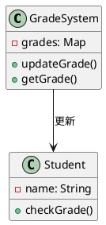
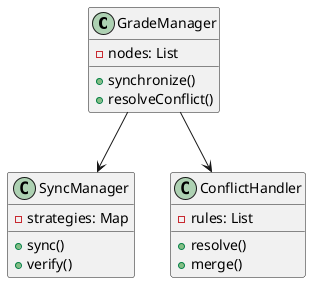
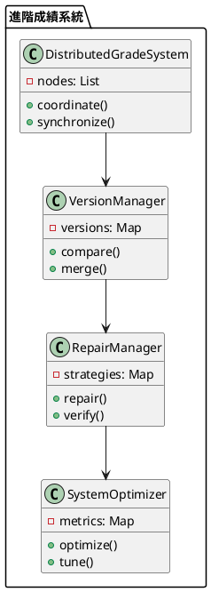

# 最終一致性教學

## 初級（Beginner）層級

### 1. 概念說明
最終一致性就像是在學校裡，當老師要更新班級成績時：
- 不需要立即讓所有同學都看到最新的成績
- 允許短暫的時間差，最終所有同學都會看到相同的成績
- 系統可以繼續運作，不會因為等待所有同學都看到成績而停下來

初級學習者需要了解：
- 什麼是最終一致性
- 為什麼需要最終一致性
- 基本的資料更新方式

### 2. 使用原因
最終一致性的主要使用原因包括：
1. 系統效能：
   - 提高系統吞吐量
   - 減少等待時間
   - 優化資源使用

2. 可用性：
   - 確保系統持續運作
   - 避免單點故障
   - 提升系統可靠性

3. 擴展性：
   - 支援分散式部署
   - 方便水平擴展
   - 適應高負載場景

### 3. 問題表象
常見的問題表象包括：
1. 資料不一致：
   - 讀取到舊資料
   - 資料更新延遲
   - 資料衝突

2. 系統問題：
   - 網路延遲
   - 節點故障
   - 同步失敗

3. 效能問題：
   - 讀取延遲
   - 寫入阻塞
   - 資源消耗

### 4. 避免方法
避免問題的方法包括：
1. 系統設計：
   - 選擇適當的一致性策略
   - 設計有效的同步機制
   - 建立監控系統

2. 資料管理：
   - 定期檢查資料一致性
   - 優化同步策略
   - 確保資料完整性

3. 效能優化：
   - 合理設置同步頻率
   - 優化讀寫策略
   - 實現負載均衡

### 5. 問題處理
遇到問題時的處理方法：
1. 資料不一致處理：
   - 檢查資料版本
   - 解決資料衝突
   - 修復資料完整性

2. 系統問題處理：
   - 檢查網路狀態
   - 修復節點故障
   - 重試同步操作

3. 效能問題處理：
   - 優化讀寫策略
   - 調整同步頻率
   - 優化資源使用

### 6. PlantUML 圖解


### 7. 分段教學步驟

#### 步驟 1：基本成績系統
```java
public class SimpleGradeSystem {
    private Map<String, Integer> grades;
    private ConsistencyMonitor monitor;
    private ConsistencyValidator validator;
    
    public SimpleGradeSystem() {
        grades = new HashMap<>();
        monitor = new ConsistencyMonitor();
        validator = new ConsistencyValidator();
    }
    
    public void updateGrade(String studentId, int grade) {
        // 驗證更新
        if (!validator.validateUpdate(studentId, grade)) {
            System.out.println("更新驗證失敗！");
            return;
        }
        
        // 非同步更新成績
        new Thread(() -> {
            grades.put(studentId, grade);
            monitor.recordUpdate(studentId, grade);
            System.out.println("更新學生 " + studentId + " 的成績: " + grade);
        }).start();
    }
    
    public Integer getGrade(String studentId) {
        // 檢查資料一致性
        if (!monitor.checkConsistency(studentId)) {
            System.out.println("資料不一致警告！");
        }
        return grades.get(studentId);
    }
}

class ConsistencyMonitor {
    private Map<String, Integer> lastUpdates;
    private Map<String, Integer> updateCounts;
    
    public ConsistencyMonitor() {
        lastUpdates = new HashMap<>();
        updateCounts = new HashMap<>();
    }
    
    public void recordUpdate(String studentId, int grade) {
        lastUpdates.put(studentId, grade);
        updateCounts.merge(studentId, 1, Integer::sum);
    }
    
    public boolean checkConsistency(String studentId) {
        return updateCounts.getOrDefault(studentId, 0) > 0;
    }
}

class ConsistencyValidator {
    public boolean validateUpdate(String studentId, int grade) {
        return studentId != null && !studentId.isEmpty() && grade >= 0 && grade <= 100;
    }
}
```

#### 步驟 2：簡單的成績查詢
```java
public class GradeChecker {
    private SimpleGradeSystem gradeSystem;
    
    public void checkGrade(String studentId) {
        // 嘗試讀取成績
        Integer grade = gradeSystem.getGrade(studentId);
        
        if (grade != null) {
            System.out.println("學生 " + studentId + " 的成績是: " + grade);
        } else {
            System.out.println("成績尚未更新");
        }
    }
}
```

## 中級（Intermediate）層級

### 1. 概念說明
中級學習者需要理解：
- 最終一致性的實現方式
- 資料同步機制
- 衝突解決策略
- 讀取優化

### 2. PlantUML 圖解


### 3. 分段教學步驟

#### 步驟 1：資料同步
```java
import java.util.*;

public class SyncManager {
    private List<GradeNode> nodes;
    private Map<String, SyncStrategy> strategies;
    private ConsistencyMonitor monitor;
    private ConsistencyValidator validator;
    
    public void synchronize(String studentId, int grade) {
        // 驗證同步
        if (!validator.validateSync(studentId, grade)) {
            System.out.println("同步驗證失敗！");
            return;
        }
        
        // 選擇同步策略
        SyncStrategy strategy = selectStrategy(studentId);
        
        // 執行同步
        strategy.sync(nodes, studentId, grade);
        
        // 記錄同步操作
        monitor.recordSync(studentId, grade);
    }
    
    private SyncStrategy selectStrategy(String studentId) {
        return strategies.getOrDefault(studentId, new DefaultSyncStrategy());
    }
}

interface SyncStrategy {
    void sync(List<GradeNode> nodes, String studentId, int grade);
}

class DefaultSyncStrategy implements SyncStrategy {
    @Override
    public void sync(List<GradeNode> nodes, String studentId, int grade) {
        for (GradeNode node : nodes) {
            node.updateGradeAsync(studentId, grade);
        }
    }
}
```

#### 步驟 2：衝突處理
```java
public class ConflictHandler {
    private List<ConflictRule> rules;
    
    public void resolveConflict(String studentId, List<Integer> grades) {
        // 選擇衝突解決規則
        ConflictRule rule = selectRule(studentId);
        
        // 解決衝突
        int resolvedGrade = rule.resolve(grades);
        
        // 更新所有節點
        updateNodes(studentId, resolvedGrade);
    }
    
    private ConflictRule selectRule(String studentId) {
        return rules.stream()
            .filter(rule -> rule.isApplicable(studentId))
            .findFirst()
            .orElse(new DefaultConflictRule());
    }
}

interface ConflictRule {
    boolean isApplicable(String studentId);
    int resolve(List<Integer> grades);
}
```

## 高級（Advanced）層級

### 1. 概念說明
高級學習者需要掌握：
- 分散式系統設計
- 版本控制
- 讀取修復
- 寫入修復

### 2. PlantUML 圖解


### 3. 分段教學步驟

#### 步驟 1：版本控制
```java
import java.util.*;

public class VersionManager {
    private Map<String, Long> versions;
    
    public VersionManager() {
        versions = new HashMap<>();
    }
    
    public void increment(String studentId) {
        versions.merge(studentId, 1L, Long::sum);
    }
    
    public boolean isConcurrent(String studentId, long otherVersion) {
        long thisVersion = versions.getOrDefault(studentId, 0L);
        return thisVersion > otherVersion;
    }
    
    public void merge(String studentId, long otherVersion) {
        versions.merge(studentId, otherVersion, Math::max);
    }
}
```

#### 步驟 2：讀取修復
```java
public class ReadRepair {
    private DistributedGradeSystem system;
    private VersionManager versionManager;
    
    public int readWithRepair(String studentId) {
        // 從多個節點讀取
        List<GradeResult> results = readFromNodes(studentId);
        
        // 檢查一致性
        if (needsRepair(results)) {
            // 執行修復
            repairInconsistency(studentId, results);
        }
        
        // 返回最新值
        return getLatestGrade(results);
    }
    
    private List<GradeResult> readFromNodes(String studentId) {
        List<GradeResult> results = new ArrayList<>();
        for (GradeNode node : system.getNodes()) {
            results.add(node.readGrade(studentId));
        }
        return results;
    }
    
    private boolean needsRepair(List<GradeResult> results) {
        return results.stream()
            .map(GradeResult::getGrade)
            .distinct()
            .count() > 1;
    }
}

class GradeResult {
    private int grade;
    private long version;
    
    public GradeResult(int grade, long version) {
        this.grade = grade;
        this.version = version;
    }
    
    public int getGrade() {
        return grade;
    }
}
```

#### 步驟 3：寫入修復
```java
public class WriteRepair {
    private DistributedGradeSystem system;
    private VersionManager versionManager;
    
    public void writeWithRepair(String studentId, int grade) {
        // 寫入到多個節點
        List<WriteResult> results = writeToNodes(studentId, grade);
        
        // 檢查寫入結果
        if (needsRepair(results)) {
            // 執行修復
            repairInconsistency(studentId, grade, results);
        }
    }
    
    private List<WriteResult> writeToNodes(String studentId, int grade) {
        List<WriteResult> results = new ArrayList<>();
        for (GradeNode node : system.getNodes()) {
            results.add(node.writeGrade(studentId, grade));
        }
        return results;
    }
    
    private boolean needsRepair(List<WriteResult> results) {
        return results.stream()
            .anyMatch(result -> !result.isSuccess());
    }
}

class WriteResult {
    private boolean success;
    private long version;
    
    public WriteResult(boolean success, long version) {
        this.success = success;
        this.version = version;
    }
    
    public boolean isSuccess() {
        return success;
    }
}
```

### 4. 常見問題與解決方案

#### 問題表象
1. 資料不一致：
   - 讀取到舊資料
   - 資料更新延遲
   - 資料衝突

2. 系統問題：
   - 網路延遲
   - 節點故障
   - 同步失敗

3. 效能問題：
   - 讀取延遲
   - 寫入阻塞
   - 資源消耗

#### 避免方法
1. 系統設計：
   - 選擇適當的一致性策略
   - 設計有效的同步機制
   - 建立監控系統

2. 資料管理：
   - 定期檢查資料一致性
   - 優化同步策略
   - 確保資料完整性

3. 效能優化：
   - 合理設置同步頻率
   - 優化讀寫策略
   - 實現負載均衡

#### 處理方案
1. 技術方案：
   ```java
   public class ConsistencyManager {
       private ConsistencyStrategy strategy;
       private ConsistencyMonitor monitor;
       private ConsistencyValidator validator;
       private ConsistencyOptimizer optimizer;
       
       public void handleConsistencyIssue(ConsistencyIssue issue) {
           switch (issue.getType()) {
               case DATA:
                   handleDataIssue(issue);
                   break;
               case SYSTEM:
                   handleSystemIssue(issue);
                   break;
               case PERFORMANCE:
                   handlePerformanceIssue(issue);
                   break;
           }
       }
       
       private void handleDataIssue(ConsistencyIssue issue) {
           // 檢查資料版本
           checkDataVersion();
           // 解決資料衝突
           resolveConflicts();
           // 修復資料完整性
           repairDataIntegrity();
       }
       
       private void handleSystemIssue(ConsistencyIssue issue) {
           // 檢查網路狀態
           checkNetworkStatus();
           // 修復節點故障
           repairNodeFailure();
           // 重試同步操作
           retrySync();
       }
       
       private void handlePerformanceIssue(ConsistencyIssue issue) {
           // 優化讀寫策略
           optimizeReadWrite();
           // 調整同步頻率
           adjustSyncFrequency();
           // 優化資源使用
           optimizeResources();
       }
   }
   ```

2. 監控方案：
   ```java
   public class ConsistencyMonitor {
       private MetricsCollector metricsCollector;
       private ConsistencyChecker consistencyChecker;
       private AlertManager alertManager;
       
       public void monitorConsistency() {
           ConsistencyMetrics metrics = metricsCollector.collectMetrics();
           ConsistencyStatus status = consistencyChecker.checkConsistency();
           
           // 檢查資料一致性
           if (!status.isConsistent()) {
               alertManager.alert("資料不一致警告", status.getDetails());
           }
           
           // 檢查系統狀態
           if (metrics.getSystemStatus() != SystemStatus.HEALTHY) {
               alertManager.alert("系統狀態警告", metrics.getDetails());
           }
           
           // 檢查效能指標
           if (metrics.getPerformance() < PERFORMANCE_THRESHOLD) {
               alertManager.alert("效能警告", metrics.getDetails());
           }
       }
   }
   ```

3. 最佳實踐：
   - 實現自動化同步
   - 配置智能監控
   - 建立告警機制
   - 優化同步策略
   - 定期效能優化
   - 保持系統文檔
   - 建立應急流程

### 5. 實戰案例

#### 案例一：電商系統最終一致性
```java
public class ECommerceConsistency {
    private ConsistencyManager consistencyManager;
    private ConsistencyMonitor monitor;
    
    public void updateProductStock(String productId, int quantity) {
        // 設定一致性策略
        consistencyManager.setStrategy(new ProductConsistencyStrategy(productId));
        
        // 執行更新
        consistencyManager.update(productId, quantity);
        
        // 檢查一致性
        monitor.checkConsistency();
    }
    
    public void updateOrderStatus(String orderId, String status) {
        // 設定一致性策略
        consistencyManager.setStrategy(new OrderConsistencyStrategy(orderId));
        
        // 執行更新
        consistencyManager.update(orderId, status);
        
        // 檢查一致性
        monitor.checkConsistency();
    }
}
```

#### 案例二：社交媒體最終一致性
```java
public class SocialMediaConsistency {
    private ConsistencyManager consistencyManager;
    private ConsistencyMonitor monitor;
    
    public void updateUserProfile(String userId, String profile) {
        // 設定一致性策略
        consistencyManager.setStrategy(new UserConsistencyStrategy(userId));
        
        // 執行更新
        consistencyManager.update(userId, profile);
        
        // 檢查一致性
        monitor.checkConsistency();
    }
    
    public void updatePostContent(String postId, String content) {
        // 設定一致性策略
        consistencyManager.setStrategy(new PostConsistencyStrategy(postId));
        
        // 執行更新
        consistencyManager.update(postId, content);
        
        // 檢查一致性
        monitor.checkConsistency();
    }
}
```

這個教學文件提供了從基礎到進階的最終一致性學習路徑，每個層級都包含了相應的概念說明、圖解、教學步驟和實作範例。初級學習者可以從基本的成績系統開始，中級學習者可以學習資料同步和衝突處理，而高級學習者則可以掌握版本控制和修復機制等進階功能。 