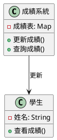
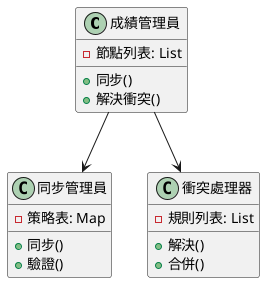
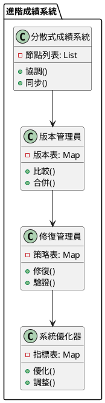

# 最終一致性教學

## 初級（Beginner）層級

### 1. 概念說明
最終一致性就像是在教室裡傳紙條：
- 當老師要更新班級成績時，不需要立即讓所有同學都看到
- 同學們可能會在不同時間看到成績
- 但最後大家都會看到相同的成績

初級學習者需要了解：
- 什麼是最終一致性（就像傳紙條一樣，訊息最終會傳到每個人手上）
- 為什麼需要最終一致性（讓系統運作更快更順暢）
- 基本的資料更新方式（就像寫在紙條上傳給大家）

### 2. 使用原因
最終一致性的主要使用原因包括：
1. 系統效能：
   - 讓系統跑得更快
   - 減少等待時間
   - 更有效率地使用資源

2. 可用性：
   - 確保系統不會當機
   - 即使部分功能出問題，其他功能仍可使用
   - 提升系統穩定性

3. 擴展性：
   - 可以讓更多使用者同時使用
   - 方便增加新功能
   - 適應大量使用者

### 3. 問題表象
常見的問題表象包括：
1. 資料不一致：
   - 看到舊的資料
   - 資料更新比較慢
   - 資料可能有衝突

2. 系統問題：
   - 網路速度慢
   - 部分功能暫時不能用
   - 同步失敗

3. 效能問題：
   - 讀取資料比較慢
   - 更新資料要等比較久
   - 系統資源使用較多

### 4. 避免方法
避免問題的方法包括：
1. 系統設計：
   - 選擇合適的同步方式
   - 設計好的同步機制
   - 建立監控系統

2. 資料管理：
   - 定期檢查資料
   - 優化同步方式
   - 確保資料正確

3. 效能優化：
   - 設定合適的同步時間
   - 優化讀寫方式
   - 平衡系統負載

### 5. 問題處理
遇到問題時的處理方法：
1. 資料不一致處理：
   - 檢查資料版本
   - 解決資料衝突
   - 修復資料

2. 系統問題處理：
   - 檢查網路
   - 修復故障
   - 重試同步

3. 效能問題處理：
   - 優化讀寫方式
   - 調整同步時間
   - 優化資源使用

### 6. PlantUML 圖解


### 7. 分段教學步驟

#### 步驟 1：基本成績系統
```java
public class 簡單成績系統 {
    private Map<String, Integer> 成績表;
    private 監控器 監控;
    private 驗證器 驗證;
    
    public 簡單成績系統() {
        成績表 = new HashMap<>();
        監控 = new 監控器();
        驗證 = new 驗證器();
    }
    
    public void 更新成績(String 學號, int 成績) {
        // 驗證更新
        if (!驗證.檢查更新(學號, 成績)) {
            System.out.println("更新失敗！");
            return;
        }
        
        // 非同步更新成績
        new Thread(() -> {
            成績表.put(學號, 成績);
            監控.記錄更新(學號, 成績);
            System.out.println("更新學生 " + 學號 + " 的成績: " + 成績);
        }).start();
    }
    
    public Integer 查詢成績(String 學號) {
        // 檢查資料一致性
        if (!監控.檢查一致性(學號)) {
            System.out.println("資料不一致警告！");
        }
        return 成績表.get(學號);
    }
}

class 監控器 {
    private Map<String, Integer> 最後更新;
    private Map<String, Integer> 更新次數;
    
    public 監控器() {
        最後更新 = new HashMap<>();
        更新次數 = new HashMap<>();
    }
    
    public void 記錄更新(String 學號, int 成績) {
        最後更新.put(學號, 成績);
        更新次數.merge(學號, 1, Integer::sum);
    }
    
    public boolean 檢查一致性(String 學號) {
        return 更新次數.getOrDefault(學號, 0) > 0;
    }
}

class 驗證器 {
    public boolean 檢查更新(String 學號, int 成績) {
        return 學號 != null && !學號.isEmpty() && 成績 >= 0 && 成績 <= 100;
    }
}
```

#### 步驟 2：簡單的成績查詢
```java
public class 成績查詢器 {
    private 簡單成績系統 成績系統;
    
    public void 查詢成績(String 學號) {
        // 嘗試讀取成績
        Integer 成績 = 成績系統.查詢成績(學號);
        
        if (成績 != null) {
            System.out.println("學生 " + 學號 + " 的成績是: " + 成績);
        } else {
            System.out.println("成績尚未更新");
        }
    }
}
```

## 中級（Intermediate）層級

### 1. 概念說明
中級學習者需要理解：
- 最終一致性的實現方式（如何讓資料最終一致）
- 資料同步機制（如何讓資料在不同地方同步）
- 衝突解決策略（當資料有衝突時如何解決）
- 讀取優化（如何讓讀取資料更快）

### 2. PlantUML 圖解


### 3. 分段教學步驟

#### 步驟 1：資料同步
```java
import java.util.*;

public class 同步管理員 {
    private List<成績節點> 節點列表;
    private Map<String, 同步策略> 策略表;
    private 監控器 監控;
    private 驗證器 驗證;
    
    public void 同步(String 學號, int 成績) {
        // 驗證同步
        if (!驗證.檢查同步(學號, 成績)) {
            System.out.println("同步失敗！");
            return;
        }
        
        // 選擇同步策略
        同步策略 策略 = 選擇策略(學號);
        
        // 執行同步
        策略.同步(節點列表, 學號, 成績);
        
        // 記錄同步操作
        監控.記錄同步(學號, 成績);
    }
    
    private 同步策略 選擇策略(String 學號) {
        return 策略表.getOrDefault(學號, new 預設同步策略());
    }
}

interface 同步策略 {
    void 同步(List<成績節點> 節點列表, String 學號, int 成績);
}

class 預設同步策略 implements 同步策略 {
    @Override
    public void 同步(List<成績節點> 節點列表, String 學號, int 成績) {
        for (成績節點 節點 : 節點列表) {
            節點.非同步更新成績(學號, 成績);
        }
    }
}
```

#### 步驟 2：衝突處理
```java
public class 衝突處理器 {
    private List<衝突規則> 規則列表;
    
    public void 解決衝突(String 學號, List<Integer> 成績列表) {
        // 選擇衝突解決規則
        衝突規則 規則 = 選擇規則(學號);
        
        // 解決衝突
        int 解決後成績 = 規則.解決(成績列表);
        
        // 更新所有節點
        更新節點(學號, 解決後成績);
    }
    
    private 衝突規則 選擇規則(String 學號) {
        return 規則列表.stream()
            .filter(規則 -> 規則.適用於(學號))
            .findFirst()
            .orElse(new 預設衝突規則());
    }
}

interface 衝突規則 {
    boolean 適用於(String 學號);
    int 解決(List<Integer> 成績列表);
}
```

## 高級（Advanced）層級

### 1. 概念說明
高級學習者需要掌握：
- 分散式系統設計（如何設計多台電腦一起工作的系統）
- 版本控制（如何追蹤資料的變化）
- 讀取修復（如何修復讀取到的錯誤資料）
- 寫入修復（如何修復寫入時的錯誤）

### 2. PlantUML 圖解


### 3. 分段教學步驟

#### 步驟 1：版本控制
```java
import java.util.*;

public class 版本管理員 {
    private Map<String, Long> 版本表;
    
    public 版本管理員() {
        版本表 = new HashMap<>();
    }
    
    public void 增加版本(String 學號) {
        版本表.merge(學號, 1L, Long::sum);
    }
    
    public boolean 是否同時(String 學號, long 其他版本) {
        long 當前版本 = 版本表.getOrDefault(學號, 0L);
        return 當前版本 > 其他版本;
    }
    
    public void 合併版本(String 學號, long 其他版本) {
        版本表.merge(學號, 其他版本, Math::max);
    }
}
```

#### 步驟 2：讀取修復
```java
public class 讀取修復器 {
    private 分散式成績系統 系統;
    private 版本管理員 版本管理員;
    
    public int 修復讀取(String 學號) {
        // 從多個節點讀取
        List<成績結果> 結果列表 = 從節點讀取(學號);
        
        // 檢查一致性
        if (需要修復(結果列表)) {
            // 執行修復
            修復不一致(學號, 結果列表);
        }
        
        // 返回最新值
        return 取得最新成績(結果列表);
    }
    
    private List<成績結果> 從節點讀取(String 學號) {
        List<成績結果> 結果列表 = new ArrayList<>();
        for (成績節點 節點 : 系統.取得節點列表()) {
            結果列表.add(節點.讀取成績(學號));
        }
        return 結果列表;
    }
    
    private boolean 需要修復(List<成績結果> 結果列表) {
        return 結果列表.stream()
            .map(成績結果::取得成績)
            .distinct()
            .count() > 1;
    }
}

class 成績結果 {
    private int 成績;
    private long 版本;
    
    public 成績結果(int 成績, long 版本) {
        this.成績 = 成績;
        this.版本 = 版本;
    }
    
    public int 取得成績() {
        return 成績;
    }
}
```

#### 步驟 3：寫入修復
```java
public class 寫入修復器 {
    private 分散式成績系統 系統;
    private 版本管理員 版本管理員;
    
    public void 修復寫入(String 學號, int 成績) {
        // 寫入到多個節點
        List<寫入結果> 結果列表 = 寫入節點(學號, 成績);
        
        // 檢查寫入結果
        if (需要修復(結果列表)) {
            // 執行修復
            修復不一致(學號, 成績, 結果列表);
        }
    }
    
    private List<寫入結果> 寫入節點(String 學號, int 成績) {
        List<寫入結果> 結果列表 = new ArrayList<>();
        for (成績節點 節點 : 系統.取得節點列表()) {
            結果列表.add(節點.寫入成績(學號, 成績));
        }
        return 結果列表;
    }
    
    private boolean 需要修復(List<寫入結果> 結果列表) {
        return 結果列表.stream()
            .anyMatch(結果 -> !結果.是否成功());
    }
}

class 寫入結果 {
    private boolean 成功;
    private long 版本;
    
    public 寫入結果(boolean 成功, long 版本) {
        this.成功 = 成功;
        this.版本 = 版本;
    }
    
    public boolean 是否成功() {
        return 成功;
    }
}
```

### 4. 常見問題與解決方案

#### 問題表象
1. 資料不一致：
   - 讀取到舊資料
   - 資料更新延遲
   - 資料衝突

2. 系統問題：
   - 網路延遲
   - 節點故障
   - 同步失敗

3. 效能問題：
   - 讀取延遲
   - 寫入阻塞
   - 資源消耗

#### 避免方法
1. 系統設計：
   - 選擇適當的一致性策略
   - 設計有效的同步機制
   - 建立監控系統

2. 資料管理：
   - 定期檢查資料一致性
   - 優化同步策略
   - 確保資料完整性

3. 效能優化：
   - 合理設置同步頻率
   - 優化讀寫策略
   - 實現負載均衡

#### 處理方案
1. 技術方案：
   ```java
   public class 一致性管理員 {
       private 一致性策略 策略;
       private 監控器 監控;
       private 驗證器 驗證;
       private 優化器 優化器;
       
       public void 處理一致性問題(一致性問題 問題) {
           switch (問題.取得類型()) {
               case 資料:
                   處理資料問題(問題);
                   break;
               case 系統:
                   處理系統問題(問題);
                   break;
               case 效能:
                   處理效能問題(問題);
                   break;
           }
       }
       
       private void 處理資料問題(一致性問題 問題) {
           // 檢查資料版本
           檢查資料版本();
           // 解決資料衝突
           解決衝突();
           // 修復資料完整性
           修復資料完整性();
       }
       
       private void 處理系統問題(一致性問題 問題) {
           // 檢查網路狀態
           檢查網路狀態();
           // 修復節點故障
           修復節點故障();
           // 重試同步操作
           重試同步();
       }
       
       private void 處理效能問題(一致性問題 問題) {
           // 優化讀寫策略
           優化讀寫();
           // 調整同步頻率
           調整同步頻率();
           // 優化資源使用
           優化資源();
       }
   }
   ```

2. 監控方案：
   ```java
   public class 一致性監控器 {
       private 指標收集器 指標收集器;
       private 一致性檢查器 一致性檢查器;
       private 警告管理員 警告管理員;
       
       public void 監控一致性() {
           一致性指標 指標 = 指標收集器.收集指標();
           一致性狀態 狀態 = 一致性檢查器.檢查一致性();
           
           // 檢查資料一致性
           if (!狀態.是否一致()) {
               警告管理員.警告("資料不一致警告", 狀態.取得詳細資訊());
           }
           
           // 檢查系統狀態
           if (指標.取得系統狀態() != 系統狀態.健康) {
               警告管理員.警告("系統狀態警告", 指標.取得詳細資訊());
           }
           
           // 檢查效能指標
           if (指標.取得效能() < 效能閾值) {
               警告管理員.警告("效能警告", 指標.取得詳細資訊());
           }
       }
   }
   ```

3. 最佳實踐：
   - 實現自動化同步
   - 配置智能監控
   - 建立告警機制
   - 優化同步策略
   - 定期效能優化
   - 保持系統文檔
   - 建立應急流程

### 5. 實戰案例

#### 案例一：電商系統最終一致性
```java
public class 電商一致性 {
    private 一致性管理員 一致性管理員;
    private 監控器 監控;
    
    public void 更新商品庫存(String 商品編號, int 數量) {
        // 設定一致性策略
        一致性管理員.設定策略(new 商品一致性策略(商品編號));
        
        // 執行更新
        一致性管理員.更新(商品編號, 數量);
        
        // 檢查一致性
        監控.檢查一致性();
    }
    
    public void 更新訂單狀態(String 訂單編號, String 狀態) {
        // 設定一致性策略
        一致性管理員.設定策略(new 訂單一致性策略(訂單編號));
        
        // 執行更新
        一致性管理員.更新(訂單編號, 狀態);
        
        // 檢查一致性
        監控.檢查一致性();
    }
}
```

#### 案例二：社交媒體最終一致性
```java
public class 社交媒體一致性 {
    private 一致性管理員 一致性管理員;
    private 監控器 監控;
    
    public void 更新使用者資料(String 使用者編號, String 資料) {
        // 設定一致性策略
        一致性管理員.設定策略(new 使用者一致性策略(使用者編號));
        
        // 執行更新
        一致性管理員.更新(使用者編號, 資料);
        
        // 檢查一致性
        監控.檢查一致性();
    }
    
    public void 更新貼文內容(String 貼文編號, String 內容) {
        // 設定一致性策略
        一致性管理員.設定策略(new 貼文一致性策略(貼文編號));
        
        // 執行更新
        一致性管理員.更新(貼文編號, 內容);
        
        // 檢查一致性
        監控.檢查一致性();
    }
}
```

這個教學文件提供了從基礎到進階的最終一致性學習路徑，每個層級都包含了相應的概念說明、圖解、教學步驟和實作範例。初級學習者可以從基本的成績系統開始，中級學習者可以學習資料同步和衝突處理，而高級學習者則可以掌握版本控制和修復機制等進階功能。 