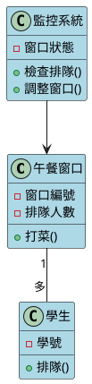
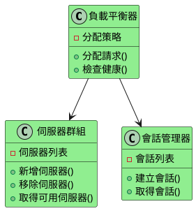
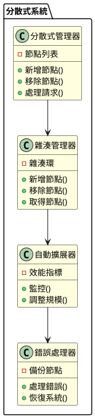

# 水平擴展教學：讓你的程式像樂高積木一樣可以無限組合

## 初級（Beginner）層級

### 1. 概念說明
想像你在玩線上遊戲，當越來越多人加入時，遊戲會變得很慢。水平擴展就像是在遊戲中增加新的伺服器，讓更多人可以一起玩而不會卡頓。

初級學習者需要了解：
- 什麼是水平擴展（就像增加遊戲伺服器）
- 為什麼需要多台電腦一起工作
- 如何平均分配工作

### 2. 使用原因
就像學校的午餐時間：
1. 效能提升：
   - 多開幾個打菜窗口，大家就不用排太久
   - 每個窗口都有足夠的食物
   - 不會有人餓肚子

2. 可用性：
   - 如果一個窗口壞了，還有其他窗口可以用
   - 不會因為一個問題就全部停擺
   - 服務可以一直持續

3. 擴展性：
   - 學生變多時可以開更多窗口
   - 放學時可以關掉一些窗口
   - 可以根據需要調整

### 3. 問題表象
就像學校的午餐時間可能遇到的問題：
1. 負載問題：
   - 有些窗口排很長，有些沒人
   - 食物準備太多或太少
   - 打菜速度太慢

2. 系統問題：
   - 窗口突然壞掉
   - 網路連線不穩
   - 資料不同步

3. 管理問題：
   - 不知道要開幾個窗口
   - 不知道食物夠不夠
   - 維護成本太高

### 4. 避免方法
就像學校午餐時間的管理：
1. 系統設計：
   - 選擇合適的窗口數量
   - 平均分配學生到各窗口
   - 隨時監控排隊狀況

2. 資源管理：
   - 準備適量的食物
   - 根據人數調整窗口
   - 自動調整窗口數量

3. 效能優化：
   - 優化打菜流程
   - 平均分配學生
   - 定期檢查效率

### 5. PlantUML 圖解


### 6. 分段教學步驟

#### 步驟 1：基本負載分配
```java
// 簡單的午餐窗口管理系統
public class LunchWindow {
    private int windowNumber;  // 窗口編號
    private int queueLength;   // 排隊人數
    
    public LunchWindow(int number) {
        this.windowNumber = number;
        this.queueLength = 0;
    }
    
    public void serveStudent() {
        if (queueLength > 0) {
            queueLength--;
            System.out.println("窗口 " + windowNumber + " 服務了一位學生");
        }
    }
    
    public void addToQueue() {
        queueLength++;
        System.out.println("窗口 " + windowNumber + " 增加了一位排隊學生");
    }
}

// 主程式
public class Main {
    public static void main(String[] args) {
        // 創建三個午餐窗口
        LunchWindow[] windows = new LunchWindow[3];
        for (int i = 0; i < 3; i++) {
            windows[i] = new LunchWindow(i + 1);
        }
        
        // 模擬學生排隊
        for (int i = 0; i < 10; i++) {
            // 選擇排隊人數最少的窗口
            int minQueue = 0;
            for (int j = 1; j < windows.length; j++) {
                if (windows[j].getQueueLength() < windows[minQueue].getQueueLength()) {
                    minQueue = j;
                }
            }
            windows[minQueue].addToQueue();
        }
    }
}
```

## 中級（Intermediate）層級

### 1. 概念說明
中級學習者需要理解：
- 如何聰明地分配工作（負載平衡）
- 如何檢查系統是否正常（健康檢查）
- 如何記住使用者的狀態（會話管理）
- 如何讓資料保持一致（資料同步）

### 2. PlantUML 圖解


### 3. 分段教學步驟

#### 步驟 1：進階負載平衡
```java
// 使用 Apache Commons 的負載平衡器
import org.apache.commons.pool2.impl.GenericObjectPool;
import org.apache.commons.pool2.impl.GenericObjectPoolConfig;

public class AdvancedLoadBalancer {
    private GenericObjectPool<Server> serverPool;
    private SessionManager sessionManager;
    
    public AdvancedLoadBalancer() {
        // 設定伺服器池
        GenericObjectPoolConfig<Server> config = new GenericObjectPoolConfig<>();
        config.setMaxTotal(10);  // 最多10台伺服器
        config.setMinIdle(2);    // 最少2台閒置伺服器
        
        serverPool = new GenericObjectPool<>(new ServerFactory(), config);
    }
    
    public void handleRequest(Request request) {
        try {
            // 從池中取得伺服器
            Server server = serverPool.borrowObject();
            
            // 處理請求
            server.handleRequest(request);
            
            // 歸還伺服器
            serverPool.returnObject(server);
        } catch (Exception e) {
            System.out.println("處理請求時發生錯誤: " + e.getMessage());
        }
    }
}
```

## 高級（Advanced）層級

### 1. 概念說明
高級學習者需要掌握：
- 如何設計分散式系統
- 如何使用一致性雜湊
- 如何自動調整系統規模
- 如何處理系統錯誤

### 2. PlantUML 圖解


### 3. 分段教學步驟

#### 步驟 1：使用 Hazelcast 實現分散式系統
```java
import com.hazelcast.core.Hazelcast;
import com.hazelcast.core.HazelcastInstance;
import com.hazelcast.map.IMap;

public class DistributedSystem {
    private HazelcastInstance hazelcast;
    private IMap<String, Object> distributedMap;
    
    public DistributedSystem() {
        // 建立 Hazelcast 實例
        hazelcast = Hazelcast.newHazelcastInstance();
        distributedMap = hazelcast.getMap("my-distributed-map");
    }
    
    public void storeData(String key, Object value) {
        distributedMap.put(key, value);
    }
    
    public Object getData(String key) {
        return distributedMap.get(key);
    }
    
    public void shutdown() {
        hazelcast.shutdown();
    }
}
```

### 4. 實戰案例

#### 案例：線上遊戲伺服器
```java
// 使用 Spring Cloud 實現遊戲伺服器集群
import org.springframework.cloud.client.discovery.EnableDiscoveryClient;
import org.springframework.boot.SpringApplication;
import org.springframework.boot.autoconfigure.SpringBootApplication;

@SpringBootApplication
@EnableDiscoveryClient
public class GameServer {
    public static void main(String[] args) {
        SpringApplication.run(GameServer.class, args);
    }
    
    // 遊戲邏輯處理
    @RestController
    public class GameController {
        @PostMapping("/play")
        public String handleGameRequest(@RequestBody GameRequest request) {
            // 處理遊戲請求
            return "遊戲請求已處理";
        }
    }
}
```

這個教學文件從基礎到進階，用生活化的例子（如學校午餐窗口）來解釋水平擴展的概念。初級學習者可以從基本的負載分配開始，中級學習者可以學習會話管理和進階負載平衡，而高級學習者則可以掌握分散式系統設計和容錯處理等進階功能。每個層級都提供了相應的程式碼範例和視覺化的 PlantUML 圖解，幫助學生更好地理解概念。 