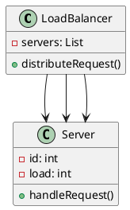
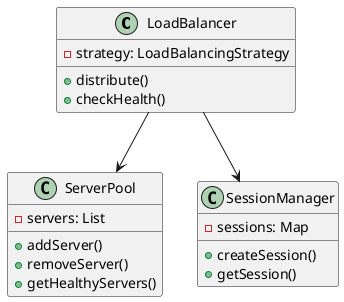
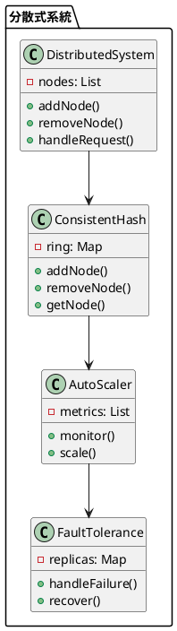

# 水平擴展教學

## 初級（Beginner）層級

### 1. 概念說明
水平擴展就像是在學校裡，當一個班級的學生太多時，我們可以：
- 開設新的班級（新增伺服器）
- 分配學生到不同班級（分散負載）
- 讓不同班級一起工作（協同處理）

初級學習者需要了解：
- 什麼是水平擴展
- 為什麼需要多台伺服器
- 基本的負載分配

### 2. 使用原因
水平擴展的主要使用原因包括：
1. 效能提升：
   - 提高系統吞吐量
   - 減少響應時間
   - 優化資源使用

2. 可用性：
   - 避免單點故障
   - 提供故障轉移
   - 確保服務不中斷

3. 擴展性：
   - 支援業務增長
   - 適應流量波動
   - 方便資源調整

### 3. 問題表象
常見的問題表象包括：
1. 負載問題：
   - 負載不均衡
   - 資源浪費
   - 效能瓶頸

2. 系統問題：
   - 節點故障
   - 網路延遲
   - 同步失敗

3. 管理問題：
   - 配置複雜
   - 監控困難
   - 維護成本高

### 4. 避免方法
避免問題的方法包括：
1. 系統設計：
   - 選擇適當的擴展策略
   - 設計有效的負載均衡
   - 建立監控系統

2. 資源管理：
   - 合理分配資源
   - 優化負載策略
   - 實現自動擴展

3. 效能優化：
   - 優化資源使用
   - 實現負載均衡
   - 定期效能評估

### 5. 問題處理
遇到問題時的處理方法：
1. 負載問題處理：
   - 調整負載策略
   - 優化資源分配
   - 實現動態擴展

2. 系統問題處理：
   - 檢查節點狀態
   - 修復網路問題
   - 重試同步操作

3. 管理問題處理：
   - 簡化配置流程
   - 加強監控系統
   - 優化維護流程

### 6. PlantUML 圖解


### 7. 分段教學步驟

#### 步驟 1：基本負載分配
```java
public class SimpleLoadBalancer {
    private List<Server> servers;
    private LoadMonitor monitor;
    private LoadValidator validator;
    
    public SimpleLoadBalancer() {
        servers = new ArrayList<>();
        monitor = new LoadMonitor();
        validator = new LoadValidator();
        // 初始化三台伺服器
        servers.add(new Server(1));
        servers.add(new Server(2));
        servers.add(new Server(3));
    }
    
    public void handleRequest(Request request) {
        // 驗證請求
        if (!validator.validateRequest(request)) {
            System.out.println("請求驗證失敗！");
            return;
        }
        
        // 簡單的輪詢分配
        Server server = servers.get(request.getCount() % servers.size());
        server.handleRequest(request);
        
        // 監控負載
        monitor.recordLoad(server);
    }
}

class Server {
    private int id;
    private int load;
    
    public Server(int id) {
        this.id = id;
        this.load = 0;
    }
    
    public void handleRequest(Request request) {
        load++;
        System.out.println("伺服器 " + id + " 處理請求，目前負載: " + load);
    }
}

class Request {
    private static int count = 0;
    private int id;
    
    public Request() {
        this.id = ++count;
    }
    
    public int getCount() {
        return count;
    }
}

class LoadMonitor {
    private Map<Integer, Integer> serverLoads;
    private Map<Integer, Integer> requestCounts;
    
    public LoadMonitor() {
        serverLoads = new HashMap<>();
        requestCounts = new HashMap<>();
    }
    
    public void recordLoad(Server server) {
        int serverId = server.getId();
        serverLoads.merge(serverId, 1, Integer::sum);
        requestCounts.merge(serverId, 1, Integer::sum);
    }
    
    public boolean shouldAddServer() {
        return serverLoads.values().stream()
            .anyMatch(load -> load > 80);
    }
}

class LoadValidator {
    public boolean validateRequest(Request request) {
        return request != null && request.getId() > 0;
    }
}
```

#### 步驟 2：簡單的負載監控
```java
public class LoadMonitor {
    private List<Server> servers;
    
    public void checkLoad() {
        for (Server server : servers) {
            System.out.println("伺服器 " + server.getId() + 
                             " 的負載: " + server.getLoad());
        }
    }
    
    public void addNewServer() {
        if (shouldAddServer()) {
            Server newServer = new Server(servers.size() + 1);
            servers.add(newServer);
            System.out.println("新增伺服器 " + newServer.getId());
        }
    }
    
    private boolean shouldAddServer() {
        // 如果任何伺服器的負載超過 80%，就新增伺服器
        return servers.stream()
            .anyMatch(server -> server.getLoad() > 80);
    }
}
```

## 中級（Intermediate）層級

### 1. 概念說明
中級學習者需要理解：
- 負載平衡策略
- 伺服器健康檢查
- 會話管理
- 資料同步

### 2. PlantUML 圖解


### 3. 分段教學步驟

#### 步驟 1：進階負載平衡
```java
import java.util.*;

public class AdvancedLoadBalancer {
    private LoadBalancingStrategy strategy;
    private ServerPool serverPool;
    private SessionManager sessionManager;
    private LoadMonitor monitor;
    private LoadValidator validator;
    
    public void distributeRequest(Request request) {
        // 驗證請求
        if (!validator.validateRequest(request)) {
            System.out.println("請求驗證失敗！");
            return;
        }
        
        // 檢查伺服器健康狀態
        List<Server> healthyServers = serverPool.getHealthyServers();
        
        // 根據策略選擇伺服器
        Server selectedServer = strategy.selectServer(healthyServers, request);
        
        // 處理會話
        String sessionId = request.getSessionId();
        if (sessionId != null) {
            // 確保會話被分配到同一台伺服器
            selectedServer = sessionManager.getServerForSession(sessionId);
        }
        
        // 分配請求
        selectedServer.handleRequest(request);
        
        // 監控負載
        monitor.recordLoad(selectedServer);
    }
}

interface LoadBalancingStrategy {
    Server selectServer(List<Server> servers, Request request);
}

class RoundRobinStrategy implements LoadBalancingStrategy {
    private int currentIndex = 0;
    
    @Override
    public Server selectServer(List<Server> servers, Request request) {
        Server server = servers.get(currentIndex);
        currentIndex = (currentIndex + 1) % servers.size();
        return server;
    }
}
```

#### 步驟 2：會話管理
```java
public class SessionManager {
    private Map<String, Server> sessionToServer;
    private Map<String, Session> sessions;
    
    public Session createSession(User user) {
        String sessionId = generateSessionId();
        Session session = new Session(sessionId, user);
        sessions.put(sessionId, session);
        return session;
    }
    
    public Server getServerForSession(String sessionId) {
        return sessionToServer.get(sessionId);
    }
    
    public void assignSessionToServer(String sessionId, Server server) {
        sessionToServer.put(sessionId, server);
    }
}

class Session {
    private String id;
    private User user;
    private Date createdAt;
    private Date lastAccessed;
    
    public Session(String id, User user) {
        this.id = id;
        this.user = user;
        this.createdAt = new Date();
        this.lastAccessed = new Date();
    }
}
```

## 高級（Advanced）層級

### 1. 概念說明
高級學習者需要掌握：
- 分散式系統設計
- 一致性雜湊
- 自動擴展
- 容錯處理

### 2. PlantUML 圖解


### 3. 分段教學步驟

#### 步驟 1：一致性雜湊
```java
import java.util.*;

public class ConsistentHash {
    private TreeMap<Long, Node> ring;
    private int numberOfReplicas;
    
    public ConsistentHash(int numberOfReplicas) {
        this.ring = new TreeMap<>();
        this.numberOfReplicas = numberOfReplicas;
    }
    
    public void addNode(Node node) {
        for (int i = 0; i < numberOfReplicas; i++) {
            long hash = hash(node.getId() + i);
            ring.put(hash, node);
        }
    }
    
    public Node getNode(String key) {
        if (ring.isEmpty()) {
            return null;
        }
        
        long hash = hash(key);
        if (!ring.containsKey(hash)) {
            SortedMap<Long, Node> tail = ring.tailMap(hash);
            hash = tail.isEmpty() ? ring.firstKey() : tail.firstKey();
        }
        
        return ring.get(hash);
    }
    
    private long hash(String key) {
        // 實作雜湊函數
        return key.hashCode();
    }
}

class Node {
    private String id;
    private Map<String, Object> data;
    
    public Node(String id) {
        this.id = id;
        this.data = new HashMap<>();
    }
    
    public String getId() {
        return id;
    }
}
```

#### 步驟 2：自動擴展
```java
public class AutoScaler {
    private List<Node> nodes;
    private List<Metric> metrics;
    private int minNodes;
    private int maxNodes;
    
    public void monitor() {
        // 收集效能指標
        collectMetrics();
        
        // 分析是否需要擴展
        if (shouldScaleUp()) {
            scaleUp();
        } else if (shouldScaleDown()) {
            scaleDown();
        }
    }
    
    private void scaleUp() {
        if (nodes.size() < maxNodes) {
            Node newNode = new Node("node-" + (nodes.size() + 1));
            nodes.add(newNode);
            System.out.println("新增節點: " + newNode.getId());
        }
    }
    
    private void scaleDown() {
        if (nodes.size() > minNodes) {
            Node nodeToRemove = nodes.remove(nodes.size() - 1);
            System.out.println("移除節點: " + nodeToRemove.getId());
        }
    }
}

class Metric {
    private String name;
    private double value;
    private Date timestamp;
    
    public Metric(String name, double value) {
        this.name = name;
        this.value = value;
        this.timestamp = new Date();
    }
}
```

#### 步驟 3：容錯處理
```java
public class FaultTolerance {
    private Map<String, List<Node>> replicas;
    private int replicationFactor;
    
    public void handleFailure(Node failedNode) {
        // 找出受影響的資料
        List<String> affectedKeys = getAffectedKeys(failedNode);
        
        // 從其他副本恢復資料
        for (String key : affectedKeys) {
            recoverData(key);
        }
        
        // 重新分配副本
        redistributeReplicas(failedNode);
    }
    
    private void recoverData(String key) {
        List<Node> replicaNodes = replicas.get(key);
        for (Node node : replicaNodes) {
            if (!node.isFailed()) {
                // 從健康的副本複製資料
                copyData(key, node);
                break;
            }
        }
    }
    
    private void redistributeReplicas(Node failedNode) {
        // 重新分配副本到其他節點
        for (List<Node> replicaList : replicas.values()) {
            if (replicaList.contains(failedNode)) {
                replicaList.remove(failedNode);
                Node newNode = selectNewReplicaNode();
                replicaList.add(newNode);
            }
        }
    }
}
```

### 4. 常見問題與解決方案

#### 問題表象
1. 負載問題：
   - 負載不均衡
   - 資源浪費
   - 效能瓶頸

2. 系統問題：
   - 節點故障
   - 網路延遲
   - 同步失敗

3. 管理問題：
   - 配置複雜
   - 監控困難
   - 維護成本高

#### 避免方法
1. 系統設計：
   - 選擇適當的擴展策略
   - 設計有效的負載均衡
   - 建立監控系統

2. 資源管理：
   - 合理分配資源
   - 優化負載策略
   - 實現自動擴展

3. 效能優化：
   - 優化資源使用
   - 實現負載均衡
   - 定期效能評估

#### 處理方案
1. 技術方案：
   ```java
   public class ScalingManager {
       private ScalingStrategy strategy;
       private LoadMonitor monitor;
       private LoadValidator validator;
       private ScalingOptimizer optimizer;
       
       public void handleScalingIssue(ScalingIssue issue) {
           switch (issue.getType()) {
               case LOAD:
                   handleLoadIssue(issue);
                   break;
               case SYSTEM:
                   handleSystemIssue(issue);
                   break;
               case MANAGEMENT:
                   handleManagementIssue(issue);
                   break;
           }
       }
       
       private void handleLoadIssue(ScalingIssue issue) {
           // 調整負載策略
           adjustLoadStrategy();
           // 優化資源分配
           optimizeResourceAllocation();
           // 實現動態擴展
           implementDynamicScaling();
       }
       
       private void handleSystemIssue(ScalingIssue issue) {
           // 檢查節點狀態
           checkNodeStatus();
           // 修復網路問題
           repairNetwork();
           // 重試同步操作
           retrySync();
       }
       
       private void handleManagementIssue(ScalingIssue issue) {
           // 簡化配置流程
           simplifyConfiguration();
           // 加強監控系統
           enhanceMonitoring();
           // 優化維護流程
           optimizeMaintenance();
       }
   }
   ```

2. 監控方案：
   ```java
   public class ScalingMonitor {
       private MetricsCollector metricsCollector;
       private ScalingChecker scalingChecker;
       private AlertManager alertManager;
       
       public void monitorScaling() {
           ScalingMetrics metrics = metricsCollector.collectMetrics();
           ScalingStatus status = scalingChecker.checkScaling();
           
           // 檢查負載狀態
           if (metrics.getLoadStatus() != LoadStatus.BALANCED) {
               alertManager.alert("負載警告", metrics.getDetails());
           }
           
           // 檢查系統狀態
           if (metrics.getSystemStatus() != SystemStatus.HEALTHY) {
               alertManager.alert("系統狀態警告", metrics.getDetails());
           }
           
           // 檢查管理狀態
           if (metrics.getManagementStatus() != ManagementStatus.OPTIMAL) {
               alertManager.alert("管理警告", metrics.getDetails());
           }
       }
   }
   ```

3. 最佳實踐：
   - 實現自動化擴展
   - 配置智能監控
   - 建立告警機制
   - 優化負載策略
   - 定期效能評估
   - 保持系統文檔
   - 建立應急流程

### 5. 實戰案例

#### 案例一：電商系統水平擴展
```java
public class ECommerceScaling {
    private ScalingManager scalingManager;
    private ScalingMonitor monitor;
    
    public void handleProductRequest(String productId) {
        // 設定擴展策略
        scalingManager.setStrategy(new ProductScalingStrategy(productId));
        
        // 處理請求
        scalingManager.handleRequest(productId);
        
        // 檢查擴展狀態
        monitor.checkScaling();
    }
    
    public void handleOrderRequest(String orderId) {
        // 設定擴展策略
        scalingManager.setStrategy(new OrderScalingStrategy(orderId));
        
        // 處理請求
        scalingManager.handleRequest(orderId);
        
        // 檢查擴展狀態
        monitor.checkScaling();
    }
}
```

#### 案例二：社交媒體水平擴展
```java
public class SocialMediaScaling {
    private ScalingManager scalingManager;
    private ScalingMonitor monitor;
    
    public void handleUserRequest(String userId) {
        // 設定擴展策略
        scalingManager.setStrategy(new UserScalingStrategy(userId));
        
        // 處理請求
        scalingManager.handleRequest(userId);
        
        // 檢查擴展狀態
        monitor.checkScaling();
    }
    
    public void handlePostRequest(String postId) {
        // 設定擴展策略
        scalingManager.setStrategy(new PostScalingStrategy(postId));
        
        // 處理請求
        scalingManager.handleRequest(postId);
        
        // 檢查擴展狀態
        monitor.checkScaling();
    }
}
```

這個教學文件提供了從基礎到進階的水平擴展學習路徑，每個層級都包含了相應的概念說明、圖解、教學步驟和實作範例。初級學習者可以從基本的負載分配開始，中級學習者可以學習會話管理和進階負載平衡，而高級學習者則可以掌握分散式系統設計和容錯處理等進階功能。 