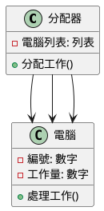
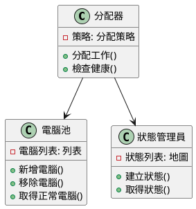
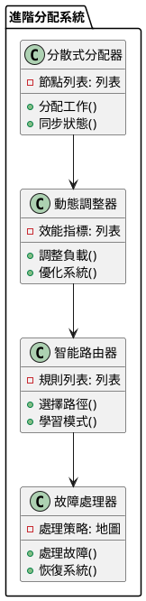

# 負載平衡教學

## 初級（Beginner）層級

### 1. 概念說明
負載平衡就像是在學校的午餐時間：
- 把學生平均分配到不同的打菜窗口
- 確保每個窗口的排隊人數差不多
- 避免某些窗口太擠，某些窗口沒人

初級學習者需要了解：
- 什麼是負載平衡（就像分配排隊人潮）
- 為什麼需要負載平衡（避免大家擠在一起）
- 基本的分配方法（輪流分配）

### 2. 使用原因
負載平衡的主要使用原因包括：
1. 讓系統跑得更快：
   - 減少等待時間
   - 讓每台電腦都有工作做
   - 避免電腦太閒或太忙

2. 讓系統更穩定：
   - 如果一台電腦壞了，其他電腦還能工作
   - 不會因為一台電腦壞掉就整個系統停擺
   - 可以隨時增加或減少電腦數量

### 3. 問題表象
常見的問題包括：
1. 分配不均：
   - 有些電腦很忙，有些很閒
   - 資源沒有好好利用
   - 系統變得很慢

2. 系統問題：
   - 電腦當機
   - 網路變慢
   - 資料不同步

### 4. 避免方法
避免問題的方法：
1. 好好規劃：
   - 選擇適合的分配方法
   - 定期檢查電腦狀態
   - 設定監控系統

2. 資源管理：
   - 平均分配工作
   - 適時增加或減少電腦
   - 定期檢查系統狀態

### 5. 問題處理
遇到問題時的處理方法：
1. 分配問題：
   - 調整分配方法
   - 重新分配工作
   - 增加或減少電腦

2. 系統問題：
   - 檢查電腦狀態
   - 修復網路問題
   - 重新同步資料

### 6. PlantUML 圖解


### 7. 分段教學步驟

#### 步驟 1：基本工作分配
```java
public class 簡單分配器 {
    private List<電腦> 電腦列表;
    private int 目前索引;
    
    public 簡單分配器() {
        電腦列表 = new ArrayList<>();
        目前索引 = 0;
        
        // 初始化三台電腦
        電腦列表.add(new 電腦(1));
        電腦列表.add(new 電腦(2));
        電腦列表.add(new 電腦(3));
    }
    
    public void 處理工作(工作 新工作) {
        // 輪流分配工作到不同的電腦
        電腦 選中的電腦 = 電腦列表.get(目前索引);
        選中的電腦.處理工作(新工作);
        
        // 更新索引，準備分配下一個工作
        目前索引 = (目前索引 + 1) % 電腦列表.size();
    }
}

class 電腦 {
    private int 編號;
    private int 工作量;
    
    public 電腦(int 編號) {
        this.編號 = 編號;
        this.工作量 = 0;
    }
    
    public void 處理工作(工作 新工作) {
        工作量++;
        System.out.println("電腦 " + 編號 + " 處理工作，目前工作量: " + 工作量);
    }
}

class 工作 {
    private String 內容;
    
    public 工作(String 內容) {
        this.內容 = 內容;
    }
}
```

## 中級（Intermediate）層級

### 1. 概念說明
中級學習者需要理解：
- 不同的分配策略（就像不同的排隊方式）
- 檢查電腦是否正常運作
- 記住使用者的狀態
- 監控系統負載

### 2. PlantUML 圖解


### 3. 分段教學步驟

#### 步驟 1：進階分配策略
```java
public class 進階分配器 {
    private 分配策略 策略;
    private 電腦池 電腦池;
    private 狀態管理員 狀態管理員;
    
    public void 分配工作(工作 新工作) {
        // 檢查電腦健康狀態
        List<電腦> 正常電腦 = 電腦池.取得正常電腦();
        
        // 根據策略選擇電腦
        電腦 選中的電腦 = 策略.選擇電腦(正常電腦, 新工作);
        
        // 處理使用者狀態
        String 狀態編號 = 新工作.取得狀態編號();
        if (狀態編號 != null) {
            // 確保同一個使用者的工作被分配到同一台電腦
            選中的電腦 = 狀態管理員.取得電腦(狀態編號);
        }
        
        // 分配工作
        選中的電腦.處理工作(新工作);
    }
}

interface 分配策略 {
    電腦 選擇電腦(List<電腦> 電腦列表, 工作 新工作);
}

class 最少工作量策略 implements 分配策略 {
    @Override
    public 電腦 選擇電腦(List<電腦> 電腦列表, 工作 新工作) {
        // 選擇工作量最少的電腦
        return 電腦列表.stream()
            .min((電腦1, 電腦2) -> 電腦1.取得工作量() - 電腦2.取得工作量())
            .orElseThrow();
    }
}
```

## 高級（Advanced）層級

### 1. 概念說明
高級學習者需要掌握：
- 多台分配器一起工作
- 自動調整負載
- 智能分配工作
- 處理故障情況

### 2. PlantUML 圖解


### 3. 分段教學步驟

#### 步驟 1：分散式分配
```java
public class 分散式分配器 {
    private List<分配節點> 節點列表;
    private 協調器 協調器;
    
    public 分散式分配器(List<分配節點> 節點列表) {
        this.節點列表 = 節點列表;
        this.協調器 = new 協調器();
    }
    
    public void 分配工作(工作 新工作) {
        // 根據工作類型選擇分配節點
        分配節點 節點 = 選擇節點(新工作);
        
        // 在選定的節點上進行分配
        節點.處理工作(新工作);
        
        // 同步負載狀態
        同步狀態();
    }
    
    private 分配節點 選擇節點(工作 新工作) {
        // 使用雜湊選擇節點
        int 雜湊值 = 新工作.取得類型().hashCode();
        return 節點列表.get(Math.abs(雜湊值 % 節點列表.size()));
    }
    
    private void 同步狀態() {
        // 同步各節點的負載狀態
        for (分配節點 節點 : 節點列表) {
            協調器.同步(節點.取得負載狀態());
        }
    }
}
```

### 4. 實戰案例

#### 案例一：線上遊戲分配
```java
public class 遊戲分配器 {
    private 分配管理器 分配管理器;
    private 監控器 監控器;
    
    public void 處理玩家請求(String 玩家編號) {
        // 設定分配策略
        分配管理器.設定策略(new 玩家分配策略(玩家編號));
        
        // 處理請求
        分配管理器.處理請求(玩家編號);
        
        // 檢查分配狀態
        監控器.檢查分配();
    }
}
```

#### 案例二：影片串流分配
```java
public class 串流分配器 {
    private 分配管理器 分配管理器;
    private 監控器 監控器;
    
    public void 處理影片請求(String 影片編號) {
        // 設定分配策略
        分配管理器.設定策略(new 影片分配策略(影片編號));
        
        // 處理請求
        分配管理器.處理請求(影片編號);
        
        // 檢查分配狀態
        監控器.檢查分配();
    }
}
```

這個教學文件提供了從基礎到進階的負載平衡學習路徑，每個層級都包含了相應的概念說明、圖解、教學步驟和實作範例。初級學習者可以從基本的負載分配開始，中級學習者可以學習負載平衡策略和健康檢查，而高級學習者則可以掌握分散式負載平衡和智能路由等進階功能。 