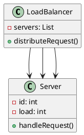
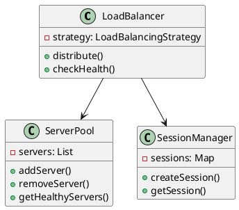
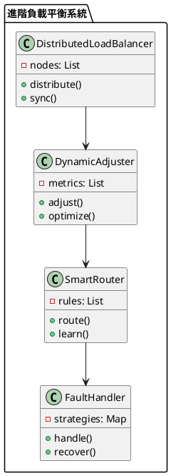

# 負載平衡教學

## 初級（Beginner）層級

### 1. 概念說明
負載平衡就像是在學校裡，當有很多學生要使用電腦教室時：
- 把學生平均分配到不同的電腦（伺服器）
- 確保每台電腦的工作量差不多
- 避免某些電腦太忙，某些電腦太閒

初級學習者需要了解：
- 什麼是負載平衡
- 為什麼需要負載平衡
- 基本的負載分配方法

### 2. 使用原因
負載平衡的主要使用原因包括：
1. 效能優化：
   - 提高系統吞吐量
   - 減少響應時間
   - 優化資源使用

2. 可用性提升：
   - 避免單點故障
   - 提供故障轉移
   - 確保服務不中斷

3. 擴展性：
   - 支援業務增長
   - 適應流量波動
   - 方便資源調整

### 3. 問題表象
常見的問題表象包括：
1. 負載問題：
   - 負載不均衡
   - 資源浪費
   - 效能瓶頸

2. 系統問題：
   - 節點故障
   - 網路延遲
   - 同步失敗

3. 管理問題：
   - 配置複雜
   - 監控困難
   - 維護成本高

### 4. 避免方法
避免問題的方法包括：
1. 系統設計：
   - 選擇適當的負載平衡策略
   - 設計有效的健康檢查機制
   - 建立監控系統

2. 資源管理：
   - 合理分配資源
   - 優化負載策略
   - 實現自動擴展

3. 效能優化：
   - 優化資源使用
   - 實現負載均衡
   - 定期效能評估

### 5. 問題處理
遇到問題時的處理方法：
1. 負載問題處理：
   - 調整負載策略
   - 優化資源分配
   - 實現動態擴展

2. 系統問題處理：
   - 檢查節點狀態
   - 修復網路問題
   - 重試同步操作

3. 管理問題處理：
   - 簡化配置流程
   - 加強監控系統
   - 優化維護流程

### 6. PlantUML 圖解


### 7. 分段教學步驟

#### 步驟 1：基本負載分配
```java
public class SimpleLoadBalancer {
    private List<Server> servers;
    private int currentIndex;
    private LoadMonitor monitor;
    private LoadValidator validator;
    
    public SimpleLoadBalancer() {
        servers = new ArrayList<>();
        currentIndex = 0;
        monitor = new LoadMonitor();
        validator = new LoadValidator();
        
        // 初始化三台伺服器
        servers.add(new Server(1));
        servers.add(new Server(2));
        servers.add(new Server(3));
    }
    
    public void handleRequest(Request request) {
        // 驗證請求
        if (!validator.validateRequest(request)) {
            System.out.println("請求驗證失敗！");
            return;
        }
        
        // 輪流分配請求到不同的伺服器
        Server server = servers.get(currentIndex);
        server.handleRequest(request);
        
        // 更新索引，準備分配下一個請求
        currentIndex = (currentIndex + 1) % servers.size();
        
        // 監控負載
        monitor.recordLoad(server);
    }
}

class Server {
    private int id;
    private int load;
    
    public Server(int id) {
        this.id = id;
        this.load = 0;
    }
    
    public void handleRequest(Request request) {
        load++;
        System.out.println("伺服器 " + id + " 處理請求，目前負載: " + load);
    }
}

class Request {
    private String content;
    
    public Request(String content) {
        this.content = content;
    }
}

class LoadMonitor {
    private Map<Integer, Integer> serverLoads;
    private Map<Integer, Integer> requestCounts;
    
    public LoadMonitor() {
        serverLoads = new HashMap<>();
        requestCounts = new HashMap<>();
    }
    
    public void recordLoad(Server server) {
        int serverId = server.getId();
        serverLoads.merge(serverId, 1, Integer::sum);
        requestCounts.merge(serverId, 1, Integer::sum);
    }
    
    public boolean shouldAddServer() {
        return serverLoads.values().stream()
            .anyMatch(load -> load > 80);
    }
}

class LoadValidator {
    public boolean validateRequest(Request request) {
        return request != null && request.getContent() != null;
    }
}
```

#### 步驟 2：簡單的負載監控
```java
public class LoadMonitor {
    private List<Server> servers;
    
    public void checkLoad() {
        for (Server server : servers) {
            System.out.println("伺服器 " + server.getId() + 
                             " 的負載: " + server.getLoad());
        }
    }
    
    public void addNewServer() {
        if (shouldAddServer()) {
            Server newServer = new Server(servers.size() + 1);
            servers.add(newServer);
            System.out.println("新增伺服器 " + newServer.getId());
        }
    }
    
    private boolean shouldAddServer() {
        // 如果任何伺服器的負載超過 80%，就新增伺服器
        return servers.stream()
            .anyMatch(server -> server.getLoad() > 80);
    }
}
```

## 中級（Intermediate）層級

### 1. 概念說明
中級學習者需要理解：
- 負載平衡策略
- 伺服器健康檢查
- 會話管理
- 負載監控

### 2. PlantUML 圖解


### 3. 分段教學步驟

#### 步驟 1：進階負載平衡策略
```java
import java.util.*;

public class AdvancedLoadBalancer {
    private LoadBalancingStrategy strategy;
    private ServerPool serverPool;
    private SessionManager sessionManager;
    private LoadMonitor monitor;
    private LoadValidator validator;
    
    public void distributeRequest(Request request) {
        // 驗證請求
        if (!validator.validateRequest(request)) {
            System.out.println("請求驗證失敗！");
            return;
        }
        
        // 檢查伺服器健康狀態
        List<Server> healthyServers = serverPool.getHealthyServers();
        
        // 根據策略選擇伺服器
        Server selectedServer = strategy.selectServer(healthyServers, request);
        
        // 處理會話
        String sessionId = request.getSessionId();
        if (sessionId != null) {
            // 確保會話被分配到同一台伺服器
            selectedServer = sessionManager.getServerForSession(sessionId);
        }
        
        // 分配請求
        selectedServer.handleRequest(request);
        
        // 監控負載
        monitor.recordLoad(selectedServer);
    }
}

interface LoadBalancingStrategy {
    Server selectServer(List<Server> servers, Request request);
}

class LeastConnectionsStrategy implements LoadBalancingStrategy {
    @Override
    public Server selectServer(List<Server> servers, Request request) {
        // 選擇連接數最少的伺服器
        return servers.stream()
            .min((s1, s2) -> s1.getConnectionCount() - s2.getConnectionCount())
            .orElseThrow();
    }
}

class WeightedRoundRobinStrategy implements LoadBalancingStrategy {
    private int currentIndex = 0;
    private int currentWeight = 0;
    
    @Override
    public Server selectServer(List<Server> servers, Request request) {
        // 根據權重選擇伺服器
        Server server = servers.get(currentIndex);
        currentWeight++;
        
        if (currentWeight >= server.getWeight()) {
            currentIndex = (currentIndex + 1) % servers.size();
            currentWeight = 0;
        }
        
        return server;
    }
}
```

#### 步驟 2：健康檢查
```java
public class HealthChecker {
    private List<Server> servers;
    private int checkInterval;
    
    public void startChecking() {
        while (true) {
            for (Server server : servers) {
                boolean isHealthy = checkServerHealth(server);
                server.setHealthy(isHealthy);
                
                if (!isHealthy) {
                    handleUnhealthyServer(server);
                }
            }
            
            try {
                Thread.sleep(checkInterval);
            } catch (InterruptedException e) {
                break;
            }
        }
    }
    
    private boolean checkServerHealth(Server server) {
        // 檢查伺服器是否正常運作
        try {
            return server.ping();
        } catch (Exception e) {
            return false;
        }
    }
    
    private void handleUnhealthyServer(Server server) {
        System.out.println("伺服器 " + server.getId() + " 發生問題，正在處理...");
        // 實現故障處理邏輯
    }
}
```

## 高級（Advanced）層級

### 1. 概念說明
高級學習者需要掌握：
- 分散式負載平衡
- 動態負載調整
- 智能路由
- 容錯處理

### 2. PlantUML 圖解


### 3. 分段教學步驟

#### 步驟 1：分散式負載平衡
```java
import java.util.*;

public class DistributedLoadBalancer {
    private List<LoadBalancerNode> nodes;
    private LoadBalancerCoordinator coordinator;
    
    public DistributedLoadBalancer(List<LoadBalancerNode> nodes) {
        this.nodes = nodes;
        this.coordinator = new LoadBalancerCoordinator();
    }
    
    public void distributeRequest(Request request) {
        // 根據請求類型選擇負載平衡節點
        LoadBalancerNode node = selectNode(request);
        
        // 在選定的節點上進行負載平衡
        node.handleRequest(request);
        
        // 同步負載狀態
        syncLoadStatus();
    }
    
    private LoadBalancerNode selectNode(Request request) {
        // 使用一致性雜湊選擇節點
        int hash = request.getType().hashCode();
        return nodes.get(Math.abs(hash % nodes.size()));
    }
    
    private void syncLoadStatus() {
        // 同步各節點的負載狀態
        for (LoadBalancerNode node : nodes) {
            coordinator.sync(node.getLoadStatus());
        }
    }
}

class LoadBalancerNode {
    private String id;
    private Map<String, Server> servers;
    private LoadBalancingStrategy strategy;
    
    public void handleRequest(Request request) {
        Server server = strategy.selectServer(new ArrayList<>(servers.values()), request);
        server.handleRequest(request);
    }
    
    public LoadStatus getLoadStatus() {
        return new LoadStatus(id, calculateLoad());
    }
    
    private double calculateLoad() {
        return servers.values().stream()
            .mapToDouble(Server::getLoad)
            .average()
            .orElse(0.0);
    }
}
```

#### 步驟 2：動態負載調整
```java
public class DynamicLoadAdjuster {
    private DistributedLoadBalancer loadBalancer;
    private List<PerformanceMetric> metrics;
    
    public void adjust() {
        // 收集效能指標
        collectMetrics();
        
        // 分析負載情況
        analyzeLoad();
        
        // 調整負載平衡策略
        adjustStrategy();
    }
    
    private void analyzeLoad() {
        for (PerformanceMetric metric : metrics) {
            if (metric.getLoad() > metric.getThreshold()) {
                // 觸發負載調整
                triggerAdjustment(metric);
            }
        }
    }
    
    private void adjustStrategy() {
        // 根據負載情況調整策略
        // 實現調整邏輯
    }
}

class PerformanceMetric {
    private String nodeId;
    private double load;
    private double threshold;
    private Date timestamp;
    
    public PerformanceMetric(String nodeId, double load, double threshold) {
        this.nodeId = nodeId;
        this.load = load;
        this.threshold = threshold;
        this.timestamp = new Date();
    }
}
```

#### 步驟 3：智能路由
```java
public class SmartRouter {
    private List<RoutingRule> rules;
    private Map<String, Double> weights;
    
    public Server route(Request request) {
        // 分析請求特徵
        RequestFeatures features = analyzeRequest(request);
        
        // 選擇最適合的路由規則
        RoutingRule rule = selectRule(features);
        
        // 根據規則選擇伺服器
        return rule.selectServer(request);
    }
    
    private RequestFeatures analyzeRequest(Request request) {
        // 分析請求的特徵
        return new RequestFeatures(
            request.getType(),
            request.getSize(),
            request.getPriority()
        );
    }
    
    private RoutingRule selectRule(RequestFeatures features) {
        // 選擇最適合的路由規則
        return rules.stream()
            .filter(rule -> rule.matches(features))
            .max((r1, r2) -> Double.compare(
                r1.getWeight(features),
                r2.getWeight(features)
            ))
            .orElseThrow();
    }
}

class RoutingRule {
    private Predicate<RequestFeatures> condition;
    private Function<RequestFeatures, Double> weightCalculator;
    
    public boolean matches(RequestFeatures features) {
        return condition.test(features);
    }
    
    public double getWeight(RequestFeatures features) {
        return weightCalculator.apply(features);
    }
}
```

### 4. 常見問題與解決方案

#### 問題表象
1. 負載問題：
   - 負載不均衡
   - 資源浪費
   - 效能瓶頸

2. 系統問題：
   - 節點故障
   - 網路延遲
   - 同步失敗

3. 管理問題：
   - 配置複雜
   - 監控困難
   - 維護成本高

#### 避免方法
1. 系統設計：
   - 選擇適當的負載平衡策略
   - 設計有效的健康檢查機制
   - 建立監控系統

2. 資源管理：
   - 合理分配資源
   - 優化負載策略
   - 實現自動擴展

3. 效能優化：
   - 優化資源使用
   - 實現負載均衡
   - 定期效能評估

#### 處理方案
1. 技術方案：
   ```java
   public class LoadBalancingManager {
       private LoadBalancingStrategy strategy;
       private LoadMonitor monitor;
       private LoadValidator validator;
       private LoadBalancingOptimizer optimizer;
       
       public void handleLoadBalancingIssue(LoadBalancingIssue issue) {
           switch (issue.getType()) {
               case LOAD:
                   handleLoadIssue(issue);
                   break;
               case SYSTEM:
                   handleSystemIssue(issue);
                   break;
               case MANAGEMENT:
                   handleManagementIssue(issue);
                   break;
           }
       }
       
       private void handleLoadIssue(LoadBalancingIssue issue) {
           // 調整負載策略
           adjustLoadStrategy();
           // 優化資源分配
           optimizeResourceAllocation();
           // 實現動態擴展
           implementDynamicScaling();
       }
       
       private void handleSystemIssue(LoadBalancingIssue issue) {
           // 檢查節點狀態
           checkNodeStatus();
           // 修復網路問題
           repairNetwork();
           // 重試同步操作
           retrySync();
       }
       
       private void handleManagementIssue(LoadBalancingIssue issue) {
           // 簡化配置流程
           simplifyConfiguration();
           // 加強監控系統
           enhanceMonitoring();
           // 優化維護流程
           optimizeMaintenance();
       }
   }
   ```

2. 監控方案：
   ```java
   public class LoadBalancingMonitor {
       private MetricsCollector metricsCollector;
       private LoadBalancingChecker loadBalancingChecker;
       private AlertManager alertManager;
       
       public void monitorLoadBalancing() {
           LoadBalancingMetrics metrics = metricsCollector.collectMetrics();
           LoadBalancingStatus status = loadBalancingChecker.checkLoadBalancing();
           
           // 檢查負載狀態
           if (metrics.getLoadStatus() != LoadStatus.BALANCED) {
               alertManager.alert("負載警告", metrics.getDetails());
           }
           
           // 檢查系統狀態
           if (metrics.getSystemStatus() != SystemStatus.HEALTHY) {
               alertManager.alert("系統狀態警告", metrics.getDetails());
           }
           
           // 檢查管理狀態
           if (metrics.getManagementStatus() != ManagementStatus.OPTIMAL) {
               alertManager.alert("管理警告", metrics.getDetails());
           }
       }
   }
   ```

3. 最佳實踐：
   - 實現自動化負載平衡
   - 配置智能監控
   - 建立告警機制
   - 優化負載策略
   - 定期效能評估
   - 保持系統文檔
   - 建立應急流程

### 5. 實戰案例

#### 案例一：電商系統負載平衡
```java
public class ECommerceLoadBalancing {
    private LoadBalancingManager loadBalancingManager;
    private LoadBalancingMonitor monitor;
    
    public void handleProductRequest(String productId) {
        // 設定負載平衡策略
        loadBalancingManager.setStrategy(new ProductLoadBalancingStrategy(productId));
        
        // 處理請求
        loadBalancingManager.handleRequest(productId);
        
        // 檢查負載平衡狀態
        monitor.checkLoadBalancing();
    }
    
    public void handleOrderRequest(String orderId) {
        // 設定負載平衡策略
        loadBalancingManager.setStrategy(new OrderLoadBalancingStrategy(orderId));
        
        // 處理請求
        loadBalancingManager.handleRequest(orderId);
        
        // 檢查負載平衡狀態
        monitor.checkLoadBalancing();
    }
}
```

#### 案例二：社交媒體負載平衡
```java
public class SocialMediaLoadBalancing {
    private LoadBalancingManager loadBalancingManager;
    private LoadBalancingMonitor monitor;
    
    public void handleUserRequest(String userId) {
        // 設定負載平衡策略
        loadBalancingManager.setStrategy(new UserLoadBalancingStrategy(userId));
        
        // 處理請求
        loadBalancingManager.handleRequest(userId);
        
        // 檢查負載平衡狀態
        monitor.checkLoadBalancing();
    }
    
    public void handlePostRequest(String postId) {
        // 設定負載平衡策略
        loadBalancingManager.setStrategy(new PostLoadBalancingStrategy(postId));
        
        // 處理請求
        loadBalancingManager.handleRequest(postId);
        
        // 檢查負載平衡狀態
        monitor.checkLoadBalancing();
    }
}
```

這個教學文件提供了從基礎到進階的負載平衡學習路徑，每個層級都包含了相應的概念說明、圖解、教學步驟和實作範例。初級學習者可以從基本的負載分配開始，中級學習者可以學習負載平衡策略和健康檢查，而高級學習者則可以掌握分散式負載平衡和智能路由等進階功能。 