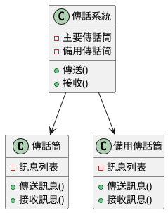
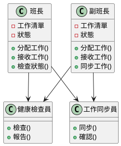
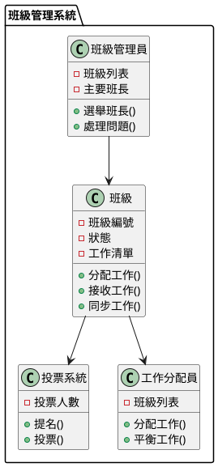

# 消息隊列高可用性教學

## 初級（Beginner）層級

### 1. 概念說明
消息隊列就像學校的傳話筒遊戲：
- 當一個同學要傳話給另一個同學時，他們之間需要一個傳話筒
- 如果傳話筒壞掉了，我們需要有備用的傳話筒
- 這樣即使一個傳話筒不能用，我們還可以用另一個繼續傳話

初級學習者需要了解：
- 什麼是消息隊列（就像傳話筒）
- 為什麼需要備用系統（防止傳話筒壞掉）
- 基本的備份概念（準備多個傳話筒）

### 2. 使用原因
為什麼我們需要消息隊列高可用性：
1. 防止系統當機：
   - 就像傳話筒壞掉時有備用的
   - 確保消息不會丟失
   - 系統可以繼續運作

2. 維持服務不中斷：
   - 就像上課時傳話筒壞了，馬上換新的
   - 使用者不會感覺到問題
   - 系統可以一直運作

3. 保護重要資料：
   - 就像重要的訊息一定要傳到
   - 確保資料不會消失
   - 資料都有備份

### 3. 問題表象
可能會遇到的問題：
1. 系統問題：
   - 傳話筒壞掉了
   - 同學之間無法傳話
   - 訊息傳不出去

2. 資料問題：
   - 訊息傳丟了
   - 訊息傳錯了
   - 同一個訊息傳了兩次

3. 效能問題：
   - 傳話速度變慢
   - 一次只能傳少量訊息
   - 傳話筒用太多

### 4. 避免方法
如何避免這些問題：
1. 系統設計：
   - 準備多個傳話筒
   - 定期檢查傳話筒
   - 監控傳話情況

2. 資料管理：
   - 確認訊息有傳到
   - 檢查訊息是否正確
   - 定期備份訊息

3. 效能優化：
   - 使用更好的傳話筒
   - 讓多個同學一起傳
   - 定期檢查傳話速度

### 5. 問題處理
遇到問題時該怎麼辦：
1. 系統問題處理：
   - 檢查傳話筒是否正常
   - 修復傳話筒
   - 換用備用傳話筒

2. 資料問題處理：
   - 檢查訊息是否正確
   - 重新傳送訊息
   - 找回丟失的訊息

3. 效能問題處理：
   - 調整傳話方式
   - 使用更多傳話筒
   - 優化傳話流程

### 6. PlantUML 圖解


### 7. 分段教學步驟

#### 步驟 1：基本傳話筒系統
```java
public class 傳話筒 {
    private List<String> 訊息列表;
    private boolean 是否正常;
    
    public 傳話筒() {
        訊息列表 = new ArrayList<>();
        是否正常 = true;
    }
    
    public void 傳送訊息(String 訊息) {
        if (!是否正常) {
            throw new RuntimeException("傳話筒壞掉了！");
        }
        System.out.println("傳送訊息：" + 訊息);
        訊息列表.add(訊息);
    }
    
    public String 接收訊息() {
        if (!是否正常) {
            throw new RuntimeException("傳話筒壞掉了！");
        }
        if (!訊息列表.isEmpty()) {
            String 訊息 = 訊息列表.remove(0);
            System.out.println("接收訊息：" + 訊息);
            return 訊息;
        }
        return null;
    }
    
    public boolean 是否正常() {
        return 是否正常;
    }
    
    public void 設定狀態(boolean 狀態) {
        是否正常 = 狀態;
    }
}

public class 備用系統 {
    private 傳話筒 主要傳話筒;
    private 傳話筒 備用傳話筒;
    private 健康檢查器 檢查器;
    
    public 備用系統() {
        主要傳話筒 = new 傳話筒();
        備用傳話筒 = new 傳話筒();
        檢查器 = new 健康檢查器();
    }
    
    public void 傳送(String 訊息) {
        // 檢查主要傳話筒是否正常
        if (!檢查器.檢查(主要傳話筒)) {
            主要傳話筒.設定狀態(false);
            System.out.println("主要傳話筒壞了，改用備用傳話筒");
        }
        
        // 同時傳送到主要和備用傳話筒
        if (主要傳話筒.是否正常()) {
            主要傳話筒.傳送訊息(訊息);
        }
        備用傳話筒.傳送訊息(訊息);
    }
    
    public String 接收() {
        // 優先從主要傳話筒接收
        if (主要傳話筒.是否正常()) {
            String 訊息 = 主要傳話筒.接收訊息();
            if (訊息 != null) {
                return 訊息;
            }
        }
        
        // 如果主要傳話筒沒有訊息或壞了，從備用傳話筒接收
        return 備用傳話筒.接收訊息();
    }
    
    public void 檢查健康狀態() {
        檢查器.檢查(主要傳話筒);
        檢查器.檢查(備用傳話筒);
    }
}

class 健康檢查器 {
    public boolean 檢查(傳話筒 傳話筒) {
        try {
            // 模擬健康檢查
            傳話筒.接收訊息();
            return true;
        } catch (Exception e) {
            System.out.println("健康檢查失敗：" + e.getMessage());
            return false;
        }
    }
}
```

## 中級（Intermediate）層級

### 1. 概念說明
中級學習者需要理解：
- 主從架構：就像班級有班長和副班長，班長負責主要工作，副班長協助
- 故障檢測：定期檢查班長和副班長是否正常工作
- 自動切換：如果班長請假，副班長自動接手
- 資料同步：確保班長和副班長知道相同的事情

### 2. PlantUML 圖解


### 3. 分段教學步驟

#### 步驟 1：班級工作系統
```java
public class 班級工作系統 {
    private 班長 主要班長;
    private 副班長 副班長;
    private 健康檢查員 檢查員;
    private 工作同步員 同步員;
    private 工作檢查員 檢查員;
    
    public 班級工作系統() {
        主要班長 = new 班長();
        副班長 = new 副班長();
        檢查員 = new 健康檢查員();
        同步員 = new 工作同步員();
        檢查員 = new 工作檢查員();
    }
    
    public void 分配工作(String 工作) {
        // 檢查工作是否有效
        if (!檢查員.檢查(工作)) {
            System.out.println("工作無效！");
            return;
        }
        
        if (主要班長.是否正常()) {
            主要班長.分配工作(工作);
            同步員.同步(主要班長, 副班長);
        } else {
            副班長.分配工作(工作);
        }
    }
    
    public String 接收工作() {
        if (主要班長.是否正常()) {
            return 主要班長.接收工作();
        } else {
            return 副班長.接收工作();
        }
    }
    
    public void 檢查健康狀態() {
        檢查員.檢查(主要班長);
        檢查員.檢查(副班長);
    }
}

class 工作檢查員 {
    public boolean 檢查(String 工作) {
        return 工作 != null && !工作.isEmpty();
    }
}
```

#### 步驟 2：健康檢查
```java
public class 健康檢查員 {
    public boolean 檢查(班級幹部 幹部) {
        try {
            // 模擬健康檢查
            幹部.檢查狀態();
            return true;
        } catch (Exception e) {
            System.out.println("健康檢查失敗：" + e.getMessage());
            return false;
        }
    }
    
    public void 報告(班級幹部 幹部, boolean 是否正常) {
        if (!是否正常) {
            System.out.println("警告：" + 幹部.取得名稱() + " 狀態異常");
        }
    }
}
```

## 高級（Advanced）層級

### 1. 概念說明
高級學習者需要掌握：
- 班級管理系統：就像學校有多個班級，每個班級都有自己的班長和副班長
- 投票選舉：當需要選出新的班長時，所有同學一起投票決定
- 自動接手：如果班長請假，系統會自動選出新的班長
- 工作分配：系統會自動把工作平均分配給所有班級

### 2. PlantUML 圖解


### 3. 分段教學步驟

#### 步驟 1：班級管理
```java
public class 班級管理員 {
    private List<班級> 班級列表;
    private 班級 主要班長;
    private 投票系統 投票系統;
    
    public 班級管理員() {
        班級列表 = new ArrayList<>();
        投票系統 = new 投票系統(班級列表.size() / 2 + 1);
    }
    
    public void 新增班級(班級 新班級) {
        班級列表.add(新班級);
        if (主要班長 == null) {
            選舉班長();
        }
    }
    
    public void 選舉班長() {
        // 使用投票系統選出主要班長
        主要班長 = 投票系統.選舉班長(班級列表);
        System.out.println("選出新的主要班長：" + 主要班長.取得班級編號());
    }
    
    public void 處理問題(班級 問題班級) {
        班級列表.remove(問題班級);
        if (問題班級 == 主要班長) {
            選舉班長();
        }
    }
}
```

#### 步驟 2：投票系統
```java
public class 投票系統 {
    private int 投票人數;
    
    public 投票系統(int 投票人數) {
        this.投票人數 = 投票人數;
    }
    
    public 班級 選舉班長(List<班級> 班級列表) {
        // 簡單的多數決選舉
        Map<班級, Integer> 票數 = new HashMap<>();
        for (班級 班級 : 班級列表) {
            班級 候選人 = 班級.提名班長();
            票數.put(候選人, 票數.getOrDefault(候選人, 0) + 1);
        }
        
        return 票數.entrySet().stream()
            .max(Map.Entry.comparingByValue())
            .map(Map.Entry::getKey)
            .orElse(null);
    }
    
    public boolean 確認提名(Object 提名) {
        // 檢查是否達到投票人數
        return true;
    }
}
```

#### 步驟 3：工作分配
```java
public class 工作分配員 {
    private List<班級> 班級列表;
    private Map<班級, Integer> 工作量;
    
    public 工作分配員() {
        班級列表 = new ArrayList<>();
        工作量 = new HashMap<>();
    }
    
    public void 分配工作(String 工作) {
        班級 班級 = 選擇班級();
        班級.分配工作(工作);
        更新工作量(班級);
    }
    
    private 班級 選擇班級() {
        // 選擇工作量最少的班級
        return 班級列表.stream()
            .min(Comparator.comparingInt(班級 -> 工作量.getOrDefault(班級, 0)))
            .orElse(null);
    }
    
    private void 更新工作量(班級 班級) {
        工作量.put(班級, 工作量.getOrDefault(班級, 0) + 1);
    }
}
```

### 4. 常見問題與解決方案

#### 問題表象
1. 系統問題：
   - 班級無法運作
   - 班級之間無法溝通
   - 工作無法同步

2. 資料問題：
   - 工作內容遺失
   - 工作內容不一致
   - 重複分配工作

3. 效能問題：
   - 工作分配太慢
   - 班級負擔太重
   - 系統資源不足

#### 避免方法
1. 系統設計：
   - 建立備用班級
   - 定期檢查班級
   - 監控工作分配

2. 資料管理：
   - 確認工作完成
   - 檢查工作內容
   - 定期備份工作

3. 效能優化：
   - 優化工作分配
   - 平衡班級負擔
   - 定期檢查效能

#### 處理方案
1. 技術方案：
   ```java
   public class 班級管理系統 {
       private 班級 主要班級;
       private 班級 備用班級;
       private 健康檢查員 檢查員;
       private 工作同步員 同步員;
       private 工作檢查員 檢查員;
       
       public void 處理問題(班級問題 問題) {
           switch (問題.取得類型()) {
               case 系統:
                   處理系統問題(問題);
                   break;
               case 資料:
                   處理資料問題(問題);
                   break;
               case 效能:
                   處理效能問題(問題);
                   break;
           }
       }
       
       private void 處理系統問題(班級問題 問題) {
           // 檢查班級狀態
           檢查班級狀態();
           // 修復溝通問題
           修復溝通問題();
           // 重試同步工作
           重試同步工作();
       }
       
       private void 處理資料問題(班級問題 問題) {
           // 檢查工作一致性
           檢查工作一致性();
           // 修復工作錯誤
           修復工作錯誤();
           // 恢復遺失工作
           恢復遺失工作();
       }
       
       private void 處理效能問題(班級問題 問題) {
           // 調整工作分配
           調整工作分配();
           // 優化資源使用
           優化資源使用();
           // 實現動態擴充
           實現動態擴充();
       }
   }
   ```

2. 監控方案：
   ```java
   public class 班級監控系統 {
       private 資料收集員 收集員;
       private 健康檢查員 檢查員;
       private 警告管理員 管理員;
       
       public void 監控() {
           班級資料 資料 = 收集員.收集資料();
           boolean 是否正常 = 檢查員.檢查健康狀態();
           
           // 檢查系統狀態
           if (!是否正常) {
               管理員.警告("系統狀態警告", 資料.取得詳細資料());
           }
           
           // 檢查資料狀態
           if (資料.取得資料狀態() != 資料狀態.一致) {
               管理員.警告("資料狀態警告", 資料.取得詳細資料());
           }
           
           // 檢查效能狀態
           if (資料.取得效能狀態() != 效能狀態.最佳) {
               管理員.警告("效能警告", 資料.取得詳細資料());
           }
       }
   }
   ```

3. 最佳實踐：
   - 實現自動化監控
   - 設定智慧警告
   - 建立應急流程
   - 優化工作分配
   - 定期效能評估
   - 保持系統文件
   - 實現自動恢復

### 5. 實戰案例

#### 案例一：學校工作分配系統
```java
public class 學校工作系統 {
    private 班級管理員 管理員;
    private 班級監控系統 監控系統;
    
    public void 處理班級工作(String 班級編號) {
        // 設定工作分配策略
        管理員.設定策略(new 班級工作策略(班級編號));
        
        // 處理工作
        管理員.處理工作(班級編號);
        
        // 檢查班級狀態
        監控系統.檢查狀態();
    }
    
    public void 處理學校工作(String 工作編號) {
        // 設定工作分配策略
        管理員.設定策略(new 學校工作策略(工作編號));
        
        // 處理工作
        管理員.處理工作(工作編號);
        
        // 檢查班級狀態
        監控系統.檢查狀態();
    }
}
```

#### 案例二：社團活動系統
```java
public class 社團活動系統 {
    private 班級管理員 管理員;
    private 班級監控系統 監控系統;
    
    public void 處理社員活動(String 社員編號) {
        // 設定活動分配策略
        管理員.設定策略(new 社員活動策略(社員編號));
        
        // 處理活動
        管理員.處理活動(社員編號);
        
        // 檢查社團狀態
        監控系統.檢查狀態();
    }
    
    public void 處理社團活動(String 活動編號) {
        // 設定活動分配策略
        管理員.設定策略(new 社團活動策略(活動編號));
        
        // 處理活動
        管理員.處理活動(活動編號);
        
        // 檢查社團狀態
        監控系統.檢查狀態();
    }
}
```

這個教學文件提供了從基礎到進階的班級管理系統學習路徑，每個層級都包含了相應的概念說明、圖解、教學步驟和實作範例。初級學習者可以從基本的傳話筒系統開始，中級學習者可以學習班級工作系統和健康檢查，而高級學習者則可以掌握班級管理和投票系統等進階功能。 