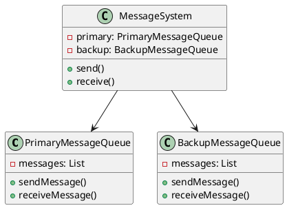
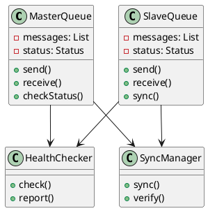
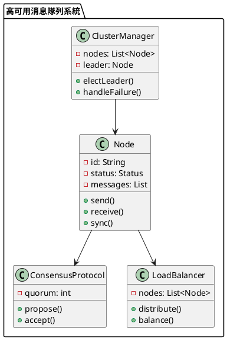

# 消息隊列高可用性教學

## 初級（Beginner）層級

### 1. 概念說明
消息隊列高可用性就像學校的備用傳話筒：
- 當主要的傳話筒壞掉時，我們還有備用的傳話筒可以用
- 兩個傳話筒會互相備份，確保消息不會丟失
- 如果一個傳話筒壞了，另一個可以馬上接手

初級學習者需要了解：
- 什麼是高可用性
- 為什麼需要備用系統
- 基本的備份概念

### 2. 使用原因
消息隊列高可用性的主要使用原因包括：
1. 可靠性提升：
   - 避免單點故障
   - 確保消息不丟失
   - 提供故障轉移

2. 業務連續性：
   - 維持系統運作
   - 減少服務中斷
   - 提高用戶體驗

3. 數據安全：
   - 防止數據丟失
   - 確保數據一致性
   - 提供數據備份

### 3. 問題表象
常見的問題表象包括：
1. 系統問題：
   - 節點故障
   - 網路中斷
   - 同步失敗

2. 數據問題：
   - 消息丟失
   - 數據不一致
   - 重複消息

3. 效能問題：
   - 延遲增加
   - 吞吐量下降
   - 資源消耗高

### 4. 避免方法
避免問題的方法包括：
1. 系統設計：
   - 實現主從架構
   - 設計健康檢查
   - 建立監控系統

2. 數據管理：
   - 實現數據同步
   - 設置消息確認
   - 定期備份數據

3. 效能優化：
   - 優化同步策略
   - 實現負載均衡
   - 定期效能評估

### 5. 問題處理
遇到問題時的處理方法：
1. 系統問題處理：
   - 檢查節點狀態
   - 修復網路問題
   - 重試同步操作

2. 數據問題處理：
   - 檢查數據一致性
   - 修復數據錯誤
   - 恢復丟失數據

3. 效能問題處理：
   - 調整同步策略
   - 優化資源使用
   - 實現動態擴展

### 6. PlantUML 圖解


### 7. 分段教學步驟

#### 步驟 1：基本備份系統
```java
public class SimpleMessageQueue {
    private List<String> messages;
    private boolean isHealthy;
    
    public SimpleMessageQueue() {
        messages = new ArrayList<>();
        isHealthy = true;
    }
    
    public void sendMessage(String message) {
        if (!isHealthy) {
            throw new RuntimeException("消息隊列狀態異常");
        }
        System.out.println("發送消息：" + message);
        messages.add(message);
    }
    
    public String receiveMessage() {
        if (!isHealthy) {
            throw new RuntimeException("消息隊列狀態異常");
        }
        if (!messages.isEmpty()) {
            String message = messages.remove(0);
            System.out.println("接收消息：" + message);
            return message;
        }
        return null;
    }
    
    public boolean isHealthy() {
        return isHealthy;
    }
    
    public void setHealthy(boolean healthy) {
        isHealthy = healthy;
    }
}

public class BackupSystem {
    private SimpleMessageQueue primary;
    private SimpleMessageQueue backup;
    private HealthChecker healthChecker;
    
    public BackupSystem() {
        primary = new SimpleMessageQueue();
        backup = new SimpleMessageQueue();
        healthChecker = new HealthChecker();
    }
    
    public void send(String message) {
        // 檢查主系統健康狀態
        if (!healthChecker.check(primary)) {
            primary.setHealthy(false);
            System.out.println("主系統異常，切換到備份系統");
        }
        
        // 同時發送到主系統和備份系統
        if (primary.isHealthy()) {
            primary.sendMessage(message);
        }
        backup.sendMessage(message);
    }
    
    public String receive() {
        // 優先從主系統接收
        if (primary.isHealthy()) {
            String message = primary.receiveMessage();
            if (message != null) {
                return message;
            }
        }
        
        // 如果主系統沒有消息或異常，從備份系統接收
        return backup.receiveMessage();
    }
    
    public void checkHealth() {
        healthChecker.check(primary);
        healthChecker.check(backup);
    }
}

class HealthChecker {
    public boolean check(SimpleMessageQueue queue) {
        try {
            // 模擬健康檢查
            queue.receiveMessage();
            return true;
        } catch (Exception e) {
            System.out.println("健康檢查失敗：" + e.getMessage());
            return false;
        }
    }
}
```

## 中級（Intermediate）層級

### 1. 概念說明
中級學習者需要理解：
- 主從架構
- 故障檢測
- 自動切換
- 數據同步

### 2. PlantUML 圖解


### 3. 分段教學步驟

#### 步驟 1：主從架構
```java
public class MasterSlaveSystem {
    private MasterQueue master;
    private SlaveQueue slave;
    private HealthChecker healthChecker;
    private SyncManager syncManager;
    private MessageValidator validator;
    
    public MasterSlaveSystem() {
        master = new MasterQueue();
        slave = new SlaveQueue();
        healthChecker = new HealthChecker();
        syncManager = new SyncManager();
        validator = new MessageValidator();
    }
    
    public void send(String message) {
        // 驗證消息
        if (!validator.validate(message)) {
            System.out.println("消息驗證失敗！");
            return;
        }
        
        if (master.isHealthy()) {
            master.send(message);
            syncManager.sync(master, slave);
        } else {
            slave.send(message);
        }
    }
    
    public String receive() {
        if (master.isHealthy()) {
            return master.receive();
        } else {
            return slave.receive();
        }
    }
    
    public void checkHealth() {
        healthChecker.check(master);
        healthChecker.check(slave);
    }
}

class MessageValidator {
    public boolean validate(String message) {
        return message != null && !message.isEmpty();
    }
}
```

#### 步驟 2：健康檢查
```java
public class HealthChecker {
    public boolean check(MessageQueue queue) {
        try {
            // 模擬健康檢查
            queue.checkStatus();
            return true;
        } catch (Exception e) {
            System.out.println("健康檢查失敗：" + e.getMessage());
            return false;
        }
    }
    
    public void report(MessageQueue queue, boolean isHealthy) {
        if (!isHealthy) {
            System.out.println("警告：" + queue.getName() + " 狀態異常");
        }
    }
}
```

## 高級（Advanced）層級

### 1. 概念說明
高級學習者需要掌握：
- 集群架構
- 一致性協議
- 故障轉移
- 負載均衡

### 2. PlantUML 圖解


### 3. 分段教學步驟

#### 步驟 1：集群管理
```java
public class ClusterManager {
    private List<Node> nodes;
    private Node leader;
    private ConsensusProtocol protocol;
    
    public ClusterManager() {
        nodes = new ArrayList<>();
        protocol = new ConsensusProtocol(nodes.size() / 2 + 1);
    }
    
    public void addNode(Node node) {
        nodes.add(node);
        if (leader == null) {
            electLeader();
        }
    }
    
    public void electLeader() {
        // 使用一致性協議選舉領導者
        leader = protocol.electLeader(nodes);
        System.out.println("選舉新的領導者：" + leader.getId());
    }
    
    public void handleFailure(Node failedNode) {
        nodes.remove(failedNode);
        if (failedNode == leader) {
            electLeader();
        }
    }
}
```

#### 步驟 2：一致性協議
```java
public class ConsensusProtocol {
    private int quorum;
    
    public ConsensusProtocol(int quorum) {
        this.quorum = quorum;
    }
    
    public Node electLeader(List<Node> nodes) {
        // 簡單的多數決選舉
        Map<Node, Integer> votes = new HashMap<>();
        for (Node node : nodes) {
            Node candidate = node.proposeLeader();
            votes.put(candidate, votes.getOrDefault(candidate, 0) + 1);
        }
        
        return votes.entrySet().stream()
            .max(Map.Entry.comparingByValue())
            .map(Map.Entry::getKey)
            .orElse(null);
    }
    
    public boolean acceptProposal(Object proposal) {
        // 檢查是否達到法定人數
        return true;
    }
}
```

#### 步驟 3：負載均衡
```java
public class LoadBalancer {
    private List<Node> nodes;
    private Map<Node, Integer> load;
    
    public LoadBalancer() {
        nodes = new ArrayList<>();
        load = new HashMap<>();
    }
    
    public void distribute(Message message) {
        Node node = selectNode();
        node.send(message);
        updateLoad(node);
    }
    
    private Node selectNode() {
        // 選擇負載最輕的節點
        return nodes.stream()
            .min(Comparator.comparingInt(node -> load.getOrDefault(node, 0)))
            .orElse(null);
    }
    
    private void updateLoad(Node node) {
        load.put(node, load.getOrDefault(node, 0) + 1);
    }
}
```

### 4. 常見問題與解決方案

#### 問題表象
1. 系統問題：
   - 節點故障
   - 網路中斷
   - 同步失敗

2. 數據問題：
   - 消息丟失
   - 數據不一致
   - 重複消息

3. 效能問題：
   - 延遲增加
   - 吞吐量下降
   - 資源消耗高

#### 避免方法
1. 系統設計：
   - 實現主從架構
   - 設計健康檢查
   - 建立監控系統

2. 數據管理：
   - 實現數據同步
   - 設置消息確認
   - 定期備份數據

3. 效能優化：
   - 優化同步策略
   - 實現負載均衡
   - 定期效能評估

#### 處理方案
1. 技術方案：
   ```java
   public class MessageQueueManager {
       private MessageQueue primary;
       private MessageQueue backup;
       private HealthChecker healthChecker;
       private SyncManager syncManager;
       private MessageValidator validator;
       
       public void handleIssue(MessageQueueIssue issue) {
           switch (issue.getType()) {
               case SYSTEM:
                   handleSystemIssue(issue);
                   break;
               case DATA:
                   handleDataIssue(issue);
                   break;
               case PERFORMANCE:
                   handlePerformanceIssue(issue);
                   break;
           }
       }
       
       private void handleSystemIssue(MessageQueueIssue issue) {
           // 檢查節點狀態
           checkNodeStatus();
           // 修復網路問題
           repairNetwork();
           // 重試同步操作
           retrySync();
       }
       
       private void handleDataIssue(MessageQueueIssue issue) {
           // 檢查數據一致性
           checkDataConsistency();
           // 修復數據錯誤
           repairData();
           // 恢復丟失數據
           recoverData();
       }
       
       private void handlePerformanceIssue(MessageQueueIssue issue) {
           // 調整同步策略
           adjustSyncStrategy();
           // 優化資源使用
           optimizeResources();
           // 實現動態擴展
           implementScaling();
       }
   }
   ```

2. 監控方案：
   ```java
   public class MessageQueueMonitor {
       private MetricsCollector metricsCollector;
       private HealthChecker healthChecker;
       private AlertManager alertManager;
       
       public void monitor() {
           MessageQueueMetrics metrics = metricsCollector.collectMetrics();
           boolean isHealthy = healthChecker.checkHealth();
           
           // 檢查系統狀態
           if (!isHealthy) {
               alertManager.alert("系統狀態警告", metrics.getDetails());
           }
           
           // 檢查數據狀態
           if (metrics.getDataStatus() != DataStatus.CONSISTENT) {
               alertManager.alert("數據狀態警告", metrics.getDetails());
           }
           
           // 檢查效能狀態
           if (metrics.getPerformanceStatus() != PerformanceStatus.OPTIMAL) {
               alertManager.alert("效能警告", metrics.getDetails());
           }
       }
   }
   ```

3. 最佳實踐：
   - 實現自動化監控
   - 配置智能告警
   - 建立應急流程
   - 優化同步策略
   - 定期效能評估
   - 保持系統文檔
   - 實現自動恢復

### 5. 實戰案例

#### 案例一：電商系統消息隊列
```java
public class ECommerceMessageQueue {
    private MessageQueueManager manager;
    private MessageQueueMonitor monitor;
    
    public void handleOrderMessage(String orderId) {
        // 設定消息隊列策略
        manager.setStrategy(new OrderMessageStrategy(orderId));
        
        // 處理消息
        manager.handleMessage(orderId);
        
        // 檢查消息隊列狀態
        monitor.checkStatus();
    }
    
    public void handlePaymentMessage(String paymentId) {
        // 設定消息隊列策略
        manager.setStrategy(new PaymentMessageStrategy(paymentId));
        
        // 處理消息
        manager.handleMessage(paymentId);
        
        // 檢查消息隊列狀態
        monitor.checkStatus();
    }
}
```

#### 案例二：社交媒體消息隊列
```java
public class SocialMediaMessageQueue {
    private MessageQueueManager manager;
    private MessageQueueMonitor monitor;
    
    public void handleUserMessage(String userId) {
        // 設定消息隊列策略
        manager.setStrategy(new UserMessageStrategy(userId));
        
        // 處理消息
        manager.handleMessage(userId);
        
        // 檢查消息隊列狀態
        monitor.checkStatus();
    }
    
    public void handlePostMessage(String postId) {
        // 設定消息隊列策略
        manager.setStrategy(new PostMessageStrategy(postId));
        
        // 處理消息
        manager.handleMessage(postId);
        
        // 檢查消息隊列狀態
        monitor.checkStatus();
    }
}
```

這個教學文件提供了從基礎到進階的消息隊列高可用性學習路徑，每個層級都包含了相應的概念說明、圖解、教學步驟和實作範例。初級學習者可以從基本的備份系統開始，中級學習者可以學習主從架構和健康檢查，而高級學習者則可以掌握集群管理和一致性協議等進階功能。 