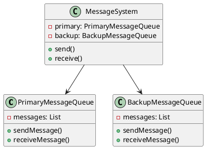
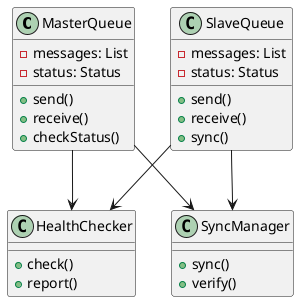
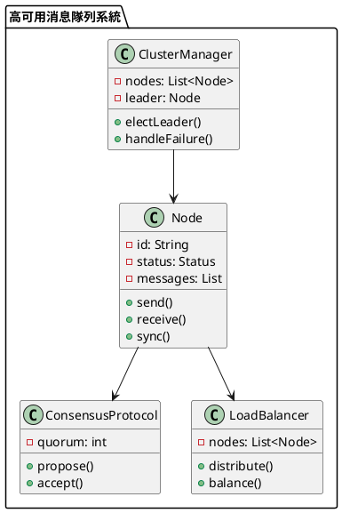

# 消息隊列高可用性教學

## 初級（Beginner）層級

### 1. 概念說明
消息隊列高可用性就像學校的備用傳話筒：
- 當主要的傳話筒壞掉時，我們還有備用的傳話筒可以用
- 兩個傳話筒會互相備份，確保消息不會丟失
- 如果一個傳話筒壞了，另一個可以馬上接手

初級學習者需要了解：
- 什麼是高可用性
- 為什麼需要備用系統
- 基本的備份概念

### 2. PlantUML 圖解


### 3. 分段教學步驟

#### 步驟 1：基本備份系統
```java
public class SimpleMessageQueue {
    private List<String> messages;
    
    public SimpleMessageQueue() {
        messages = new ArrayList<>();
    }
    
    public void sendMessage(String message) {
        System.out.println("發送消息：" + message);
        messages.add(message);
    }
    
    public String receiveMessage() {
        if (!messages.isEmpty()) {
            String message = messages.remove(0);
            System.out.println("接收消息：" + message);
            return message;
        }
        return null;
    }
}

public class BackupSystem {
    private SimpleMessageQueue primary;
    private SimpleMessageQueue backup;
    
    public BackupSystem() {
        primary = new SimpleMessageQueue();
        backup = new SimpleMessageQueue();
    }
    
    public void send(String message) {
        // 同時發送到主系統和備份系統
        primary.sendMessage(message);
        backup.sendMessage(message);
    }
    
    public String receive() {
        // 優先從主系統接收
        String message = primary.receiveMessage();
        if (message == null) {
            // 如果主系統沒有消息，從備份系統接收
            message = backup.receiveMessage();
        }
        return message;
    }
}
```

## 中級（Intermediate）層級

### 1. 概念說明
中級學習者需要理解：
- 主從架構
- 故障檢測
- 自動切換
- 數據同步

### 2. PlantUML 圖解


### 3. 分段教學步驟

#### 步驟 1：主從架構
```java
public class MasterSlaveSystem {
    private MasterQueue master;
    private SlaveQueue slave;
    private HealthChecker healthChecker;
    private SyncManager syncManager;
    
    public MasterSlaveSystem() {
        master = new MasterQueue();
        slave = new SlaveQueue();
        healthChecker = new HealthChecker();
        syncManager = new SyncManager();
    }
    
    public void send(String message) {
        if (master.isHealthy()) {
            master.send(message);
            syncManager.sync(master, slave);
        } else {
            slave.send(message);
        }
    }
    
    public String receive() {
        if (master.isHealthy()) {
            return master.receive();
        } else {
            return slave.receive();
        }
    }
    
    public void checkHealth() {
        healthChecker.check(master);
        healthChecker.check(slave);
    }
}
```

#### 步驟 2：健康檢查
```java
public class HealthChecker {
    public boolean check(MessageQueue queue) {
        try {
            // 模擬健康檢查
            queue.checkStatus();
            return true;
        } catch (Exception e) {
            System.out.println("健康檢查失敗：" + e.getMessage());
            return false;
        }
    }
    
    public void report(MessageQueue queue, boolean isHealthy) {
        if (!isHealthy) {
            System.out.println("警告：" + queue.getName() + " 狀態異常");
        }
    }
}
```

## 高級（Advanced）層級

### 1. 概念說明
高級學習者需要掌握：
- 集群架構
- 一致性協議
- 故障轉移
- 負載均衡

### 2. PlantUML 圖解


### 3. 分段教學步驟

#### 步驟 1：集群管理
```java
public class ClusterManager {
    private List<Node> nodes;
    private Node leader;
    private ConsensusProtocol protocol;
    
    public ClusterManager() {
        nodes = new ArrayList<>();
        protocol = new ConsensusProtocol(nodes.size() / 2 + 1);
    }
    
    public void addNode(Node node) {
        nodes.add(node);
        if (leader == null) {
            electLeader();
        }
    }
    
    public void electLeader() {
        // 使用一致性協議選舉領導者
        leader = protocol.electLeader(nodes);
        System.out.println("選舉新的領導者：" + leader.getId());
    }
    
    public void handleFailure(Node failedNode) {
        nodes.remove(failedNode);
        if (failedNode == leader) {
            electLeader();
        }
    }
}
```

#### 步驟 2：一致性協議
```java
public class ConsensusProtocol {
    private int quorum;
    
    public ConsensusProtocol(int quorum) {
        this.quorum = quorum;
    }
    
    public Node electLeader(List<Node> nodes) {
        // 簡單的多數決選舉
        Map<Node, Integer> votes = new HashMap<>();
        for (Node node : nodes) {
            Node candidate = node.proposeLeader();
            votes.put(candidate, votes.getOrDefault(candidate, 0) + 1);
        }
        
        return votes.entrySet().stream()
            .max(Map.Entry.comparingByValue())
            .map(Map.Entry::getKey)
            .orElse(null);
    }
    
    public boolean acceptProposal(Object proposal) {
        // 檢查是否達到法定人數
        return true;
    }
}
```

#### 步驟 3：負載均衡
```java
public class LoadBalancer {
    private List<Node> nodes;
    private Map<Node, Integer> load;
    
    public LoadBalancer() {
        nodes = new ArrayList<>();
        load = new HashMap<>();
    }
    
    public void distribute(Message message) {
        Node node = selectNode();
        node.send(message);
        updateLoad(node);
    }
    
    private Node selectNode() {
        // 選擇負載最輕的節點
        return nodes.stream()
            .min(Comparator.comparingInt(node -> load.getOrDefault(node, 0)))
            .orElse(null);
    }
    
    private void updateLoad(Node node) {
        load.put(node, load.getOrDefault(node, 0) + 1);
    }
}
```

這個教學文件提供了從基礎到進階的消息隊列高可用性學習路徑，每個層級都包含了相應的概念說明、圖解、教學步驟和實作範例。初級學習者可以從基本的備份系統開始，中級學習者可以學習主從架構和健康檢查，而高級學習者則可以掌握集群管理和一致性協議等進階功能。 