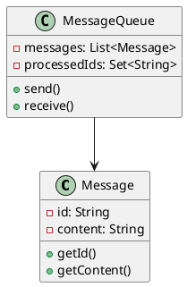
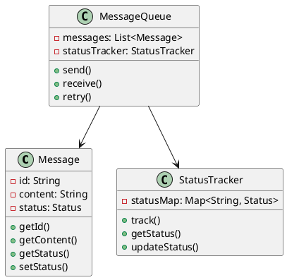
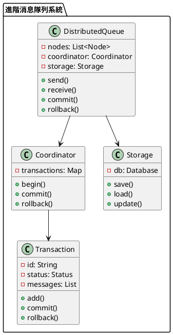

# 消息隊列不重複消費教學

## 初級（Beginner）層級

### 1. 概念說明
消息隊列就像學校的點名系統：
- 每個學生只能被點名一次
- 如果點名表上已經有你的名字，就不會再點你一次
- 這樣可以確保每個學生只被點到一次名

#### 使用原因
1. 避免重複處理：
   - 就像不能重複點名同一個學生
   - 確保每條消息只處理一次
   - 防止系統出錯

2. 保持數據正確：
   - 避免重複計算
   - 確保數據準確
   - 防止數據混亂

#### 可能遇到的問題
1. 重複處理：
   - 同一個消息被處理多次
   - 數據被重複計算
   - 系統資源浪費

2. 數據錯誤：
   - 數據不一致
   - 計算結果錯誤
   - 系統狀態混亂

#### 如何避免
1. 使用唯一標記：
   - 給每條消息一個獨特的ID
   - 記錄已處理的消息
   - 檢查是否已處理

2. 簡單的檢查機制：
   - 處理前先檢查
   - 記錄處理狀態
   - 定期清理記錄

### 2. PlantUML 圖解


### 3. 分段教學步驟

#### 步驟 1：建立基本消息類別
```java
public class SimpleMessage {
    private String id;        // 消息的唯一ID
    private String content;   // 消息內容
    private boolean processed; // 是否已處理
    
    public SimpleMessage(String content) {
        this.id = UUID.randomUUID().toString();
        this.content = content;
        this.processed = false;
    }
    
    public String getId() {
        return id;
    }
    
    public String getContent() {
        return content;
    }
    
    public boolean isProcessed() {
        return processed;
    }
    
    public void setProcessed(boolean processed) {
        this.processed = processed;
    }
}
```

#### 步驟 2：建立簡單的消息隊列
```java
public class SimpleQueue {
    private List<SimpleMessage> messages;    // 存放消息的列表
    private Set<String> processedIds;        // 記錄已處理的消息ID
    
    public SimpleQueue() {
        messages = new ArrayList<>();
        processedIds = new HashSet<>();
    }
    
    public void send(SimpleMessage message) {
        System.out.println("發送消息：" + message.getContent());
        messages.add(message);
    }
    
    public SimpleMessage receive() {
        if (!messages.isEmpty()) {
            SimpleMessage message = messages.remove(0);
            if (!processedIds.contains(message.getId())) {
                processedIds.add(message.getId());
                message.setProcessed(true);
                System.out.println("接收消息：" + message.getContent());
                return message;
            }
        }
        return null;
    }
}
```

## 中級（Intermediate）層級

### 1. 概念說明
中級學習者需要理解：
- 消息狀態管理
- 重試機制
- 錯誤處理
- 狀態追蹤

#### 使用原因
1. 處理更複雜的情況：
   - 消息可能處理失敗
   - 需要重試機制
   - 需要追蹤狀態

2. 提高系統可靠性：
   - 自動重試失敗的消息
   - 記錄處理歷史
   - 監控系統狀態

#### 可能遇到的問題
1. 消息處理失敗：
   - 系統暫時性錯誤
   - 網絡問題
   - 資源不足

2. 狀態管理混亂：
   - 狀態不一致
   - 重試次數過多
   - 系統負載過高

#### 如何避免
1. 實現重試機制：
   - 設置最大重試次數
   - 記錄重試歷史
   - 控制重試間隔

2. 狀態追蹤：
   - 記錄消息狀態
   - 定期檢查狀態
   - 清理過期記錄

### 2. PlantUML 圖解


### 3. 分段教學步驟

#### 步驟 1：定義消息狀態
```java
public enum MessageStatus {
    PENDING,    // 等待處理
    PROCESSING, // 正在處理
    COMPLETED,  // 處理完成
    FAILED,     // 處理失敗
    RETRYING    // 重試中
}

public class AdvancedMessage {
    private String id;
    private String content;
    private MessageStatus status;
    private int retryCount;
    private long lastProcessedTime;
    
    public AdvancedMessage(String content) {
        this.id = UUID.randomUUID().toString();
        this.content = content;
        this.status = MessageStatus.PENDING;
        this.retryCount = 0;
        this.lastProcessedTime = 0;
    }
    
    public String getId() {
        return id;
    }
    
    public String getContent() {
        return content;
    }
    
    public MessageStatus getStatus() {
        return status;
    }
    
    public void setStatus(MessageStatus status) {
        this.status = status;
    }
    
    public int getRetryCount() {
        return retryCount;
    }
    
    public void incrementRetryCount() {
        this.retryCount++;
    }
    
    public long getLastProcessedTime() {
        return lastProcessedTime;
    }
    
    public void setLastProcessedTime(long time) {
        this.lastProcessedTime = time;
    }
}
```

#### 步驟 2：實現狀態追蹤
```java
public class StatusTracker {
    private Map<String, MessageStatus> statusMap;
    
    public StatusTracker() {
        statusMap = new HashMap<>();
    }
    
    public void track(String messageId, MessageStatus status) {
        statusMap.put(messageId, status);
    }
    
    public MessageStatus getStatus(String messageId) {
        return statusMap.getOrDefault(messageId, MessageStatus.PENDING);
    }
    
    public void updateStatus(String messageId, MessageStatus newStatus) {
        statusMap.put(messageId, newStatus);
    }
}
```

## 高級（Advanced）層級

### 1. 概念說明
高級學習者需要掌握：
- 分散式系統
- 事務管理
- 狀態持久化
- 並發控制

#### 使用原因
1. 處理大規模系統：
   - 多台機器協同工作
   - 確保數據一致性
   - 處理並發請求

2. 提高系統可靠性：
   - 實現事務管理
   - 持久化存儲
   - 並發控制

#### 可能遇到的問題
1. 分散式問題：
   - 網絡延遲
   - 機器故障
   - 數據不一致

2. 並發問題：
   - 資源競爭
   - 死鎖
   - 性能瓶頸

#### 如何避免
1. 實現分散式協調：
   - 使用分散式鎖
   - 實現選舉機制
   - 監控系統狀態

2. 並發控制：
   - 使用鎖機制
   - 實現隊列
   - 控制資源訪問

### 2. PlantUML 圖解


### 3. 分段教學步驟

#### 步驟 1：實現分散式隊列
```java
public class DistributedQueue {
    private List<Node> nodes;
    private Coordinator coordinator;
    private Storage storage;
    
    public DistributedQueue() {
        nodes = new ArrayList<>();
        coordinator = new Coordinator();
        storage = new Storage();
    }
    
    public void send(Message message) {
        Transaction tx = coordinator.begin();
        try {
            // 保存消息
            storage.save(message);
            
            // 同步到其他節點
            for (Node node : nodes) {
                node.replicate(message);
            }
            
            // 提交事務
            coordinator.commit(tx);
        } catch (Exception e) {
            // 回滾事務
            coordinator.rollback(tx);
            throw e;
        }
    }
}
```

#### 步驟 2：實現事務管理
```java
public class Coordinator {
    private Map<String, Transaction> transactions;
    
    public Coordinator() {
        transactions = new HashMap<>();
    }
    
    public Transaction begin() {
        String txId = UUID.randomUUID().toString();
        Transaction tx = new Transaction(txId);
        transactions.put(txId, tx);
        return tx;
    }
    
    public void commit(Transaction tx) {
        tx.commit();
        transactions.remove(tx.getId());
    }
    
    public void rollback(Transaction tx) {
        tx.rollback();
        transactions.remove(tx.getId());
    }
}
```

### 4. 實戰案例

#### 案例一：電商訂單系統
```java
public class OrderSystem {
    private DistributedQueue queue;
    
    public void processOrder(String orderId) {
        Message message = new Message(orderId, "處理訂單");
        queue.send(message);
        
        // 監控訂單處理狀態
        monitorOrderStatus(orderId);
    }
    
    private void monitorOrderStatus(String orderId) {
        // 實現訂單狀態監控邏輯
    }
}
```

#### 案例二：社交媒體通知系統
```java
public class NotificationSystem {
    private DistributedQueue queue;
    
    public void sendNotification(String userId, String message) {
        Message notification = new Message(userId, message);
        queue.send(notification);
        
        // 追蹤通知發送狀態
        trackNotificationStatus(userId);
    }
    
    private void trackNotificationStatus(String userId) {
        // 實現通知狀態追蹤邏輯
    }
}
```

這個教學文件提供了從基礎到進階的消息隊列不重複消費學習路徑，每個層級都包含了相應的概念說明、圖解、教學步驟和實作範例。初級學習者可以從基本的消息標記開始，中級學習者可以學習狀態管理和追蹤，而高級學習者則可以掌握分散式事務和持久化等進階功能。 