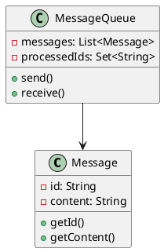
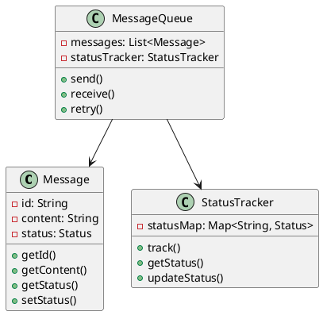
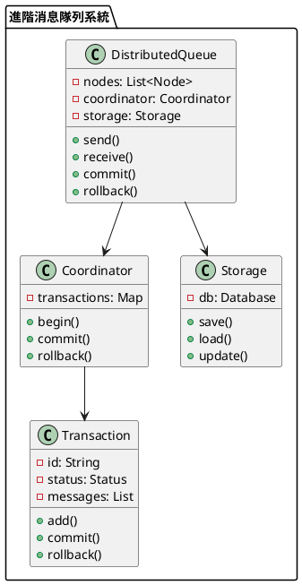

# 消息隊列不重複消費教學

## 初級（Beginner）層級

### 1. 概念說明
消息隊列不重複消費就像學校的點名系統：
- 每個學生只能被點名一次
- 如果點名表上已經有你的名字，就不會再點你一次
- 這樣可以確保每個學生只被點到一次名

初級學習者需要了解：
- 什麼是不重複消費
- 為什麼需要避免重複消費
- 基本的消息標記概念

### 2. 使用原因
消息隊列不重複消費的主要使用原因包括：
1. 數據一致性：
   - 避免重複處理
   - 確保數據準確性
   - 防止數據錯誤

2. 業務正確性：
   - 避免重複操作
   - 確保業務邏輯正確
   - 防止業務異常

3. 資源優化：
   - 避免資源浪費
   - 提高系統效率
   - 優化處理流程

### 3. 問題表象
常見的問題表象包括：
1. 數據問題：
   - 重複處理
   - 數據不一致
   - 數據錯誤

2. 業務問題：
   - 重複操作
   - 業務異常
   - 邏輯錯誤

3. 效能問題：
   - 資源浪費
   - 處理延遲
   - 系統負載高

### 4. 避免方法
避免問題的方法包括：
1. 系統設計：
   - 實現冪等性
   - 設計狀態管理
   - 建立追蹤機制

2. 數據管理：
   - 實現消息標記
   - 設置狀態檢查
   - 定期清理數據

3. 效能優化：
   - 優化處理流程
   - 實現並發控制
   - 定期效能評估

### 5. 問題處理
遇到問題時的處理方法：
1. 數據問題處理：
   - 檢查數據一致性
   - 修復數據錯誤
   - 恢復正確狀態

2. 業務問題處理：
   - 檢查業務邏輯
   - 修復業務異常
   - 恢復正常流程

3. 效能問題處理：
   - 優化處理流程
   - 調整資源分配
   - 實現動態擴展

### 6. PlantUML 圖解


### 7. 分段教學步驟

#### 步驟 1：基本消息標記
```java
public class SimpleMessage {
    private String id;
    private String content;
    private boolean processed;
    
    public SimpleMessage(String content) {
        this.id = UUID.randomUUID().toString();
        this.content = content;
        this.processed = false;
    }
    
    public String getId() {
        return id;
    }
    
    public String getContent() {
        return content;
    }
    
    public boolean isProcessed() {
        return processed;
    }
    
    public void setProcessed(boolean processed) {
        this.processed = processed;
    }
}

public class SimpleQueue {
    private List<SimpleMessage> messages;
    private Set<String> processedIds;
    private MessageValidator validator;
    
    public SimpleQueue() {
        messages = new ArrayList<>();
        processedIds = new HashSet<>();
        validator = new MessageValidator();
    }
    
    public void send(SimpleMessage message) {
        // 驗證消息
        if (!validator.validate(message)) {
            System.out.println("消息驗證失敗！");
            return;
        }
        
        System.out.println("發送消息：" + message.getContent());
        messages.add(message);
    }
    
    public SimpleMessage receive() {
        if (!messages.isEmpty()) {
            SimpleMessage message = messages.remove(0);
            if (!processedIds.contains(message.getId())) {
                processedIds.add(message.getId());
                message.setProcessed(true);
                System.out.println("接收消息：" + message.getContent());
                return message;
            }
        }
        return null;
    }
}

class MessageValidator {
    public boolean validate(SimpleMessage message) {
        return message != null && 
               message.getContent() != null && 
               !message.getContent().isEmpty();
    }
}
```

## 中級（Intermediate）層級

### 1. 概念說明
中級學習者需要理解：
- 消息狀態管理
- 冪等性處理
- 重試機制
- 狀態追蹤

### 2. PlantUML 圖解


### 3. 分段教學步驟

#### 步驟 1：消息狀態管理
```java
public enum MessageStatus {
    PENDING,
    PROCESSING,
    COMPLETED,
    FAILED,
    RETRYING
}

public class AdvancedMessage {
    private String id;
    private String content;
    private MessageStatus status;
    private int retryCount;
    private long lastProcessedTime;
    
    public AdvancedMessage(String content) {
        this.id = UUID.randomUUID().toString();
        this.content = content;
        this.status = MessageStatus.PENDING;
        this.retryCount = 0;
        this.lastProcessedTime = 0;
    }
    
    public String getId() {
        return id;
    }
    
    public String getContent() {
        return content;
    }
    
    public MessageStatus getStatus() {
        return status;
    }
    
    public void setStatus(MessageStatus status) {
        this.status = status;
    }
    
    public int getRetryCount() {
        return retryCount;
    }
    
    public void incrementRetryCount() {
        this.retryCount++;
    }
    
    public long getLastProcessedTime() {
        return lastProcessedTime;
    }
    
    public void setLastProcessedTime(long time) {
        this.lastProcessedTime = time;
    }
}
```

#### 步驟 2：狀態追蹤
```java
public class StatusTracker {
    private Map<String, MessageStatus> statusMap;
    
    public StatusTracker() {
        statusMap = new HashMap<>();
    }
    
    public void track(String messageId, MessageStatus status) {
        statusMap.put(messageId, status);
    }
    
    public MessageStatus getStatus(String messageId) {
        return statusMap.getOrDefault(messageId, MessageStatus.PENDING);
    }
    
    public void updateStatus(String messageId, MessageStatus newStatus) {
        statusMap.put(messageId, newStatus);
    }
}
```

## 高級（Advanced）層級

### 1. 概念說明
高級學習者需要掌握：
- 分散式冪等性
- 事務管理
- 狀態持久化
- 並發控制

### 2. PlantUML 圖解


### 3. 分段教學步驟

#### 步驟 1：分散式事務
```java
public class DistributedQueue {
    private List<Node> nodes;
    private Coordinator coordinator;
    private Storage storage;
    
    public DistributedQueue() {
        nodes = new ArrayList<>();
        coordinator = new Coordinator();
        storage = new Storage();
    }
    
    public void send(Message message) {
        Transaction tx = coordinator.begin();
        try {
            // 保存消息
            storage.save(message);
            
            // 同步到其他節點
            for (Node node : nodes) {
                node.replicate(message);
            }
            
            // 提交事務
            coordinator.commit(tx);
        } catch (Exception e) {
            // 回滾事務
            coordinator.rollback(tx);
            throw e;
        }
    }
    
    public Message receive() {
        Transaction tx = coordinator.begin();
        try {
            Message message = storage.load();
            if (message != null && !isProcessed(message)) {
                markAsProcessing(message);
                coordinator.commit(tx);
                return message;
            }
            coordinator.rollback(tx);
            return null;
        } catch (Exception e) {
            coordinator.rollback(tx);
            throw e;
        }
    }
}
```

#### 步驟 2：事務管理
```java
public class Coordinator {
    private Map<String, Transaction> transactions;
    
    public Coordinator() {
        transactions = new HashMap<>();
    }
    
    public Transaction begin() {
        String txId = UUID.randomUUID().toString();
        Transaction tx = new Transaction(txId);
        transactions.put(txId, tx);
        return tx;
    }
    
    public void commit(Transaction tx) {
        tx.commit();
        transactions.remove(tx.getId());
    }
    
    public void rollback(Transaction tx) {
        tx.rollback();
        transactions.remove(tx.getId());
    }
}

public class Transaction {
    private String id;
    private TransactionStatus status;
    private List<Message> messages;
    
    public Transaction(String id) {
        this.id = id;
        this.status = TransactionStatus.ACTIVE;
        this.messages = new ArrayList<>();
    }
    
    public void add(Message message) {
        messages.add(message);
    }
    
    public void commit() {
        status = TransactionStatus.COMMITTED;
    }
    
    public void rollback() {
        status = TransactionStatus.ROLLED_BACK;
    }
}
```

#### 步驟 3：狀態持久化
```java
public class Storage {
    private Map<String, Message> db;
    
    public Storage() {
        db = new HashMap<>();
    }
    
    public void save(Message message) {
        db.put(message.getId(), message);
        System.out.println("保存消息：" + message.getContent());
    }
    
    public Message load() {
        if (!db.isEmpty()) {
            String key = db.keySet().iterator().next();
            return db.remove(key);
        }
        return null;
    }
    
    public void update(Message message) {
        db.put(message.getId(), message);
    }
}
```

### 4. 常見問題與解決方案

#### 問題表象
1. 數據問題：
   - 重複處理
   - 數據不一致
   - 數據錯誤

2. 業務問題：
   - 重複操作
   - 業務異常
   - 邏輯錯誤

3. 效能問題：
   - 資源浪費
   - 處理延遲
   - 系統負載高

#### 避免方法
1. 系統設計：
   - 實現冪等性
   - 設計狀態管理
   - 建立追蹤機制

2. 數據管理：
   - 實現消息標記
   - 設置狀態檢查
   - 定期清理數據

3. 效能優化：
   - 優化處理流程
   - 實現並發控制
   - 定期效能評估

#### 處理方案
1. 技術方案：
   ```java
   public class MessageQueueManager {
       private MessageQueue queue;
       private StatusTracker tracker;
       private MessageValidator validator;
       private RetryManager retryManager;
       
       public void handleIssue(MessageQueueIssue issue) {
           switch (issue.getType()) {
               case DATA:
                   handleDataIssue(issue);
                   break;
               case BUSINESS:
                   handleBusinessIssue(issue);
                   break;
               case PERFORMANCE:
                   handlePerformanceIssue(issue);
                   break;
           }
       }
       
       private void handleDataIssue(MessageQueueIssue issue) {
           // 檢查數據一致性
           checkDataConsistency();
           // 修復數據錯誤
           repairData();
           // 恢復正確狀態
           restoreState();
       }
       
       private void handleBusinessIssue(MessageQueueIssue issue) {
           // 檢查業務邏輯
           checkBusinessLogic();
           // 修復業務異常
           repairBusiness();
           // 恢復正常流程
           restoreFlow();
       }
       
       private void handlePerformanceIssue(MessageQueueIssue issue) {
           // 優化處理流程
           optimizeProcess();
           // 調整資源分配
           adjustResources();
           // 實現動態擴展
           implementScaling();
       }
   }
   ```

2. 監控方案：
   ```java
   public class MessageQueueMonitor {
       private MetricsCollector metricsCollector;
       private StatusTracker tracker;
       private AlertManager alertManager;
       
       public void monitor() {
           MessageQueueMetrics metrics = metricsCollector.collectMetrics();
           boolean isConsistent = tracker.checkConsistency();
           
           // 檢查數據狀態
           if (!isConsistent) {
               alertManager.alert("數據狀態警告", metrics.getDetails());
           }
           
           // 檢查業務狀態
           if (metrics.getBusinessStatus() != BusinessStatus.NORMAL) {
               alertManager.alert("業務狀態警告", metrics.getDetails());
           }
           
           // 檢查效能狀態
           if (metrics.getPerformanceStatus() != PerformanceStatus.OPTIMAL) {
               alertManager.alert("效能警告", metrics.getDetails());
           }
       }
   }
   ```

3. 最佳實踐：
   - 實現自動化監控
   - 配置智能告警
   - 建立應急流程
   - 優化處理策略
   - 定期效能評估
   - 保持系統文檔
   - 實現自動恢復

### 5. 實戰案例

#### 案例一：電商系統消息隊列
```java
public class ECommerceMessageQueue {
    private MessageQueueManager manager;
    private MessageQueueMonitor monitor;
    
    public void handleOrderMessage(String orderId) {
        // 設定消息隊列策略
        manager.setStrategy(new OrderMessageStrategy(orderId));
        
        // 處理消息
        manager.handleMessage(orderId);
        
        // 檢查消息隊列狀態
        monitor.checkStatus();
    }
    
    public void handlePaymentMessage(String paymentId) {
        // 設定消息隊列策略
        manager.setStrategy(new PaymentMessageStrategy(paymentId));
        
        // 處理消息
        manager.handleMessage(paymentId);
        
        // 檢查消息隊列狀態
        monitor.checkStatus();
    }
}
```

#### 案例二：社交媒體消息隊列
```java
public class SocialMediaMessageQueue {
    private MessageQueueManager manager;
    private MessageQueueMonitor monitor;
    
    public void handleUserMessage(String userId) {
        // 設定消息隊列策略
        manager.setStrategy(new UserMessageStrategy(userId));
        
        // 處理消息
        manager.handleMessage(userId);
        
        // 檢查消息隊列狀態
        monitor.checkStatus();
    }
    
    public void handlePostMessage(String postId) {
        // 設定消息隊列策略
        manager.setStrategy(new PostMessageStrategy(postId));
        
        // 處理消息
        manager.handleMessage(postId);
        
        // 檢查消息隊列狀態
        monitor.checkStatus();
    }
}
```

這個教學文件提供了從基礎到進階的消息隊列不重複消費學習路徑，每個層級都包含了相應的概念說明、圖解、教學步驟和實作範例。初級學習者可以從基本的消息標記開始，中級學習者可以學習狀態管理和追蹤，而高級學習者則可以掌握分散式事務和持久化等進階功能。 